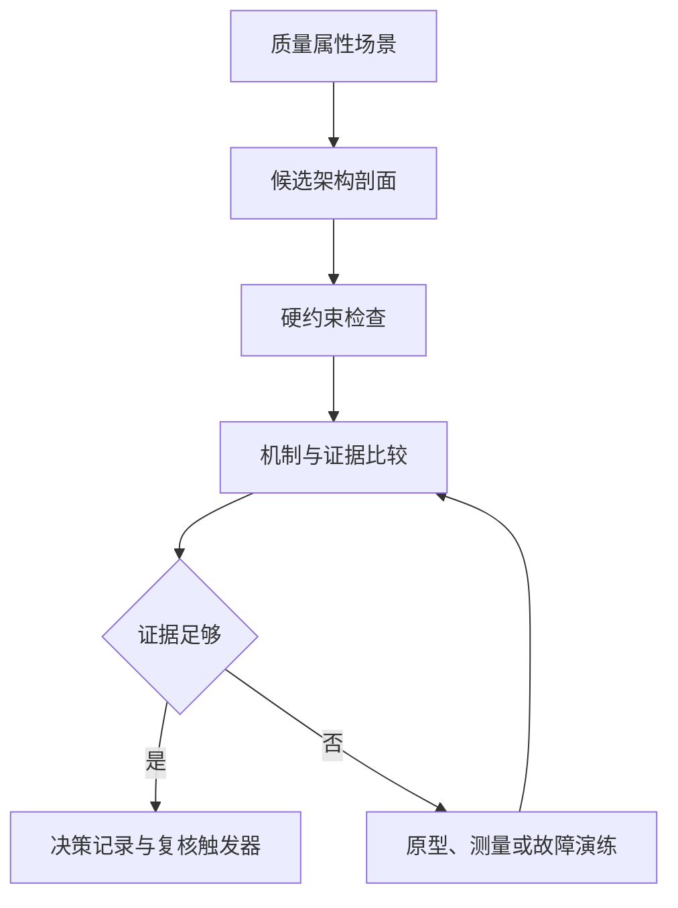

import {handleHorizontalArrowKey} from '@site/src/components/KeyboardScrollableRegion/handleHorizontalArrowKey.mjs';

# 架构风格比较框架

架构风格是一组约束，不是技术清单。候选可以组合多种风格；本方法比较架构剖面，而不是比较风格标签。[风格目录](/styles)提供后续主题，本页则给出可重复执行、保留证据并能触发复核的比较流程。

## 学习问题

- 如何先用响应度量（Response Measure）定义问题，而不是先选风格名称？
- 如何把不同候选展开成同构的八维架构剖面？
- 哪些证据足以支持选择，哪些未知项必须先验证？

## 组件、连接器与约束

一次比较的输入包括：业务目标与不可违反的硬约束；按优先级排序、带响应度量的质量属性场景；两到四个候选架构剖面；当前系统、团队、部署与运维能力的证据；以及决策期限、责任角色类型和复核条件。没有响应度量的“高可用”或“易扩展”不能进入比较。

先执行硬约束检查：违反不可协商约束的候选应记录否决原因，不得靠其他收益抵消。通过检查的候选再用同一张剖面表说明组件、连接器和约束。

| 维度 | 候选约束 | 实现机制 | 当前证据 | 未知项 |
| --- | --- | --- | --- | --- |
| 边界 | 写明组件划分与禁止依赖 | 模块、服务、端口或事件契约 | 代码、模型与变更记录 | 未验证的绕行依赖 |
| 控制流 | 写明流程的启动、推进和终止者 | 同步编排、异步协作或本地调用 | 时序、追踪与失败演练 | 超时后的控制权 |
| 数据所有权 | 写明唯一写者与读取方式 | 私有存储、共享事务或复制 | 数据模式、权限与写入路径 | 非正式共享写入 |
| 一致性 | 写明原子边界与陈旧窗口 | 本地事务、消息、补偿或冲突解决 | 事务测试与恢复记录 | 未演练的部分失败 |
| 部署单元 | 写明构建、发布、回滚和扩缩边界 | 单制品或独立制品流水线 | 部署记录与版本身份 | 兼容窗口成本 |
| 故障域 | 写明传播、隔离、降级和恢复边界 | 进程隔离、队列、超时或熔断 | 故障注入与恢复观测 | 级联故障路径 |
| 团队拓扑 | 写明变更、值班和审批所有权 | 单团队模块或跨团队服务契约 | 提交、值班与审批事实 | 名义所有权偏差 |
| 质量属性 | 写明支持场景的机制与代价 | 与场景一一对应的架构措施 | 可测响应与风险记录 | 无度量的收益声明 |

## 边界与控制流

边界必须说明允许和禁止的依赖，控制流则说明谁启动、推进、暂停和终止一次业务流程。同步调用让调用方保留控制，但继承下游失败；异步协作转移时间控制，但必须定义重放、幂等和失败处置。用[信息隐藏原则](/principles/pr-01)检查消费者是否仍依赖生产者的内部模型。

## 数据所有权与一致性

数据所有权要找到权威状态的唯一写者，一致性要明确哪些变化原子完成，哪些允许延迟、补偿或冲突解决。共享事务可以保留局部原子性，却可能扩大数据模式和变更耦合；私有存储缩小写入权限，却需要显式设计复制、陈旧窗口与部分失败。

## 部署单元与故障域

部署单元要同时描述构建、发布、回滚和扩缩边界。故障域要回答失败会向哪里传播、哪里可以隔离或降级，以及如何恢复。“可独立部署”并不自动意味着故障隔离；若共享资源、版本契约或调用链仍把失败传回入口，候选就需要补充机制。

## 团队拓扑

用实际的提交、值班、变更审批和故障处置证据描述所有权，不要把组织图当成事实。单一共同值班团队不会因为服务数量增加就获得独立所有权；跨团队边界则需要契约、升级路径和平台能力。

## 质量属性收益与成本

判断不使用简单加总，且每项都必须与机制、证据和代价一起记录：

- **直接支持**：候选已有明确机制和足够证据满足场景。
- **需要补充机制**：增加已说明的机制与成本后才可能满足。
- **与约束冲突**：候选违反不可协商约束，或补充机制会取消其核心前提。
- **未知**：证据不足，必须原型、测量、演练或继续调查。

> **决策记录卡**
>
> - **决策范围与日期：** 订单系统当前架构候选比较，2026-08-06。
> - **参与的责任角色类型：** 业务责任人、架构责任人、开发与值班代表。
> - **选定候选：** 候选一，保留订单与库存的本地事务，用事务性发件箱隔离报表更新。
> - **被否决候选与原因：** 当前不选候选二；其同步跨服务确认和协调回滚需要尚未具备的机制与平台能力，但它不是普遍错误的候选。
> - **关键敏感点：** 订单与库存的原子边界，以及事务性发件箱发布和报表重放的可靠性。
> - **关键权衡点：** 局部事务与简单回滚，对比独立部署、隔离和扩缩能力。
> - **仍未关闭的风险：** 本地事务正确性、回滚时已接受订单的保留行为，以及两个候选的报表恢复时长均未实测，结果为未知。
> - **验证动作：** 测试订单与库存的本地事务行为和回滚时不丢失已接受订单；演练事务性发件箱重放与消费者不可用；记录两个候选的实测恢复时长。
> - **复核触发器：** 团队所有权拆分、容量或故障隔离目标变化，或独立发布需求持续出现。

| 场景与响应度量 | 候选响应 | 判断 | 所需机制 | 风险或代价 | 证据 | 置信度 |
| --- | --- | --- | --- | --- | --- | --- |
| 订单确认与库存预留一致 | 候选一在同一本地事务内写入订单、预留与事务性发件箱 | 未知 | 模块边界、唯一写者与本地事务 | 事务边界限制独立部署 | 现有共同事务要求，待用事务测试确认 | 中 |
| 订单确认与库存预留一致 | 候选二由订单服务同步请求库存服务后确认 | 需要补充机制 | 超时、幂等、重试（Retry）及部分失败处置 | 网络失败和不确定结果扩大控制成本 | 只有候选描述，尚无原型或演练 | 低 |
| 报表消费者隔离与恢复 | 候选一用事务性发件箱将已提交事件交给独立报表消费者 | 未知 | 可重放发布、幂等消费与积压观测 | 报表延迟与重放运维成本 | 写入隔离机制明确，恢复时长未知 | 中 |
| 报表消费者隔离与恢复 | 候选二也以事件异步更新独立报表服务 | 未知 | 可重放事件、幂等消费与积压观测 | 多一个独立部署单元的运维与版本成本 | 隔离方向明确，恢复时长未知 | 低 |
| 回滚且不丢失已接受订单 | 候选一回滚单一制品，保留已提交订单和事务性发件箱记录 | 未知 | 向后兼容的数据模式变更、制品回滚和重放 | 兼容窗口和未发布事件积压 | 回滚路径可由当前单制品流水线验证 | 中 |
| 回滚且不丢失已接受订单 | 候选二需协调订单、库存和契约版本的回滚 | 需要补充机制 | 兼容契约、分步回滚、重复请求防护和数据校验 | 多单元协调与数据修复成本 | 当前尚无独立服务平台或回滚演练 | 低 |

## 迁移路径

先为未知项安排原型、测量或故障演练，再根据证据回到机制与代价比较。迁移不必从一个标签跳到另一个标签：可先用 [C4 架构模型（C4 Model）的系统上下文图与容器图](/modeling/mod-02)画出系统、运行单元和外部协作者，在现有边界内建立契约与观测，再用[分层架构](/styles/sty-01)检查单一部署单元内的职责和依赖，然后只在场景需要时移动部署或数据边界。

## 禁用条件

若关键场景没有响应度量，应停止比较并先补充目标。若字段缺少证据，必须写“未知”，不得借助风格声誉推断。若候选无法区分，应缩小问题或执行验证动作，不得强制选出胜者。不得用简单总分决定架构，因为场景未必等权，硬约束也不能被其他收益抵消。

## 对比案例

订单系统演练只使用下列已知事实，不添加吞吐、延迟或事故数据：

- 下单与库存预留在订单确认前需要一致结果。
- 报表消费者不可用不能阻断订单写入；报表允许有界延迟并需要恢复行为。
- 当前由一个共同值班团队维护，尚无独立服务平台能力。
- 发布失败必须可回滚，已接受订单不能丢失。

候选一：模块化单体 + 事务性发件箱 + 独立报表消费者。

- **边界：** 订单、库存和事务性发件箱是单制品内的模块，报表消费者在进程外。
- **控制流：** 订单模块同步推进确认，已提交事件异步驱动报表。
- **数据所有权：** 订单与库存模块各自保持唯一写入路径，报表只读取事件。
- **一致性：** 订单、预留和事务性发件箱在一个本地事务中；报表最终一致。
- **部署单元：** 订单与库存随单一制品发布，报表消费者独立发布。
- **故障域：** 报表故障不阻断订单写入，但事务性发件箱积压与恢复时长待演练。
- **团队拓扑：** 共同值班团队拥有全部单元。
- **质量属性：** 保留本地一致性和单制品回滚，以报表延迟与重放运维换取写入隔离。

候选二：订单、库存、报表独立部署；订单与库存同步确认，报表异步更新。

- **边界：** 三个服务通过同步应用程序编程接口（Application Programming Interface，API）与事件契约交互。
- **控制流：** 订单服务同步编排库存确认，事件异步推进报表。
- **数据所有权：** 每个服务只写自己的权威状态。
- **一致性：** 订单与库存跨服务一致结果需要补充超时、幂等和部分失败处置。
- **部署单元：** 订单、库存和报表分别构建、发布和回滚。
- **故障域：** 报表可隔离，但订单与库存的同步链仍会传播失败。
- **团队拓扑：** 一个共同值班团队暂时承担所有服务的契约、发布和恢复成本。
- **质量属性：** 独立部署为隔离和扩缩提供机制，但跨服务确认与回滚当前需要补充机制，实际恢复时长仍为未知。

当前选择候选一是基于现有约束的条件性选择，仍受上述验证门槛约束。这些验证门槛通过前，不能把该选择视为验证完成。这个结论只适用于上述约束与证据；团队所有权拆分、容量或故障隔离目标变化、独立发布需求持续出现时必须重新比较。候选二可能在那时成为更合适的基础，也可与候选一的局部事务机制重新组合。

[生产中的微前端案例](/cases/micro-frontends-single-spa)展示了部署独立性、共享依赖和团队边界的类似权衡，可用同一剖面方法复核。

## 来源

质量属性场景的形成、排序与细化参考[卡内基梅隆大学软件工程研究所的质量属性工作坊（Quality Attribute Workshop，QAW）资料集](https://www.sei.cmu.edu/library/quality-attribute-workshop-collection/)；候选架构的风险、敏感点与权衡分析参考[该研究所的架构权衡分析方法（Architecture Tradeoff Analysis Method，ATAM）资料集](https://www.sei.cmu.edu/library/architecture-tradeoff-analysis-method-collection/)；风格的约束、收益与挑战视角参考 [Microsoft 公司云平台架构中心的架构风格资料](https://learn.microsoft.com/en-us/azure/architecture/guide/architecture-styles/)；决策记录与质量场景文档化分别参考 [arc42 架构文档模板的架构决策章节](https://docs.arc42.org/section-9/)和[质量要求（Quality Requirements）章节](https://docs.arc42.org/section-10/)。本文的比较表、判断词汇、Mermaid 图表工具绘制的流程和演练均为 Tego Arch 架构知识项目原创综合，不复刻来源图示，也不采用来源给出的数值评分。
