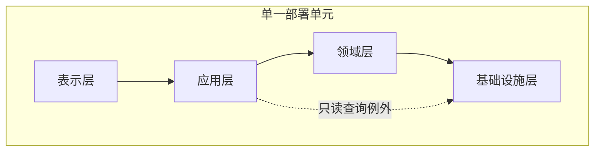

import {handleHorizontalArrowKey} from '@site/src/components/KeyboardScrollableRegion/handleHorizontalArrowKey.mjs';

# 分层架构：用依赖方向约束职责分层

分层架构中的层是责任边界和依赖边界，不是目录、进程、服务、物理层级、部署单元或团队的别名。[风格目录](/styles)提供主题入口；本文把[架构风格比较框架](/styles/sty-00)的八维剖面落实为一个可检查的经典分层合同。

## 学习问题

- 如何区分逻辑层、代码模块或程序包与物理层级或部署单元？
- 四个封闭层各自负责什么，又必须拒绝什么依赖？
- 什么条件下只读查询可以成为受控开放层例外？

## 组件、连接器与约束

本例固定表示层、应用层、领域层和基础设施层四个逻辑层。责任、公开能力和禁止内容共同决定一个层是否真实存在。

| 层 | 主要责任 | 公开能力 | 禁止内容 |
| --- | --- | --- | --- |
| 表示层 | 协议解析、输入格式、响应呈现 | 稳定的输入映射和结果呈现 | 业务规则、事务决策、数据库访问 |
| 应用层 | 用例编排、权限入口、事务意图、超时预算和流程结果 | 面向调用方的用例 | 核心业务判断、对象关系映射类型与厂商驱动 |
| 领域层 | 订单与库存不变量、状态转换和业务拒绝 | 领域行为与稳定的数据访问能力合同 | 传输协议、用户界面、数据库结构、对象关系映射类型和运行配置 |
| 基础设施层 | 持久化、消息、时钟和外部系统实现 | 满足上层所需的数据与外部能力 | 决定业务规则或向上层泄漏厂商类型 |

逻辑层可由代码模块或程序包实现；物理层级或部署单元则是构建、发布、扩缩与故障传播边界。二者可以重合，却不能从层名自动推导。

八维架构剖面按固定次序记录为：

- `| 边界 |` 四层按技术责任划分，默认只允许紧邻向下依赖。
- `| 控制流 |` 表示层发起，应用层编排，领域层决策，基础设施层执行外部副作用。
- `| 数据所有权 |` 领域规则决定合法状态变化，基础设施实现持久化；报表查询只读。
- `| 一致性 |` 订单确认与库存预留在单一本地事务中完成。
- `| 部署单元 |` 四层随同一制品发布和回滚。
- `| 故障域 |` 进程内层不能提供独立故障隔离；基础设施失败仍会影响写路径。
- `| 团队拓扑 |` 一个跨层共同值班团队拥有完整订单能力，不按技术层拆团队。
- `| 质量属性 |` 质量属性（Quality Attribute）方面，封闭分层降低局部认知范围、提供测试接缝和替换点；代价是横向变更传播、转发层和基础设施依赖。

## 边界与控制流

封闭层默认只允许紧邻向下依赖。领域层依赖基础设施层公开的稳定数据访问能力合同，但不能接收其数据结构、对象关系映射类型、连接配置或厂商类型。

反向依赖和循环依赖均被禁止。虚线只表示同一制品内部受治理的只读查询旁路，不是服务调用或网络跳。

## 数据所有权与一致性

领域规则决定订单和库存状态变化是否合法，基础设施层实现持久化。订单确认与库存预留保持在同一本地事务中；报表查询只能读取投影，不得改变权威状态、重算业务不变量或返回对象关系映射类型与数据库类型。

## 部署单元与故障域

四层作为单一部署单元随同一制品构建、发布和回滚。进程内的逻辑边界不会带来独立故障隔离、独立扩缩或网络隔离；基础设施故障仍可沿写路径影响调用方。

## 团队拓扑

一个跨层共同值班团队拥有完整订单能力，并负责依赖规则、行为测试、发布和恢复。按技术层拆团队会让一次业务变化横跨多个所有者，因此层的边界不应被误读为组织边界。

## 质量属性收益与成本

封闭层降低局部认知范围，并为行为测试、替换实现和自动化架构规则提供接缝；代价是横向业务变化可能穿过多层，薄转发层可能增加维护成本，经典自上而下合同也保留了领域对基础设施能力合同的依赖。下列开放层例外只有一条，十项字段共同构成批准与撤销合同。

| 调用方 | 被调用层 | 被跳过层 | 理由 | 不变量 | 风险 | 自动化验证 | 责任角色类型 | 复核触发器 | 撤销条件 |
| --- | --- | --- | --- | --- | --- | --- | --- | --- | --- |
| 应用层 | 基础设施层 | 领域层 | 报表只读查询避免无业务价值的转发 | 不改变订单、库存或权限不变量 | 查询模型耦合与旁路扩散 | 架构依赖测试、查询契约测试、结果映射测试 | 架构责任人、订单能力负责人 | 查询参与业务决策或返回模型变化 | 恢复逐层调用或重新设计边界 |

层间访问规则与循环约束应进入架构依赖测试；写路径、查询合同和结果映射分别用行为测试证明。工具只负责执行合同，不能替代责任与例外的设计判断。

## 迁移路径

先记录现有跨层依赖与唯一写入路径，再把协议、业务判断和厂商类型移回其责任层。若查询开始参与权限判断或状态转换，撤销旁路。若大量业务变化持续横跨所有技术层，可按[垂直切片架构](/styles/sty-03)逐个把高变化用例收拢为端到端代码边界；若压力来自业务模块合同、数据所有权和共同部署节奏，则与[模块化单体](/styles/sty-04)重新比较边界、部署和团队所有权。依赖反转变体可继续参阅[六边形架构、洋葱架构与整洁架构对照](/styles/sty-02)。

## 禁用条件

若系统只是按目录命名却允许任意穿透，不能宣称合同成立。若目标要求独立部署、独立扩缩、网络隔离或团队自治，分层本身不足以满足目标。若开放层例外缺少理由、不变量、自动化验证、责任角色、复核触发器或撤销条件，应拒绝旁路；写路径始终不得绕过领域判断。

## 对比案例

订单确认演练按固定顺序执行：表示层解析请求并产生格式错误；应用层执行权限入口、超时预算和用例编排并收敛流程失败；领域层检查订单与库存不变量并产生业务拒绝；基础设施层在同一本地事务中持久化订单确认与库存预留，并把技术故障映射为稳定错误类别。结果再逐层返回，由表示层映射为协议响应。

所有层随一个制品交付，案例不推断任何未测的生产性能或事故收益。只读报表查询可以使用已登记例外；一旦它参与订单确认、库存计算、权限判断或业务状态转换，就必须撤销旁路。

[生产中的微前端案例](/cases/micro-frontends-single-spa)展示了另一种边界压力：按技术层组织的共同变更与按用户价值形成垂直切片，会带来不同的部署和团队权衡。该案例用于比较边界，不把前端部署方式移植为本订单系统的默认方案。

## 来源

[微软分层架构指南](https://learn.microsoft.com/en-us/azure/architecture/guide/architecture-styles/n-tier)用于区分逻辑层与物理层级，并支持开放层、封闭层和向下依赖的事实边界；本文不采用其特定云平台的部署拓扑。[马丁·福勒的表示、领域与数据分层说明](https://martinfowler.com/bliki/PresentationDomainDataLayering.html)用于核对表示、领域、数据责任分离和逻辑层不等于部署单元。[亚马逊云服务（Amazon Web Services，AWS）六边形架构概览](https://docs.aws.amazon.com/prescriptive-guidance/latest/hexagonal-architectures/overview.html)只用于提示经典分层与依赖反转的差异，不在本文展开后者。[架构规则工具用户指南](https://www.archunit.org/userguide/html/000_Index.html)说明层间访问和循环约束可以成为自动化架构规则；具体编程语言与工具只是实现示例，不是本文要求。

本文的责任合同、八维剖面、例外表、订单演练和 Mermaid 图表工具所绘制的示意图均为 Tego Arch 架构知识项目原创综合，不复制来源图示、表格、结构或长段落。
