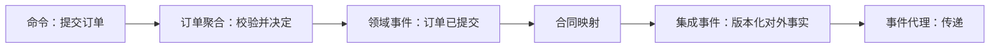

import SourceLedger from '@site/src/components/SourceLedger';
import {handleHorizontalArrowKey} from '@site/src/components/KeyboardScrollableRegion/handleHorizontalArrowKey.mjs';

# 事件驱动架构：先分清事件携带什么，再决定状态放在哪里

“系统发布了事件”并没有说明消费者收到多少状态、是否还要回查，也没有说明当前状态由数据库还是事件历史裁定。相同的订单提交事实，可以形成完全不同的耦合、恢复和数据所有权。

本文用订单、库存、支付、通知四个固定参与者回答五个固定问题，并观察质量属性（Quality Attribute）的变化。四种模式是 Tego Arch 架构知识项目的教学比较框架，并非唯一分类，也不是穷尽式分类；它们不构成成熟度阶梯，更不要求逐级升级。

**事实边界：** 事件通知、事件携带状态和事件溯源三个名称直接对应主来源的比较；“状态转移”是本站为合法状态机迁移建立的教学观察列，由状态机标准中的状态、事件、守卫与转换语义分别支持，不宣称它是业界通用的第四分类。

## 学习问题

- 消费者收到的是发生通知、合法迁移、所需状态，还是权威事件历史？
- 消费者是否需要回查订单服务，运行时依赖落在哪里？
- 当前状态的权威来源是谁，本地副本和投影能否写回？
- 事件是否参与当前状态重建，回放又必须隔离哪些外部副作用？
{/* terminology-exempt: unknown-english-term | reason: 审查契约要求事件结构版本保留 schema 字面量以消除分类层级歧义 */}
- 丢失、重复、乱序、事件结构（schema）版本变化与人工终止分别由谁负责？

## 组件、连接器与约束

{/* terminology-exempt: unknown-english-term | reason: 四模式契约要求保留命令的英文对应词 */}
命令（Command）表达发送方要求明确接收方执行动作的意图，命令处理器可以拒绝它。

{/* terminology-exempt: unknown-english-term | reason: 四模式契约要求保留领域事件的英文对应词 */}
领域事件（Domain Event）表达聚合或领域内已经发生的事实或状态变化。

{/* terminology-exempt: unknown-english-term | reason: 四模式契约要求保留集成事件的英文对应词 */}
集成事件（Integration Event）是面向边界外消费者的版本化公开合同，需要由领域事件映射而非默认共用。

{/* terminology-exempt: unknown-english-term | reason: 四模式契约要求保留事件代理的英文对应词 */}
事件代理（Event Broker）负责传递、路由、保留和消费位置，但不拥有也不决定业务状态。

{/* terminology-exempt: unknown-english-term | reason: 四模式契约要求保留事务性发件箱的英文对应词 */}
事务性发件箱（Outbox）在同一本地事务中保存业务变更与待发布消息，缩小提交和发布之间的缺口，却不承诺端到端只处理一次。

{/* terminology-exempt: unknown-english-term | reason: 四模式契约要求保留事件存储的英文对应词 */}
事件存储（Event Store）在事件溯源中保存追加、按聚合有序的事件流，并把它作为权威事实记录。

权威状态的唯一写入方负责业务决定。本地副本是消费者拥有的派生只读数据，不取得源业务状态的权威写入权；读取投影是由事件或权威记录派生、可重建的查询模型，也不反向成为事件存储。

下图只回答语义如何穿过边界：命令进入拥有业务规则的聚合，领域事件先记录内部事实，随后才映射成对外集成事件。它不表示所有系统都必须异步，也不把代理画成权威存储。

因此，是否使用代理与“谁有权改变订单”是两个问题。下面的责任表把存储和派生状态也放回各自位置。

| 组件或状态 | 核心责任 | 明确不负责 |
| --- | --- | --- |
| 订单聚合与权威写模型 | 校验命令、决定订单合法变化 | 不替消费者维护副本 |
| 事件代理 | 传递、保留、消费位置 | 不裁定业务状态 |
| 事件存储 | 保存权威聚合事件流 | 不执行支付或通知 |
| 本地副本与读取投影 | 支持自治读取或查询 | 不取得源状态写入权 |

{/* terminology-exempt: unknown-english-term | reason: 审查契约要求事件结构版本保留 schema 字面量以消除分类层级歧义 */}
- 所有模式共享最小信封：事件标识、事件类型、发生时间、生产者、聚合键或业务键、事件结构（schema）版本、关联标识和因果标识。
- 公共事件信封规范只支持这种协议无关上下文字段，不证明本文的业务分类。
- 完整载荷不等于事件溯源；事件代理、事务性发件箱、异步或可重放日志都不足以证明事件溯源。
- 命令查询职责分离（Command Query Responsibility Segregation，CQRS）也不要求事件溯源。

{/* terminology-exempt: unknown-english-term | reason: 防混淆内容契约固定要求保留 Outbox 字面量 */}
Outbox 不等于事件溯源。

## 边界与控制流

请先看图中每一列的“载荷—取数—权威—恢复”路径，而不是只比较箭头数量。实线表示正常消费，虚线表示恢复或回放；正文和表格仍是精确语义的权威说明。

图的结论是：代理只负责传递；前三列仍由订单服务保存权威状态，第四列才由事件存储的聚合事件流担当权威写入记录。虚线恢复路径停在内部派生状态。

### 事件通知

**说明性场景：** 订单服务发布 `OrderSubmitted` 最小载荷，库存、支付、通知消费者得知事实后回查订单服务。它适合消费者少、回查可接受的场景；若订单服务实际要求库存必须预留，就应发送命令，不能把要求动作包装成被动攻击式命令。

- **收到什么：** 库存、支付、通知收到订单标识与必要上下文构成的最小载荷。
- **是否回查：** 三个消费者都按需回查订单服务，生产者不可用会形成时间耦合。
- **权威状态：** 订单服务保存订单权威状态，消费者不持有可写订单副本。
- **是否重建：** 通知不参与订单当前状态重建，持久业务记录用于补偿扫描。
- **失败责任：** 事件通知回查失败先做有界重试（Retry），超过上限则降级为最后已知状态并标记待补偿，仍未恢复时由服务所有者人工处置。

### 状态转移

{/* terminology-exempt: unknown-english-term | reason: 状态转移内容契约固定要求 from 字段名 */}
**说明性场景：** 订单服务发布 `PENDING → CONFIRMED`，载荷包含 from 字段、业务原因和聚合版本。库存、支付、通知消费者用各自状态机验证迁移；状态转移强调合法迁移，不要求携带完整快照，因此状态转移不等于事件携带状态。

{/* terminology-exempt: unknown-english-term | reason: 状态转移内容契约固定要求 to 字段名 */}
迁移目标由 to 字段表达。

- **收到什么：** 三个消费者收到前后状态、业务原因、关联标识与聚合版本。
- **是否回查：** 合法性通常本地校验；遇到版本缺口时才暂存并补取订单事实。
- **权威状态：** 订单服务仍是权威，消费者状态机只维护各自处理进度。
- **是否重建：** 迁移事件可推进消费者状态，但本文不把它定义为订单权威历史。
- **失败责任：** 消费者负责非法迁移拒绝、同版本重复幂等忽略、旧版本拒绝；遇到版本缺口则暂存并补取，事件合同负责人负责事件结构兼容演进。

### 事件携带状态

**说明性场景：** 事件携带状态提供库存、支付、通知完成处理所需字段或变化集，并让消费者维护本地副本，正常路径不回查订单服务；旧版本不能覆盖新版本，但副本陈旧窗口、字段复制和隐私（Privacy）撤回成为显性成本。

- **收到什么：** 三个消费者收到版本化订单状态或各自所需字段，而非仅一个键。
- **是否回查：** 正常路径不回查，生产者暂时不可用时仍可自治读取。
- **权威状态：** 订单服务保有权威写模型，本地副本是派生只读状态。
- **是否重建：** 事件可重建消费者副本，但不因此成为订单聚合的权威事件历史。
- **失败责任：** 消费者负责按聚合标识与版本去重更新，事件合同负责人负责事件结构兼容，服务所有者负责引导重建和隐私删除。

### 事件溯源

**说明性场景：** 命令处理器先从事件流和可选快照恢复订单聚合，以预期流版本乐观并发追加领域事件。投影处理器据此构建订单读取投影，再映射集成事件，经事件代理交给库存、支付和通知；事件存储与代理是两个责任边界。

- **收到什么：** 聚合读取按聚合有序的领域事件；外部消费者只收到稳定集成事件。
- **是否回查：** 聚合从事件存储恢复，外部消费者是否回查由其集成合同决定。
- **权威状态：** 事件存储是权威，按聚合有序事件流是权威写入记录，投影只是派生查询状态。
- **是否重建：** 回放重建聚合与投影，快照只优化回放速度，不成为新权威。
- **失败责任：** 命令处理器负责乐观并发，投影处理器负责确定性重建；恢复权限在下方运行合同中单独归属。

## 数据所有权与一致性

前三种模式中，订单服务的数据库仍裁定订单状态；事件携带越多，只是把更多派生状态复制给消费者。第四种模式中，事件存储的按聚合有序事件流才是权威事实，聚合内存状态和读取投影都可由它派生。代理日志和业务事件流必须分别治理。

{/* terminology-exempt: unknown-english-term | reason: 审查契约要求事件结构演进保留 schema 字面量以明确合同边界 */}
投递按至少一次设计：消费者以事件标识与聚合键去重，重试采用退避和上限。顺序由消费者和平台团队共同维护可解释的聚合分区；乱序由消费者负责拒绝、暂存或补取。事件结构（schema）演进由事件合同负责人维护兼容窗口，不允许旧版本覆盖新版本。

回放只能重建确定性内部状态。回放不得再次扣款，不得重新发送通知或发短信，也不得再次调用不可逆外部副作用；这些结果由外部回执、对账和新的补偿事实裁定。

## 部署单元与故障域

生产者、代理、消费者、事件存储和投影可以独立部署，但事件驱动不会自动消除故障传播。代理不可用阻断发布或消费；事件通知还受订单回查可用性影响；状态副本可能陈旧；事件溯源的毒事件可能阻塞投影水位。

- 生产者负责本地提交与待发布记录；平台团队负责代理可用性、至少一次投递与积压容量。
- 消费者负责幂等和乱序处置；投影处理器负责处理延迟、失败率与投影水位维护。
- 事件通知回查失败先做有界重试，达到上限后降级为最后已知状态，仍未恢复时交由服务所有者人工处置。
- 毒事件处置固定为隔离、修复、受控重放，无法证明安全时人工终止。
- 死信队列由服务所有者负责；告警触发后处置时限为四小时，超时升级给值班负责人。
{/* terminology-exempt: unknown-english-term | reason: 审查契约要求事件结构版本保留 schema 字面量以明确合同负责人 */}
- 事件结构（schema）版本与演进由事件合同负责人负责，事件合同负责人就是明确的结构所有者。
- 可观测指标至少覆盖积压、处理延迟、失败率与投影水位。

下表回答“发现故障后自动做到哪里、何时必须停下交给谁”。

| 故障类 | 检测 | 自动响应 | 停止条件 | 人工所有者 |
| --- | --- | --- | --- | --- |
| 事件通知回查失败 | 回查超时或订单服务不可用 | 有界重试后降级到最后已知状态 | 补偿扫描后回查仍失败 | 服务所有者 |
| 重复投递 | 事件标识已处理 | 返回已有结果 | 去重记录冲突 | 消费者所有者 |
| 乱序或版本缺口 | 聚合版本不连续 | 暂存、补取并拒绝旧版 | 缺口超过保留窗口 | 消费者所有者 |
| 事件结构不兼容 | 未识别事件结构版本 | 进入兼容读取或隔离 | 无安全升级路径 | 事件合同负责人 |
| 投影积压或延迟 | 积压、处理延迟、失败率、投影水位 | 扩容或暂停非关键重建 | 水位持续不前进 | 投影处理器 |
| 毒事件与死信队列 | 重试上限、死信告警 | 隔离、修复后受控重放 | 无法证明安全时人工终止 | 服务所有者，处置时限四小时 |

自动重试不能无限持续。超过风险预算、无法证明安全去重或外部效果状态未知时，应停止自动动作，由具名所有者根据权威记录处置。

## 团队拓扑

订单团队拥有事件的业务含义、权威状态和兼容承诺；库存、支付、通知团队分别拥有重复处理、本地副本或状态机和恢复手册。平台团队拥有事件代理、积压容量和投递机制，却不替业务团队决定事件语义。

{/* terminology-exempt: unknown-english-term | reason: 审查契约要求跨团队合同保留 schema 字面量以消除分类层级歧义 */}
跨团队合同至少包含事件类型、事件结构（schema）版本、聚合键、关联标识、因果标识、所有者和退役窗口。一个团队不能以“平台保证投递”为由取消端到端对账，也不能把无人处理的死信队列当作恢复方案。

## 质量属性收益与成本

四种模式回答不同权衡。通知保持小合同但增加回查依赖；状态转移让合法性显式但要求版本与缺口治理；携带状态改善自治读取却增加复制、隐私与模式耦合；事件溯源提供历史重建和多投影，却把事件演进、存储与回放安全变成长期责任。

先用这张采用检查表排除不成立的前提，再阅读完整矩阵。任一“停止”条件成立，都不能靠更丰富的事件载荷绕过。

| 当前证据 | 候选方向 | 立即停止条件 |
| --- | --- | --- |
| 只需告知事实，回查可接受 | 事件通知 | 回查成为不可接受的可用性依赖 |
| 合法迁移比完整字段重要 | 状态转移 | 没有明确状态机和版本规则 |
| 消费者必须自治读取 | 事件携带状态 | 无法承担复制、隐私与演进 |
| 历史事实必须重建当前状态 | 事件溯源 | 无法隔离外部副作用或演进历史事件 |

下表把选择问题对齐到同一组维度。它不是评分表，不能把更右侧理解为更先进。

| 比较维度 | 事件通知 | 状态转移 | 事件携带状态 | 事件溯源 |
| --- | --- | --- | --- | --- |
| 载荷 | 最小键与上下文 | 前后状态、原因、版本 | 所需字段或变化集 | 有序领域事实 |
| 回查与取数 | 通常回查生产者 | 缺口时补取 | 正常路径不回查 | 从事件流恢复 |
| 时间耦合与模式耦合 | 时间耦合较高、模式耦合低 | 两者中等 | 时间耦合低、模式耦合高 | 内部事件演进耦合高 |
| 权威事实来源 | 订单数据库 | 订单数据库 | 订单数据库 | 事件存储 |
| 本地副本 | 非必要 | 状态机进度 | 核心成本 | 读取投影 |
| 顺序处理 | 业务按需 | 聚合版本严格校验 | 旧版不得覆盖新版 | 聚合流严格有序 |
| 重放能力 | 补偿重发 | 有限补取 | 重建副本 | 重建聚合与投影 |
| 审计能力 | 依赖业务记录 | 可见迁移轨迹 | 依赖源记录 | 原生历史事实 |
| 隐私暴露 | 较少 | 状态字段有限 | 较高，须最小披露 | 不可变历史需专门设计 |
| 模式演进 | 小合同较简单 | 迁移兼容 | 多副本兼容 | 历史事件长期兼容 |
| 存储与运行成本 | 低至中 | 中 | 中至高 | 高 |
| 采用信号与停止条件 | 告知事实且回查可接受；回查不可接受时停止 | 合法迁移关键；无状态机约束时停止 | 自治读取关键；无复制治理时停止 | 确需历史重建；无法安全回放时停止 |

## 迁移路径

先盘点现有消息表达的是命令还是事实，再为每类事件填完五个问题。若只需降低回查，可从通知选择性演进为携带状态；若业务规则围绕合法迁移，先建立状态机版本与缺口处理；只有历史事实确实要成为权威记录时，才在一个聚合上试行事件溯源。

迁移必须保留双读或校验窗口、可回退投影和对账。事务性发件箱只能闭合本地提交与待发布消息，不能保证恰好一次；补偿是新的业务事实而不是数据库回滚。CQRS 可以不使用事件溯源，异步也不能证明事件溯源，可重放流同样不能决定业务权威。

## 禁用条件

简单请求—响应已满足延迟与吞吐需求，跨边界必须即时强一致，或团队无法运营代理、积压、死信和回放时，不采用事件驱动。事件所有权与模式治理不清，隐私删除要求与不可变历史冲突且没有方案，或采用理由只是“更现代”，都应停止。

若必须执行的动作被伪装为过去式通知，改用有明确接收者和可拒绝语义的命令。若完整状态复制没有数据最小化、撤回和重建责任，保持回查。若无法隔离外部系统，禁止启用自动历史重建。

## 对比案例

[STY-04 模块化单体](/styles/sty-04)与[STY-05 微服务](/styles/sty-05)回答订单、库存、支付、通知如何形成部署和数据所有权边界；本文回答这些边界之间传递什么事件。事件不会消除模块、服务与数据所有权，也不能代替 Saga 的补偿与对账。

[STY-07 面向服务架构](/styles/sty-07)说明企业能力、合同和跨所有权治理；消息或事件不会自动形成面向服务架构，也不能决定合同、业务权威或治理责任。

[STY-08 Actor Model](/styles/sty-08)说明有稳定身份的状态所有者怎样通过邮箱处理命令；Actor 消息不一定是领域事件，采用事件也不等于采用 Actor。

[STY-09 Pipes and Filters](/styles/sty-09)说明相邻转换怎样通过数据与容量合同组合。事件可以承载某个 Pipe 的数据，却不会自动决定事件载荷、业务权威、窗口完成或外部效果恢复。

[PR-11 命令查询职责分离](/principles/pr-11)说明读写模型为何分离，CQRS 不要求事件溯源；[MOD-08 状态机建模](/modeling/mod-08)说明状态、守卫与终态如何接受评审，状态图本身仍不能证明跨系统效果。[Apache Kafka 事件流平台消费者组案例](/cases/apache-kafka-consumer-groups)只用于观察分区、消费位置与恢复机制，不把事件流平台或代理日志当作业务事件存储。返回[架构风格目录](/styles)可与其他风格按统一维度比较。

## 来源

- [What do you mean by “Event-Driven”?](https://martinfowler.com/articles/201701-event-driven.html)（2017-02-07）支持事件通知、事件携带状态、事件溯源及被动攻击式命令边界；它不支持本站“状态转移”作为通用第四分类。
- [Event-driven architecture style](https://learn.microsoft.com/en-us/azure/architecture/guide/architecture-styles/event-driven)（固定官方源码 `ms.date: 03/06/2026`）支持生产者、通道、消费者、载荷选择、顺序、幂等、错误处理、观测与模式演进；云产品建议不外推为普遍要求。
- [Event Sourcing pattern](https://learn.microsoft.com/en-us/azure/architecture/patterns/event-sourcing)（固定官方源码 `ms.date: 03/27/2026`）支持追加式事件存储、聚合恢复、投影、并发、快照与演进成本；本文不复制其图示。
- [CloudEvents - Version 1.0.2](https://github.com/cloudevents/spec/blob/v1.0.2/cloudevents/spec.md)只支持公共事件上下文字段和协议无关信封，不支持四模式分类或业务状态结论。
- [State Chart XML (SCXML): State Machine Notation for Control Abstraction](https://www.w3.org/TR/2015/REC-scxml-20150901/)（2015-09-01）支持状态、事件、守卫和合法转换语义；本文“状态转移”列仍明确属于本站教学分析。
- 原创“订单事件四种模式并排比较图”由本站维护者以可编辑源图与矢量发布图成对绘制，不含第三方参考图、品牌视觉、签名、水印或复制构图。图示只支持本站教学拓扑，不证明生产结果。

  
证据：固定版本与使用边界

  - **微软文档：** 两份页面的运输定位固定到官方文档仓库提交 `7b4bf26469bc45810c64406ad3cebdae4f60fb6b`，只使用许可范围内的原创事实总结。
  - **公共事件信封：** 固定标签 `v1.0.2`，只核对 `id`、`source`、`specversion`、`type` 等上下文字段。
  - **边界：** 来源支持机制与术语，不证明本文订单场景的生产效果、性能或可用性。

<SourceLedger />
