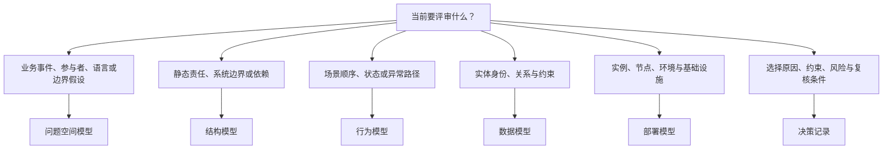
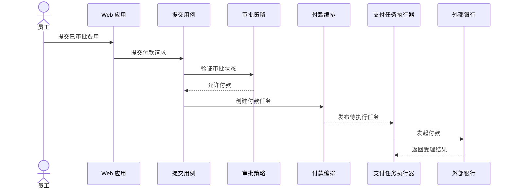

# G008 Batch 1 Model Selection and C4 Views Implementation Plan

> **For agentic workers:** REQUIRED SUB-SKILL: Use superpowers:subagent-driven-development (recommended) or superpowers:executing-plans to implement this plan task-by-task. Steps use checkbox (`- [ ]`) syntax for tracking.

**Goal:** Publish MOD-01 through MOD-03 as one coherent model-selection and C4 learning path, close the existing MOD-02 fixture with immutable deployment evidence, and leave G008 active with MOD-04 next.

**Architecture:** Add two focused modeling articles around the existing MOD-02 fixture. Keep model selection in MOD-01, preserve the audited Context/Container exercise in MOD-02, and put Component, Dynamic, and Deployment evidence in MOD-03. Use source-ledger identities for five official C4 subpages and two original Draw.io/SVG pairs, then deliver through the repository’s Stage A content release and Stage B evidence closure.

**Tech Stack:** Docusaurus 3.10.2, MDX, Mermaid, Draw.io XML, accessible SVG, Node.js 26.5.0 (repository floor Node.js 24), `node:test`, TypeScript 6, GitHub Pages.

## Global Constraints

- Work only in `/Users/seal/projects/tego-arch/.worktrees/g008-modeling-batch1` on branch `codex/g008-modeling-batch1`.
- Preserve the user-owned untracked `/Users/seal/projects/tego-arch/.codex/config.toml`; never stage, modify, or delete it.
- Scope is exactly MOD-01, MOD-02, and MOD-03. Do not add MOD-04 or later G008 content.
- Do not add dependencies and do not lower the Node.js engine below `>=24.0`.
- MOD-02 is an audit-style closure: retain its current prose and diagram unless a failing contract proves a specific defect.
- Reuse the expense-reporting system and the exact names `员工`, `费用申报系统`, `Web 应用`, `申报 API`, `申报数据库`, `支付任务执行器`, and `外部银行`.
- MOD-03 Component scope is the single `申报 API` container and exactly four responsibility units: `提交用例`, `审批策略`, `付款编排`, and `持久化端口`.
- MOD-01 uses one Mermaid decision map and one model-selection table.
- MOD-03 uses one Mermaid sequence plus two separate Draw.io/SVG pairs; never compress all three views into one multi-panel image.
- Every Draw.io/SVG pair must pass `.codex/skills/creating-drawio-architecture-diagrams/scripts/validate_drawio_svg.mjs`.
- Static checks do not replace desktop `1440x1000` and mobile `390x844` browser QA.
- Stage A must project 84 content documents, 464 governed sources, 39 completed topics, durable stories `7 / 20`, and current G008.
- Stage B must project 84 content documents, 464 governed sources, 42 completed topics, durable stories `7 / 20`, current G008, and MOD-04 next.
- Stage B must use the exact Stage A SHA and the exact successful GitHub Pages run; do not record guessed or mutable evidence.
- Use `apply_patch` for source edits. Generated JSON is updated only through `npm run generate:content`.
- Run targeted tests before the full `npm run verify`; do not claim completion from partial validation.

## File Structure

### New files

- `content/modeling/mod-01-model-selection-overview.mdx` — routes six architecture questions to matching model families.
- `content/modeling/mod-03-c4-component-dynamic-deployment.mdx` — teaches the three deeper/supporting C4 views with one continuous scenario.
- `diagrams/mod-03-c4-component.drawio` — editable Component source.
- `static/img/diagrams/mod-03-c4-component.svg` — accessible Component publication asset.
- `diagrams/mod-03-c4-deployment.drawio` — editable Deployment source.
- `static/img/diagrams/mod-03-c4-deployment.svg` — accessible Deployment publication asset.
- `tests/g008-batch1-content.test.mjs` — content, relation, source, and evidence-boundary contract.
- `tests/g008-batch1-diagrams.test.mjs` — Draw.io/SVG, embed, accessibility, and label contract.
- `tests/g008-batch1-deployment.test.mjs` — immutable Stage A evidence and Stage B closure contract.
- `docs/reviews/g008-batch1.md` — exact release and live-smoke audit record.

### Existing files modified

- `content/modeling/mod-02-c4-context-container.mdx` — reciprocal MOD-01/MOD-03 navigation only unless tests expose another defect.
- `data/source-ledger.json` — five C4 subpage identities, two original illustration identities, and three document citation maps.
- `docs/source-license-inventory.md` — generated inventory for the seven new identities.
- `docs/content-backlog.md` — Stage B evidence and completion only.
- `tests/knowledge-fixtures.test.mjs` — MOD-02 completion false→true in Stage B.
- `tests/project-status.test.mjs` — Stage A and Stage B count projections.
- `tests/content-review-health.test.mjs` — canonical document and source counts.
- `tests/source-ledger-pagination.test.mjs` — paginated source count.
- `tests/source-ledger-rendering.test.mjs` — source-card count and source-kind distribution.
- `src/generated/source-ledger.json` — generated.
- `src/generated/topic-manifest.json` — generated.
- `src/generated/topic-indexes.json` — generated.
- `src/generated/project-status.json` — generated.

---

### Task 1: Publish MOD-01 as the model-selection router

**Files:**

- Create: `content/modeling/mod-01-model-selection-overview.mdx`
- Create: `tests/g008-batch1-content.test.mjs`
- Modify: `content/modeling/mod-02-c4-context-container.mdx`
- Modify: `data/source-ledger.json`
- Modify: `tests/project-status.test.mjs`
- Modify: `tests/content-review-health.test.mjs`
- Modify: `tests/source-ledger-pagination.test.mjs`
- Modify: `tests/source-ledger-rendering.test.mjs`
- Modify: generated files produced by `npm run generate:content`
- Test: `tests/g008-batch1-content.test.mjs`

**Interfaces:**

- Consumes: the existing modeling heading contract and MOD-02 route `/modeling/mod-02`.
- Produces: topic `MOD-01`, route `/modeling/mod-01`, reciprocal MOD-01↔MOD-02 navigation, and source IDs `src-c4model-diagrams` and `src-c4model-notation`.

- [ ] **Step 1: Add the failing MOD-01 contract**

Create `tests/g008-batch1-content.test.mjs` with imports and helpers matching the repository content tests:

```js
import assert from 'node:assert/strict';
import {readFile} from 'node:fs/promises';
import test from 'node:test';
import {fileURLToPath} from 'node:url';

import {
  findMarkdownHeadings,
  readContentDocuments,
} from '../scripts/content-metadata.mjs';
import {extractInternalLinks} from '../scripts/content-relations.mjs';
import {extractExternalLinks} from '../scripts/source-ledger.mjs';

const root = fileURLToPath(new URL('../', import.meta.url));
const contentRoot = fileURLToPath(new URL('../content/', import.meta.url));
const modelingHeadings = [
  '学习问题',
  '建模目标与输入',
  '参与者与步骤',
  '模型产物',
  '完成判断',
  '常见失败',
  '与其他模型的衔接',
  '完整演练',
  '来源',
];

const [documents, ledger] = await Promise.all([
  readContentDocuments(contentRoot),
  readFile(new URL('../data/source-ledger.json', import.meta.url), 'utf8')
    .then(JSON.parse),
]);
const byId = new Map(
  documents
    .filter(({metadata}) => typeof metadata.topic_id === 'string')
    .map((document) => [document.metadata.topic_id, document]),
);

function requiredDocument(id) {
  const document = byId.get(id);
  assert.ok(document, `${id} must be published`);
  return document;
}

function section(body, heading) {
  const headings = findMarkdownHeadings(body).filter(({level}) => level === 2);
  const index = headings.findIndex(({text}) => text === heading);
  assert.notEqual(index, -1, `missing ## ${heading}`);
  const start = body.indexOf('\n', headings[index].offset);
  const end = headings[index + 1]?.offset ?? body.length;
  return body.slice(start === -1 ? end : start + 1, end);
}

test('publishes MOD-01 as the six-question model-selection router', () => {
  const document = requiredDocument('MOD-01');
  assert.equal(document.file, 'modeling/mod-01-model-selection-overview.mdx');
  assert.equal(document.metadata.slug, '/modeling/mod-01');
  assert.equal(document.metadata.content_type, 'modeling');
  assert.equal(document.metadata.status, 'reviewed');
  assert.equal(document.metadata.priority, 'P0');
  assert.deepEqual(document.metadata.depends_on, ['FND-03']);
  assert.deepEqual(document.metadata.adjacent_topics, ['MOD-02']);
  assert.deepEqual(
    document.headings.filter(({level}) => level === 2).map(({text}) => text),
    modelingHeadings,
  );
  for (const label of ['问题空间', '结构', '行为', '数据', '部署', '决策']) {
    assert.match(document.body, new RegExp(label, 'u'), label);
  }
  assert.match(document.body, /```mermaid[\s\S]*?flowchart/u);
  assert.match(document.body, /\| 问题类别 \| 首选产物 \| 主要证明 \| 明确不证明 \|/u);
});

test('governs MOD-01 sources and reciprocal navigation', () => {
  const mod01 = requiredDocument('MOD-01');
  const mod02 = requiredDocument('MOD-02');
  const mod01Links = new Set(extractInternalLinks(mod01));
  const mod02Links = new Set(extractInternalLinks(mod02));
  assert.ok(mod01Links.has('/modeling'));
  assert.ok(mod01Links.has('/modeling/mod-02'));
  assert.ok(mod01Links.has('/methods/mth-03'));
  assert.ok(mod01Links.has('/quality-attributes/qa-01'));
  assert.ok(mod02Links.has('/modeling/mod-01'));
  assert.ok(mod01.metadata.adjacent_topics.includes('MOD-02'));
  assert.ok(mod02.metadata.adjacent_topics.includes('MOD-01'));

  const governed = ledger.documents[
    'content/modeling/mod-01-model-selection-overview.mdx'
  ];
  assert.ok(governed);
  assert.deepEqual(
    governed.citations.map(({source_id}) => source_id),
    ['src-c4model-diagrams', 'src-c4model-notation', 'src-arc42-8b346f00707f'],
  );
  const visibleExternal = new Set(extractExternalLinks(mod01));
  for (const citation of governed.citations) {
    assert.ok(visibleExternal.has(citation.citation_url));
  }
});
```

- [ ] **Step 2: Run the test and prove it fails for the missing article**

Run:

```bash
node --test tests/g008-batch1-content.test.mjs
```

Expected: FAIL with `MOD-01 must be published`.

- [ ] **Step 3: Register the two official C4 identities**

Add these source records to `data/source-ledger.json` with the array’s existing deterministic ordering:

```json
{
  "id": "src-c4model-diagrams",
  "canonical_locator": "https://c4model.com/diagrams",
  "transport_locator": "https://c4model.com/diagrams",
  "query_insensitive": false,
  "locator_aliases": [],
  "tombstone": null,
  "title": "C4 Model — Diagrams",
  "author_or_org": "Simon Brown",
  "published_at": null,
  "registered_at": "2026-07-30",
  "checked_at": "2026-07-30",
  "version": "Current diagrams page checked on 2026-07-30",
  "source_kind": "official-docs",
  "tier": "primary",
  "allowed_evidence_roles": ["definition", "learning", "method"],
  "license": "CC-BY-4.0",
  "license_scope": "C4 Model site content covered by the CC BY 4.0 footer; trademarks, linked works, code, media, and third-party assets excluded",
  "license_evidence_url": "https://c4model.com/",
  "license_evidence_note": "The official C4 Model site footer identifies its content as CC BY 4.0; this record covers factual summary of the diagrams page with attribution.",
  "license_family_id": "https://c4model.com/diagrams",
  "license_family_grouping": "identity",
  "family_grouping_evidence_url": null,
  "copyright_policy": "adapt-with-attribution",
  "usage_boundary": "Defines the official C4 diagram set and recommendation boundary; it does not prove that every diagram is needed for a specific system.",
  "link_policy": "stable",
  "expected_final_transport_locator": "https://c4model.com/diagrams",
  "expected_final_approved_at": "2026-07-30",
  "expected_final_approval_note": "Reviewed G008 Batch 1 transport baseline"
}
```

```json
{
  "id": "src-c4model-notation",
  "canonical_locator": "https://c4model.com/diagrams/notation",
  "transport_locator": "https://c4model.com/diagrams/notation",
  "query_insensitive": false,
  "locator_aliases": [],
  "tombstone": null,
  "title": "C4 Model — Notation",
  "author_or_org": "Simon Brown",
  "published_at": null,
  "registered_at": "2026-07-30",
  "checked_at": "2026-07-30",
  "version": "Current notation page checked on 2026-07-30",
  "source_kind": "official-docs",
  "tier": "primary",
  "allowed_evidence_roles": ["definition", "learning", "method"],
  "license": "CC-BY-4.0",
  "license_scope": "C4 Model site content covered by the CC BY 4.0 footer; trademarks, linked works, code, media, and third-party assets excluded",
  "license_evidence_url": "https://c4model.com/",
  "license_evidence_note": "The official C4 Model site footer identifies its content as CC BY 4.0; this record covers factual summary of the notation page with attribution.",
  "license_family_id": "https://c4model.com/diagrams/notation",
  "license_family_grouping": "identity",
  "family_grouping_evidence_url": null,
  "copyright_policy": "adapt-with-attribution",
  "usage_boundary": "Defines self-describing notation and diagram-key guidance; it does not mandate one visual style or certify diagram readability.",
  "link_policy": "stable",
  "expected_final_transport_locator": "https://c4model.com/diagrams/notation",
  "expected_final_approved_at": "2026-07-30",
  "expected_final_approval_note": "Reviewed G008 Batch 1 transport baseline"
}
```

- [ ] **Step 4: Add the complete MOD-01 article**

Create `content/modeling/mod-01-model-selection-overview.mdx` with:

```mdx
---
title: 建模总览
slug: /modeling/mod-01
content_type: modeling
status: reviewed
difficulty: beginner
analyzed_at: 2026-07-30
source_cutoff: 2026-07-30
confidence: high
domains:
  - software-architecture
agent_patterns: []
protocols: []
quality_attributes:
  - understandability
  - maintainability
tags:
  - 建模
  - 模型选择
summary: 从评审问题出发选择问题空间、结构、行为、数据、部署或决策模型，并明确每种模型没有证明什么。
topic_id: MOD-01
priority: P0
depends_on:
  - FND-03
adjacent_topics:
  - MOD-02
related_cases:
  - /cases/microsoft-multi-agent-reference-architecture
related_questions: []
---

# 建模总览

模型是针对一个评审问题压缩事实的工具，不是越完整越好的系统副本。[建模目录](/modeling)提供各类模型入口；本文先确定要证明什么，再进入 [C4 Context 与 Container](/modeling/mod-02)。

## 学习问题

- 问题空间、结构、行为、数据、部署和决策模型分别回答什么？
- 如何从评审问题选择最小而充分的模型？
- 如何写清一个模型明确没有证明什么？

## 建模目标与输入

输入不是“想画一张架构图”，而是一个可判断的评审问题、目标受众、事实截止时间和可用证据。[质量属性场景](/quality-attributes/qa-01)可把模糊目标改写为可评审刺激、响应和度量。目标是选择最小模型组合，让评审者能指出范围、边界、关系、变化责任与证据缺口。

## 参与者与步骤

问题提出者先写下一句需要判断的话；事实所有者提供代码、运行、数据或决策证据；模型维护者选择视图并声明范围；未参与绘图的评审者尝试复述。先选问题类别，再选模型，再写“本模型不证明”，最后决定是否需要第二种互补模型。

## 模型产物



| 问题类别 | 首选产物 | 主要证明 | 明确不证明 |
| --- | --- | --- | --- |
| 问题空间 | EventStorming、Domain Storytelling、Context Map | 事件、参与者、语言与边界假设 | 软件内部结构已经正确 |
| 结构 | C4 Context、Container、Component | 静态边界、责任与依赖 | 运行顺序和部署拓扑 |
| 行为 | sequence、Dynamic、state machine | 场景顺序、状态转换与异常路径 | 静态所有权或容量 |
| 数据 | 概念、逻辑、物理数据模型与 ER | 身份、关系、约束和实现映射 | 业务流程已经完整 |
| 部署 | C4 Deployment、UML deployment | 实例、节点、环境和基础设施关系 | 容量与故障切换已经验证 |
| 决策 | ADR、约束、风险与质量属性场景 | 选择原因、边界与复核条件 | 运行事实自动与决策一致 |

## 完成判断

模型名称、范围、受众和事实截止时间明确；每个元素能追溯到事实或显式假设；评审者能说明该模型证明什么、没有证明什么，以及下一份证据由谁补充。

## 常见失败

从熟悉的工具反推问题，会让所有问题都变成同一种图。把结构、顺序、部署和决策混在一张图中，会产生无法验证的伪精确。没有事实截止时间的图，也会把历史设计误当作当前运行事实。

## 与其他模型的衔接

[C4 Context 与 Container](/modeling/mod-02)用于系统与容器边界；行为问题要补 Dynamic 或 sequence；部署问题要补 Deployment；决策原因要由 [ADR 生命周期](/methods/mth-03)承担。不同模型共享规范名称，但不能互相冒充证据。

## 完整演练

费用申报系统评审先问“员工、系统和外部银行的边界是否清楚”，因此选择 Context；再问“责任落在哪些可运行或存储单元”，因此选择 Container。审批顺序改用 Dynamic，生产实例映射改用 Deployment，数据身份与约束留给数据模型，选择原因写入 ADR。结果不是一张万能图，而是一组按问题展开的最小证据。

## 来源

模型集合与推荐边界依据 [C4 diagrams](https://c4model.com/diagrams)，自描述符号与图例原则依据 [C4 notation](https://c4model.com/diagrams/notation)，跨视图文档一致性参考 [arc42](https://arc42.org/)。本文选择表、决策图和费用申报演练为本站原创。
```

- [ ] **Step 5: Add the MOD-01 citation map and reciprocal MOD-02 link**

Add this document record to `data/source-ledger.json`:

```json
"content/modeling/mod-01-model-selection-overview.mdx": {
  "reviewed_at": "2026-07-30",
  "copyright_checks": [
    "original-structure",
    "quotation-boundary",
    "attribution-complete",
    "illustration-rights"
  ],
  "citations": [
    {
      "source_id": "src-c4model-diagrams",
      "citation_url": "https://c4model.com/diagrams",
      "roles": ["definition", "method"],
      "manifest_primary": true,
      "usage_mode": "facts-summary",
      "attribution_note": "C4 Model — Diagrams, Simon Brown",
      "modification_note": null,
      "excerpt": null,
      "quotation_reviewed": false
    },
    {
      "source_id": "src-c4model-notation",
      "citation_url": "https://c4model.com/diagrams/notation",
      "roles": ["method", "learning"],
      "manifest_primary": false,
      "usage_mode": "facts-summary",
      "attribution_note": "C4 Model — Notation, Simon Brown",
      "modification_note": null,
      "excerpt": null,
      "quotation_reviewed": false
    },
    {
      "source_id": "src-arc42-8b346f00707f",
      "citation_url": "https://arc42.org/",
      "roles": ["method", "learning"],
      "manifest_primary": false,
      "usage_mode": "facts-summary",
      "attribution_note": "arc42, arc42 contributors",
      "modification_note": null,
      "excerpt": null,
      "quotation_reviewed": false
    }
  ]
}
```

In MOD-02 frontmatter, change:

```yaml
depends_on:
  - MOD-01
adjacent_topics:
  - MOD-01
  - STY-00
```

Add one visible link to `/modeling/mod-01` in MOD-02’s opening or “与其他模型的衔接” section.

- [ ] **Step 6: Update incremental count contracts**

Update the real-repository expectations to:

- `tests/project-status.test.mjs`: `39 completed_topics`, `83 content_documents`, `459 governed_sources`;
- `tests/content-review-health.test.mjs`: 83 canonical documents and 459 canonical/report sources;
- `tests/source-ledger-pagination.test.mjs`: 459 paged and unique IDs;
- `tests/source-ledger-rendering.test.mjs`: 459 cards, 416 primary sources, 159 official-docs sources, 25 original illustrations, and 459 unique cards.

- [ ] **Step 7: Generate and verify MOD-01**

Run:

```bash
npm run generate:content
node --test tests/g008-batch1-content.test.mjs
npm run validate:content
npm run check:content
node --test tests/project-status.test.mjs tests/content-review-health.test.mjs tests/source-ledger-pagination.test.mjs tests/source-ledger-rendering.test.mjs
git diff --check
```

Expected: all commands PASS. Generated status is 83 documents, 459 sources, and 39 completed topics.

- [ ] **Step 8: Commit MOD-01**

```bash
git add content/modeling/mod-01-model-selection-overview.mdx content/modeling/mod-02-c4-context-container.mdx data/source-ledger.json docs/source-license-inventory.md src/generated/source-ledger.json src/generated/topic-manifest.json src/generated/topic-indexes.json src/generated/project-status.json tests/g008-batch1-content.test.mjs tests/project-status.test.mjs tests/content-review-health.test.mjs tests/source-ledger-pagination.test.mjs tests/source-ledger-rendering.test.mjs
git commit -m "content: add g008 model selection overview"
```

---

### Task 2: Publish MOD-03 prose and Dynamic view

**Files:**

- Create: `content/modeling/mod-03-c4-component-dynamic-deployment.mdx`
- Modify: `content/modeling/mod-02-c4-context-container.mdx`
- Modify: `data/source-ledger.json`
- Modify: `tests/g008-batch1-content.test.mjs`
- Modify: `tests/project-status.test.mjs`
- Modify: `tests/content-review-health.test.mjs`
- Modify: `tests/source-ledger-pagination.test.mjs`
- Modify: `tests/source-ledger-rendering.test.mjs`
- Modify: generated files produced by `npm run generate:content`
- Test: `tests/g008-batch1-content.test.mjs`

**Interfaces:**

- Consumes: MOD-01 selection vocabulary and the exact MOD-02 expense-system element names.
- Produces: topic `MOD-03`, route `/modeling/mod-03`, reciprocal MOD-02↔MOD-03 navigation, one Dynamic Mermaid sequence, and official source IDs `src-c4model-component-diagram`, `src-c4model-dynamic-diagram`, and `src-c4model-deployment-diagram`.

- [ ] **Step 1: Extend the content test before adding MOD-03**

Append:

```js
test('publishes MOD-03 with three evidence-bounded C4 views', () => {
  const document = requiredDocument('MOD-03');
  assert.equal(
    document.file,
    'modeling/mod-03-c4-component-dynamic-deployment.mdx',
  );
  assert.equal(document.metadata.slug, '/modeling/mod-03');
  assert.equal(document.metadata.content_type, 'modeling');
  assert.equal(document.metadata.status, 'reviewed');
  assert.equal(document.metadata.priority, 'P0');
  assert.deepEqual(document.metadata.depends_on, ['MOD-01', 'MOD-02']);
  assert.deepEqual(document.metadata.adjacent_topics, ['MOD-02']);
  assert.deepEqual(
    document.headings.filter(({level}) => level === 2).map(({text}) => text),
    modelingHeadings,
  );

  const products = section(document.body, '模型产物');
  for (const label of [
    'Component',
    'Dynamic',
    'Deployment',
    '提交用例',
    '审批策略',
    '付款编排',
    '持久化端口',
  ]) {
    assert.match(products, new RegExp(label, 'u'), label);
  }
  assert.match(products, /```mermaid[\s\S]*?sequenceDiagram/u);
  assert.match(document.body, /Component[^。；\n]*(?:不证明|不能证明)[^。；\n]*代码/u);
  assert.match(document.body, /Dynamic[^。；\n]*(?:不等于|不证明)[^。；\n]*(?:性能|追踪)/u);
  assert.match(document.body, /Deployment[^。；\n]*(?:不证明|不能证明)[^。；\n]*(?:容量|故障切换)/u);
});

test('keeps MOD-02 and MOD-03 reciprocal and governed', () => {
  const mod02 = requiredDocument('MOD-02');
  const mod03 = requiredDocument('MOD-03');
  assert.ok(extractInternalLinks(mod02).includes('/modeling/mod-03'));
  assert.ok(extractInternalLinks(mod03).includes('/modeling/mod-02'));
  assert.ok(mod02.metadata.adjacent_topics.includes('MOD-03'));
  assert.ok(mod03.metadata.adjacent_topics.includes('MOD-02'));

  const governed = ledger.documents[
    'content/modeling/mod-03-c4-component-dynamic-deployment.mdx'
  ];
  assert.ok(governed);
  for (const sourceId of [
    'src-c4model-component-diagram',
    'src-c4model-dynamic-diagram',
    'src-c4model-deployment-diagram',
    'src-arc42-8b346f00707f',
  ]) {
    assert.ok(
      governed.citations.some(({source_id}) => source_id === sourceId),
      sourceId,
    );
  }
});
```

- [ ] **Step 2: Run the test and prove it fails for missing MOD-03**

```bash
node --test tests/g008-batch1-content.test.mjs
```

Expected: MOD-01 tests PASS and MOD-03 tests FAIL with `MOD-03 must be published`.

- [ ] **Step 3: Add the three C4 view identities**

Add three records to `data/source-ledger.json`. Each uses the same C4 CC-BY-4.0 license fields as Task 1 and these exact distinguishing fields:

```json
[
  {
    "id": "src-c4model-component-diagram",
    "canonical_locator": "https://c4model.com/diagrams/component",
    "transport_locator": "https://c4model.com/diagrams/component",
    "title": "C4 Model — Component diagram",
    "version": "Current component diagram page checked on 2026-07-30",
    "usage_boundary": "Defines the scope, elements, audience, and optional nature of a C4 Component diagram; it does not prove code conformance."
  },
  {
    "id": "src-c4model-dynamic-diagram",
    "canonical_locator": "https://c4model.com/diagrams/dynamic",
    "transport_locator": "https://c4model.com/diagrams/dynamic",
    "title": "C4 Model — Dynamic diagram",
    "version": "Current dynamic diagram page checked on 2026-07-30",
    "usage_boundary": "Defines scenario-level runtime collaboration and its sparing use; it does not provide production tracing or performance evidence."
  },
  {
    "id": "src-c4model-deployment-diagram",
    "canonical_locator": "https://c4model.com/diagrams/deployment",
    "transport_locator": "https://c4model.com/diagrams/deployment",
    "title": "C4 Model — Deployment diagram",
    "version": "Current deployment diagram page checked on 2026-07-30",
    "usage_boundary": "Defines deployment nodes, instances, infrastructure nodes, and environment scope; it does not prove capacity or resilience."
  }
]
```

For each record, include the complete common fields:

```json
{
  "query_insensitive": false,
  "locator_aliases": [],
  "tombstone": null,
  "author_or_org": "Simon Brown",
  "published_at": null,
  "registered_at": "2026-07-30",
  "checked_at": "2026-07-30",
  "source_kind": "official-docs",
  "tier": "primary",
  "allowed_evidence_roles": ["definition", "learning", "method"],
  "license": "CC-BY-4.0",
  "license_scope": "C4 Model site content covered by the CC BY 4.0 footer; trademarks, linked works, code, media, and third-party assets excluded",
  "license_evidence_url": "https://c4model.com/",
  "license_evidence_note": "The official C4 Model site footer identifies its content as CC BY 4.0; this record covers factual summary of the named diagram page with attribution.",
  "license_family_grouping": "identity",
  "family_grouping_evidence_url": null,
  "copyright_policy": "adapt-with-attribution",
  "link_policy": "stable",
  "expected_final_approved_at": "2026-07-30",
  "expected_final_approval_note": "Reviewed G008 Batch 1 transport baseline"
}
```

Set `license_family_id` and `expected_final_transport_locator` equal to each record’s canonical locator.

- [ ] **Step 4: Create MOD-03 with its full prose and Dynamic Mermaid**

Create `content/modeling/mod-03-c4-component-dynamic-deployment.mdx` with this frontmatter:

```yaml
---
title: C4 Component、Dynamic 与 Deployment
slug: /modeling/mod-03
content_type: modeling
status: reviewed
difficulty: intermediate
analyzed_at: 2026-07-30
source_cutoff: 2026-07-30
confidence: high
domains:
  - software-architecture
agent_patterns: []
protocols: []
quality_attributes:
  - understandability
  - maintainability
  - operability
tags:
  - C4
  - Component
  - Dynamic
  - Deployment
summary: 用同一费用申报场景区分组件责任、运行时协作与部署实例，并识别不值得维护的伪精确视图。
topic_id: MOD-03
priority: P0
depends_on:
  - MOD-01
  - MOD-02
adjacent_topics:
  - MOD-02
related_cases:
  - /cases/microsoft-multi-agent-reference-architecture
related_questions: []
---
```

Use all nine modeling headings. The article must state these exact decisions:

- The input is the audited MOD-02 system/container boundary plus one review question per view.
- Component scope is only `申报 API`.
- The only internal responsibility units are `提交用例`, `审批策略`, `付款编排`, and `持久化端口`.
- Component is optional and created only when responsibility/interface/change ownership needs review.
- Dynamic covers one approved-expense payment scenario and is not a request catalogue.
- Deployment names one production environment and separates deployment nodes, container instances, and infrastructure nodes.
- Every view has an explicit “does not prove” statement.

Use this Dynamic block in `## 模型产物`:



Reserve the Component and Deployment positions with prose headings only; do not insert broken image links before Task 3 creates the assets.

- [ ] **Step 5: Add the MOD-03 citation map and reciprocal link**

Add a document citation record containing exactly the three official C4 identities plus arc42. Each C4 identity uses its canonical URL, `facts-summary`, and the roles `definition` and `method`; arc42 uses `method` and `learning`. Mark only `src-c4model-component-diagram` as `manifest_primary: true`.

In MOD-02 frontmatter, set:

```yaml
adjacent_topics:
  - MOD-01
  - MOD-03
  - STY-00
```

Add a visible `/modeling/mod-03` link in MOD-02’s “与其他模型的衔接” section.

- [ ] **Step 6: Advance incremental count contracts**

Update the real-repository expectations to:

- `tests/project-status.test.mjs`: `39 completed_topics`, `84 content_documents`, `462 governed_sources`;
- `tests/content-review-health.test.mjs`: 84 canonical documents and 462 canonical/report sources;
- `tests/source-ledger-pagination.test.mjs`: 462 paged and unique IDs;
- `tests/source-ledger-rendering.test.mjs`: 462 cards, 419 primary sources, 162 official-docs sources, 25 original illustrations, and 462 unique cards.

- [ ] **Step 7: Generate, test, and commit MOD-03 prose**

```bash
npm run generate:content
node --test tests/g008-batch1-content.test.mjs
npm run validate:content
npm run check:content
node --test tests/project-status.test.mjs tests/content-review-health.test.mjs tests/source-ledger-pagination.test.mjs tests/source-ledger-rendering.test.mjs
git diff --check
git add content/modeling/mod-03-c4-component-dynamic-deployment.mdx content/modeling/mod-02-c4-context-container.mdx data/source-ledger.json docs/source-license-inventory.md src/generated/source-ledger.json src/generated/topic-manifest.json src/generated/topic-indexes.json src/generated/project-status.json tests/g008-batch1-content.test.mjs tests/project-status.test.mjs tests/content-review-health.test.mjs tests/source-ledger-pagination.test.mjs tests/source-ledger-rendering.test.mjs
git commit -m "content: add advanced c4 views"
```

Expected: targeted checks PASS. Generated status is 84 documents, 462 sources, and 39 completed topics.

---

### Task 3: Add accessible Component and Deployment diagram pairs

**Files:**

- Create: `tests/g008-batch1-diagrams.test.mjs`
- Create: `diagrams/mod-03-c4-component.drawio`
- Create: `static/img/diagrams/mod-03-c4-component.svg`
- Create: `diagrams/mod-03-c4-deployment.drawio`
- Create: `static/img/diagrams/mod-03-c4-deployment.svg`
- Modify: `content/modeling/mod-03-c4-component-dynamic-deployment.mdx`
- Modify: `data/source-ledger.json`
- Modify: `tests/project-status.test.mjs`
- Modify: `tests/content-review-health.test.mjs`
- Modify: `tests/source-ledger-pagination.test.mjs`
- Modify: `tests/source-ledger-rendering.test.mjs`
- Modify: generated files produced by `npm run generate:content`
- Test: `tests/g008-batch1-diagrams.test.mjs`

**Interfaces:**

- Consumes: MOD-03’s fixed vocabulary and the project Draw.io validator.
- Produces: two accessible illustration pairs and source IDs `src-atlas-mod03-c4-component` and `src-atlas-mod03-c4-deployment`.

- [ ] **Step 1: Write the failing diagram contract**

Create `tests/g008-batch1-diagrams.test.mjs` by adapting the data-driven structure in `tests/g007-batch5-diagrams.test.mjs`. Use this exact diagram table:

```js
const diagrams = [
  {
    article: 'content/modeling/mod-03-c4-component-dynamic-deployment.mdx',
    route: '/modeling/mod-03#component',
    drawio: 'diagrams/mod-03-c4-component.drawio',
    svg: 'static/img/diagrams/mod-03-c4-component.svg',
    labels: [
      '申报 API',
      '提交用例',
      '审批策略',
      '付款编排',
      '持久化端口',
      'Web 应用',
      '申报数据库',
      '支付任务执行器',
    ],
  },
  {
    article: 'content/modeling/mod-03-c4-component-dynamic-deployment.mdx',
    route: '/modeling/mod-03#deployment',
    drawio: 'diagrams/mod-03-c4-deployment.drawio',
    svg: 'static/img/diagrams/mod-03-c4-deployment.svg',
    labels: [
      '生产环境',
      '员工终端',
      'Web 节点',
      'API 节点',
      '数据库节点',
      '任务执行节点',
      'Web 应用实例',
      '申报 API 实例',
      '申报数据库实例',
      '支付任务执行器实例',
      '外部银行',
    ],
  },
];
```

Unlike the G007 helper, do not return only the first diagram wrapper because MOD-03 contains two SVGs. Implement:

```js
function architectureDiagramWrapperForSource(article, publicSvgPath) {
  const openings = article.matchAll(
    /<div className="architecture-diagram-scroll"[^>]*>/gu,
  );
  for (const opening of openings) {
    const contentStart = opening.index + opening[0].length;
    const contentEnd = article.indexOf('</div>', contentStart);
    if (contentEnd === -1) {
      continue;
    }
    const wrapper = article.slice(opening.index, contentEnd + '</div>'.length);
    if (wrapper.includes(`](${publicSvgPath})`)) {
      return wrapper;
    }
  }
  return null;
}
```

For each entry, assert:

- the article embeds the exact public SVG inside an `architecture-diagram-scroll` wrapper;
- the wrapper has `role="region"`, a purpose-oriented `aria-label`, and `tabIndex={0}`;
- the image alt describes purpose and does not end in `.svg`, `diagram`, or `架构图`;
- the SVG root has `role="img"`, `viewBox`, `aria-labelledby`, no fixed `width`/`height`;
- the SVG contains non-empty `<title>` and `<desc>`;
- the Draw.io file starts with `<mxfile`;
- the validator exits with status 0 for every required label.

- [ ] **Step 2: Prove both pairs are missing**

```bash
node --test tests/g008-batch1-diagrams.test.mjs
```

Expected: FAIL with `ENOENT` for `diagrams/mod-03-c4-component.drawio`.

- [ ] **Step 3: Create the Component pair**

Use the project-local `creating-drawio-architecture-diagrams` skill during execution. The brief is:

- one dashed boundary titled `申报 API`;
- four internal responsibility units only: `提交用例`, `审批策略`, `付款编排`, `持久化端口`;
- external supporting elements: `Web 应用`, `申报数据库`, `支付任务执行器`;
- every relation has a verb;
- no class, method, pod, node, or sequence detail;
- minimum published SVG viewBox width 800;
- accessible title `申报 API Component 责任边界`;
- accessible description states that the figure expands one container and does not prove code conformance.

Create both `diagrams/mod-03-c4-component.drawio` and `static/img/diagrams/mod-03-c4-component.svg`.

- [ ] **Step 4: Create the Deployment pair**

Use this brief:

- one boundary titled `生产环境`;
- deployment nodes: `员工终端`, `Web 节点`, `API 节点`, `数据库节点`, `任务执行节点`;
- instances: `Web 应用实例`, `申报 API 实例`, `申报数据库实例`, `支付任务执行器实例`;
- `外部银行` remains outside the production-environment boundary;
- the legend distinguishes deployment node, container instance, infrastructure node, and external system;
- do not include replica counts, availability zones, autoscaling, capacity, or failover claims;
- minimum published SVG viewBox width 800;
- accessible title `费用申报系统生产环境部署视图`;
- accessible description states that the figure maps instances to nodes without proving capacity or resilience.

Create both `diagrams/mod-03-c4-deployment.drawio` and `static/img/diagrams/mod-03-c4-deployment.svg`.

- [ ] **Step 5: Embed both SVGs**

In MOD-03 `## 模型产物`, add:

```mdx
### Component

<div className="architecture-diagram-scroll" role="region" aria-label="申报 API Component 责任边界，可横向滚动" tabIndex={0}>


</div>
```

and:

```mdx
### Deployment

<div className="architecture-diagram-scroll" role="region" aria-label="费用申报系统生产环境部署视图，可横向滚动" tabIndex={0}>


</div>
```

Keep the Dynamic Mermaid between these two sections.

- [ ] **Step 6: Register the two original illustration identities**

Add two `source_kind: "original-illustration"` identities following the existing PR-15 original-asset pattern:

```json
[
  {
    "id": "src-atlas-mod03-c4-component",
    "canonical_locator": "/img/diagrams/mod-03-c4-component.svg",
    "transport_locator": "/img/diagrams/mod-03-c4-component.svg",
    "title": "申报 API Component 责任边界",
    "usage_boundary": "Original project illustration for the MOD-03 Component exercise; it communicates responsibility boundaries and direct dependencies without proving code conformance."
  },
  {
    "id": "src-atlas-mod03-c4-deployment",
    "canonical_locator": "/img/diagrams/mod-03-c4-deployment.svg",
    "transport_locator": "/img/diagrams/mod-03-c4-deployment.svg",
    "title": "费用申报系统生产环境部署视图",
    "usage_boundary": "Original project illustration for the MOD-03 Deployment exercise; it maps instances to nodes without claiming capacity, redundancy, or failover."
  }
]
```

For both records use these exact common fields:

```json
{
  "query_insensitive": false,
  "locator_aliases": [],
  "tombstone": null,
  "author_or_org": "Tego Arch maintainers",
  "published_at": null,
  "registered_at": "2026-07-30",
  "checked_at": "2026-07-30",
  "version": "Original SVG authored and QA-checked on 2026-07-30",
  "source_kind": "original-illustration",
  "tier": "primary",
  "allowed_evidence_roles": ["illustration"],
  "license": "LicenseRef-Atlas-Original",
  "license_family_grouping": "identity",
  "family_grouping_evidence_url": null,
  "copyright_policy": "original-atlas",
  "link_policy": null,
  "expected_final_approved_at": "2026-07-30"
}
```

For the Component identity, set the license scope, evidence URL, family ID, expected locator, and approval note to the named `mod-03-c4-component.svg` asset. For the Deployment identity, set the same fields to the named `mod-03-c4-deployment.svg` asset. Each license evidence note must state that the project-authored Draw.io/SVG pair contains no third-party reference image or copied composition.

Add both citations to the MOD-03 document record with role `illustration`, `usage_mode: "original-illustration"`, `manifest_primary: false`, and a modification note that names the view’s explicit non-claims.

- [ ] **Step 7: Advance final Stage A count contracts**

Update the real-repository expectations to:

- `tests/project-status.test.mjs`: `39 completed_topics`, `84 content_documents`, `464 governed_sources`;
- `tests/content-review-health.test.mjs`: 84 canonical documents and 464 canonical/report sources;
- `tests/source-ledger-pagination.test.mjs`: 464 paged and unique IDs;
- `tests/source-ledger-rendering.test.mjs`: 464 cards, 421 primary sources, 162 official-docs sources, 27 original illustrations, and 464 unique cards.

- [ ] **Step 8: Run diagram, content, and generation checks**

```bash
node --test tests/g008-batch1-diagrams.test.mjs
node --test tests/g008-batch1-content.test.mjs
npm run generate:content
npm run validate:content
npm run check:content
node --test tests/project-status.test.mjs tests/content-review-health.test.mjs tests/source-ledger-pagination.test.mjs tests/source-ledger-rendering.test.mjs
git diff --check
```

Expected: PASS. Generated status is exactly 84 documents, 464 sources, and 39 completed topics.

- [ ] **Step 9: Commit the diagram deliverable**

```bash
git add diagrams/mod-03-c4-component.drawio static/img/diagrams/mod-03-c4-component.svg diagrams/mod-03-c4-deployment.drawio static/img/diagrams/mod-03-c4-deployment.svg content/modeling/mod-03-c4-component-dynamic-deployment.mdx data/source-ledger.json docs/source-license-inventory.md src/generated/source-ledger.json src/generated/topic-manifest.json src/generated/topic-indexes.json src/generated/project-status.json tests/g008-batch1-diagrams.test.mjs tests/project-status.test.mjs tests/content-review-health.test.mjs tests/source-ledger-pagination.test.mjs tests/source-ledger-rendering.test.mjs
git commit -m "content: illustrate advanced c4 views"
```

---

### Task 4: Lock the Stage A content contract and audit MOD-02

**Files:**

- Modify: `tests/g008-batch1-content.test.mjs`
- Modify: `tests/drawio-svg-pilot.test.mjs` only if the audit exposes a missing static contract
- Modify: `content/modeling/mod-02-c4-context-container.mdx` only for a proven defect
- Test: all G008 Batch 1 and MOD-02 diagram tests

**Interfaces:**

- Consumes: all three published topics and all three Draw.io/SVG pairs, including the pre-existing MOD-02 pair.
- Produces: one passing Stage A contract with no backlog closure.

- [ ] **Step 1: Add exact Stage A projection assertions**

Append to `tests/g008-batch1-content.test.mjs`:

```js
test('keeps G008 Batch 1 pending during Stage A', async () => {
  const [status, backlog] = await Promise.all([
    readFile(new URL('../src/generated/project-status.json', import.meta.url), 'utf8')
      .then(JSON.parse),
    readFile(new URL('../docs/content-backlog.md', import.meta.url), 'utf8'),
  ]);
  assert.deepEqual(status, {
    schema_version: 1,
    durable_stories: {completed: 7, total: 20, current: 'G008'},
    completed_topics: 39,
    content_documents: 84,
    governed_sources: 464,
    sources: {
      durable_stories: 'docs/content-backlog.md',
      completed_topics: 'docs/content-backlog.md',
      content_documents: 'content/**/*.{md,mdx}',
      governed_sources: 'data/source-ledger.json',
    },
  });
  for (const id of ['MOD-01', 'MOD-02', 'MOD-03']) {
    assert.match(backlog, new RegExp(`^- \\[ \\] \\*\\*${id} `, 'mu'));
  }
});
```

- [ ] **Step 2: Audit MOD-02 without speculative edits**

Run:

```bash
node --test tests/drawio-svg-pilot.test.mjs --test-name-pattern='MOD-02|canonical MOD-02'
node .codex/skills/creating-drawio-architecture-diagrams/scripts/validate_drawio_svg.mjs diagrams/mod-02-c4-context-container.drawio static/img/diagrams/mod-02-c4-context-container.svg --label 'Context：费用申报系统边界' --label 'Container：展开费用申报系统' --label 员工 --label 费用申报系统 --label 银行支付服务 --label 'Web 应用' --label '申报 API' --label 申报数据库 --label 支付任务执行器
```

Expected: PASS. If both pass and browser QA later finds no defect, do not change the MOD-02 diagram or prose beyond the navigation already added.

- [ ] **Step 3: Run all Stage A local gates**

```bash
node --test tests/g008-batch1-content.test.mjs tests/g008-batch1-diagrams.test.mjs
npm run verify
git diff --check
git status --short
```

Expected: targeted tests PASS; full repository verification passes with the then-current exact test total; only deliberate G008 files are changed.

- [ ] **Step 4: Commit the Stage A contract and any proven repairs**

Commit the Stage A projection assertion plus any repair proven by Step 2:

```bash
git add tests/g008-batch1-content.test.mjs
git add tests/drawio-svg-pilot.test.mjs content/modeling/mod-02-c4-context-container.mdx
git commit -m "test: lock g008 batch 1 content contract"
```

Omit the second `git add` when MOD-02 required no repair. Record the resulting `git rev-parse HEAD` as the Stage A candidate.

---

### Task 5: Review, publish, and visually verify Stage A

**Files:**

- No repository file is modified until deployment evidence exists.

**Interfaces:**

- Consumes: clean Stage A candidate with local verification evidence.
- Produces: exact Stage A SHA, exact successful Pages run ID, and live browser evidence for five routes/assets.

- [ ] **Step 1: Run independent pre-release reviews**

Dispatch independent review lanes:

- code/content reviewer: contracts, source attribution, relationships, and anti-duplication;
- architecture reviewer: model boundaries, cross-view name consistency, and pseudo-precision claims;
- visual reviewer: Draw.io geometry and mobile readability.

Resolve every Critical/High finding and rerun the smallest proving test plus `npm run verify`. Do not publish while any Critical/High finding is open.

- [ ] **Step 2: Capture the exact Stage A SHA**

```bash
git status --short --branch
git rev-parse HEAD
git log -1 --oneline
```

Expected: clean feature worktree. Save the 40-character output as `STAGE_A_SHA`.

- [ ] **Step 3: Fast-forward main and publish Stage A**

From `/Users/seal/projects/tego-arch`:

```bash
git merge --ff-only codex/g008-modeling-batch1
git push origin main
```

Expected: main and origin/main both point to `STAGE_A_SHA`. The untracked `.codex/config.toml` remains untouched.

- [ ] **Step 4: Identify and wait for the exact Pages run**

```bash
STAGE_A_SHA=$(git rev-parse HEAD)
PAGES_RUN_ID=$(gh run list --workflow deploy.yml --branch main --limit 20 --json databaseId,headSha --jq ".[] | select(.headSha == \"$STAGE_A_SHA\") | .databaseId" | head -n 1)
test -n "$PAGES_RUN_ID"
gh run watch "$PAGES_RUN_ID" --exit-status
gh run view "$PAGES_RUN_ID" --json databaseId,headSha,status,conclusion,url
```

Expected: the selected record has the exact Stage A SHA, `status=completed`, and `conclusion=success`. Save its decimal database ID as `PAGES_RUN_ID`.

- [ ] **Step 5: Run HTTP smoke checks**

Verify HTTP 200 for:

```text
https://sealday.github.io/tego-arch/modeling/
https://sealday.github.io/tego-arch/modeling/mod-01
https://sealday.github.io/tego-arch/modeling/mod-02
https://sealday.github.io/tego-arch/modeling/mod-03
https://sealday.github.io/tego-arch/img/diagrams/mod-02-c4-context-container.svg
https://sealday.github.io/tego-arch/img/diagrams/mod-03-c4-component.svg
https://sealday.github.io/tego-arch/img/diagrams/mod-03-c4-deployment.svg
```

- [ ] **Step 6: Run desktop and mobile browser QA**

At `1440x1000` and `390x844`, verify:

- no document-level horizontal overflow;
- each Draw.io SVG is readable or intentionally locally scrollable;
- each diagram region is keyboard focusable and horizontally scrollable;
- both Mermaid views render;
- MOD-01’s table remains inside a local overflow container;
- source labels are visible;
- browser console reports 0 warnings and 0 errors.

Click every required parent, adjacent, and case relation on MOD-01..03. Record exact pass counts rather than “links look fine”.

- [ ] **Step 7: Preserve evidence for Stage B**

Keep the exact values from Steps 2–6 available for the next task. Do not edit backlog rows until the run and live checks are complete.

---

### Task 6: Write the immutable Stage B closure contract

**Files:**

- Create: `docs/reviews/g008-batch1.md`
- Create: `tests/g008-batch1-deployment.test.mjs`
- Modify: `docs/content-backlog.md`
- Modify: `tests/knowledge-fixtures.test.mjs`
- Modify: `tests/project-status.test.mjs`
- Modify: generated files produced by `npm run generate:content`
- Test: `tests/g008-batch1-deployment.test.mjs`

**Interfaces:**

- Consumes: exact `STAGE_A_SHA`, `PAGES_RUN_ID`, test total, source labels, link pass count, and browser observations from Task 5.
- Produces: auditable Stage B closure with MOD-01..03 complete and G008 still current.

- [ ] **Step 1: Write the failing deployment test**

Create `tests/g008-batch1-deployment.test.mjs` with:

```js
import assert from 'node:assert/strict';
import {execFileSync} from 'node:child_process';
import {readFile} from 'node:fs/promises';
import test from 'node:test';

const [review, backlog, manifest, projectStatus] = await Promise.all([
  readFile(new URL('../docs/reviews/g008-batch1.md', import.meta.url), 'utf8')
    .catch(() => ''),
  readFile(new URL('../docs/content-backlog.md', import.meta.url), 'utf8'),
  readFile(new URL('../src/generated/topic-manifest.json', import.meta.url), 'utf8')
    .then(JSON.parse),
  readFile(new URL('../src/generated/project-status.json', import.meta.url), 'utf8')
    .then(JSON.parse),
]);
const topicsById = new Map(manifest.topics.map((topic) => [topic.id, topic]));

function parseEvidence(source) {
  const sha = source.match(/^Exact Stage A SHA: `([0-9a-f]{40})`$/mu)?.[1];
  const run = source.match(
    /^GitHub Pages run: \[`([0-9]+)`\]\(https:\/\/github\.com\/sealday\/tego-arch\/actions\/runs\/\1\)$/mu,
  )?.[1];
  const gate = source.match(
    /^Exact run gate: `headSha=([0-9a-f]{40})`, `status=completed`, `conclusion=success`\.$/mu,
  )?.[1];
  assert.ok(sha, 'review must contain one exact Stage A SHA');
  assert.ok(run, 'review must contain one exact Pages run');
  assert.equal(gate, sha, 'run gate must use the Stage A SHA');
  return {sha, run};
}

test('records exact successful G008 Batch 1 deployment evidence', () => {
  const {sha} = parseEvidence(review);
  assert.doesNotThrow(() =>
    execFileSync('git', ['cat-file', '-e', `${sha}^{commit}`], {stdio: 'pipe'}),
  );
  for (const literal of [
    '84 content documents',
    '464 governed sources',
    '39 completed topics',
    'desktop `1440x1000`',
    'mobile `390x844`',
    '0 warnings / 0 errors',
    'no document overflow',
    'keyboard scroll/focus',
    '42 completed topics',
    '7 / 20',
    'current G008',
    'next MOD-04',
    'C4 Model',
    'C4 Model — Diagrams',
    'C4 Model — Notation',
    'C4 Model — Component diagram',
    'C4 Model — Dynamic diagram',
    'C4 Model — Deployment diagram',
    'arc42',
    '申报 API Component 责任边界',
    '费用申报系统生产环境部署视图',
    'Stage B closure — PASS',
  ]) {
    assert.ok(review.includes(literal), literal);
  }
});

test('closes exactly MOD-01 through MOD-03 without closing G008', () => {
  const {sha, run} = parseEvidence(review);
  for (const id of ['MOD-01', 'MOD-02', 'MOD-03']) {
    const row = backlog
      .split(/\r?\n/u)
      .find((line) => line.startsWith(`- [x] **${id} `));
    assert.ok(row, `${id} checked`);
    assert.ok(row.includes(sha), `${id} Stage A SHA`);
    assert.ok(
      row.includes(`https://github.com/sealday/tego-arch/actions/runs/${run}`),
      `${id} Pages run`,
    );
    assert.deepEqual(topicsById.get(id)?.status, {
      scope: 'backlog-projection',
      value: 'complete',
      source: 'docs/content-backlog.md',
    });
  }
  assert.equal(projectStatus.completed_topics, 42);
  assert.equal(projectStatus.content_documents, 84);
  assert.equal(projectStatus.governed_sources, 464);
  assert.deepEqual(projectStatus.durable_stories, {
    completed: 7,
    total: 20,
    current: 'G008',
  });
  assert.match(backlog, /当前持久故事：\*\* `G008`/u);
  assert.match(backlog, /下一项[^。\n]*MOD-04/u);
  assert.doesNotMatch(backlog, /最近完成 `G008`/u);
});
```

- [ ] **Step 2: Prove Stage B is not yet recorded**

```bash
node --test tests/g008-batch1-deployment.test.mjs
```

Expected: FAIL because `docs/reviews/g008-batch1.md` does not exist and MOD-01..03 remain unchecked.

- [ ] **Step 3: Write the exact review**

Create `docs/reviews/g008-batch1.md` with the actual values printed in Task 5. The first three lines must contain the literal 40-character SHA and decimal run ID in these exact syntactic forms:

```markdown
# G008 Batch 1 Release Review

Exact Stage A SHA: followed by one backtick-wrapped 40-character lowercase SHA
GitHub Pages run: followed by one Markdown link whose label is the backtick-wrapped decimal run ID and whose URL ends with that same run ID
Exact run gate: followed by the same SHA, status=completed, and conclusion=success

## Stage A evidence

- 84 content documents
- 464 governed sources
- 39 completed topics
- Repository test gate: the exact passed test total printed by `npm run verify`

## Live smoke

- desktop `1440x1000`
- mobile `390x844`
- 0 warnings / 0 errors
- no document overflow
- contained overflow for diagrams and the MOD-01 decision table
- keyboard scroll/focus
- the exact passed-link numerator, the same denominator, and the word `total`
- source labels: C4 Model; C4 Model — Diagrams; C4 Model — Notation; C4 Model — Component diagram; C4 Model — Dynamic diagram; C4 Model — Deployment diagram; arc42; 申报 API Component 责任边界; 费用申报系统生产环境部署视图

## Stage B projection

- 42 completed topics
- 84 content documents
- 464 governed sources
- 7 / 20
- current G008
- next MOD-04

Stage B closure — PASS
```

The committed review must contain the actual literal SHA, run ID, test total, and link count. It must not contain explanatory prose in place of those values.

- [ ] **Step 4: Close the three backlog rows**

Change only MOD-01, MOD-02, and MOD-03 from `[ ]` to `[x]`. Append to each row:

- exact Stage A SHA and GitHub commit link;
- exact Pages run link;
- canonical live route;
- date `2026-07-30` or the actual deployment date if later;
- desktop/mobile, overflow, console, source-label, diagram, and real-link evidence.

Update the single current release baseline to G008 Batch 1. Preserve the complete G007 Batch 5 baseline as explicit history. Keep:

```markdown
- **持久故事进度：** 已完成 `7 / 20`；最近完成 `G007`。
- **当前持久故事：** `G008`。
```

The current baseline must explicitly say G008 remains in progress and MOD-04 is next.

- [ ] **Step 5: Update fixture and project-status expectations**

In `tests/knowledge-fixtures.test.mjs`, change:

```js
['MOD-02', false],
```

to:

```js
['MOD-02', true],
```

Update the real-repository assertion in `tests/project-status.test.mjs` to:

```js
{
  schema_version: 1,
  durable_stories: {completed: 7, total: 20, current: 'G008'},
  completed_topics: 42,
  content_documents: 84,
  governed_sources: 464,
  sources: {
    durable_stories: 'docs/content-backlog.md',
    completed_topics: 'docs/content-backlog.md',
    content_documents: 'content/**/*.{md,mdx}',
    governed_sources: 'data/source-ledger.json',
  },
}
```

Do not change `scripts/project-status.mjs`; its durable-story invariant remains `7 / 20`, G007 complete, G008 current.

- [ ] **Step 6: Generate Stage B projections**

```bash
npm run generate:content
node --test tests/g008-batch1-deployment.test.mjs tests/knowledge-fixtures.test.mjs tests/project-status.test.mjs
```

Expected: PASS with MOD-01..03 complete and exact `42/84/464/G008`.

- [ ] **Step 7: Run full Stage B verification**

```bash
npm run verify
git diff --check
git status --short
```

Expected: all tests, content validation, generated drift, link cache, review health, typecheck, and build PASS.

- [ ] **Step 8: Commit Stage B**

```bash
git add docs/reviews/g008-batch1.md docs/content-backlog.md tests/g008-batch1-deployment.test.mjs tests/knowledge-fixtures.test.mjs tests/project-status.test.mjs src/generated/topic-manifest.json src/generated/topic-indexes.json src/generated/project-status.json
git commit -m "docs: close g008 modeling batch 1"
```

---

### Task 7: Publish Stage B and perform final verification

**Files:**

- No content changes unless final verification exposes a real defect.

**Interfaces:**

- Consumes: verified Stage B commit.
- Produces: synchronized feature/main/origin refs, a successful Stage B Pages deployment, final production smoke, and an evidence-backed handoff to MOD-04.

- [ ] **Step 1: Run independent final review**

Dispatch a fresh final reviewer to check:

- exact review/backlog SHA and run consistency;
- 42/84/464 project projection;
- MOD-01..03 only are closed;
- G008 remains current and MOD-04 next;
- no stale current baseline claims;
- no unresolved Critical/High content, architecture, source, diagram, or deployment findings.

Resolve findings and rerun targeted tests plus `npm run verify`.

- [ ] **Step 2: Fast-forward main and push Stage B**

From `/Users/seal/projects/tego-arch`:

```bash
git merge --ff-only codex/g008-modeling-batch1
git push origin main
```

Expected: main and origin/main point to the Stage B closure commit.

- [ ] **Step 3: Wait for the Stage B Pages run**

```bash
STAGE_B_SHA=$(git rev-parse HEAD)
STAGE_B_RUN_ID=$(gh run list --workflow deploy.yml --branch main --limit 20 --json databaseId,headSha --jq ".[] | select(.headSha == \"$STAGE_B_SHA\") | .databaseId" | head -n 1)
test -n "$STAGE_B_RUN_ID"
gh run watch "$STAGE_B_RUN_ID" --exit-status
```

Expected: exact Stage B head SHA, `completed`, `success`.

- [ ] **Step 4: Re-run production smoke**

Repeat Task 5 HTTP, desktop, mobile, console, overflow, focus/scroll, Mermaid, source-label, and link checks. Confirm the modeling index shows MOD-01..03 complete and generated status reports:

```text
42 completed topics
84 content documents
464 governed sources
7 / 20
current G008
next MOD-04
```

- [ ] **Step 5: Run final local evidence checks**

```bash
npm run verify
git diff --check
git status --short --branch
git -C /Users/seal/projects/tego-arch status --short --branch
git rev-parse HEAD
git -C /Users/seal/projects/tego-arch rev-parse HEAD
git rev-parse origin/main
```

Expected:

- full verification PASS;
- feature worktree clean;
- main has only the preserved untracked `.codex/config.toml`;
- feature HEAD, main HEAD, and origin/main are identical;
- all required evidence is present in `docs/reviews/g008-batch1.md`.

- [ ] **Step 6: Checkpoint the durable runtime goal**

If a matching active durable OMX/Codex goal exists, record G008 Batch 1 as a non-terminal checkpoint with the Stage A SHA/run, Stage B SHA/run, verification total, `42/84/464`, G008 current, and MOD-04 next. Do not mark G008 complete.
