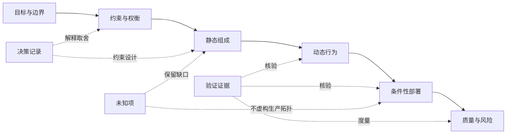

# G008 Batch 2 arc42 Documentation Skeleton Implementation Plan

> **For agentic workers:** REQUIRED SUB-SKILL: Use superpowers:subagent-driven-development (recommended) or superpowers:executing-plans to implement this plan task-by-task. Steps use checkbox (`- [ ]`) syntax for tracking.

**Goal:** Publish MOD-04 as an original six-unit arc42 v9 learning skeleton, map the existing Microsoft multi-agent reference architecture case without inventing deployment facts, and close only MOD-04 with immutable deployment evidence.

**Architecture:** Add one focused modeling article whose six original teaching units map all twelve arc42 v9 problem domains. Reuse the existing Microsoft case as the end-to-end evidence carrier, keep facts/inferences/local decisions/unknowns separate, and use one Mermaid evidence chain plus one accessible mapping table. Register four exact arc42 source identities, preserve existing Microsoft identities, then deliver through the repository’s Stage A content release and Stage B evidence closure.

**Tech Stack:** Docusaurus 3.10.2, MDX, Mermaid, Node.js 26.5.0 (repository floor Node.js 24), `node:test`, TypeScript 6, GitHub Pages.

## Global Constraints

- Work only in `/Users/seal/projects/tego-arch/.worktrees/g008-modeling-batch2` on branch `codex/g008-modeling-batch2`.
- Preserve the user-owned untracked `/Users/seal/projects/tego-arch/.codex/config.toml`; never stage, modify, or delete it.
- Scope is exactly MOD-04. Do not add MOD-05 or later G008 content and do not close G008.
- Do not add dependencies and do not lower the Node.js engine below `>=24.0`.
- Use the Microsoft multi-agent reference architecture as the only end-to-end case. The expense-reporting scenario is only a backlink to MOD-02/03.
- The six-unit skeleton is original project teaching structure, not an official arc42 template or a renamed copy of its twelve sections.
- Keep `已验证事实`, `基于证据的推断`, `本地项目决策`, and `未知项` visibly distinct.
- Building Block View is the static-composition spine; runtime and deployment evidence must not be presented as static structure.
- Never invent production topology, capacity, failover, recovery targets, or organization ownership for the Microsoft reference architecture.
- Include at least one measurable quality scenario and label its metric as a local teaching acceptance criterion, not a Microsoft production commitment.
- Use one Mermaid evidence chain and one focusable horizontally contained mapping table. Do not add Draw.io, SVG, or raster assets.
- MOD-13 is an unbuilt future handoff: mention it as plain text only. Do not link `/modeling/mod-13` and do not add it to `adjacent_topics` until that topic is published.
- Reuse existing Microsoft source identities. Add exactly four exact arc42 identities for Overview, Section 5, Section 10, and the v9 version record.
- arc42 material is CC BY-SA 4.0. Summarize and attribute; do not copy official template prose, examples, or field structure.
- Stage A must project 85 content documents, 468 governed sources, 42 completed topics, durable stories `7 / 20`, current G008, and MOD-04 next.
- Stage B must project 85 content documents, 468 governed sources, 43 completed topics, durable stories `7 / 20`, current G008, and MOD-05 next.
- Stage B must use the exact Stage A SHA and exact successful GitHub Pages run; do not record guessed or mutable evidence.
- Use `apply_patch` for source edits. Generated JSON is updated only through `npm run generate:content`.
- Run targeted tests before `npm run verify`; static checks do not replace desktop `1440x1000` and mobile `390x844` browser QA.

## File Structure

### New files

- `content/modeling/mod-04-arc42-documentation-skeleton.mdx` — six-unit arc42 v9 teaching skeleton and Microsoft-case walkthrough.
- `tests/g008-batch2-content.test.mjs` — MOD-04 metadata, structure, evidence-boundary, source, relation, Mermaid, table, and Stage A contract.
- `tests/g008-batch2-deployment.test.mjs` — exact Stage A evidence and Stage B closure contract.
- `docs/reviews/g008-batch2.md` — immutable release and production-smoke record.

### Existing files modified

- `content/methods/mth-03-adr-lifecycle.mdx` — visible backlink from ADR lifecycle to MOD-04.
- `content/methods/mth-06-requirements-to-evolution-loop.mdx` — visible backlink from evidence loop to MOD-04.
- `content/cases/microsoft-multi-agent-reference-architecture.mdx` — visible backlink from case evidence to the MOD-04 mapping method.
- `data/source-ledger.json` — four exact arc42 v9 identities plus MOD-04 document citations.
- `data/source-link-health.json` — reviewed live-link cache entries for the four new source transports.
- `docs/content-backlog.md` — Stage B evidence, MOD-04 completion, current baseline, and MOD-05 next.
- `tests/g008-batch1-content.test.mjs` — keep Batch 1 topic assertions, but advance the current repository projection to 85/468.
- `tests/g008-batch1-deployment.test.mjs` — keep immutable Batch 1 review literals, but advance current project status to 85/468.
- `tests/content-review-health.test.mjs` — canonical document/source counts 85/468.
- `tests/project-status.test.mjs` — Stage A then Stage B repository projection.
- `tests/source-ledger-pagination.test.mjs` — source total 468 and primary tier 425.
- `tests/source-ledger-rendering.test.mjs` — card total 468, primary tier 425, official-docs kind 165, official-repository kind 32.
- `src/generated/source-ledger.json` — generated.
- `src/generated/topic-manifest.json` — generated.
- `src/generated/topic-indexes.json` — generated.
- `src/generated/project-status.json` — generated.

---

### Task 1: Lock the MOD-04 content and evidence contract

**Files:**

- Create: `tests/g008-batch2-content.test.mjs`
- Test: `tests/g008-batch2-content.test.mjs`

**Interfaces:**

- Consumes: `readContentDocuments`, `findMarkdownHeadings`, `extractInternalLinks`, `extractExternalLinks`, current topic IDs, and the current source-ledger schema.
- Produces: a failing executable contract for topic `MOD-04`, route `/modeling/mod-04`, six-unit/twelve-domain coverage, four evidence classes, one measurable quality scenario, exact relations, and seven governed citations.

- [ ] **Step 1: Create the failing content contract**

Create `tests/g008-batch2-content.test.mjs`:

```js
import assert from 'node:assert/strict';
import {readFile} from 'node:fs/promises';
import test from 'node:test';
import {fileURLToPath} from 'node:url';

import {
  findMarkdownHeadings,
  readContentDocuments,
} from '../scripts/content-metadata.mjs';
import {extractInternalLinks} from '../scripts/content-relations.mjs';
import {extractExternalLinks} from '../scripts/source-ledger.mjs';

const contentRoot = fileURLToPath(new URL('../content/', import.meta.url));
const modelingHeadings = [
  '学习问题',
  '建模目标与输入',
  '参与者与步骤',
  '模型产物',
  '完成判断',
  '常见失败',
  '与其他模型的衔接',
  '完整演练',
  '来源',
];
const [documents, ledger] = await Promise.all([
  readContentDocuments(contentRoot),
  readFile(new URL('../data/source-ledger.json', import.meta.url), 'utf8')
    .then(JSON.parse),
]);
const byId = new Map(
  documents
    .filter(({metadata}) => typeof metadata.topic_id === 'string')
    .map((document) => [document.metadata.topic_id, document]),
);

function requiredDocument(id) {
  const document = byId.get(id);
  assert.ok(document, `${id} must be published`);
  return document;
}

function section(body, heading) {
  const headings = findMarkdownHeadings(body).filter(({level}) => level === 2);
  const index = headings.findIndex(({text}) => text === heading);
  assert.notEqual(index, -1, `missing ## ${heading}`);
  const start = body.indexOf('\n', headings[index].offset);
  const end = headings[index + 1]?.offset ?? body.length;
  return body.slice(start === -1 ? end : start + 1, end);
}

function fencedBlock(body, language) {
  const match = body.match(
    new RegExp(`\`\`\`${language}\\n([\\s\\S]*?)\\n\`\`\``, 'u'),
  );
  assert.ok(match, `missing ${language} fenced block`);
  return match[1];
}

test('publishes MOD-04 as an original six-unit arc42 v9 skeleton', () => {
  const document = requiredDocument('MOD-04');
  assert.equal(
    document.file,
    'modeling/mod-04-arc42-documentation-skeleton.mdx',
  );
  assert.equal(document.metadata.slug, '/modeling/mod-04');
  assert.equal(document.metadata.content_type, 'modeling');
  assert.equal(document.metadata.status, 'reviewed');
  assert.equal(document.metadata.priority, 'P0');
  assert.deepEqual(document.metadata.depends_on, ['MOD-01', 'MOD-03']);
  assert.deepEqual(document.metadata.adjacent_topics, []);
  assert.deepEqual(document.metadata.related_cases, [
    '/cases/microsoft-multi-agent-reference-architecture',
  ]);
  assert.deepEqual(
    document.headings.filter(({level}) => level === 2).map(({text}) => text),
    modelingHeadings,
  );
  assert.match(document.body, /arc42 v9\.0/u);
  assert.match(document.body, /本站原创的六单元教学骨架/u);
  assert.match(document.body, /不是[^。\n]*官方模板/u);
});

test('maps all twelve arc42 problem domains without copying the template', () => {
  const products = section(requiredDocument('MOD-04').body, '模型产物');
  for (const label of [
    'Introduction and Goals',
    'Architecture Constraints',
    'Context and Scope',
    'Solution Strategy',
    'Building Block View',
    'Runtime View',
    'Deployment View',
    'Cross-cutting Concepts',
    'Architecture Decisions',
    'Quality Requirements',
    'Risks and Technical Debt',
    'Glossary',
  ]) {
    assert.match(products, new RegExp(label, 'u'), label);
  }
  for (const unit of [
    '目标与边界',
    '约束与权衡',
    '静态组成',
    '动态行为',
    '条件性部署',
    '质量、风险与词汇',
  ]) {
    assert.match(products, new RegExp(unit, 'u'), unit);
  }
  assert.match(products, /className="table-wrapper"/u);
  assert.match(products, /aria-label="arc42 v9 六单元映射表，可横向滚动"/u);
  assert.match(products, /tabIndex=\{0\}/u);
});

test('keeps evidence classes and non-proof boundaries explicit', () => {
  const document = requiredDocument('MOD-04');
  for (const evidenceClass of [
    '已验证事实',
    '基于证据的推断',
    '本地项目决策',
    '未知项',
  ]) {
    assert.match(document.body, new RegExp(evidenceClass, 'u'), evidenceClass);
  }
  assert.match(
    document.body,
    /Building Block View[^。\n]*(?:核心|主线)[^。\n]*静态/u,
  );
  assert.match(document.body, /未知[^。\n]*(?:生产拓扑|部署拓扑)/u);
  assert.match(document.body, /不[^。\n]*虚构[^。\n]*(?:拓扑|容量|故障切换)/u);
  assert.match(
    document.body,
    /arc42[^。\n]*(?:不替代|不能替代)[^。\n]*(?:ADR|质量场景|风险|运行证据)/u,
  );
});

test('renders one evidence-chain Mermaid with explicit validation gaps', () => {
  const mermaid = fencedBlock(requiredDocument('MOD-04').body, 'mermaid');
  assert.match(mermaid, /^flowchart LR/mu);
  for (const label of [
    '目标与边界',
    '约束与权衡',
    '静态组成',
    '动态行为',
    '条件性部署',
    '质量与风险',
    '决策记录',
    '验证证据',
    '未知项',
  ]) {
    assert.match(mermaid, new RegExp(label, 'u'), label);
  }
});

test('contains one measurable local quality scenario', () => {
  const exercise = section(requiredDocument('MOD-04').body, '完整演练');
  for (const field of ['来源', '刺激', '环境', '制品', '响应', '度量']) {
    assert.match(exercise, new RegExp(`\\*\\*${field}：\\*\\*`, 'u'), field);
  }
  assert.match(exercise, /全部关键步骤[^。\n]*一致关联标识/u);
  assert.match(exercise, /故障步骤[^。\n]*10 分钟内定位/u);
  assert.match(exercise, /本站教学验收标准/u);
  assert.match(exercise, /不是 Microsoft[^。\n]*生产承诺/u);
});

test('links the real learning chain without publishing MOD-13 early', () => {
  const mod04 = requiredDocument('MOD-04');
  const links = new Set(extractInternalLinks(mod04));
  for (const slug of [
    '/modeling',
    '/modeling/mod-01',
    '/modeling/mod-02',
    '/modeling/mod-03',
    '/methods/mth-03',
    '/methods/mth-06',
    '/cases/microsoft-multi-agent-reference-architecture',
  ]) {
    assert.ok(links.has(slug), slug);
  }
  assert.equal(links.has('/modeling/mod-13'), false);
  assert.match(mod04.body, /MOD-13[^。\n]*尚未发布/u);
  assert.ok(
    extractInternalLinks(requiredDocument('MTH-03')).includes('/modeling/mod-04'),
  );
  assert.ok(
    extractInternalLinks(requiredDocument('MTH-06')).includes('/modeling/mod-04'),
  );
  const microsoft = documents.find(
    ({metadata}) =>
      metadata.slug === '/cases/microsoft-multi-agent-reference-architecture',
  );
  assert.ok(microsoft);
  assert.ok(extractInternalLinks(microsoft).includes('/modeling/mod-04'));
});

test('governs exact arc42 and Microsoft evidence identities', () => {
  const document = requiredDocument('MOD-04');
  const governed =
    ledger.documents['content/modeling/mod-04-arc42-documentation-skeleton.mdx'];
  assert.ok(governed);
  assert.deepEqual(
    governed.citations.map(({source_id}) => source_id),
    [
      'src-arc42-building-block-view-v9',
      'src-arc42-overview-v9',
      'src-arc42-quality-requirements-v9',
      'src-arc42-template-v9-record',
      'src-github-2dd3cdefac57',
      'src-github-4d3dfe89f2a4',
      'src-github-ccef43990f14',
    ],
  );
  const visibleExternal = new Set(extractExternalLinks(document));
  for (const citation of governed.citations) {
    assert.ok(visibleExternal.has(citation.citation_url), citation.citation_url);
  }
  for (const sourceId of governed.citations.slice(0, 4).map(({source_id}) => source_id)) {
    const source = ledger.sources.find(({id}) => id === sourceId);
    assert.ok(source, sourceId);
    assert.equal(source.license, 'CC-BY-SA-4.0');
    assert.equal(source.copyright_policy, 'adapt-sharealike-review');
  }
});
```

- [ ] **Step 2: Run the test and verify the missing article failure**

Run:

```bash
node --test tests/g008-batch2-content.test.mjs
```

Expected: FAIL with `MOD-04 must be published`.

- [ ] **Step 3: Commit nothing yet**

The failing test and its implementation form one reviewable unit. Keep the test unstaged until Task 2 makes it pass.

---

### Task 2: Publish the article, exact sources, and reciprocal visible links

**Files:**

- Create: `content/modeling/mod-04-arc42-documentation-skeleton.mdx`
- Modify: `content/methods/mth-03-adr-lifecycle.mdx`
- Modify: `content/methods/mth-06-requirements-to-evolution-loop.mdx`
- Modify: `content/cases/microsoft-multi-agent-reference-architecture.mdx`
- Modify: `data/source-ledger.json`
- Modify: generated files produced by `npm run generate:content`
- Test: `tests/g008-batch2-content.test.mjs`

**Interfaces:**

- Consumes: MOD-01/MOD-03 evidence boundaries, Microsoft case source identities, and the source-ledger exact-locator rule.
- Produces: published topic `MOD-04`, route `/modeling/mod-04`, four new arc42 identities, seven visible governed citations, two method backlinks, one case backlink, and generated topic/source projections.

- [ ] **Step 1: Register four exact arc42 source identities**

Insert these objects into `data/source-ledger.json`’s `sources` array using the file’s deterministic source-ID ordering:

```json
{
  "id": "src-arc42-building-block-view-v9",
  "canonical_locator": "https://docs.arc42.org/section-5/",
  "transport_locator": "https://docs.arc42.org/section-5/",
  "query_insensitive": false,
  "locator_aliases": [],
  "tombstone": null,
  "title": "arc42 v9 — Building Block View",
  "author_or_org": "arc42 contributors",
  "published_at": null,
  "registered_at": "2026-07-30",
  "checked_at": "2026-07-30",
  "version": "arc42 v9 section checked on 2026-07-30",
  "source_kind": "official-docs",
  "tier": "primary",
  "allowed_evidence_roles": ["definition", "learning", "method"],
  "license": "CC-BY-SA-4.0",
  "license_scope": "The named arc42 documentation page within the official CC BY-SA 4.0 scope; linked third-party works, trademarks, code, and separately licensed media excluded",
  "license_evidence_url": "https://arc42.org/license",
  "license_evidence_note": "The official arc42 license page identifies arc42 documentation as CC BY-SA 4.0.",
  "license_family_id": "https://docs.arc42.org/section-5/",
  "license_family_grouping": "identity",
  "family_grouping_evidence_url": null,
  "copyright_policy": "adapt-sharealike-review",
  "usage_boundary": "Supports a factual summary of the purpose and decomposition role of the arc42 v9 Building Block View; it does not authorize copying the official template text or prove a project decomposition is correct.",
  "link_policy": "stable",
  "expected_final_transport_locator": "https://docs.arc42.org/section-5/",
  "expected_final_approved_at": "2026-07-30",
  "expected_final_approval_note": "Reviewed G008 Batch 2 transport baseline"
}
```

```json
{
  "id": "src-arc42-overview-v9",
  "canonical_locator": "https://arc42.org/overview",
  "transport_locator": "https://arc42.org/overview",
  "query_insensitive": false,
  "locator_aliases": [],
  "tombstone": null,
  "title": "arc42 v9 — Overview",
  "author_or_org": "arc42 contributors",
  "published_at": null,
  "registered_at": "2026-07-30",
  "checked_at": "2026-07-30",
  "version": "arc42 v9 overview checked on 2026-07-30",
  "source_kind": "official-docs",
  "tier": "primary",
  "allowed_evidence_roles": ["definition", "learning", "method"],
  "license": "CC-BY-SA-4.0",
  "license_scope": "The named arc42 overview page within the official CC BY-SA 4.0 scope; linked third-party works, trademarks, code, and separately licensed media excluded",
  "license_evidence_url": "https://arc42.org/license",
  "license_evidence_note": "The official arc42 license page identifies arc42 documentation as CC BY-SA 4.0.",
  "license_family_id": "https://arc42.org/overview",
  "license_family_grouping": "identity",
  "family_grouping_evidence_url": null,
  "copyright_policy": "adapt-sharealike-review",
  "usage_boundary": "Supports the arc42 v9 problem-domain overview and tailoring principle; it does not make the project’s original six-unit teaching skeleton an official arc42 template.",
  "link_policy": "stable",
  "expected_final_transport_locator": "https://arc42.org/overview",
  "expected_final_approved_at": "2026-07-30",
  "expected_final_approval_note": "Reviewed G008 Batch 2 transport baseline"
}
```

```json
{
  "id": "src-arc42-quality-requirements-v9",
  "canonical_locator": "https://docs.arc42.org/section-10/",
  "transport_locator": "https://docs.arc42.org/section-10/",
  "query_insensitive": false,
  "locator_aliases": [],
  "tombstone": null,
  "title": "arc42 v9 — Quality Requirements",
  "author_or_org": "arc42 contributors",
  "published_at": null,
  "registered_at": "2026-07-30",
  "checked_at": "2026-07-30",
  "version": "arc42 v9 section checked on 2026-07-30",
  "source_kind": "official-docs",
  "tier": "primary",
  "allowed_evidence_roles": ["definition", "learning", "method"],
  "license": "CC-BY-SA-4.0",
  "license_scope": "The named arc42 documentation page within the official CC BY-SA 4.0 scope; linked third-party works, trademarks, code, and separately licensed media excluded",
  "license_evidence_url": "https://arc42.org/license",
  "license_evidence_note": "The official arc42 license page identifies arc42 documentation as CC BY-SA 4.0.",
  "license_family_id": "https://docs.arc42.org/section-10/",
  "license_family_grouping": "identity",
  "family_grouping_evidence_url": null,
  "copyright_policy": "adapt-sharealike-review",
  "usage_boundary": "Supports factual summary of the arc42 v9 quality overview and detailed quality-scenario role; it does not supply project-specific metrics or production commitments.",
  "link_policy": "stable",
  "expected_final_transport_locator": "https://docs.arc42.org/section-10/",
  "expected_final_approved_at": "2026-07-30",
  "expected_final_approval_note": "Reviewed G008 Batch 2 transport baseline"
}
```

```json
{
  "id": "src-arc42-template-v9-record",
  "canonical_locator": "https://github.com/arc42/arc42-template/blob/8dff0d9b1f9640684df8c3bbcdc2ee45f989ca0f/EN/version.properties",
  "transport_locator": "https://github.com/arc42/arc42-template/blob/8dff0d9b1f9640684df8c3bbcdc2ee45f989ca0f/EN/version.properties",
  "query_insensitive": false,
  "locator_aliases": [],
  "tombstone": null,
  "title": "arc42 Template v9.0 Version Record",
  "author_or_org": "arc42 contributors",
  "published_at": null,
  "registered_at": "2026-07-30",
  "checked_at": "2026-07-30",
  "version": "arc42 v9.0, July 2025; arc42/arc42-template@8dff0d9b1f9640684df8c3bbcdc2ee45f989ca0f, EN/version.properties",
  "source_kind": "official-repository",
  "tier": "primary",
  "allowed_evidence_roles": ["definition", "historical-context", "learning"],
  "license": "CC-BY-SA-4.0",
  "license_scope": "The arc42 template repository content covered by its CC BY-SA 4.0 license; trademarks and separately licensed linked material excluded",
  "license_evidence_url": "https://arc42.org/license",
  "license_evidence_note": "The official arc42 license page identifies the templates and documentation as CC BY-SA 4.0.",
  "license_family_id": "https://github.com/arc42/arc42-template/blob/8dff0d9b1f9640684df8c3bbcdc2ee45f989ca0f/EN/version.properties",
  "license_family_grouping": "identity",
  "family_grouping_evidence_url": null,
  "copyright_policy": "adapt-sharealike-review",
  "usage_boundary": "Supports only the pinned v9.0 version and July 2025 release record; it does not define the meaning of every arc42 section or authorize copying the template.",
  "link_policy": "pinned",
  "expected_final_transport_locator": "https://github.com/arc42/arc42-template/blob/8dff0d9b1f9640684df8c3bbcdc2ee45f989ca0f/EN/version.properties",
  "expected_final_approved_at": "2026-07-30",
  "expected_final_approval_note": "Reviewed G008 Batch 2 pinned version evidence"
}
```

- [ ] **Step 2: Add the MOD-04 document citation map**

Add this exact entry to `data/source-ledger.json`’s `documents` object:

```json
"content/modeling/mod-04-arc42-documentation-skeleton.mdx": {
  "reviewed_at": "2026-07-30",
  "copyright_checks": [
    "original-structure",
    "quotation-boundary",
    "attribution-complete"
  ],
  "citations": [
    {
      "source_id": "src-arc42-building-block-view-v9",
      "citation_url": "https://docs.arc42.org/section-5/",
      "roles": ["definition", "method"],
      "manifest_primary": false,
      "usage_mode": "facts-summary",
      "attribution_note": "arc42 v9 Building Block View, arc42 contributors",
      "modification_note": null,
      "excerpt": null,
      "quotation_reviewed": false
    },
    {
      "source_id": "src-arc42-overview-v9",
      "citation_url": "https://arc42.org/overview",
      "roles": ["definition", "method"],
      "manifest_primary": true,
      "usage_mode": "facts-summary",
      "attribution_note": "arc42 v9 Overview, arc42 contributors",
      "modification_note": null,
      "excerpt": null,
      "quotation_reviewed": false
    },
    {
      "source_id": "src-arc42-quality-requirements-v9",
      "citation_url": "https://docs.arc42.org/section-10/",
      "roles": ["definition", "method"],
      "manifest_primary": false,
      "usage_mode": "facts-summary",
      "attribution_note": "arc42 v9 Quality Requirements, arc42 contributors",
      "modification_note": null,
      "excerpt": null,
      "quotation_reviewed": false
    },
    {
      "source_id": "src-arc42-template-v9-record",
      "citation_url": "https://github.com/arc42/arc42-template/blob/8dff0d9b1f9640684df8c3bbcdc2ee45f989ca0f/EN/version.properties",
      "roles": ["historical-context"],
      "manifest_primary": false,
      "usage_mode": "facts-summary",
      "attribution_note": "arc42 Template v9.0 version record, arc42 contributors",
      "modification_note": null,
      "excerpt": null,
      "quotation_reviewed": false
    },
    {
      "source_id": "src-github-2dd3cdefac57",
      "citation_url": "https://github.com/microsoft/multi-agent-reference-architecture/blob/ed3613b54b46b595dd223aaff8772def376a8c37/docs/reference-architecture/Reference-Architecture.md",
      "roles": ["implementation"],
      "manifest_primary": true,
      "usage_mode": "facts-summary",
      "attribution_note": "Reference Architecture, Microsoft",
      "modification_note": null,
      "excerpt": null,
      "quotation_reviewed": false
    },
    {
      "source_id": "src-github-4d3dfe89f2a4",
      "citation_url": "https://github.com/microsoft/multi-agent-reference-architecture/blob/ed3613b54b46b595dd223aaff8772def376a8c37/docs/building-blocks/Building-Blocks.md",
      "roles": ["implementation"],
      "manifest_primary": true,
      "usage_mode": "facts-summary",
      "attribution_note": "Building Blocks, Microsoft",
      "modification_note": null,
      "excerpt": null,
      "quotation_reviewed": false
    },
    {
      "source_id": "src-github-ccef43990f14",
      "citation_url": "https://github.com/microsoft/multi-agent-reference-architecture/blob/ed3613b54b46b595dd223aaff8772def376a8c37/docs/observability/Observability.md",
      "roles": ["implementation"],
      "manifest_primary": true,
      "usage_mode": "facts-summary",
      "attribution_note": "Observability, Microsoft",
      "modification_note": null,
      "excerpt": null,
      "quotation_reviewed": false
    }
  ]
}
```

- [ ] **Step 3: Create the complete MOD-04 article**

Create `content/modeling/mod-04-arc42-documentation-skeleton.mdx`:

```mdx
---
title: arc42 文档骨架
slug: /modeling/mod-04
content_type: modeling
status: reviewed
difficulty: intermediate
analyzed_at: 2026-07-30
source_cutoff: 2026-07-30
review_policy: quarterly-version-sensitive
confidence: high
domains:
  - software-architecture
agent_patterns: []
protocols: []
quality_attributes:
  - understandability
  - maintainability
  - auditability
tags:
  - arc42
  - 架构文档
  - Building Block
summary: 用原创六单元教学骨架映射 arc42 v9 的十二个问题域，并把事实、推断、决策和未知项组织成可评审证据链。
topic_id: MOD-04
priority: P0
depends_on:
  - MOD-01
  - MOD-03
adjacent_topics: []
related_cases:
  - /cases/microsoft-multi-agent-reference-architecture
related_questions: []
---

# arc42 文档骨架

arc42 组织架构知识，不替团队创造事实。本文把 [arc42 v9.0 Overview](https://arc42.org/overview) 的十二个问题域映射为本站原创的六单元教学骨架；它不是 arc42 官方模板，也不复制官方字段。先从[建模目录](/modeling)和[建模总览](/modeling/mod-01)确定评审问题，再复用 [C4 Component、Dynamic 与 Deployment](/modeling/mod-03)已经区分的结构、行为和部署证据。

## 学习问题

- 如何裁剪 arc42，而不是为了章节完整度制造内容？
- 如何让 Building Block View 成为静态组成主线，又不混淆运行和部署事实？
- 如何区分案例中的已验证事实、基于证据的推断、本地项目决策和未知项？
- 如何把质量场景、ADR、风险和验证证据接回文档骨架？

## 建模目标与输入

输入包括评审问题、干系人、业务目标、约束、现有模型、决策记录、运行证据和事实截止时间。本文以 [Microsoft 多智能体参考架构案例](/cases/microsoft-multi-agent-reference-architecture)为端到端载体，只使用其固定提交公开材料。费用申报系统只通过 [Context/Container](/modeling/mod-02)和 MOD-03 回看视图分工，不与 Microsoft 案例事实混写。

每条陈述先分类：**已验证事实**来自公开文本或图；**基于证据的推断**由公开材料合理推出但未被直接陈述；**本地项目决策**是本站为了教学选择的裁剪和验收标准；**未知项**是生产拓扑、容量、恢复目标或组织所有权等尚无证据的内容。未知不等于失败，伪造完整才是失败。

## 参与者与步骤

业务和产品负责人确认目标与边界，架构负责人组织静态和动态证据，开发与运维人员核验实现和运行事实，决策责任人批准取舍，未参与编写的评审者检查未知项是否被隐藏。

1. 先记录目标、干系人和系统上下文，再筛出真正塑造架构的约束。
2. 写出总策略和关键决策，把事实、推断与本地决定分栏。
3. 以 Building Block View 为静态主线，只分解到能回答责任、接口和所有权问题的层级。
4. 选择少量关键运行场景，说明责任交接、失败和恢复，不把调用顺序塞进静态结构。
5. 只记录有证据的部署节点和实例；Microsoft 材料没有证明的生产拓扑保持未知。
6. 写出可度量质量场景、风险和术语，再检查每项能否回到结构、运行、部署、决策或验证证据。

## 模型产物

arc42 v9.0 仍以十二个问题域组织内容。下面的六单元只是本站原创教学投影，可以按评审需要继续裁剪。

<div className="table-wrapper" role="region" aria-label="arc42 v9 六单元映射表，可横向滚动" tabIndex={0}>

| 本站原创单元 | 对应 arc42 v9 问题域 | 核心问题 | 最小证据与产物 | 明确不证明 |
| --- | --- | --- | --- | --- |
| 目标与边界 | 1 Introduction and Goals；3 Context and Scope | 为什么建、为谁建、边界在哪里 | 目标、干系人、质量目标、业务与技术上下文 | 内部结构或运行顺序已经正确 |
| 约束与权衡 | 2 Architecture Constraints；4 Solution Strategy；9 Architecture Decisions | 哪些条件不可改变，采用什么总策略，为什么取舍 | 约束、总策略、ADR 与复核条件 | 决策已经被正确实现 |
| 静态组成 | 5 Building Block View；8 Cross-cutting Concepts 的结构部分 | 责任单元、接口和依赖如何分层 | Building Block 分解、职责、接口、所有权 | 真实调用顺序或部署实例 |
| 动态行为 | 6 Runtime View；8 Cross-cutting Concepts 的运行部分 | 关键场景如何跨边界执行 | 场景顺序、状态、失败与恢复 | 性能或生产追踪已经达标 |
| 条件性部署 | 7 Deployment View | 软件实例在什么已知环境运行 | 经验证的节点、实例和环境映射 | 容量、容灾或故障切换有效 |
| 质量、风险与词汇 | 10 Quality Requirements；11 Risks and Technical Debt；12 Glossary | 如何度量成败、最大风险是什么、术语是否一致 | 质量场景、风险与债务、统一词汇 | 风险已经被处置或质量已经达成 |

</div>

Building Block View 是本文静态组成的核心主线。Microsoft 公开材料明确给出 Orchestrator、Specialized Agents 和 Agent Registry 等构件，这是**已验证事实**；把分散职责重组为控制、执行、数据与保障平面，是**基于证据的推断**；选择只展开控制平面，是**本地项目决策**；真实团队所有权仍是**未知项**。



静态组成不自动证明运行顺序，运行场景不自动证明部署事实，决策记录不自动证明实现符合预期。arc42 不替代 ADR、质量场景、风险分析或运行证据；它只让这些产物能被找到、复核和共同演进。

## 完成判断

六单元能覆盖当前评审所需的十二个问题域，但没有为未使用章节填充空话；Building Block 的每个元素有责任和证据分类；关键运行场景与静态组成名称一致；部署未知项没有被虚构拓扑、容量或故障切换填满；至少一个质量场景能回链到决策、验证和风险。

评审者还应能指出哪些内容被裁剪、为什么裁剪、由什么事件触发补写。文档完整度不是停止条件，足以支持当前决定且未知项有负责人和复核触发才是。

## 常见失败

最常见的失败是复制十二章标题后逐项填空，把“暂无证据”改写成模糊愿景。另一个失败是把组件、运行步骤和部署节点放进同一层清单，导致 Building Block 无法表达稳定责任。只记录决定而没有 ADR 状态与替代关系，只记录质量口号而没有度量，或只画部署图却没有环境盘点，都会切断证据链。

不要从 Microsoft 参考架构图推断其生产区域、实例数、容量或故障切换。公开材料未证明的生产拓扑必须保留为未知；本文不虚构拓扑、容量或故障切换来满足模板完整度。

## 与其他模型的衔接

[建模总览](/modeling/mod-01)负责从问题选择模型，[MOD-03](/modeling/mod-03)提供结构、行为和部署的证明边界。[ADR 生命周期](/methods/mth-03)维护决策状态与替代关系，[从需求到演进的架构闭环](/methods/mth-06)把质量、风险、实现和运行反馈接回文档。Microsoft 案例提供公开事实，但不能替代项目自己的生产盘点。

MOD-13 将承担持续建模与漂移治理，但 MOD-13 尚未发布；本页只记录未来交接方向，不创建失效链接或 `adjacent_topics`。费用申报示例继续以 [MOD-02](/modeling/mod-02) 的图为权威，不进入本文 Microsoft 案例的事实清单。

## 完整演练

目标是把 Microsoft 多智能体参考架构整理成一次可评审知识包。目标与边界记录“企业治理下的多智能体职责分工”；约束与权衡记录中央编排、注册准入和策略执行；静态组成以 Orchestrator、Registry、Specialized Agents、Memory 与保障能力为 Building Blocks；动态行为选择一次请求分类、路由、专业 Agent 执行和结果聚合；部署因缺少公开生产盘点而保留未知。

质量场景采用本站教学验收标准：

- **来源：** 架构评审者；
- **刺激：** 请求追踪一次跨多个 Agent 的业务流程；
- **环境：** 参考实现的正常运行演练；
- **制品：** 编排、Agent 间消息和遥测链路；
- **响应：** 关联关键步骤并定位失败责任边界；
- **度量：** 演练选定的全部关键步骤都有一致关联标识，故障步骤能在 10 分钟内定位。

这个度量是本站教学验收标准，不是 Microsoft 的生产承诺。若观测材料只能证明应采集动作、工具调用和响应模式，却没有给出本项目的关联标识实现，记录为**基于证据的推断**与**未知项**；不得把建议写成已经通过的运行事实。

## 来源

十二个问题域和裁剪原则依据 [arc42 v9 Overview](https://arc42.org/overview)，静态分解依据 [Building Block View](https://docs.arc42.org/section-5/)，质量概览与详细场景依据 [Quality Requirements](https://docs.arc42.org/section-10/)，版本依据固定提交中的 [v9.0 version record](https://github.com/arc42/arc42-template/blob/8dff0d9b1f9640684df8c3bbcdc2ee45f989ca0f/EN/version.properties)。案例事实依据 Microsoft 固定提交中的 [Reference Architecture](https://github.com/microsoft/multi-agent-reference-architecture/blob/ed3613b54b46b595dd223aaff8772def376a8c37/docs/reference-architecture/Reference-Architecture.md)、[Building Blocks](https://github.com/microsoft/multi-agent-reference-architecture/blob/ed3613b54b46b595dd223aaff8772def376a8c37/docs/building-blocks/Building-Blocks.md)与 [Observability](https://github.com/microsoft/multi-agent-reference-architecture/blob/ed3613b54b46b595dd223aaff8772def376a8c37/docs/observability/Observability.md)。六单元结构、映射、Mermaid 和演练为本站原创。
```

- [ ] **Step 4: Add three visible backlinks without changing historical adjacency arrays**

Append this sentence to `content/methods/mth-03-adr-lifecycle.mdx` under `## 与其他方法的衔接`:

```mdx
[arc42 文档骨架](/modeling/mod-04)把 ADR 放回约束、策略、结构、运行、质量与风险证据链，但不改变 ADR 自身的状态和替代规则。
```

Append this sentence to `content/methods/mth-06-requirements-to-evolution-loop.mdx` under `## 与其他方法的衔接`:

```mdx
[arc42 文档骨架](/modeling/mod-04)为闭环各节点提供可裁剪的文档位置，同时保留运行反馈和未知项的证据边界。
```

Append this paragraph to `content/cases/microsoft-multi-agent-reference-architecture.mdx` under `## 可迁移经验`:

```mdx
若要把本案例的约束、Building Blocks、运行场景、部署未知项、决策和风险组织成可复核文档，可进入 [arc42 文档骨架](/modeling/mod-04)；该方法保留本文的事实、推断和未知项边界，不把参考图改写成生产拓扑。
```

- [ ] **Step 5: Refresh and inspect link-health evidence**

Run:

```bash
npm run refresh:links
npm run check:links
```

Expected: the committed cache contains one reviewed result for each of these exact transports, and the cache check passes:

```text
https://arc42.org/overview
https://docs.arc42.org/section-5/
https://docs.arc42.org/section-10/
https://github.com/arc42/arc42-template/blob/8dff0d9b1f9640684df8c3bbcdc2ee45f989ca0f/EN/version.properties
```

Review `git diff -- data/source-link-health.json`; keep only truthful probe results produced by the script.

- [ ] **Step 6: Generate projections**

Run:

```bash
npm run generate:content
```

Expected: generated source ledger, topic manifest/indexes, project status, review reports, and source-license inventory update successfully.

- [ ] **Step 7: Run the focused contract**

Run:

```bash
node --test tests/g008-batch2-content.test.mjs
npm run validate:content
npm run check:content
```

Expected: all three commands PASS. If a source role or exact-locator rule fails, repair the ledger record or citation; do not weaken the test.

- [ ] **Step 8: Commit the complete content slice**

```bash
git add content/modeling/mod-04-arc42-documentation-skeleton.mdx content/methods/mth-03-adr-lifecycle.mdx content/methods/mth-06-requirements-to-evolution-loop.mdx content/cases/microsoft-multi-agent-reference-architecture.mdx data/source-ledger.json data/source-link-health.json tests/g008-batch2-content.test.mjs src/generated/source-ledger.json src/generated/topic-manifest.json src/generated/topic-indexes.json src/generated/project-status.json
git commit -m "content: add arc42 documentation skeleton"
```

Expected: one commit with no backlog completion and no review record.

---

### Task 3: Lock the Stage A repository projection and run local gates

**Files:**

- Modify: `tests/g008-batch1-content.test.mjs`
- Modify: `tests/g008-batch1-deployment.test.mjs`
- Modify: `tests/content-review-health.test.mjs`
- Modify: `tests/project-status.test.mjs`
- Modify: `tests/source-ledger-pagination.test.mjs`
- Modify: `tests/source-ledger-rendering.test.mjs`
- Modify: `tests/g008-batch2-content.test.mjs`
- Modify: generated files produced by `npm run generate:content`

**Interfaces:**

- Consumes: Task 2’s one document and four exact source identities.
- Produces: one green Stage A baseline at `42 completed / 85 documents / 468 sources`, with 425 primary sources, 165 official-docs sources, and 32 official-repository sources.

- [ ] **Step 1: Add the Stage A projection assertion**

Append to `tests/g008-batch2-content.test.mjs`:

```js
test('keeps MOD-04 pending during Stage A', async () => {
  const [status, backlog] = await Promise.all([
    readFile(new URL('../src/generated/project-status.json', import.meta.url), 'utf8')
      .then(JSON.parse),
    readFile(new URL('../docs/content-backlog.md', import.meta.url), 'utf8'),
  ]);
  assert.deepEqual(status, {
    schema_version: 1,
    durable_stories: {completed: 7, total: 20, current: 'G008'},
    completed_topics: 42,
    content_documents: 85,
    governed_sources: 468,
    sources: {
      durable_stories: 'docs/content-backlog.md',
      completed_topics: 'docs/content-backlog.md',
      content_documents: 'content/**/*.{md,mdx}',
      governed_sources: 'data/source-ledger.json',
    },
  });
  assert.match(backlog, /^- \[ \] \*\*MOD-04 /mu);
  assert.match(backlog, /当前持久故事：\*\* `G008`/u);
  assert.match(backlog, /下一项[^。\n]*MOD-04/u);
});
```

- [ ] **Step 2: Advance only live repository count assertions**

Apply these exact value changes:

```text
tests/g008-batch1-content.test.mjs
  current project status: content_documents 84 -> 85
  current project status: governed_sources 464 -> 468
  keep completed_topics 42

tests/g008-batch1-deployment.test.mjs
  current projectStatus.content_documents 84 -> 85
  current projectStatus.governed_sources 464 -> 468
  keep the review literals "84 content documents" and "464 governed sources":
  those literals are immutable Batch 1 Stage A evidence

tests/content-review-health.test.mjs
  inputs.documents.length 84 -> 85
  inputs.ledger.sources.length 464 -> 468
  report.new_source_ids.length 464 -> 468
  report.new_sources.length 464 -> 468

tests/project-status.test.mjs
  real repository projection content_documents 84 -> 85
  real repository projection governed_sources 464 -> 468
  keep completed_topics 42

tests/source-ledger-pagination.test.mjs
  primary tier count 421 -> 425
  pagedIds length and unique count 464 -> 468
  expected primary page count remains 22

tests/source-ledger-rendering.test.mjs
  cards length and unique count 464 -> 468
  primary tier 421 -> 425
  official-docs source kind 162 -> 165
  official-repository source kind 31 -> 32
```

The four new identities contain three `official-docs` records and one `official-repository` record; therefore the projected totals are `official-docs=165` and `official-repository=32`.

- [ ] **Step 3: Regenerate and run count-sensitive tests**

Run:

```bash
npm run generate:content
node --test tests/g008-batch1-content.test.mjs tests/g008-batch1-deployment.test.mjs tests/g008-batch2-content.test.mjs tests/content-review-health.test.mjs tests/project-status.test.mjs tests/source-ledger-pagination.test.mjs tests/source-ledger-rendering.test.mjs
```

Expected: all selected tests PASS with `42 / 85 / 468`.

- [ ] **Step 4: Run the full Stage A local gate**

Run:

```bash
npm run verify
git diff --check
git status --short
```

Expected: complete test suite, content validation, generated-content check, cached-link check, review-health check, typecheck, and production build all PASS. Git status contains only intended tracked changes.

- [ ] **Step 5: Commit the Stage A projection contract**

```bash
git add tests/g008-batch1-content.test.mjs tests/g008-batch1-deployment.test.mjs tests/g008-batch2-content.test.mjs tests/content-review-health.test.mjs tests/project-status.test.mjs tests/source-ledger-pagination.test.mjs tests/source-ledger-rendering.test.mjs src/generated/source-ledger.json src/generated/topic-manifest.json src/generated/topic-indexes.json src/generated/project-status.json
git commit -m "test: lock g008 batch 2 stage a projection"
```

Record `git rev-parse HEAD` as the Stage A candidate.

---

### Task 4: Review, publish, and visually verify Stage A

**Files:**

- Review: every file changed by Tasks 1–3.
- Do not create `docs/reviews/g008-batch2.md` until exact production evidence exists.

**Interfaces:**

- Consumes: a clean Stage A candidate with green local verification.
- Produces: exact Stage A SHA, exact successful Pages run ID, independent review verdicts, and production evidence for MOD-04.

- [ ] **Step 1: Run independent review gates**

Use fresh reviewers for:

```text
1. spec compliance: six units, all twelve arc42 domains, evidence classes, MOD-13 boundary
2. source/copyright: four exact arc42 identities, seven visible citations, CC BY-SA 4.0 boundary
3. code/test quality: assertions prove behavior without duplicating implementation text excessively
```

Expected: each reviewer returns PASS or concrete findings. Repair every material finding, rerun targeted tests and `npm run verify`, and commit repairs before capturing the Stage A SHA.

- [ ] **Step 2: Capture the exact Stage A SHA**

Run:

```bash
git status --short
STAGE_A_SHA=$(git rev-parse HEAD)
test "${#STAGE_A_SHA}" -eq 40
```

Expected: clean worktree. Save the 40-character lowercase SHA as `STAGE_A_SHA`.

- [ ] **Step 3: Fast-forward main and push Stage A**

From `/Users/seal/projects/tego-arch`:

```bash
git status --short
git switch main
git merge --ff-only codex/g008-modeling-batch2
git push origin main
```

Expected: `main` and `origin/main` point to `STAGE_A_SHA`. Do not stage or modify `.codex/config.toml`.

- [ ] **Step 4: Select the exact Pages run**

Run:

```bash
STAGE_A_SHA=$(git rev-parse main)
PAGES_RUN_ID=$(gh run list --workflow deploy.yml --branch main --limit 20 --json databaseId,headSha --jq ".[] | select(.headSha == \"$STAGE_A_SHA\") | .databaseId" | head -n 1)
test -n "$PAGES_RUN_ID"
gh run watch "$PAGES_RUN_ID" --exit-status
gh run view "$PAGES_RUN_ID" --json databaseId,headSha,status,conclusion,url
```

Expected: exact `headSha=STAGE_A_SHA`, `status=completed`, `conclusion=success`. Save the decimal ID as `PAGES_RUN_ID`.

- [ ] **Step 5: Verify production HTTP**

Run:

```bash
curl -sS -o /dev/null -w '%{http_code}\n' https://sealday.github.io/tego-arch/modeling/
curl -sS -o /dev/null -w '%{http_code}\n' https://sealday.github.io/tego-arch/modeling/mod-04
curl -sS -o /dev/null -w '%{http_code}\n' https://sealday.github.io/tego-arch/cases/microsoft-multi-agent-reference-architecture
curl -sS -o /dev/null -w '%{http_code}\n' https://sealday.github.io/tego-arch/methods/mth-03
curl -sS -o /dev/null -w '%{http_code}\n' https://sealday.github.io/tego-arch/methods/mth-06
```

Expected: five `200` responses.

- [ ] **Step 6: Run desktop and mobile browser QA**

At desktop `1440x1000` and mobile `390x844`, verify:

```text
- /modeling/mod-04 renders the nine standard sections
- the Mermaid evidence chain is visible and labels are readable
- the six-unit table contains all twelve arc42 domains
- table overflow is contained; document-level scrollWidth <= clientWidth
- the table region accepts keyboard focus and horizontal scrolling
- source labels for four arc42 and three Microsoft citations are visible
- parent, MOD-01, MOD-02, MOD-03, MTH-03, MTH-06, and Microsoft-case links click successfully
- MTH-03, MTH-06, and Microsoft case backlinks click successfully
- no /modeling/mod-13 link exists
- console warnings = 0 and errors = 0
```

Expected: all checks PASS in both viewports.

- [ ] **Step 7: Preserve exact evidence**

Keep these values together for Task 5:

```text
STAGE_A_SHA
PAGES_RUN_ID and run URL
local verify pass/test total
HTTP 5/5
desktop and mobile viewport results
Mermaid 1/1
table 1/1 and keyboard focus/scroll
source labels 7/7
relation click total
console 0 warnings / 0 errors
Stage A projection 42 / 85 / 468
```

Do not create the closure record if any item is missing.

---

### Task 5: Write the immutable Stage B closure

**Files:**

- Create: `tests/g008-batch2-deployment.test.mjs`
- Create: `docs/reviews/g008-batch2.md`
- Modify: `docs/content-backlog.md`
- Modify: `tests/g008-batch2-content.test.mjs`
- Modify: `tests/project-status.test.mjs`
- Modify: generated files produced by `npm run generate:content`

**Interfaces:**

- Consumes: exact `STAGE_A_SHA`, `PAGES_RUN_ID`, run URL, and live-smoke evidence from Task 4.
- Produces: auditable MOD-04 completion, `43 / 85 / 468`, G008 current, and MOD-05 next.

- [ ] **Step 1: Add the failing deployment contract**

Create `tests/g008-batch2-deployment.test.mjs`:

```js
import assert from 'node:assert/strict';
import {execFileSync} from 'node:child_process';
import {readFile} from 'node:fs/promises';
import test from 'node:test';

const [review, backlog, manifest, projectStatus] = await Promise.all([
  readFile(new URL('../docs/reviews/g008-batch2.md', import.meta.url), 'utf8')
    .catch(() => ''),
  readFile(new URL('../docs/content-backlog.md', import.meta.url), 'utf8'),
  readFile(new URL('../src/generated/topic-manifest.json', import.meta.url), 'utf8')
    .then(JSON.parse),
  readFile(new URL('../src/generated/project-status.json', import.meta.url), 'utf8')
    .then(JSON.parse),
]);
const topicsById = new Map(manifest.topics.map((topic) => [topic.id, topic]));

function parseEvidence(source) {
  const sha = source.match(/^Exact Stage A SHA: `([0-9a-f]{40})`$/mu)?.[1];
  const run = source.match(
    /^GitHub Pages run: \[`([0-9]+)`\]\(https:\/\/github\.com\/sealday\/tego-arch\/actions\/runs\/\1\)$/mu,
  )?.[1];
  const gate = source.match(
    /^Exact run gate: `headSha=([0-9a-f]{40})`, `status=completed`, `conclusion=success`\.$/mu,
  )?.[1];
  assert.ok(sha, 'review must contain one exact Stage A SHA');
  assert.ok(run, 'review must contain one exact Pages run');
  assert.equal(gate, sha, 'run gate must use the Stage A SHA');
  return {sha, run};
}

test('records exact successful G008 Batch 2 deployment evidence', () => {
  const {sha} = parseEvidence(review);
  assert.doesNotThrow(() =>
    execFileSync('git', ['cat-file', '-e', `${sha}^{commit}`], {stdio: 'pipe'}),
  );
  for (const literal of [
    '85 content documents',
    '468 governed sources',
    '42 completed topics',
    'desktop `1440x1000`',
    'mobile `390x844`',
    'Mermaid: 1 / 1',
    'mapping table: 1 / 1',
    'source labels: 7 / 7',
    '0 warnings / 0 errors',
    'no document overflow',
    'keyboard scroll/focus',
    '43 completed topics',
    '7 / 20',
    'current G008',
    'next MOD-05',
    'Stage B closure — PASS',
  ]) {
    assert.ok(review.includes(literal), literal);
  }
});

test('closes exactly MOD-04 without closing G008', () => {
  const {sha, run} = parseEvidence(review);
  const row = backlog
    .split(/\r?\n/u)
    .find((line) => line.startsWith('- [x] **MOD-04 '));
  assert.ok(row, 'MOD-04 checked');
  assert.ok(row.includes(sha), 'MOD-04 Stage A SHA');
  assert.ok(
    row.includes(`https://github.com/sealday/tego-arch/actions/runs/${run}`),
    'MOD-04 Pages run',
  );
  assert.deepEqual(topicsById.get('MOD-04')?.status, {
    scope: 'backlog-projection',
    value: 'complete',
    source: 'docs/content-backlog.md',
  });
  for (const id of ['MOD-05', 'MOD-06', 'MOD-07', 'MOD-08', 'MOD-09', 'MOD-10', 'MOD-11', 'MOD-12', 'MOD-13']) {
    assert.equal(topicsById.get(id)?.status.value, 'pending', id);
  }
  assert.equal(projectStatus.completed_topics, 43);
  assert.equal(projectStatus.content_documents, 85);
  assert.equal(projectStatus.governed_sources, 468);
  assert.deepEqual(projectStatus.durable_stories, {
    completed: 7,
    total: 20,
    current: 'G008',
  });
  assert.match(backlog, /当前持久故事：\*\* `G008`/u);
  assert.match(backlog, /下一项[^。\n]*MOD-05/u);
  assert.doesNotMatch(backlog, /最近完成 `G008`/u);
});
```

- [ ] **Step 2: Prove Stage B is not yet recorded**

Run:

```bash
node --test tests/g008-batch2-deployment.test.mjs
```

Expected: FAIL because the review file does not exist and MOD-04 is still unchecked.

- [ ] **Step 3: Create the review with captured evidence**

Create `docs/reviews/g008-batch2.md`. The first three lines must use the exact 40-character Stage A SHA and exact decimal run ID captured in Task 4:

```markdown
# G008 Batch 2 Release Review

Exact Stage A SHA: `<the exact Task 4 STAGE_A_SHA>`
GitHub Pages run: [`<the exact Task 4 PAGES_RUN_ID>`](https://github.com/sealday/tego-arch/actions/runs/<the exact Task 4 PAGES_RUN_ID>)
Exact run gate: `headSha=<the exact Task 4 STAGE_A_SHA>`, `status=completed`, `conclusion=success`.

## Stage A evidence

- 85 content documents
- 468 governed sources
- 42 completed topics
- Repository test gate: <the exact Task 4 passing test total>

## Independent review

- spec compliance: PASS
- source and copyright boundary: PASS
- code and test quality: PASS

## Live smoke

- desktop `1440x1000`
- mobile `390x844`
- HTTP canonical routes: 5 / 5
- Mermaid: 1 / 1
- mapping table: 1 / 1
- source labels: 7 / 7
- relation clicks: <the exact Task 4 successful click count>
- 0 warnings / 0 errors
- no document overflow
- contained horizontal overflow for the mapping table
- keyboard scroll/focus

## Stage B projection

- 43 completed topics
- 85 content documents
- 468 governed sources
- 7 / 20
- current G008
- next MOD-05

Stage B closure — PASS
```

The angle-bracket descriptions above identify runtime evidence, not values to leave in the file. The committed review must contain only the literal SHA, decimal run ID, numeric test total, and numeric click count captured in Task 4.

- [ ] **Step 4: Close only the MOD-04 backlog row and advance the current baseline**

In `docs/content-backlog.md`:

```text
- change only MOD-04 from [ ] to [x]
- append the exact Stage A commit link, exact Pages run link, canonical live route, viewport/overflow/Mermaid/table/source/relation/console evidence
- keep MOD-05..13 unchecked
- keep durable story progress 7 / 20 and current G008
- make the current-release baseline describe G008 Batch 2
- preserve G008 Batch 1 and older baselines as history
- state next MOD-05
```

- [ ] **Step 5: Advance Stage B projection assertions**

Change the Stage A status test appended in Task 3 to:

```js
test('projects G008 Batch 2 completion during Stage B', async () => {
  const [status, backlog] = await Promise.all([
    readFile(new URL('../src/generated/project-status.json', import.meta.url), 'utf8')
      .then(JSON.parse),
    readFile(new URL('../docs/content-backlog.md', import.meta.url), 'utf8'),
  ]);
  assert.equal(status.completed_topics, 43);
  assert.equal(status.content_documents, 85);
  assert.equal(status.governed_sources, 468);
  assert.deepEqual(status.durable_stories, {
    completed: 7,
    total: 20,
    current: 'G008',
  });
  assert.match(backlog, /^- \[x\] \*\*MOD-04 /mu);
  assert.match(backlog, /下一项[^。\n]*MOD-05/u);
});
```

Also change the real-repository assertion in `tests/project-status.test.mjs` from `completed_topics: 42` to `completed_topics: 43`. Keep `85 / 468 / 7 of 20 / current G008`.

- [ ] **Step 6: Generate Stage B projections**

Run:

```bash
npm run generate:content
```

Expected: MOD-04 status becomes complete; MOD-05..13 remain pending; project status becomes `43 / 85 / 468`.

- [ ] **Step 7: Run the Stage B target and full gates**

Run:

```bash
node --test tests/g008-batch2-content.test.mjs tests/g008-batch2-deployment.test.mjs tests/project-status.test.mjs
npm run verify
git diff --check
git status --short
```

Expected: all commands PASS and only intended closure files are modified.

- [ ] **Step 8: Commit Stage B**

```bash
git add docs/reviews/g008-batch2.md docs/content-backlog.md tests/g008-batch2-content.test.mjs tests/g008-batch2-deployment.test.mjs tests/project-status.test.mjs src/generated/topic-manifest.json src/generated/topic-indexes.json src/generated/project-status.json
git commit -m "docs: close g008 arc42 documentation skeleton"
```

Expected: one closure commit containing exact Stage A evidence and no MOD-05..13 completion.

---

### Task 6: Publish Stage B and perform final verification

**Files:**

- Verify: `docs/reviews/g008-batch2.md`
- Verify: `docs/content-backlog.md`
- Verify: all files changed in Tasks 1–5.

**Interfaces:**

- Consumes: verified Stage B closure commit.
- Produces: synchronized feature/main/origin refs, successful Stage B Pages run, final production smoke, and an evidence-backed handoff to MOD-05.

- [ ] **Step 1: Capture the Stage B SHA and clean state**

Run in the worktree:

```bash
git status --short
STAGE_B_SHA=$(git rev-parse HEAD)
test "${#STAGE_B_SHA}" -eq 40
```

Expected: clean worktree. Save the 40-character SHA as `STAGE_B_SHA`.

- [ ] **Step 2: Fast-forward main and push Stage B**

From `/Users/seal/projects/tego-arch`:

```bash
git switch main
git merge --ff-only codex/g008-modeling-batch2
git push origin main
```

Expected: `main` and `origin/main` point to `STAGE_B_SHA`.

- [ ] **Step 3: Wait for the exact Stage B Pages run**

Run:

```bash
STAGE_B_SHA=$(git rev-parse main)
STAGE_B_RUN_ID=$(gh run list --workflow deploy.yml --branch main --limit 20 --json databaseId,headSha --jq ".[] | select(.headSha == \"$STAGE_B_SHA\") | .databaseId" | head -n 1)
test -n "$STAGE_B_RUN_ID"
gh run watch "$STAGE_B_RUN_ID" --exit-status
gh run view "$STAGE_B_RUN_ID" --json databaseId,headSha,status,conclusion,url
```

Expected: exact Stage B head SHA, `completed`, `success`.

- [ ] **Step 4: Repeat final production smoke**

Repeat Task 4 HTTP and browser checks for `/modeling/mod-04` at both viewports. Confirm the production topic index now shows MOD-04 as published/complete, MOD-05 remains planned, links still work, and console remains at 0 warnings / 0 errors.

- [ ] **Step 5: Run final repository verification**

Run in the Batch 2 worktree:

```bash
npm run verify
git status --short
git rev-parse HEAD
git -C /Users/seal/projects/tego-arch rev-parse main
git -C /Users/seal/projects/tego-arch rev-parse origin/main
```

Expected:

```text
- full verification PASS
- worktree clean
- feature branch, main, and origin/main all equal STAGE_B_SHA
- 43 completed topics
- 85 content documents
- 468 governed sources
- durable stories 7 / 20
- current G008
- next MOD-05
```

- [ ] **Step 6: Record the non-terminal G008 checkpoint**

If a matching active durable OMX/Codex goal exists, record G008 Batch 2 as a non-terminal checkpoint with Stage A SHA/run, Stage B SHA/run, final verification total, `43/85/468`, G008 current, and MOD-05 next. Do not mark G008 complete.

## Execution Stop Condition

Stop only when all six tasks are complete, every targeted and full verification command passes, Stage A and Stage B exact-head Pages runs both succeed, production QA passes in both viewports, feature/main/origin are synchronized, MOD-04 alone is complete, G008 remains current, and MOD-05 is the next target.
