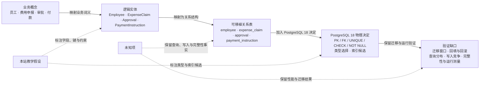

# G008 Batch 3 Conceptual, Logical, and Physical Data Model Implementation Plan

> **For agentic workers:** REQUIRED SUB-SKILL: Use superpowers:subagent-driven-development (recommended) or superpowers:executing-plans to implement this plan task-by-task. Steps use checkbox (`- [ ]`) syntax for tracking.

**Goal:** Publish and close MOD-05 as an evidence-bounded progression from conceptual data model to logical data model, portable relational schema, and a minimal PostgreSQL 18 physical realization.

**Architecture:** Reuse the MOD-02 expense-claim system as the authoritative system boundary and vocabulary, then add one original mapping table and one original Mermaid that show decisions accumulating across model layers. Govern five official SAP, IBM, and PostgreSQL sources, publish Stage A while MOD-05 remains pending, then record exact deployment evidence and close only MOD-05 in Stage B.

**Tech Stack:** MDX, Mermaid, JSON source governance, Node.js 26, Node test runner, Docusaurus, GitHub Actions Pages deployment, Playwright/browser QA.

## Global Constraints

- Scope is exactly MOD-05. Do not publish or close MOD-06..13 and do not close G008.
- `content/modeling/mod-02-c4-context-container.mdx` and its diagrams are authoritative for the expense-claim system boundary and the name `银行支付服务`.
- The main example must progress through conceptual model, logical model, portable relational schema, and a bounded PostgreSQL 18 physical slice.
- Do not call the portable relational schema a universally accepted or already validated physical data model.
- Do not provide complete executable DDL.
- Every field, key, constraint, type, and index in the example is a Tego Arch teaching decision, not a production fact.
- Publish exactly one Mermaid and exactly one primary mapping table.
- The Mermaid expresses mapping and added decisions, not runtime sequence.
- MOD-06 may be named as the unpublished next handoff, but it must not be linked or added to `adjacent_topics`.
- Reuse existing responsive wrappers and CSS; add no dependency and no new global abstraction.
- Stage A must keep MOD-05 pending and project `43 / 86 / 473`.
- Stage B must close only MOD-05 and project `44 / 86 / 473`, durable stories `7 / 20`, current G008, and MOD-06 next.
- All external prose is original facts-summary. Do not copy SAP/IBM figures, tables, screenshots, page structure, or product UI.
- Preserve the user-owned `/Users/seal/projects/tego-arch/.codex/config.toml`.

---

## File Map

- `content/modeling/mod-05-conceptual-logical-physical-data-model.mdx` — the only new article.
- `content/modeling/mod-04-arc42-documentation-skeleton.mdx` — reciprocal published modeling link to MOD-05.
- `content/principles/pr-13-persistence-ignorance.mdx` — reciprocal published principle link to MOD-05.
- `content/cases/temporal-saga-durable-execution.mdx` — visible terminal backlink that keeps event history separate from the business data model.
- `data/source-ledger.json` — five new official source records and the MOD-05 citation review.
- `data/source-link-health.json` — committed live-check results for the five new transports.
- `scripts/source-ledger.mjs` — recognize the exact PostgreSQL License and require attribution-preserving reuse.
- `tests/source-ledger.test.mjs` — regression for the PostgreSQL License policy.
- `src/generated/source-ledger.json` — generated source projection.
- `src/generated/topic-manifest.json` — generated published MOD-05 projection.
- `src/generated/topic-indexes.json` — generated modeling index projection.
- `src/generated/project-status.json` — Stage A and Stage B durable state.
- `tests/g008-batch3-content.test.mjs` — content, diagram, relation, source, and Stage A/Stage B projection contract.
- `tests/g008-batch3-deployment.test.mjs` — immutable Stage A deployment and Stage B closure contract.
- `tests/project-status.test.mjs` — current real-repository completion count.
- `tests/g008-batch2-content.test.mjs`, `tests/g008-batch2-deployment.test.mjs`, and any other historical test that reads the current generated projection — update only current counts when the full gate proves that change is necessary; never alter historical SHA/run facts.
- `docs/reviews/g008-batch3.md` — immutable release evidence.
- `docs/content-backlog.md` — Stage B MOD-05 closure and current baseline.

---

### Task 1: Publish the MOD-05 content and governed evidence

**Files:**

- Create: `content/modeling/mod-05-conceptual-logical-physical-data-model.mdx`
- Create: `tests/g008-batch3-content.test.mjs`
- Modify: `content/modeling/mod-04-arc42-documentation-skeleton.mdx`
- Modify: `content/principles/pr-13-persistence-ignorance.mdx`
- Modify: `content/cases/temporal-saga-durable-execution.mdx`
- Modify: `data/source-ledger.json`
- Modify: `data/source-link-health.json`
- Modify: `scripts/source-ledger.mjs`
- Modify: `tests/source-ledger.test.mjs`
- Modify: generated files produced by `npm run generate:content`

**Interfaces:**

- Consumes: MOD-02 vocabulary, the modeling nine-H2 schema, source-ledger schema version 1, and existing table/Mermaid rendering.
- Produces: published `MOD-05`, five governed source identities, visible reciprocal links, and Stage A generated projection `43 / 86 / 473`.

- [ ] **Step 1: Add the failing content contract**

Create `tests/g008-batch3-content.test.mjs` with these imports, helpers, and initial tests:

```js
import assert from 'node:assert/strict';
import {readFile} from 'node:fs/promises';
import test from 'node:test';
import {fileURLToPath} from 'node:url';

import {
  findMarkdownHeadings,
  readContentDocuments,
} from '../scripts/content-metadata.mjs';
import {extractInternalLinks} from '../scripts/content-relations.mjs';
import {extractExternalLinks} from '../scripts/source-ledger.mjs';

const contentRoot = fileURLToPath(new URL('../content/', import.meta.url));
const modelingHeadings = [
  '学习问题',
  '建模目标与输入',
  '参与者与步骤',
  '模型产物',
  '完成判断',
  '常见失败',
  '与其他模型的衔接',
  '完整演练',
  '来源',
];
const [documents, ledger] = await Promise.all([
  readContentDocuments(contentRoot),
  readFile(new URL('../data/source-ledger.json', import.meta.url), 'utf8')
    .then(JSON.parse),
]);
const byId = new Map(
  documents
    .filter(({metadata}) => typeof metadata.topic_id === 'string')
    .map((document) => [document.metadata.topic_id, document]),
);

function requiredDocument(id) {
  const document = byId.get(id);
  assert.ok(document, `${id} must be published`);
  return document;
}

function section(body, heading) {
  const headings = findMarkdownHeadings(body).filter(({level}) => level === 2);
  const index = headings.findIndex(({text}) => text === heading);
  assert.notEqual(index, -1, `missing ## ${heading}`);
  const start = body.indexOf('\n', headings[index].offset);
  const end = headings[index + 1]?.offset ?? body.length;
  return body.slice(start === -1 ? end : start + 1, end);
}

function markdownTableRows(body) {
  return body
    .split('\n')
    .filter((line) => /^\|.+\|$/u.test(line))
    .map((line) => line.slice(1, -1).split('|').map((cell) => cell.trim()))
    .filter((cells) => !cells.every((cell) => /^:?-+:?$/u.test(cell)));
}

function fencedBlock(body, language) {
  const matches = [...body.matchAll(
    new RegExp(`\\\`\\\`\\\`${language}\\n([\\s\\S]*?)\\n\\\`\\\`\\\``, 'gu'),
  )];
  assert.equal(matches.length, 1, `expected exactly one ${language} block`);
  return matches[0][1];
}

test('publishes MOD-05 as one progressive expense-claim data model', () => {
  const document = requiredDocument('MOD-05');
  assert.equal(
    document.file,
    'modeling/mod-05-conceptual-logical-physical-data-model.mdx',
  );
  assert.equal(document.metadata.slug, '/modeling/mod-05');
  assert.equal(document.metadata.content_type, 'modeling');
  assert.equal(document.metadata.status, 'reviewed');
  assert.equal(document.metadata.priority, 'P0');
  assert.deepEqual(document.metadata.depends_on, ['MOD-01']);
  assert.deepEqual(document.metadata.adjacent_topics, ['MOD-04', 'PR-13']);
  assert.deepEqual(document.metadata.related_cases, [
    '/cases/temporal-saga-durable-execution',
  ]);
  assert.deepEqual(
    document.headings.filter(({level}) => level === 2).map(({text}) => text),
    modelingHeadings,
  );
  for (const label of [
    '概念模型',
    '逻辑模型',
    '可移植关系模式',
    'PostgreSQL 18 物理实现切片',
  ]) {
    assert.match(document.body, new RegExp(label, 'u'), label);
  }
  assert.match(document.body, /费用申报系统/u);
  assert.match(document.body, /银行支付服务/u);
});

test('keeps the portable schema distinct from a DBMS physical model', () => {
  const body = requiredDocument('MOD-05').body;
  assert.match(body, /可移植关系模式[^。\n]*(?:不等于|不是)[^。\n]*(?:严格|完整)[^。\n]*物理模型/u);
  assert.match(body, /PostgreSQL 18[^。\n]*(?:切片|示例)/u);
  assert.match(body, /不是[^。\n]*(?:生产 schema|生产数据库|可部署 schema)/u);
  assert.match(body, /本站原创[^。\n]*教学/u);
  assert.doesNotMatch(body, /CREATE\s+TABLE/iu);
});

test('uses only published relationships and leaves MOD-06 unlinked', () => {
  const document = requiredDocument('MOD-05');
  const links = new Set(extractInternalLinks(document));
  for (const slug of [
    '/modeling',
    '/modeling/mod-01',
    '/modeling/mod-02',
    '/modeling/mod-04',
    '/principles/pr-13',
    '/cases/temporal-saga-durable-execution',
  ]) {
    assert.ok(links.has(slug), slug);
  }
  assert.equal(links.has('/modeling/mod-06'), false);
  assert.match(document.body, /MOD-06[^。\n]*尚未发布/u);
});
```

- [ ] **Step 2: Run the contract and verify RED**

Run:

```bash
node --test tests/g008-batch3-content.test.mjs
```

Expected: FAIL because `MOD-05 must be published`.

- [ ] **Step 3: Add the exact MOD-05 frontmatter and content skeleton**

Create the article with this frontmatter:

```yaml
---
title: 概念、逻辑与物理数据模型
slug: /modeling/mod-05
content_type: modeling
status: reviewed
difficulty: intermediate
analyzed_at: 2026-07-31
source_cutoff: 2026-07-31
review_policy: quarterly-version-sensitive
confidence: high
domains:
  - software-architecture
  - data-modeling
agent_patterns: []
protocols:
  - PostgreSQL
quality_attributes:
  - understandability
  - maintainability
  - data-integrity
tags:
  - 概念数据模型
  - 逻辑数据模型
  - 物理数据模型
  - PostgreSQL
summary: 用同一费用申报问题展示业务概念如何逐层加入身份、关系、约束、关系模式和 PostgreSQL 物理实现决定。
topic_id: MOD-05
priority: P0
depends_on:
  - MOD-01
adjacent_topics:
  - MOD-04
  - PR-13
related_cases:
  - /cases/temporal-saga-durable-execution
related_questions: []
---
```

Write the nine required H2 sections in the exact schema order. The prose must implement these concrete statements:

- MOD-02 supplies only boundary and vocabulary; the MOD-05 schema is an original teaching assumption.
- Inputs cover identity, lifecycle, time, and amount semantics; retention, audit, permissions, and migration constraints; and verifiable query, write, and integrity requirements.
- Conceptual model contains employee, expense claim, approval, and payment concepts without tables or keys.
- Logical model adds stable identity, attributes, relationship cardinality, currency/amount semantics, uniqueness, and business constraints without selecting a DBMS.
- Portable relational schema maps to `employee`, `expense_claim`, `approval`, and `payment_instruction`, but is not a universally accepted or validated PDM.
- PostgreSQL 18 slice discusses PK, FK, UNIQUE, CHECK, NOT NULL, type choice, and index candidates without complete DDL.
- Index candidates do not prove performance; query distribution, cardinality, write cost, and measurements remain required.
- Temporal Event History is not the business ledger or relational schema.
- Common failures include drawing the logical model as runtime flow, inferring production schema from C4 or arc42, and ignoring amount, time, identity, history, or migration semantics.
- MOD-06 is unpublished and receives ER/cardinality/history detail later without a link.

- [ ] **Step 4: Add the single mapping table and single Mermaid**

Inside `## 模型产物`, add exactly this table header and four rows:

```mdx
<div className="table-wrapper table-wrapper--mapping" role="region" aria-label="费用申报数据模型逐层决策表，可横向滚动" tabIndex={0}>

| 层次 | 回答的问题 | 费用申报示例 | 新增决定 | 明确不证明 |
| --- | --- | --- | --- | --- |
| 概念模型 | 业务中有哪些事物与词义 | 员工、费用申报、审批、付款 | 概念边界与业务关系 | 实体键、基数、表结构或流程顺序 |
| 逻辑模型 | 实体如何识别、关联并受约束 | Employee、ExpenseClaim、Approval、PaymentInstruction | 唯一标识、属性、关系、基数与业务约束 | SQL 表已设计或查询性能达标 |
| 可移植关系模式 | 逻辑实体如何映射为关系结构 | employee、expense_claim、approval、payment_instruction | 表、PK/FK、唯一性、类型族和索引候选 | 严格意义上的 DBMS 物理模型或可部署 schema |
| PostgreSQL 18 物理实现切片 | 平台如何落实约束与访问路径 | PostgreSQL 约束、类型与索引类别 | 实际约束类别、类型选择和索引候选 | 完整生产 DDL、容量、迁移安全或性能结果 |

</div>
```

Add exactly this design-aligned semantic Mermaid topology; node inventory, connector kind, edge label, and endpoint identity are fixed:



Immediately after the graph, state that arrows mean mapping or added decisions, not runtime sequence.

- [ ] **Step 5: Add exact PostgreSQL License governance**

First add this failing case to `enforces license-specific copyright policies` in `tests/source-ledger.test.mjs`:

```js
['PostgreSQL', 'facts-and-short-quotation', 'adapt-with-attribution'],
```

Run:

```bash
node --test --test-name-pattern='license-specific copyright policies' \
  tests/source-ledger.test.mjs
```

Expected: FAIL because `PostgreSQL` is not yet an approved license.

Then add `PostgreSQL` to `approvedLicenses` in `scripts/source-ledger.mjs` and add:

```js
['PostgreSQL', 'adapt-with-attribution'],
```

to `requiredPolicyByLicense`.

Run the focused test again. Expected: PASS. Do not alias the PostgreSQL License to MIT or BSD-3-Clause.

- [ ] **Step 6: Register the five exact governed sources**

Add these source IDs and canonical locators to `data/source-ledger.json`:

```js
const requiredSources = new Map([
  [
    'src-sap-powerdesigner-data-modeling-16-7-sp10',
    'https://help.sap.com/docs/SAP_POWERDESIGNER/856348b84a7c479489d5172a630f014d/c7c2bf926e1b1014a7c7c75eb751dd6e.html',
  ],
  [
    'src-sap-powerdesigner-physical-model-16-7-sp10',
    'https://help.sap.com/docs/SAP_POWERDESIGNER/856348b84a7c479489d5172a630f014d/c7c2e0646e1b1014b15599cfaffb4f4a.html',
  ],
  [
    'src-ibm-ida-logical-data-model-9-1-1',
    'https://www.ibm.com/docs/en/ida/9.1.1?topic=modeling-logical-data-models',
  ],
  [
    'src-postgresql-18-constraints',
    'https://www.postgresql.org/docs/18/ddl-constraints.html',
  ],
  [
    'src-postgresql-18-indexes',
    'https://www.postgresql.org/docs/18/indexes.html',
  ],
]);
```

Every source record must use:

```json
{
  "query_insensitive": false,
  "locator_aliases": [],
  "tombstone": null,
  "registered_at": "2026-07-31",
  "checked_at": "2026-07-31",
  "tier": "primary",
  "license_family_grouping": "identity",
  "family_grouping_evidence_url": null,
  "link_policy": "stable",
  "expected_final_approved_at": "2026-07-31"
}
```

Use the following per-family fields:

```json
{
  "sap": {
    "author_or_org": "SAP",
    "version": "SAP PowerDesigner 16.7 SP10 documentation checked on 2026-07-31",
    "source_kind": "official-docs",
    "allowed_evidence_roles": ["definition", "learning", "method"],
    "license": "LicenseRef-All-Rights-Reserved",
    "license_scope": "Facts and the named SAP PowerDesigner documentation page only; prose, figures, tables, screenshots, product UI, logos, linked works, and third-party material excluded; named trademarks require the article-end attribution and are not licensed for reuse",
    "license_evidence_url": "https://www.sap.com/about/legal/trademark.html",
    "license_evidence_note": "SAP trademark guidelines require an end-of-document attribution for named SAP marks; Tego Arch uses textual references, links, original factual summaries, and the required attribution only.",
    "copyright_policy": "facts-and-short-quotation",
    "expected_final_approval_note": "Reviewed G008 Batch 3 SAP documentation transport, all-rights-reserved boundary, and required trademark attribution",
    "usage_boundary": "Supports the named PowerDesigner abstraction or physical-model concept only; it is a product method, not a universal data-modeling standard, and the required trademark attribution does not imply SAP sponsorship or endorsement."
  },
  "ibm": {
    "author_or_org": "IBM",
    "version": "IBM InfoSphere Data Architect 9.1.1 documentation checked on 2026-07-31",
    "source_kind": "official-docs",
    "allowed_evidence_roles": ["definition", "learning", "method"],
    "license": "LicenseRef-All-Rights-Reserved",
    "license_scope": "Facts and the named IBM documentation page only; prose, figures, tables, screenshots, product UI, logos, linked works, and third-party material excluded; IBM and InfoSphere trademark references require attribution and are not licensed for reuse",
    "license_evidence_url": "https://www.ibm.com/legal/copyright-trademark",
    "license_evidence_note": "IBM copyright and trademark information identifies IBM and InfoSphere as IBM trademarks and requires attribution on the page or in the legal section; Tego Arch uses textual references, links, original factual summaries, and the required attribution only.",
    "copyright_policy": "facts-and-short-quotation",
    "expected_final_approval_note": "Reviewed G008 Batch 3 IBM documentation transport, all-rights-reserved boundary, and required trademark attribution",
    "usage_boundary": "Supports DBMS-independent logical entities, identifiers, relationships, and constraints; it does not establish current DBMS behavior, and the trademark attribution does not imply IBM sponsorship or endorsement."
  },
  "postgresql": {
    "author_or_org": "PostgreSQL Global Development Group",
    "version": "PostgreSQL 18 documentation checked on 2026-07-31",
    "source_kind": "official-docs",
    "allowed_evidence_roles": ["definition", "implementation", "learning"],
    "license": "PostgreSQL",
    "license_scope": "The named PostgreSQL 18 documentation page under the PostgreSQL License; trademarks, linked works, and separately licensed third-party material excluded",
    "license_evidence_url": "https://www.postgresql.org/about/licence/",
    "license_evidence_note": "The official PostgreSQL license page permits use, copy, modification, and distribution subject to its copyright and permission notice.",
    "copyright_policy": "adapt-with-attribution",
    "expected_final_approval_note": "Reviewed G008 Batch 3 PostgreSQL 18 pinned documentation transport and license boundary",
    "license_family_id": "https://www.postgresql.org/docs/18/",
    "usage_boundary": "Set per source: constraint or index mechanism behavior only; neither source defines the conceptual/logical/physical taxonomy, expense-domain rules, type choices, or application performance."
  }
}
```

For every record, set `canonical_locator`, `transport_locator`, and `expected_final_transport_locator` to the corresponding locator in `requiredSources`.

Use these exact titles and identity fields:

| Source ID | Title | `license_family_id` | `published_at` |
| --- | --- | --- | --- |
| `src-sap-powerdesigner-data-modeling-16-7-sp10` | `Getting Started with Data Modeling — SAP PowerDesigner 16.7 SP10` | `https://help.sap.com/docs/SAP_POWERDESIGNER/856348b84a7c479489d5172a630f014d/c7c2bf926e1b1014a7c7c75eb751dd6e.html` | `null` |
| `src-sap-powerdesigner-physical-model-16-7-sp10` | `Physical Data Models — SAP PowerDesigner 16.7 SP10` | `https://help.sap.com/docs/SAP_POWERDESIGNER/856348b84a7c479489d5172a630f014d/c7c2e0646e1b1014b15599cfaffb4f4a.html` | `null` |
| `src-ibm-ida-logical-data-model-9-1-1` | `Logical Data Models — IBM InfoSphere Data Architect 9.1.1` | `https://www.ibm.com/docs/en/ida/9.1.1?topic=modeling-logical-data-models` | `null` |
| `src-postgresql-18-constraints` | `PostgreSQL 18 — Constraints` | `https://www.postgresql.org/docs/18/` | `2025-09-25` |
| `src-postgresql-18-indexes` | `PostgreSQL 18 — Indexes` | `https://www.postgresql.org/docs/18/` | `2025-09-25` |

PostgreSQL 18 GA was released on 2025-09-25. Do not use a documentation crawl date as `published_at`.

- [ ] **Step 7: Add the MOD-05 document review entry**

Add `data/source-ledger.json.documents["content/modeling/mod-05-conceptual-logical-physical-data-model.mdx"]` with:

```json
{
  "reviewed_at": "2026-07-31",
  "copyright_checks": [
    "original-structure",
    "quotation-boundary",
    "attribution-complete",
    "illustration-rights"
  ],
  "citations": [
    {
      "source_id": "src-sap-powerdesigner-data-modeling-16-7-sp10",
      "citation_url": "https://help.sap.com/docs/SAP_POWERDESIGNER/856348b84a7c479489d5172a630f014d/c7c2bf926e1b1014a7c7c75eb751dd6e.html",
      "roles": ["definition", "method"],
      "manifest_primary": true,
      "usage_mode": "facts-summary",
      "attribution_note": "Getting Started with Data Modeling, SAP PowerDesigner 16.7 SP10",
      "modification_note": null,
      "excerpt": null,
      "quotation_reviewed": false
    },
    {
      "source_id": "src-sap-powerdesigner-physical-model-16-7-sp10",
      "citation_url": "https://help.sap.com/docs/SAP_POWERDESIGNER/856348b84a7c479489d5172a630f014d/c7c2e0646e1b1014b15599cfaffb4f4a.html",
      "roles": ["definition", "method"],
      "manifest_primary": false,
      "usage_mode": "facts-summary",
      "attribution_note": "Physical Data Models, SAP PowerDesigner 16.7 SP10",
      "modification_note": null,
      "excerpt": null,
      "quotation_reviewed": false
    },
    {
      "source_id": "src-ibm-ida-logical-data-model-9-1-1",
      "citation_url": "https://www.ibm.com/docs/en/ida/9.1.1?topic=modeling-logical-data-models",
      "roles": ["definition", "method"],
      "manifest_primary": true,
      "usage_mode": "facts-summary",
      "attribution_note": "Logical data models, IBM InfoSphere Data Architect 9.1.1",
      "modification_note": null,
      "excerpt": null,
      "quotation_reviewed": false
    },
    {
      "source_id": "src-postgresql-18-constraints",
      "citation_url": "https://www.postgresql.org/docs/18/ddl-constraints.html",
      "roles": ["implementation"],
      "manifest_primary": true,
      "usage_mode": "facts-summary",
      "attribution_note": "PostgreSQL 18 Constraints, PostgreSQL Global Development Group",
      "modification_note": null,
      "excerpt": null,
      "quotation_reviewed": false
    },
    {
      "source_id": "src-postgresql-18-indexes",
      "citation_url": "https://www.postgresql.org/docs/18/indexes.html",
      "roles": ["implementation"],
      "manifest_primary": false,
      "usage_mode": "facts-summary",
      "attribution_note": "PostgreSQL 18 Indexes, PostgreSQL Global Development Group",
      "modification_note": null,
      "excerpt": null,
      "quotation_reviewed": false
    }
  ]
}
```

The article's `## 来源` section must visibly link all five exact citation URLs. The article end must also contain these exact notices:

- `SAP 和 SAP PowerDesigner 是 SAP SE 或其关联公司在德国及其他国家/地区的商标或注册商标。`
- `IBM 和 InfoSphere 是 International Business Machines Corporation 在美国和/或其他国家/地区的商标或注册商标。`

The PostgreSQL citations support mechanism behavior only. Expense-claim constraints, type choices, and index candidates must remain visibly labeled as original teaching decisions.

- [ ] **Step 8: Add visible reciprocal navigation**

Make these bounded edits:

- In MOD-04, append `MOD-05` to `adjacent_topics` and add a visible link explaining that MOD-05 carries the data-model evidence into conceptual/logical/physical layers.
- In PR-13, append `MOD-05` to `adjacent_topics` and add a visible link in `## 相邻原则` or `## 适用尺度` explaining that MOD-05 separates domain meaning from relational and PostgreSQL implementation decisions.
- In the Temporal/Saga case, add one visible `/modeling/mod-05` link near the statement that Event History is not the external business truth. State that MOD-05 models business identity and relational constraints; do not change case metadata or claim its example is the expense schema.

- [ ] **Step 9: Refresh source health and generate Stage A projections**

Run:

```bash
npm run refresh:links
npm run generate:content
```

Expected:

- all five new transports have accepted committed health results;
- `MOD-05` is published but its backlog-projected status remains pending;
- project status is `43 / 86 / 473`;
- source ledger, topic manifest, topic indexes, and project status are freshly generated.

- [ ] **Step 10: Run targeted and repository gates**

Run:

```bash
node --test tests/g008-batch3-content.test.mjs
npm run validate:content
npm run check:content
npm run check:links
git diff --check
```

Expected: all pass, with 86 documents and 473 governed sources.

- [ ] **Step 11: Commit the content unit**

Run:

```bash
git add content/modeling/mod-05-conceptual-logical-physical-data-model.mdx \
  content/modeling/mod-04-arc42-documentation-skeleton.mdx \
  content/principles/pr-13-persistence-ignorance.mdx \
  content/cases/temporal-saga-durable-execution.mdx \
  data/source-ledger.json data/source-link-health.json \
  scripts/source-ledger.mjs tests/source-ledger.test.mjs \
  src/generated/source-ledger.json src/generated/topic-manifest.json \
  src/generated/topic-indexes.json src/generated/project-status.json \
  tests/g008-batch3-content.test.mjs
git commit -m "content: add progressive data model guide"
```

Expected: one reviewable content/governance commit.

---

### Task 2: Harden MOD-05 behavior contracts

**Files:**

- Modify: `tests/g008-batch3-content.test.mjs`
- Modify only if the tests prove it is necessary: `src/css/custom.css`

**Interfaces:**

- Consumes: the Task 1 article, source records, and generated projection.
- Produces: mutation-sensitive table, Mermaid, terminology, relationship, and source contracts suitable for Stage A review.

- [ ] **Step 1: Add exact table and visual-count tests**

Append:

```js
test('renders one exact four-layer mapping table', () => {
  const products = section(requiredDocument('MOD-05').body, '模型产物');
  const rows = markdownTableRows(products);
  assert.equal(rows.length, 5, 'one header plus four data rows');
  assert.deepEqual(rows[0], [
    '层次',
    '回答的问题',
    '费用申报示例',
    '新增决定',
    '明确不证明',
  ]);
  assert.deepEqual(rows.slice(1).map(([layer]) => layer), [
    '概念模型',
    '逻辑模型',
    '可移植关系模式',
    'PostgreSQL 18 物理实现切片',
  ]);
  assert.equal(new Set(rows.slice(1).map(([layer]) => layer)).size, 4);
  assert.equal(
    [...products.matchAll(/className="table-wrapper table-wrapper--mapping"/gu)]
      .length,
    1,
  );
  assert.match(products, /tabIndex=\{0\}/u);
  assert.match(products, /可横向滚动/u);
  assert.equal(
    [...requiredDocument('MOD-05').body.matchAll(/```mermaid\n/gu)].length,
    1,
  );
});
```

- [ ] **Step 2: Add a strict Mermaid semantic parser and edge contract**

Use a parser that accepts only legal `-->` or labeled dotted connectors, resolves and compares the exact node-label inventory, compares a sorted edge multiset including connector kind and edge label, rejects duplicate edges, and ignores source-line order. Assert this exact edge inventory:

```js
const expectedEdges = [
  'solid|映射业务词义|C -> L',
  'solid|映射为关系结构|L -> R',
  'solid|加入 PostgreSQL 18 决定|R -> P',
  'solid|保留迁移与运行验证|P -> V',
  'dotted|标注字段、键与约束|A -> L',
  'dotted|标注类型与索引候选|A -> P',
  'dotted|保留查询、写入与完整性事实|U -> R',
  'dotted|保留性能与迁移结果|U -> V',
].sort();
```

The test must prove:

- reordering valid edge lines still passes;
- replacing one connector with `==>` fails;
- duplicating one edge fails;
- deleting one edge fails;
- changing a node inventory item, connector kind, edge label, or endpoint fails;
- changing `映射业务词义` to a runtime verb such as `先执行` fails a separate wording assertion.

- [ ] **Step 3: Add terminology and non-overclaim mutation tests**

Extract assertions into pure helpers that accept a source string, then test in-memory mutations:

```js
for (const forbiddenMutation of [
  body.replace('可移植关系模式不是严格意义上的物理模型', '可移植关系模式就是已验证物理模型'),
  body.replace('本站原创教学假设', '生产事实'),
  body.replace('索引候选不证明性能', '索引保证性能'),
]) {
  assert.throws(
    () => assertDataModelBoundaries(forbiddenMutation),
    {name: 'AssertionError'},
  );
}
```

Use the actual sentence literals from the final article. Do not weaken the product prose merely to fit the example strings above.

- [ ] **Step 4: Add exact source-governance tests**

Assert:

- the five IDs map to the five exact canonical locators;
- every locator is visible in the article;
- SAP and IBM use `LicenseRef-All-Rights-Reserved` and `facts-and-short-quotation`;
- PostgreSQL uses `PostgreSQL` and `adapt-with-attribution`;
- only SAP overview, IBM logical model, and PostgreSQL constraints are `manifest_primary: true`;
- the generated link health has accepted results for all five source IDs;
- the source count is exactly 473 during Stage A.

- [ ] **Step 5: Add Stage A projection and future-compatibility tests**

Assert:

```js
assert.deepEqual(status, {
  schema_version: 1,
  durable_stories: {completed: 7, total: 20, current: 'G008'},
  completed_topics: 43,
  content_documents: 86,
  governed_sources: 473,
  sources: {
    durable_stories: 'docs/content-backlog.md',
    completed_topics: 'docs/content-backlog.md',
    content_documents: 'content/**/*.{md,mdx}',
    governed_sources: 'data/source-ledger.json',
  },
});
assert.match(backlog, /^- \[ \] \*\*MOD-05 /mu);
assert.match(backlog, /下一项[^。\n]*MOD-05/u);
```

Keep this helper scoped to the G008 Batch 3 historical segment when it later becomes a Stage B test; it must not prevent future G008 completion or G009 current state.

- [ ] **Step 6: Run mutation evidence and restore product state**

Run:

```bash
node --test tests/g008-batch3-content.test.mjs
git diff --check
```

Expected: all tests pass. Temporarily perform each product mutation one at a time, run the focused test to observe failure, and restore the file immediately. Record the failing test name and restore proof in `.superpowers/sdd/task-2-report.md`; do not commit mutations.

- [ ] **Step 7: Run the full gate**

Run:

```bash
npm run verify
git status --short
```

Expected:

- all tests pass;
- 86 documents and 473 sources;
- generated content, link cache, review health, typecheck, and Docusaurus build pass;
- only intended Task 2 test/CSS files are modified.

- [ ] **Step 8: Commit behavior hardening**

Run:

```bash
git add tests/g008-batch3-content.test.mjs
git diff --cached --quiet src/css/custom.css || git add src/css/custom.css
git commit -m "test: harden mod05 data model contracts"
```

Expected: a test-focused commit, with CSS included only if actual browser/table overflow required a MOD-05-specific rule.

---

### Task 3: Review, publish, and verify Stage A

**Files:**

- Verify: all Task 1–2 files.
- Create only in ignored SDD workspace: `.superpowers/sdd/task-3-report.md`

**Interfaces:**

- Consumes: a clean Stage A candidate with MOD-05 pending and `43 / 86 / 473`.
- Produces: exact `STAGE_A_SHA`, exact `PAGES_RUN_ID`, independent review results, and complete production QA evidence.

- [ ] **Step 1: Run three independent read-only reviews**

Dispatch separate reviewers for:

1. spec/content alignment;
2. official-source and copyright boundary;
3. code/test quality and mutation strength.

Each reviewer receives the exact design, plan, base SHA, head SHA, and a read-only diff. Fix all Critical and Important findings, rerun targeted tests, and request re-review until clean.

- [ ] **Step 2: Run the final Stage A repository gate**

Run:

```bash
npm run verify
git diff --check
git status --short
STAGE_A_SHA=$(git rev-parse HEAD)
test "${#STAGE_A_SHA}" -eq 40
```

Expected: clean worktree; all gates pass; status is `43 / 86 / 473`; save the literal 40-character `STAGE_A_SHA`.

- [ ] **Step 3: Fast-forward main and push Stage A**

From `/Users/seal/projects/tego-arch`:

```bash
git switch main
git merge --ff-only codex/g008-modeling-batch3
git push origin main
```

Expected: main and origin/main equal `STAGE_A_SHA`; the user-owned `.codex/config.toml` remains untracked and unchanged.

- [ ] **Step 4: Wait for the exact Stage A Pages run**

Run:

```bash
STAGE_A_RUN_ID=$(gh run list --workflow deploy.yml --branch main --limit 20 \
  --json databaseId,headSha \
  --jq ".[] | select(.headSha == \"$STAGE_A_SHA\") | .databaseId" | head -n 1)
test -n "$STAGE_A_RUN_ID"
gh run watch "$STAGE_A_RUN_ID" --exit-status
gh run view "$STAGE_A_RUN_ID" \
  --json databaseId,headSha,status,conclusion,url
```

Expected: exact `headSha=$STAGE_A_SHA`, `status=completed`, and `conclusion=success`.

- [ ] **Step 5: Run canonical HTTP smoke**

Require HTTP 200 for:

```text
/modeling
/modeling/mod-05
/modeling/mod-04
/principles/pr-13
/cases/temporal-saga-durable-execution
/references
```

Record 6/6 results.

- [ ] **Step 6: Run desktop and mobile browser QA**

Use desktop `1440x1000` and mobile `390x844`. For `/modeling/mod-05`, verify:

- nine H2 sections;
- one Mermaid with all required labels;
- one mapping table with four data rows;
- table and Mermaid contained overflow where required;
- wrapper focus and ArrowRight scroll;
- five visible source labels/links;
- visible links to modeling index, MOD-01, MOD-02, MOD-04, PR-13, and Temporal case;
- no `/modeling/mod-06` link;
- all relation links clicked in both viewports;
- zero console warnings/errors and zero page errors;
- no document overflow.

Also verify `/modeling` shows MOD-05 as published but pending/planned during Stage A, and MOD-06 remains planned.

- [ ] **Step 7: Record Stage A evidence**

Write `.superpowers/sdd/task-3-report.md` with the literal Stage A SHA, literal run ID and URL, exact repository test total, `43 / 86 / 473`, HTTP 6/6, both viewport matrices, exact source and relation click counts, review verdicts, and any non-production warnings. Do not perform Stage B in this task.

---

### Task 4: Write the immutable Stage B closure

**Files:**

- Create: `tests/g008-batch3-deployment.test.mjs`
- Create: `docs/reviews/g008-batch3.md`
- Modify: `docs/content-backlog.md`
- Modify: `tests/g008-batch3-content.test.mjs`
- Modify: `tests/project-status.test.mjs`
- Modify only when full tests prove they read current projection: historical G008/G007 deployment/content tests
- Modify: generated files produced by `npm run generate:content`

**Interfaces:**

- Consumes: literal `STAGE_A_SHA`, `STAGE_A_RUN_ID`, repository test total, and live QA evidence from Task 3.
- Produces: immutable Stage B closure `44 / 86 / 473`, G008 current, and MOD-06 next.

- [ ] **Step 1: Add a failing deployment contract**

Create `tests/g008-batch3-deployment.test.mjs` using the Batch 2 parser shape. Before editing, read the exact `STAGE_A_SHA` and `STAGE_A_RUN_ID` from `.superpowers/sdd/task-3-report.md`. Declare them as direct string constants in the test file, then add these guards:

```js
assert.match(expectedStageASha, /^[0-9a-f]{40}$/u);
assert.match(expectedPagesRunId, /^[0-9]+$/u);
assert.notEqual(
  expectedStageASha,
  '2f42703d09cb63fc1e4e5c16fe745c4beab215ab',
  'Batch 3 must not reuse the Batch 2 Stage B SHA',
);
```

The committed file must contain the captured values directly and must not read identity from environment variables or the review that it validates.

The test must require:

- exactly one SHA line, one run line, and one run-gate line;
- exact equality with the expected SHA/run;
- `git cat-file -e SHA^{commit}`;
- exact Stage A counts `43 / 86 / 473`;
- both viewports;
- HTTP 6/6;
- Mermaid 1/1;
- mapping table 1/1 with four rows;
- source labels 5/5;
- the exact successful relation-click count from Task 3;
- contained overflow and keyboard focus/scroll;
- zero warnings/errors and no document overflow;
- Stage B `44 / 86 / 473`;
- `7 / 20`, current G008, next MOD-06;
- `Stage B closure — PASS`.

Add mutation tests that reject:

- an old Batch 2 SHA/run pair even when self-consistent;
- duplicate SHA/run/gate lines;
- missing live evidence;
- MOD-05 still pending;
- MOD-06 complete;
- G008 complete in the Batch 3 historical segment.

Add a positive future mutation proving the helper still accepts a later current baseline where G008 is complete and G009 is current, provided the Batch 3 historical segment remains intact.

- [ ] **Step 2: Prove Stage B is RED**

Run:

```bash
node --test tests/g008-batch3-deployment.test.mjs
```

Expected: FAIL because `docs/reviews/g008-batch3.md` does not exist and MOD-05 is pending.

- [ ] **Step 3: Create the exact release review**

Create `docs/reviews/g008-batch3.md` from the exact Task 3 report. It must contain these headings and exact fixed statements:

```markdown
# G008 Batch 3 Release Review

## Stage A evidence

- 86 content documents
- 473 governed sources
- 43 completed topics

## Independent review

- spec and content compliance: PASS
- source and copyright boundary: PASS
- code and test quality: PASS

## Live smoke

- desktop `1440x1000`
- mobile `390x844`
- HTTP canonical routes: 6 / 6
- canonical modeling route: `/modeling`
- Mermaid: 1 / 1
- mapping table: 1 / 1, 4 data rows
- source labels: 5 / 5
- 0 warnings / 0 errors
- no document overflow
- contained horizontal overflow
- keyboard scroll/focus

## Stage B projection

- 44 completed topics
- 86 content documents
- 473 governed sources
- 7 / 20
- current G008
- next MOD-06

Stage B closure — PASS
```

Immediately below the title, add exactly one `Exact Stage A SHA` line, one linked `GitHub Pages run` line, and one exact run-gate line using the direct values from Task 3. Add the exact repository test total under Stage A evidence and the exact relation-click success count under Live smoke. The deployment test must reject missing values, duplicated values, symbolic variable names, descriptive tokens, or non-decimal run IDs.

- [ ] **Step 4: Close only MOD-05 and update the current baseline**

In `docs/content-backlog.md`:

- change only MOD-05 from `[ ]` to `[x]`;
- append the exact Stage A commit, exact Pages run, canonical route, viewport, visual, source, relation, console, and overflow evidence;
- preserve MOD-06..13 unchecked;
- preserve G008 current and durable stories `7 / 20`;
- make G008 Batch 3 the one current-release baseline;
- preserve Batch 2 and older baselines as history;
- state next MOD-06.

- [ ] **Step 5: Advance Stage B projection assertions**

Change the Batch 3 status test to:

```js
assert.deepEqual(status, {
  schema_version: 1,
  durable_stories: {completed: 7, total: 20, current: 'G008'},
  completed_topics: 44,
  content_documents: 86,
  governed_sources: 473,
  sources: {
    durable_stories: 'docs/content-backlog.md',
    completed_topics: 'docs/content-backlog.md',
    content_documents: 'content/**/*.{md,mdx}',
    governed_sources: 'data/source-ledger.json',
  },
});
assert.match(backlog, /^- \[x\] \*\*MOD-05 /mu);
assert.match(backlog, /下一项[^。\n]*MOD-06/u);
```

Update the real-repository assertion in `tests/project-status.test.mjs` to `44 / 86 / 473`. Keep `7 / 20` and current G008.

- [ ] **Step 6: Generate Stage B projections**

Run:

```bash
npm run generate:content
```

Expected:

- MOD-05 complete;
- MOD-06..13 pending;
- project status `44 / 86 / 473`;
- G008 current and MOD-06 next.

- [ ] **Step 7: Run closure and full gates**

Run:

```bash
node --test tests/g008-batch3-content.test.mjs \
  tests/g008-batch3-deployment.test.mjs \
  tests/project-status.test.mjs
npm run verify
git diff --check
git status --short
```

If the full suite finds historical tests that read the current generated projection, update only their current counts. Preserve all historical Stage A SHA, Pages run, then-current state, and old projection evidence.

- [ ] **Step 8: Request independent Task 4 review**

Review the exact Stage A-to-Stage B diff for:

- immutable exact identity;
- one current baseline;
- historical evidence preservation;
- only MOD-05 closure;
- future-compatible baseline parsing;
- mutation strength;
- final generated status.

Fix every Critical/Important finding and request re-review.

- [ ] **Step 9: Commit Stage B**

Run:

```bash
git add docs/reviews/g008-batch3.md docs/content-backlog.md \
  tests/g008-batch3-content.test.mjs \
  tests/g008-batch3-deployment.test.mjs \
  tests/project-status.test.mjs \
  src/generated/topic-manifest.json src/generated/topic-indexes.json \
  src/generated/project-status.json
git add tests/g008-batch2-content.test.mjs \
  tests/g008-batch2-deployment.test.mjs \
  tests/g008-batch1-content.test.mjs \
  tests/g008-batch1-deployment.test.mjs \
  tests/g007-batch5-deployment.test.mjs
git diff --cached --quiet || git commit -m "docs: close g008 progressive data model"
```

Before committing, unstage any listed historical test that did not actually change. Expected: one closure commit with no MOD-06..13 completion.

---

### Task 5: Publish Stage B and perform final verification

**Files:**

- Verify only: all files changed in Tasks 1–4.
- Create only in ignored SDD workspace: `.superpowers/sdd/task-5-report.md`

**Interfaces:**

- Consumes: reviewed Stage B closure commit.
- Produces: synchronized feature/main/origin refs, exact-head Stage B Pages success, final production QA, and handoff to MOD-06.

- [ ] **Step 1: Capture clean Stage B state**

Run:

```bash
git status --short
STAGE_B_SHA=$(git rev-parse HEAD)
test "${#STAGE_B_SHA}" -eq 40
```

Expected: clean worktree and a literal 40-character SHA.

- [ ] **Step 2: Fast-forward main and push Stage B**

From `/Users/seal/projects/tego-arch`:

```bash
git switch main
git merge --ff-only codex/g008-modeling-batch3
git push origin main
```

Expected: main and origin/main equal `STAGE_B_SHA`; `.codex/config.toml` remains untouched.

- [ ] **Step 3: Wait for the exact Stage B Pages run**

Run:

```bash
STAGE_B_RUN_ID=$(gh run list --workflow deploy.yml --branch main --limit 20 \
  --json databaseId,headSha \
  --jq ".[] | select(.headSha == \"$STAGE_B_SHA\") | .databaseId" | head -n 1)
test -n "$STAGE_B_RUN_ID"
gh run watch "$STAGE_B_RUN_ID" --exit-status
gh run view "$STAGE_B_RUN_ID" \
  --json databaseId,headSha,status,conclusion,url
```

Expected: exact Stage B SHA, completed, success.

- [ ] **Step 4: Repeat final production QA**

Repeat the six HTTP routes and both browser viewports. Confirm:

- `/modeling` shows MOD-05 complete/published and MOD-06 planned/pending;
- MOD-05 still has one Mermaid and one four-row mapping table;
- contained overflow, focus, and ArrowRight behavior still pass;
- all five source links and all relation links work;
- MOD-06 remains unlinked from the article;
- console/page errors and document overflow remain zero.

- [ ] **Step 5: Run final repository and ref verification**

Run in the Batch 3 worktree:

```bash
npm run verify
git status --short
git rev-parse HEAD
git -C /Users/seal/projects/tego-arch rev-parse main
git -C /Users/seal/projects/tego-arch rev-parse origin/main
```

Expected:

- full verification passes;
- final projection is `44 / 86 / 473`;
- feature/main/origin/main all equal `STAGE_B_SHA`;
- worktree clean;
- G008 current;
- MOD-06 next.

- [ ] **Step 6: Run final whole-branch review**

Review the complete diff from Batch 3 base `2f42703d09cb63fc1e4e5c16fe745c4beab215ab` to `STAGE_B_SHA`. Require no Critical or Important findings. Record any non-blocking Minor issue and the exact verification evidence.

- [ ] **Step 7: Record the non-terminal checkpoint**

Write `.superpowers/sdd/task-5-report.md` with:

- Stage A SHA/run;
- Stage B SHA/run;
- final test total;
- HTTP and both viewport evidence;
- final refs;
- `44 / 86 / 473`;
- `7 / 20`;
- current G008;
- MOD-06 next.

Do not mark G008 complete.

## Execution Stop Condition

Stop only when all five tasks are complete, every targeted and full verification command passes, Stage A and Stage B exact-head Pages runs succeed, production QA passes in both viewports, feature/main/origin are synchronized, MOD-05 alone is complete, G008 remains current, and MOD-06 is the next target.
