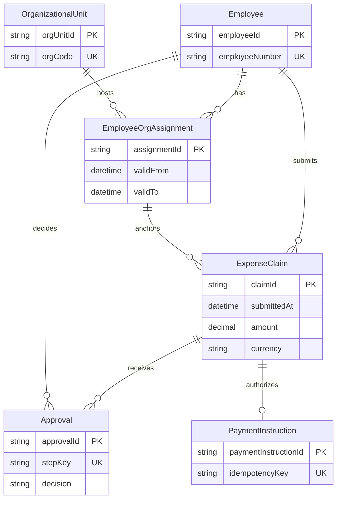

# G008 Batch 4 ER Model and Relationship Boundaries Implementation Plan

> **For agentic workers:** REQUIRED SUB-SKILL: Use superpowers:subagent-driven-development (recommended) or superpowers:executing-plans to implement this plan task-by-task. Steps use checkbox (`- [ ]`) syntax for tracking.

**Goal:** Publish and close MOD-06 as an evidence-bounded ER modeling tutorial covering stable identity, relationship boundaries, cardinality, graph-external constraints, and effective-dated relationship history.

**Architecture:** Reuse the four logical entities from MOD-05, add only `OrganizationalUnit` and `EmployeeOrgAssignment`, and express the resulting six-entity/seven-relationship model in one Mermaid 11.16.0 `erDiagram`. Keep non-graph semantics in two focused tables, govern two reused and two new official sources, publish Stage A while MOD-06 remains pending, then record exact production evidence and close only MOD-06 in Stage B.

**Tech Stack:** MDX, Mermaid 11.16.0, JSON source governance, Node.js 26.5.0, Node test runner, Docusaurus 3.10.2, GitHub Actions Pages deployment, Playwright/browser QA.

## Global Constraints

- Scope is exactly MOD-06. Do not publish or close MOD-07..13 and do not close G008.
- Continue the MOD-05 expense-claim example; MOD-02 remains authoritative for the system boundary and the name `银行支付服务`.
- Keep `Employee`, `ExpenseClaim`, `Approval`, and `PaymentInstruction`; add only `OrganizationalUnit` and `EmployeeOrgAssignment`.
- Publish exactly one Mermaid `erDiagram`, one identity/boundary table, and one constraint-coverage table.
- The Mermaid expresses six entities, seven structural relationships, cardinality, optionality, and stable identity; it does not express runtime sequence.
- Use half-open `[validFrom, validTo)` semantics for primary organizational assignment history.
- Distinguish current state, effective-dated relationship history, audit records, and event logs.
- Do not implement complete DDL, bitemporal storage, Event Sourcing, production migration, concurrency, capacity, or performance design.
- Every expense-domain entity, field, cardinality, and invariant is a Tego Arch teaching decision, not a production fact or an official-source conclusion.
- Pin Mermaid evidence to repository package version `11.16.0` and PostgreSQL evidence to version `18`.
- Reuse existing responsive wrappers and CSS; add no dependency and no new global abstraction.
- Stage A must keep MOD-06 pending and project `44 / 87 / 475`.
- Stage B must close only MOD-06 and project `45 / 87 / 475`, durable stories `7 / 20`, current G008, and MOD-07 next.
- Preserve every historical G008 Batch 1–3 SHA, Pages run, count, and QA statement exactly.
- Preserve the user-owned `/Users/seal/projects/tego-arch/.codex/config.toml`.

---

## File Map

- `content/modeling/mod-06-er-model-relationship-boundaries.mdx` — the only new article and owner of the six-entity ER model.
- `content/modeling/mod-05-conceptual-logical-physical-data-model.mdx` — replace the unpublished handoff with a published MOD-06 link and reciprocal metadata relation.
- `content/modeling/mod-01-model-selection-overview.mdx` — add the reciprocal published modeling relation and visible ER-model link.
- `content/principles/pr-13-persistence-ignorance.mdx` — add the reciprocal relation and explain that persistence mechanisms do not redefine ER semantics.
- `content/cases/temporal-saga-durable-execution.mdx` — add the terminal backlink that distinguishes Temporal Event History from business relationship history.
- `data/source-ledger.json` — add Mermaid 11.16.0 and PostgreSQL 18 Range Types source identities; add the MOD-06 four-source citation review.
- `data/source-link-health.json` — committed live-check results for the two new transports.
- `src/generated/source-ledger.json` — generated source projection.
- `src/generated/topic-manifest.json` — Stage A published/pending and Stage B complete MOD-06 projection.
- `src/generated/topic-indexes.json` — generated modeling index.
- `src/generated/project-status.json` — Stage A `44 / 87 / 475`, Stage B `45 / 87 / 475`.
- `tests/g008-batch4-content.test.mjs` — article, diagram, tables, source, relationship, and Stage A projection contract.
- `tests/g008-batch4-deployment.test.mjs` — immutable exact Stage A deployment and Stage B closure contract.
- `tests/project-status.test.mjs` — current real-repository Stage B counts.
- `tests/g008-batch2-deployment.test.mjs` and `tests/g008-batch3-deployment.test.mjs` — update only assertions about the current projection; keep their historical evidence literals immutable.
- `docs/reviews/g008-batch4.md` — immutable release evidence.
- `docs/content-backlog.md` — Stage B MOD-06 closure and current baseline.
- `.superpowers/sdd/task-4-final-browser-qa.json` — ignored raw final browser evidence.

## Source Set

Use exactly these four article sources:

1. Existing `src-ibm-ida-logical-data-model-9-1-1`  
   `https://www.ibm.com/docs/en/ida/9.1.1?topic=modeling-logical-data-models`
2. New `src-mermaid-er-diagram-11-16-0`  
   `https://github.com/mermaid-js/mermaid/blob/mermaid%4011.16.0/packages/mermaid/src/docs/syntax/entityRelationshipDiagram.md`
3. Existing `src-postgresql-18-constraints`  
   `https://www.postgresql.org/docs/18/ddl-constraints.html`
4. New `src-postgresql-18-range-types`  
   `https://www.postgresql.org/docs/18/rangetypes.html`

IBM supports DBMS-independent logical entities, identifiers, relationships, and constraints. Mermaid supports only the pinned rendering syntax and cardinality markers. PostgreSQL supports only the named constraint/range mechanisms. None of these sources establishes the expense-claim domain rules.

---

### Task 1: Lock and publish the MOD-06 teaching model

**Files:**

- Create: `tests/g008-batch4-content.test.mjs`
- Create: `content/modeling/mod-06-er-model-relationship-boundaries.mdx`

**Interfaces:**

- Consumes: the modeling nine-H2 schema, MOD-02 authoritative vocabulary, and the four logical entities from MOD-05.
- Produces: one reviewed MOD-06 document with six entities, seven relationships, one Mermaid, two tables, and explicit graph-external constraints.

- [ ] **Step 1: Write the failing document and metadata contract**

Create `tests/g008-batch4-content.test.mjs` with:

```js
import assert from 'node:assert/strict';
import {readFile} from 'node:fs/promises';
import test from 'node:test';
import {fileURLToPath} from 'node:url';

import {
  findMarkdownHeadings,
  readContentDocuments,
} from '../scripts/content-metadata.mjs';
import {extractInternalLinks} from '../scripts/content-relations.mjs';
import {extractExternalLinks} from '../scripts/source-ledger.mjs';

const contentRoot = fileURLToPath(new URL('../content/', import.meta.url));
const modelingHeadings = [
  '学习问题',
  '建模目标与输入',
  '参与者与步骤',
  '模型产物',
  '完成判断',
  '常见失败',
  '与其他模型的衔接',
  '完整演练',
  '来源',
];
const [documents, ledger] = await Promise.all([
  readContentDocuments(contentRoot),
  readFile(new URL('../data/source-ledger.json', import.meta.url), 'utf8')
    .then(JSON.parse),
]);
const byId = new Map(
  documents
    .filter(({metadata}) => typeof metadata.topic_id === 'string')
    .map((document) => [document.metadata.topic_id, document]),
);

function requiredDocument(id) {
  const document = byId.get(id);
  assert.ok(document, `${id} must be published`);
  return document;
}

function requiredSlug(slug) {
  const document = documents.find(({metadata}) => metadata.slug === slug);
  assert.ok(document, `${slug} must be published`);
  return document;
}

function section(body, heading) {
  const headings = findMarkdownHeadings(body).filter(({level}) => level === 2);
  const index = headings.findIndex(({text}) => text === heading);
  assert.notEqual(index, -1, `missing ## ${heading}`);
  const start = body.indexOf('\n', headings[index].offset);
  const end = headings[index + 1]?.offset ?? body.length;
  return body.slice(start === -1 ? end : start + 1, end);
}

function markdownTables(body) {
  const lines = body.split('\n');
  const tables = [];
  let current = [];
  for (const line of lines) {
    if (/^\|.+\|$/u.test(line)) {
      current.push(line.slice(1, -1).split('|').map((cell) => cell.trim()));
    } else if (current.length > 0) {
      tables.push(current);
      current = [];
    }
  }
  if (current.length > 0) tables.push(current);
  return tables;
}

function fencedBlock(body, language) {
  const matches = [...body.matchAll(
    new RegExp(`\\\`\\\`\\\`${language}\\n([\\s\\S]*?)\\n\\\`\\\`\\\``, 'gu'),
  )];
  assert.equal(matches.length, 1, `expected exactly one ${language} block`);
  return matches[0][1];
}

test('publishes MOD-06 with the approved scope and metadata', () => {
  const document = requiredDocument('MOD-06');
  assert.equal(
    document.file,
    'modeling/mod-06-er-model-relationship-boundaries.mdx',
  );
  assert.equal(document.metadata.slug, '/modeling/mod-06');
  assert.equal(document.metadata.content_type, 'modeling');
  assert.equal(document.metadata.status, 'reviewed');
  assert.equal(document.metadata.priority, 'P0');
  assert.deepEqual(document.metadata.depends_on, ['MOD-05']);
  assert.deepEqual(document.metadata.adjacent_topics, ['MOD-01', 'MOD-05', 'PR-13']);
  assert.deepEqual(document.metadata.related_cases, [
    '/cases/temporal-saga-durable-execution',
  ]);
  assert.deepEqual(
    document.headings.filter(({level}) => level === 2).map(({text}) => text),
    modelingHeadings,
  );
  assert.match(document.body, /MOD-02[^。\n]*权威/u);
  assert.match(document.body, /本站原创[^。\n]*教学/u);
});
```

- [ ] **Step 2: Run the contract and verify RED**

Run:

```bash
PATH=/Users/seal/.volta/tools/image/node/26.5.0/bin:$PATH \
  node --test tests/g008-batch4-content.test.mjs
```

Expected: FAIL with `MOD-06 must be published`.

- [ ] **Step 3: Add the exact frontmatter and nine-section skeleton**

Create `content/modeling/mod-06-er-model-relationship-boundaries.mdx` with this frontmatter:

```yaml
---
title: ER 模型与关系边界
slug: /modeling/mod-06
content_type: modeling
status: reviewed
difficulty: intermediate
analyzed_at: 2026-07-31
source_cutoff: 2026-07-31
review_policy: quarterly-version-sensitive
confidence: high
domains:
  - software-architecture
  - data-modeling
agent_patterns: []
protocols:
  - PostgreSQL
quality_attributes:
  - understandability
  - maintainability
  - data-integrity
  - auditability
tags:
  - ER 模型
  - 实体身份
  - 关系基数
  - 时间有效性
summary: 沿用费用申报系统，说明如何识别稳定实体身份、关系基数、图外约束和带有效期的关系历史。
topic_id: MOD-06
priority: P0
depends_on:
  - MOD-05
adjacent_topics:
  - MOD-01
  - MOD-05
  - PR-13
related_cases:
  - /cases/temporal-saga-durable-execution
related_questions: []
---
```

Add the H1 and these exact H2 headings in order:

```md
# ER 模型与关系边界

## 学习问题
## 建模目标与输入
## 参与者与步骤
## 模型产物
## 完成判断
## 常见失败
## 与其他模型的衔接
## 完整演练
## 来源
```

Fill the prose with these required statements:

- MOD-02 supplies only the authoritative system boundary and `银行支付服务` name.
- MOD-05 supplies the four starting logical entities.
- The six-entity model, fields, cardinalities, half-open interval, and invariants are original teaching decisions.
- Stable technical identity is distinct from employee number, organization code, approval-step uniqueness, and payment idempotency keys.
- Cardinality includes both lower and upper bounds and must be validated with lifecycle counterexamples.
- Current state, effective-dated history, audit record, and event log are four different evidence types.
- Unknown production cardinality, concurrency conflicts, query distribution, retention, migration, and performance remain validation gaps.
- The page is not complete DDL, a deployable schema, a bitemporal database design, or Event Sourcing.

- [ ] **Step 4: Extend the failing tests for the exact six-entity/seven-relation graph**

Append:

```js
test('renders exactly the approved six-entity seven-relation ER model', () => {
  const body = requiredDocument('MOD-06').body;
  const graph = fencedBlock(body, 'mermaid');
  assert.match(graph, /^erDiagram$/mu);
  for (const entity of [
    'Employee',
    'OrganizationalUnit',
    'EmployeeOrgAssignment',
    'ExpenseClaim',
    'Approval',
    'PaymentInstruction',
  ]) {
    assert.match(graph, new RegExp(`^  ${entity} \\\\{`, 'mu'), entity);
  }
  const relations = graph
    .split('\n')
    .filter((line) => /^\s+\w+\s+[|}{o.]{2}--[|}{o.]{2}\s+\w+\s+:/u.test(line));
  assert.equal(relations.length, 7);
  for (const literal of [
    'Employee ||--o{ ExpenseClaim : submits',
    'ExpenseClaim ||--o{ Approval : receives',
    'Employee ||--o{ Approval : decides',
    'ExpenseClaim ||--o| PaymentInstruction : authorizes',
    'Employee ||--o{ EmployeeOrgAssignment : has',
    'OrganizationalUnit ||--o{ EmployeeOrgAssignment : hosts',
    'EmployeeOrgAssignment ||--o{ ExpenseClaim : anchors',
  ]) {
    assert.ok(graph.includes(literal), literal);
  }
  assert.doesNotMatch(graph, /CREATE TABLE|varchar|btree|index/iu);
});
```

Run the focused test. Expected: FAIL because the Mermaid is missing.

- [ ] **Step 5: Add the exact Mermaid**

Under `## 模型产物`, add:

```mdx
<div className="diagram-wrapper" role="region" aria-label="费用申报 ER 教学模型，可横向滚动" tabIndex={0}>



</div>
```

Immediately after it state that lines express structural association and cardinality, not runtime order; `PK`/`UK` are teaching labels rather than deployable constraints; and the diagram does not prove graph-external invariants.

- [ ] **Step 6: Add failing table and history contracts**

Append:

```js
test('separates identity decisions from graph-external constraint evidence', () => {
  const artifacts = section(requiredDocument('MOD-06').body, '模型产物');
  const tables = markdownTables(artifacts);
  assert.equal(tables.length, 2);
  assert.deepEqual(tables[0][0], ['类别', '判断问题', '费用申报示例', '边界']);
  assert.deepEqual(tables[1][0], ['规则', 'ER 图', '主要表达位置', '仍需验证']);
  for (const label of ['实体', '属性', '值对象', '关联实体']) {
    assert.ok(tables[0].some((row) => row[0] === label), label);
  }
  for (const label of [
    '结构关系与普通基数',
    '业务唯一性',
    '时间区间有效性与不重叠',
    '跨实体一致性',
    '状态前置条件',
    '并发、迁移与性能',
  ]) {
    assert.ok(tables[1].some((row) => row[0] === label), label);
  }
});

test('defines effective-dated relationship history without claiming bitemporal storage', () => {
  const body = requiredDocument('MOD-06').body;
  for (const pattern of [
    /\[validFrom, validTo\)/u,
    /validTo[^。\n]*为空[^。\n]*仍有效/u,
    /validTo[^。\n]*晚于[^。\n]*validFrom/u,
    /同一员工[^。\n]*主要组织归属[^。\n]*不得重叠/u,
    /提交时间[^。\n]*归属[^。\n]*有效期/u,
    /申报员工[^。\n]*归属[^。\n]*员工[^。\n]*一致/u,
    /关闭旧区间[^。\n]*增加新记录/u,
  ]) {
    assert.match(body, pattern);
  }
  for (const label of ['当前状态', '有效期', '审计记录', '事件日志']) {
    assert.match(body, new RegExp(label, 'u'), label);
  }
  assert.match(body, /不(?:是|包含)[^。\n]*双时态/u);
  assert.match(body, /不(?:是|采用)[^。\n]*Event Sourcing/u);
});
```

Run the focused tests. Expected: FAIL because the tables and complete history rules are missing.

- [ ] **Step 7: Add the two exact tables and complete prose**

Add two separately focusable wrappers:

```mdx
<div className="table-wrapper table-wrapper--mapping" role="region" aria-label="实体身份与关系边界决策表，可横向滚动" tabIndex={0}>

| 类别 | 判断问题 | 费用申报示例 | 边界 |
| --- | --- | --- | --- |
| 实体 | 是否需要稳定身份并跨属性变化持续追踪 | Employee、ExpenseClaim、Approval、PaymentInstruction、OrganizationalUnit | 技术身份不替代业务唯一性 |
| 属性 | 是否只描述所属实体且无需独立生命周期 | ExpenseClaim 的 amount、currency、submittedAt | 金额必须与币种共同解释 |
| 值对象 | 是否由一组值定义并可整体替换 | 金额与币种组成的 Money 语义 | 本文不规定代码实现或数据库类型 |
| 关联实体 | 关系是否拥有属性、历史或独立约束 | EmployeeOrgAssignment | 普通连线无法保存 validFrom、validTo 和不重叠规则 |

</div>

<div className="table-wrapper table-wrapper--mapping" role="region" aria-label="ER 约束覆盖边界表，可横向滚动" tabIndex={0}>

| 规则 | ER 图 | 主要表达位置 | 仍需验证 |
| --- | --- | --- | --- |
| 结构关系与普通基数 | 可表达 | 关系端点与可选性 | 生命周期反例和真实业务规则 |
| 业务唯一性 | 只能标注候选 | 约束规则与后续 schema | 作用域、复用和并发冲突 |
| 时间区间有效性与不重叠 | 不可完整表达 | 有效期规则与数据库候选机制 | 修正、回填和并发写入 |
| 跨实体一致性 | 不可证明 | 申报员工与历史归属一致性规则 | 事务边界和失败恢复 |
| 状态前置条件 | 不可证明 | 付款只针对满足批准条件的申报 | 状态机、竞争和补偿 |
| 并发、迁移与性能 | 不可证明 | 实现与运行验证 | 数据分布、锁、回滚和测量结果 |

</div>
```

Complete all nine sections using the design spec. The full exercise must show organization A, claim submission, later transfer to organization B, and the old claim still referencing the A assignment.

- [ ] **Step 8: Run Task 1 tests and commit**

Run:

```bash
PATH=/Users/seal/.volta/tools/image/node/26.5.0/bin:$PATH \
  node --test tests/g008-batch4-content.test.mjs
```

Expected: the article/model tests pass; source and relationship tests added in Task 2 do not exist yet.

Commit:

```bash
git add content/modeling/mod-06-er-model-relationship-boundaries.mdx \
  tests/g008-batch4-content.test.mjs
git commit -m "docs: add mod06 er relationship model"
```

---

### Task 2: Govern sources, published relations, and Stage A projections

**Files:**

- Modify: `tests/g008-batch4-content.test.mjs`
- Modify: `data/source-ledger.json`
- Modify: `data/source-link-health.json`
- Modify: `content/modeling/mod-05-conceptual-logical-physical-data-model.mdx`
- Modify: `content/modeling/mod-01-model-selection-overview.mdx`
- Modify: `content/principles/pr-13-persistence-ignorance.mdx`
- Modify: `content/cases/temporal-saga-durable-execution.mdx`
- Modify: generated files from `npm run generate:content`

**Interfaces:**

- Consumes: the Task 1 article and existing source-ledger schema version 1.
- Produces: four governed article citations, two new source identities, reciprocal published links, and Stage A generated projection `44 / 87 / 475`.

- [ ] **Step 1: Add failing source-governance tests**

Append:

```js
test('governs the exact pinned MOD-06 source set', () => {
  const document = requiredDocument('MOD-06');
  const links = new Set(extractExternalLinks(document));
  const requiredSources = new Map([
    [
      'src-ibm-ida-logical-data-model-9-1-1',
      'https://www.ibm.com/docs/en/ida/9.1.1?topic=modeling-logical-data-models',
    ],
    [
      'src-mermaid-er-diagram-11-16-0',
      'https://github.com/mermaid-js/mermaid/blob/mermaid%4011.16.0/packages/mermaid/src/docs/syntax/entityRelationshipDiagram.md',
    ],
    [
      'src-postgresql-18-constraints',
      'https://www.postgresql.org/docs/18/ddl-constraints.html',
    ],
    [
      'src-postgresql-18-range-types',
      'https://www.postgresql.org/docs/18/rangetypes.html',
    ],
  ]);
  for (const [id, locator] of requiredSources) {
    const source = ledger.sources.find((candidate) => candidate.id === id);
    assert.ok(source, id);
    assert.equal(source.canonical_locator, locator);
    assert.equal(source.transport_locator, locator);
    assert.equal(source.tier, 'primary');
    assert.equal(source.checked_at, '2026-07-31');
    assert.ok(links.has(locator), locator);
  }
  assert.match(document.body, /Mermaid[^。\n]*11\.16\.0/u);
  assert.match(document.body, /PostgreSQL 18/u);
  assert.match(document.body, /Mermaid[^。\n]*(?:语法|渲染工具)[^。\n]*(?:不是|不作为)[^。\n]*(?:理论|标准)/u);
  assert.match(document.body, /官方文档[^。\n]*不支持[^。\n]*费用申报/u);
});
```

Run:

```bash
PATH=/Users/seal/.volta/tools/image/node/26.5.0/bin:$PATH \
  node --test --test-name-pattern='pinned MOD-06 source set' \
  tests/g008-batch4-content.test.mjs
```

Expected: FAIL because the two new source IDs and article source links are missing.

- [ ] **Step 2: Add the two new source records**

Add `src-mermaid-er-diagram-11-16-0` to `data/source-ledger.json`:

```json
{
  "id": "src-mermaid-er-diagram-11-16-0",
  "canonical_locator": "https://github.com/mermaid-js/mermaid/blob/mermaid%4011.16.0/packages/mermaid/src/docs/syntax/entityRelationshipDiagram.md",
  "transport_locator": "https://github.com/mermaid-js/mermaid/blob/mermaid%4011.16.0/packages/mermaid/src/docs/syntax/entityRelationshipDiagram.md",
  "query_insensitive": false,
  "locator_aliases": [],
  "tombstone": null,
  "title": "Entity Relationship Diagrams — Mermaid 11.16.0",
  "author_or_org": "Mermaid contributors",
  "published_at": "2026-06-25",
  "registered_at": "2026-07-31",
  "checked_at": "2026-07-31",
  "version": "Mermaid 11.16.0 tag mermaid@11.16.0 checked on 2026-07-31",
  "source_kind": "official-docs",
  "tier": "primary",
  "allowed_evidence_roles": ["definition", "implementation", "learning"],
  "license": "MIT",
  "license_scope": "The named Mermaid 11.16.0 documentation source within the evidenced MIT repository scope; trademarks, linked works, embedded quotations, and third-party material excluded",
  "license_evidence_url": "https://github.com/mermaid-js/mermaid/blob/mermaid%4011.16.0/LICENSE",
  "license_evidence_note": "The immutable Mermaid 11.16.0 repository tag includes the MIT license; Tego Arch uses only pinned syntax facts and an original diagram.",
  "license_family_id": "github:mermaid-js/mermaid",
  "license_family_grouping": "identity",
  "family_grouping_evidence_url": null,
  "copyright_policy": "facts-and-short-quotation",
  "usage_boundary": "Supports Mermaid 11.16.0 erDiagram entities, attributes, relationship markers, labels, cardinality, and optionality only; it is a rendering syntax source, not an ER theory standard or expense-domain authority.",
  "link_policy": "stable",
  "expected_final_transport_locator": "https://github.com/mermaid-js/mermaid/blob/mermaid%4011.16.0/packages/mermaid/src/docs/syntax/entityRelationshipDiagram.md",
  "expected_final_approved_at": "2026-07-31",
  "expected_final_approval_note": "Reviewed immutable Mermaid 11.16.0 ER syntax transport and MIT boundary"
}
```

Add `src-postgresql-18-range-types`:

```json
{
  "id": "src-postgresql-18-range-types",
  "canonical_locator": "https://www.postgresql.org/docs/18/rangetypes.html",
  "transport_locator": "https://www.postgresql.org/docs/18/rangetypes.html",
  "query_insensitive": false,
  "locator_aliases": [],
  "tombstone": null,
  "title": "PostgreSQL 18 — Range Types",
  "author_or_org": "PostgreSQL Global Development Group",
  "published_at": "2025-09-25",
  "registered_at": "2026-07-31",
  "checked_at": "2026-07-31",
  "version": "PostgreSQL 18 documentation checked on 2026-07-31",
  "source_kind": "official-docs",
  "tier": "primary",
  "allowed_evidence_roles": ["definition", "implementation", "learning"],
  "license": "PostgreSQL",
  "license_scope": "The named PostgreSQL 18 documentation page under the PostgreSQL License; trademarks, linked works, and separately licensed third-party material excluded",
  "license_evidence_url": "https://www.postgresql.org/about/licence/",
  "license_evidence_note": "The official PostgreSQL license page permits use, copy, modification, and distribution subject to its copyright and permission notice.",
  "license_family_id": "https://www.postgresql.org/docs/18/",
  "license_family_grouping": "identity",
  "family_grouping_evidence_url": null,
  "copyright_policy": "adapt-with-attribution",
  "usage_boundary": "Supports PostgreSQL 18 range bounds and exclusion-constraint mechanism behavior only; it does not establish the expense-domain interval choice, non-overlap rule, migration safety, or performance.",
  "link_policy": "stable",
  "expected_final_transport_locator": "https://www.postgresql.org/docs/18/rangetypes.html",
  "expected_final_approved_at": "2026-07-31",
  "expected_final_approval_note": "Reviewed PostgreSQL 18 range-types transport and PostgreSQL License boundary"
}
```

- [ ] **Step 3: Add the MOD-06 citation review and article source prose**

Add this entry under the ledger's `documents` object, keyed by the exact article path:

```json
{
  "content/modeling/mod-06-er-model-relationship-boundaries.mdx": {
    "reviewed_at": "2026-07-31",
    "copyright_checks": [
      "original-structure",
      "quotation-boundary",
      "attribution-complete",
      "illustration-rights"
    ],
    "citations": [
      {
        "source_id": "src-ibm-ida-logical-data-model-9-1-1",
        "citation_url": "https://www.ibm.com/docs/en/ida/9.1.1?topic=modeling-logical-data-models",
        "roles": ["definition", "method"],
        "manifest_primary": true,
        "usage_mode": "facts-summary",
        "attribution_note": "Logical Data Models, IBM InfoSphere Data Architect 9.1.1",
        "modification_note": null,
        "excerpt": null,
        "quotation_reviewed": false
      },
      {
        "source_id": "src-mermaid-er-diagram-11-16-0",
        "citation_url": "https://github.com/mermaid-js/mermaid/blob/mermaid%4011.16.0/packages/mermaid/src/docs/syntax/entityRelationshipDiagram.md",
        "roles": ["implementation"],
        "manifest_primary": true,
        "usage_mode": "facts-summary",
        "attribution_note": "Mermaid 11.16.0 Entity Relationship Diagrams",
        "modification_note": null,
        "excerpt": null,
        "quotation_reviewed": false
      },
      {
        "source_id": "src-postgresql-18-constraints",
        "citation_url": "https://www.postgresql.org/docs/18/ddl-constraints.html",
        "roles": ["implementation"],
        "manifest_primary": true,
        "usage_mode": "facts-summary",
        "attribution_note": "PostgreSQL 18 Constraints",
        "modification_note": null,
        "excerpt": null,
        "quotation_reviewed": false
      },
      {
        "source_id": "src-postgresql-18-range-types",
        "citation_url": "https://www.postgresql.org/docs/18/rangetypes.html",
        "roles": ["implementation"],
        "manifest_primary": false,
        "usage_mode": "facts-summary",
        "attribution_note": "PostgreSQL 18 Range Types",
        "modification_note": null,
        "excerpt": null,
        "quotation_reviewed": false
      }
    ]
  }
}
```

In `## 来源`, name IBM® InfoSphere® Data Architect at first public use, include the existing IBM attribution at article end, name Mermaid 11.16.0 and PostgreSQL 18, and explicitly state the usage boundaries from the Source Set.

- [ ] **Step 4: Refresh link health and verify the two new transports**

Run:

```bash
PATH=/Users/seal/.volta/tools/image/node/26.5.0/bin:$PATH npm run refresh:links
```

Expected: the refresh succeeds. In `data/source-link-health.json`, both new transports are healthy, final locators equal the canonical locators, and `login_wall_detected` is false. Preserve tool-produced health history; do not hand-edit successful timestamps or HTTP status.

- [ ] **Step 5: Add failing published-relation tests**

Append:

```js
test('publishes only the approved MOD-06 relationships and reciprocal links', () => {
  const document = requiredDocument('MOD-06');
  const links = new Set(extractInternalLinks(document));
  for (const slug of [
    '/modeling',
    '/modeling/mod-01',
    '/modeling/mod-02',
    '/modeling/mod-05',
    '/principles/pr-13',
    '/cases/temporal-saga-durable-execution',
  ]) {
    assert.ok(links.has(slug), slug);
  }
  for (const slug of ['/modeling/mod-07', '/modeling/mod-08']) {
    assert.equal(links.has(slug), false, slug);
  }
  assert.match(document.body, /MOD-08[^。\n]*尚未发布/u);

  for (const id of ['MOD-01', 'MOD-05', 'PR-13']) {
    const peer = requiredDocument(id);
    assert.ok(peer.metadata.adjacent_topics.includes('MOD-06'), id);
    assert.ok(
      new Set(extractInternalLinks(peer)).has('/modeling/mod-06'),
      `${id} visible MOD-06 link`,
    );
  }
  assert.ok(
    new Set(extractInternalLinks(requiredSlug(
      '/cases/temporal-saga-durable-execution',
    ))).has('/modeling/mod-06'),
  );
});
```

Run the focused test. Expected: FAIL because reciprocal metadata/body links are missing.

- [ ] **Step 6: Add reciprocal metadata and visible links**

Apply these exact relationship changes:

- `MOD-05`: add `MOD-06` to `adjacent_topics`; replace “MOD-06 尚未发布” with a link explaining that MOD-06 deepens identity, cardinality, graph-external constraints, and history.
- `MOD-01`: add `MOD-06` to `adjacent_topics`; add one visible MOD-06 link in the data-model selection discussion.
- `PR-13`: add `MOD-06` to `adjacent_topics`; add one visible link explaining that ER semantics remain distinct from persistence mechanisms.
- Temporal Saga case: add one terminal visible link explaining that Temporal Event History is a control-plane recovery record, not effective-dated business relationship history.

Do not alter other prose, relationships, diagrams, or historical facts.

- [ ] **Step 7: Generate Stage A projections**

Run:

```bash
PATH=/Users/seal/.volta/tools/image/node/26.5.0/bin:$PATH \
  npm run generate:content
```

Then assert:

```bash
PATH=/Users/seal/.volta/tools/image/node/26.5.0/bin:$PATH node - <<'NODE'
const status = require('./src/generated/project-status.json');
const manifest = require('./src/generated/topic-manifest.json');
const mod06 = manifest.topics.find((topic) => topic.id === 'MOD-06');
if (status.completed_topics !== 44) throw new Error(JSON.stringify(status));
if (status.content_documents !== 87) throw new Error(JSON.stringify(status));
if (status.governed_sources !== 475) throw new Error(JSON.stringify(status));
if (!mod06?.published || mod06.status.value !== 'pending') {
  throw new Error(JSON.stringify(mod06));
}
NODE
```

Expected: no output and exit 0.

- [ ] **Step 8: Run the full Task 2 content contract and commit**

Run:

```bash
PATH=/Users/seal/.volta/tools/image/node/26.5.0/bin:$PATH \
  node --test tests/g008-batch4-content.test.mjs
PATH=/Users/seal/.volta/tools/image/node/26.5.0/bin:$PATH \
  npm run check:content
PATH=/Users/seal/.volta/tools/image/node/26.5.0/bin:$PATH \
  npm run check:links
```

Expected: all pass.

Commit all Task 2 files with:

```bash
git add content/modeling/mod-06-er-model-relationship-boundaries.mdx \
  content/modeling/mod-05-conceptual-logical-physical-data-model.mdx \
  content/modeling/mod-01-model-selection-overview.mdx \
  content/principles/pr-13-persistence-ignorance.mdx \
  content/cases/temporal-saga-durable-execution.mdx \
  data/source-ledger.json data/source-link-health.json \
  src/generated/source-ledger.json src/generated/topic-manifest.json \
  src/generated/topic-indexes.json src/generated/project-status.json \
  tests/g008-batch4-content.test.mjs
git commit -m "docs: govern mod06 evidence and relations"
```

---

### Task 3: Verify and publish the Stage A baseline

**Files:**

- Modify only files required by failures that expose a genuine current-projection contract.

**Interfaces:**

- Consumes: Task 2 Stage A projection `44 / 87 / 475`.
- Produces: one fully verified Stage A commit pushed to `origin/codex/g008-modeling-batch4`.

- [ ] **Step 1: Run the targeted Batch 4 contract**

```bash
PATH=/Users/seal/.volta/tools/image/node/26.5.0/bin:$PATH \
  node --test tests/g008-batch4-content.test.mjs
```

Expected: all Batch 4 content tests pass.

- [ ] **Step 2: Run full verification**

```bash
PATH=/Users/seal/.volta/tools/image/node/26.5.0/bin:$PATH npm run verify
```

Expected:

- all repository tests pass;
- content validation and generated-file checks pass;
- cached source health and review health pass;
- typecheck passes;
- Docusaurus production build passes;
- no Node 20 engine warning appears because Node 26.5.0 is explicit.

If historical tests fail only because they assert the current generated projection, update only their current-state assertions to Stage A `44 / 87 / 475`. Do not change any historical Batch 1–3 SHA, Pages run, article count, source count, QA count, or closure statement.

- [ ] **Step 3: Review the complete Stage A diff**

Run:

```bash
git diff --check
git status --short
git diff 42ebffc608913a9cbf20bc5c96f3612b74fae97a...HEAD -- \
  content data src/generated tests
```

Expected: no whitespace errors; only approved MOD-06 content, source, relation, generated, and test changes.

- [ ] **Step 4: Commit any verification-only fixes**

If Step 2 required current-projection test fixes:

```bash
git add tests
git commit -m "test: align mod06 stage-a projection"
```

If no files changed, do not create an empty commit.

- [ ] **Step 5: Push the exact Stage A commit**

Run:

```bash
git push -u origin codex/g008-modeling-batch4
git rev-parse HEAD
```

Expected: push succeeds and the second command prints the authoritative 40-character Stage A SHA. Record that exact literal for Task 4; never use a symbolic placeholder in release evidence.

---

### Task 4: Gate the exact deployment and collect production QA

**Files:**

- Create: `.superpowers/sdd/task-4-final-browser-qa.json`

**Interfaces:**

- Consumes: the exact 40-character Stage A SHA printed by Task 3.
- Produces: one successful exact-sha Pages run and reproducible desktop/mobile evidence.

- [ ] **Step 1: Locate the exact Pages run**

Run:

```bash
gh run list --workflow deploy.yml \
  --branch codex/g008-modeling-batch4 \
  --limit 20 \
  --json databaseId,headSha,status,conclusion,url
```

Select only the entry whose `headSha` equals the exact Task 3 SHA. Ignore runs for older commits or other branches.

- [ ] **Step 2: Wait for the exact run**

Run:

```bash
g008_b4_stage_a_sha="$(git rev-parse HEAD)"
g008_b4_pages_run_id="$(
  gh run list --workflow deploy.yml \
    --branch codex/g008-modeling-batch4 \
    --limit 20 \
    --json databaseId,headSha \
    --jq ".[] | select(.headSha == \"${g008_b4_stage_a_sha}\") | .databaseId" \
  | head -1
)"
test -n "${g008_b4_pages_run_id}"
gh run watch --exit-status "${g008_b4_pages_run_id}"
gh run view "${g008_b4_pages_run_id}" \
  --json databaseId,headSha,status,conclusion,url
```

Expected final JSON:

- `headSha` equals the exact Stage A SHA;
- `status` is `completed`;
- `conclusion` is `success`.

The numeric run ID and exact SHA become immutable Stage B evidence.

- [ ] **Step 3: Run canonical HTTP checks**

Check:

```text
https://sealday.github.io/tego-arch/
https://sealday.github.io/tego-arch/modeling
https://sealday.github.io/tego-arch/modeling/mod-05
https://sealday.github.io/tego-arch/modeling/mod-06
https://sealday.github.io/tego-arch/principles/pr-13
https://sealday.github.io/tego-arch/references
```

Use:

```bash
curl -sS -o /dev/null -w '%{http_code} %{url_effective}\n' URL
```

Expected: 6/6 HTTP 200 and no unexpected canonical redirect.

- [ ] **Step 4: Execute browser QA at both viewports**

For `/modeling/mod-06`, test desktop `1440x1000` and mobile `390x844`:

- page title and all nine H2 sections render;
- exactly one Mermaid SVG renders;
- all six entity labels are visible;
- seven relationship connectors are present;
- exactly two tables render with 4 and 6 data rows;
- the diagram and both table wrappers have contained horizontal overflow;
- the document itself has no horizontal overflow;
- focus each wrapper and press ArrowRight; `scrollLeft` increases when overflow exists;
- all four source labels are visible and clickable;
- all parent/dependency, adjacent, and case links are visible and clickable;
- MOD-05 contains and can click the new MOD-06 link;
- no MOD-07 or MOD-08 article link exists;
- console warnings, console errors, and page errors are all zero.

- [ ] **Step 5: Persist raw QA evidence**

Write `.superpowers/sdd/task-4-final-browser-qa.json` from the browser-QA result. It must contain:

- exact string fields `stage_a_sha`, `pages_run_id`, and `pages_run_url`;
- `run_gate` with `headSha_matches: true`, `status: "completed"`, and `conclusion: "success"`;
- `http` with `passed: 6` and `total: 6`;
- viewports `{name: "desktop", width: 1440, height: 1000}` and `{name: "mobile", width: 390, height: 844}`;
- `mermaid` with `rendered: 1`, `expected: 1`, `entities: 6`, and `relationships: 7`;
- `tables` with `rendered: 2`, `expected: 2`, and `data_rows: [4, 6]`;
- zero warnings, errors, and page errors; `document_overflow: false`;
- `contained_overflow: true` and `keyboard_focus_and_arrow_right: true`;
- four source labels and four source clicks per viewport;
- all expected relation clicks passing and no MOD-07/MOD-08 article link.

Validate `stage_a_sha` against `/^[0-9a-f]{40}$/` and `pages_run_id` against `/^[0-9]+$/` before saving. Do not commit this ignored artifact.

- [ ] **Step 6: Hash and inspect the artifact**

Run:

```bash
shasum -a 256 .superpowers/sdd/task-4-final-browser-qa.json
git status --short
```

Expected: a SHA-256 digest is printed and the ignored raw artifact does not appear in `git status`.

---

### Task 5: Lock deployment evidence and close only MOD-06

**Files:**

- Create: `tests/g008-batch4-deployment.test.mjs`
- Create: `docs/reviews/g008-batch4.md`
- Modify: `docs/content-backlog.md`
- Modify: `tests/project-status.test.mjs`
- Modify: historical deployment tests only where they assert the current projection.
- Modify: generated files from `npm run generate:content`

**Interfaces:**

- Consumes: exact Stage A SHA, numeric Pages run, full-verification count, and Task 4 production QA evidence.
- Produces: immutable G008 Batch 4 release evidence and final Stage B projection `45 / 87 / 475`.

- [ ] **Step 1: Write the failing deployment identity contract**

Create `tests/g008-batch4-deployment.test.mjs` by copying the structural helpers from `tests/g008-batch3-deployment.test.mjs`, then make these exact semantic changes:

```js
const releaseReviewUrl = new URL(
  '../docs/reviews/g008-batch4.md',
  import.meta.url,
);

// Define expectedStageASha and expectedPagesRunId immediately above this
// block as the literal values captured by Tasks 3 and 4.
assert.match(expectedStageASha, /^[0-9a-f]{40}$/u);
assert.match(expectedPagesRunId, /^[0-9]+$/u);
assert.notEqual(
  expectedStageASha,
  'e7b712ed6e6b1e2f6780bd41fa5e6a5d8d4e4407',
  'Batch 4 must not reuse the Batch 3 Stage A SHA',
);
```

The two constants must be literal captured values before the first test run. They must not be derived from current `HEAD`, because Stage B will move `HEAD`; symbolic text must never be committed.

Require the release review to contain:

```js
for (const literal of [
  '87 content documents',
  '475 governed sources',
  '44 completed topics',
  'desktop `1440x1000`',
  'mobile `390x844`',
  'HTTP canonical routes: 6 / 6',
  'canonical modeling route: `/modeling`',
  'canonical references route: `/references`',
  'Mermaid: 1 / 1, 6 entities, 7 relationships',
  'tables: 2 / 2, 4 + 6 data rows',
  'source labels: 4 / 4',
  'source clicks: 8 / 8',
  '0 warnings / 0 errors',
  'no document overflow',
  'contained horizontal overflow',
  'keyboard scroll/focus',
  '45 completed topics',
  '7 / 20',
  'current G008',
  'next MOD-07',
  'Stage B closure — PASS',
]) {
  assert.ok(source.includes(literal), literal);
}
```

Also require:

- exactly one Stage A SHA line, run line, and exact run gate;
- the Stage A SHA resolves through `git cat-file -e`;
- the current baseline begins with the Batch 4 segment;
- the Batch 3 segment remains byte-for-byte identifiable after the Batch 4 segment;
- MOD-06 is checked, MOD-07..13 remain unchecked;
- project status is `45 / 87 / 475`;
- G008 remains current and is not marked complete.

- [ ] **Step 2: Run the deployment contract and verify RED**

```bash
PATH=/Users/seal/.volta/tools/image/node/26.5.0/bin:$PATH \
  node --test tests/g008-batch4-deployment.test.mjs
```

Expected: FAIL because `docs/reviews/g008-batch4.md` does not exist or MOD-06 is not closed.

- [ ] **Step 3: Create the exact release review**

Create `docs/reviews/g008-batch4.md` with the same heading structure as `docs/reviews/g008-batch3.md`:

- H1 `G008 Batch 4 Release Review`;
- one exact Stage A SHA line, one numeric Pages-run link, and one exact run-gate line;
- `## Stage A evidence` with 87 documents, 475 sources, 44 completed topics, and the equal pass/total count from the fresh Task 3 full test;
- `## Independent review` with spec/content, source/copyright, and code/test PASS lines;
- `## Live smoke` with every literal required by the Step 1 array plus the measured equal relation-click count;
- `## Stage B projection` with 45 topics, 87 documents, 475 sources, `7 / 20`, current G008, and next MOD-07;
- final line `Stage B closure — PASS`.

Use only exact captured literals from Tasks 3–4. The deployment test must reject the strings `ACTUAL_`, `STAGE_A_SHA`, `RUN_ID`, angle-bracket symbolic values, and non-numeric run IDs.

- [ ] **Step 4: Close MOD-06 and preserve history**

In `docs/content-backlog.md`:

- prepend one new current-baseline segment for “2026-07-31 G008 Batch 4 已完成 MOD-06”;
- include the exact Stage A commit link, Pages run link, exact run gate, all Task 4 QA facts, Stage A `44 / 87 / 475`, actual repository test count, Stage B `45 / 87 / 475`, durable stories `7 / 20`, G008 still in progress, MOD-07 next, and `Stage B closure — PASS`;
- retain the entire Batch 3 segment after “此前 G008 Batch 3” without changing any historical literal;
- change only MOD-06 from `[ ]` to `[x]`;
- leave MOD-07..13 unchecked.

- [ ] **Step 5: Generate Stage B projections and update current assertions**

Run:

```bash
PATH=/Users/seal/.volta/tools/image/node/26.5.0/bin:$PATH \
  npm run generate:content
```

Update `tests/project-status.test.mjs` current real-repository expectation to:

```js
{
  completed_topics: 45,
  content_documents: 87,
  governed_sources: 475,
}
```

Update Batch 2/3 deployment tests only where they assert the current generated projection or the new current baseline prefix. Preserve all historical evidence and add a regression that fails if the Batch 3 completion identity changes.

- [ ] **Step 6: Run targeted closure tests**

```bash
PATH=/Users/seal/.volta/tools/image/node/26.5.0/bin:$PATH \
  node --test tests/g008-batch4-content.test.mjs \
  tests/g008-batch4-deployment.test.mjs \
  tests/project-status.test.mjs \
  tests/g008-batch3-deployment.test.mjs \
  tests/g008-batch2-deployment.test.mjs
```

Expected: all pass.

- [ ] **Step 7: Run final full verification**

```bash
PATH=/Users/seal/.volta/tools/image/node/26.5.0/bin:$PATH npm run verify
git diff --check
git status --short
```

Expected: full verification passes on Stage B state; no whitespace errors; only intended release/closure files remain uncommitted.

- [ ] **Step 8: Commit Stage B closure**

```bash
git add docs/content-backlog.md docs/reviews/g008-batch4.md \
  src/generated/project-status.json src/generated/source-ledger.json \
  src/generated/topic-indexes.json src/generated/topic-manifest.json \
  tests/g008-batch4-deployment.test.mjs tests/project-status.test.mjs \
  tests/g008-batch3-deployment.test.mjs tests/g008-batch2-deployment.test.mjs
git commit -m "docs: close g008 batch4 er boundaries"
```

Include only historical tests that actually changed.

- [ ] **Step 9: Verify and push the exact final commit**

```bash
PATH=/Users/seal/.volta/tools/image/node/26.5.0/bin:$PATH npm run verify
git status --short
git push origin codex/g008-modeling-batch4
git rev-parse HEAD
```

Expected: verification passes again on the committed tree, worktree is clean, push succeeds, and the final 40-character SHA is printed.

- [ ] **Step 10: Final evidence review**

Confirm:

- feature branch, `main`, and `origin/main` synchronization is performed only if branch-finishing instructions authorize it;
- MOD-06 is complete and published;
- G008 is still current;
- MOD-07 is pending and next;
- final raw browser artifact and SHA-256 digest remain available locally;
- the main repository still contains only the preserved user-owned `.codex/config.toml` change;
- worktree and branch remain preserved unless a later explicit finishing step removes them.
