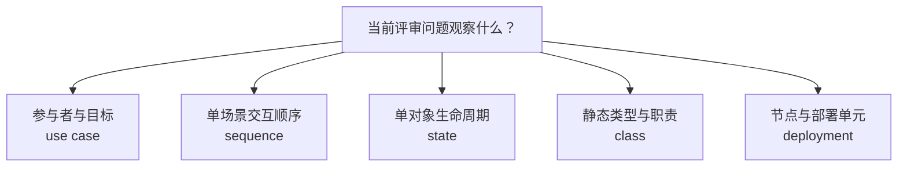

# G008 Batch 5 UML Selection Guide Implementation Plan

> **For agentic workers:** REQUIRED SUB-SKILL: Use superpowers:subagent-driven-development (recommended) or superpowers:executing-plans to implement this plan task-by-task. Steps use checkbox (`- [ ]`) syntax for tracking.

**Goal:** Publish and close MOD-07 as a question-driven UML diagram selection guide, while keeping G008 active and MOD-08 next.

**Architecture:** Add one modeling article that uses a six-node Mermaid selection flow, one five-row evidence-boundary table, and five expense-claim review records. Govern one pinned OMG UML 2.5.1 source, reuse three existing sources, publish reciprocal relations during Stage A, verify the exact production deployment, then close only MOD-07 in Stage B.

**Tech Stack:** MDX, Mermaid through Docusaurus 3.10.2, Node.js 26.5.0, Node test runner, JSON source ledger, generated content projections, GitHub Actions, GitHub Pages, in-app browser QA.

## Global Constraints

- Scope is exactly MOD-07. Do not publish or close MOD-08..13 and do not close G008.
- Use `content/modeling/mod-07-uml-diagram-selection-guide.mdx` with slug `/modeling/mod-07` and the canonical nine modeling H2 headings.
- Fix metadata to `topic_id: MOD-07`, `priority: P0`, `difficulty: intermediate`, and `review_policy: quarterly-version-sensitive`.
- Reuse MOD-02 names and boundary as authoritative; reuse MOD-06 domain concepts without claiming a UML class is an ER entity or database table.
- Use exactly one Mermaid selection flow and one five-row evidence-boundary table; do not create Draw.io, SVG, raster, or runtime dependencies.
- Make the Mermaid and table wrappers keyboard focusable and route ArrowLeft/ArrowRight to the existing `handleHorizontalArrowKey` helper.
- Govern one new source, `src-omg-uml-2-5-1-2017`, and reuse `src-c4model-dynamic-diagram`, `src-c4model-deployment-diagram`, and `src-larman-applying-uml-patterns-3e-2004`.
- Stage A must keep MOD-07 pending and project `45 / 88 / 476`; Stage B must project `46 / 88 / 476`, `7 / 20`, current G008, next MOD-08.
- Preserve every G008 Batch 1–4 historical SHA, Pages run, count, and QA literal.
- Use `/Users/seal/.volta/tools/image/node/26.5.0/bin` before every npm or Node verification command.
- Do not modify the user-owned untracked `.codex/config.toml` in the main checkout.

## File Structure

- `content/modeling/mod-07-uml-diagram-selection-guide.mdx` — MOD-07 teaching content, selection flow, table, exercise, sources, and visible relations.
- `content/modeling/mod-01-model-selection-overview.mdx` — reciprocal MOD-07 selection-guide link.
- `content/modeling/mod-03-c4-component-dynamic-deployment.mdx` — reciprocal UML/C4 comparison link.
- `content/modeling/mod-06-er-model-relationship-boundaries.mdx` — reciprocal class/ER boundary link.
- `data/source-ledger.json` — one OMG source identity and the MOD-07 citation review.
- `data/source-link-health.json` — tool-produced health evidence for the new transport and cited locator.
- `src/generated/*.json` — Stage A and Stage B projections generated from canonical inputs.
- `tests/g008-batch5-content.test.mjs` — mutation-sensitive article, visual, source, relation, and Stage A projection contract.
- `docs/reviews/g008-batch5.md` — exact immutable Stage A deployment and production QA evidence.
- `tests/g008-batch5-deployment.test.mjs` — Stage B closure, history preservation, and immutable evidence contract.
- `.superpowers/sdd/task-4-final-browser-qa.json` and `.superpowers/sdd/task-4-report.md` — ignored raw QA artifact and human-readable execution report.

---

### Task 1: Build the MOD-07 article contract and teaching content

**Files:**
- Create: `tests/g008-batch5-content.test.mjs`
- Create: `content/modeling/mod-07-uml-diagram-selection-guide.mdx`

**Interfaces:**
- Consumes: `readContentDocuments`, `findMarkdownHeadings`, `extractInternalLinks`, and `handleHorizontalArrowKey`.
- Produces: a reviewed MOD-07 document with one Mermaid flow, one evidence table, five review records, and two keyboard-scrollable regions.

- [ ] **Step 1: Write the failing metadata and heading contract**

Create the test file with the same `requiredDocument`, `section`, `markdownTables`, and `fencedBlock` helpers used by `tests/g008-batch4-content.test.mjs`, then add:

```js
test('publishes MOD-07 with the approved metadata and scope', () => {
  const document = requiredDocument('MOD-07');
  assert.equal(document.file, 'modeling/mod-07-uml-diagram-selection-guide.mdx');
  assert.equal(document.metadata.slug, '/modeling/mod-07');
  assert.equal(document.metadata.content_type, 'modeling');
  assert.equal(document.metadata.status, 'reviewed');
  assert.equal(document.metadata.difficulty, 'intermediate');
  assert.equal(document.metadata.priority, 'P0');
  assert.equal(document.metadata.review_policy, 'quarterly-version-sensitive');
  assert.deepEqual(document.metadata.depends_on, ['MOD-01']);
  assert.deepEqual(document.metadata.adjacent_topics, ['MOD-03', 'MOD-06']);
  assert.deepEqual(document.metadata.related_cases, [
    '/cases/temporal-saga-durable-execution',
  ]);
  assert.deepEqual(
    document.headings.filter(({level}) => level === 2).map(({text}) => text),
    modelingHeadings,
  );
  assert.match(document.body, /MOD-02[^。\n]*权威/u);
  assert.match(document.body, /本站原创[^。\n]*教学/u);
});
```

Run:

```bash
PATH=/Users/seal/.volta/tools/image/node/26.5.0/bin:$PATH \
  node --test tests/g008-batch5-content.test.mjs
```

Expected: FAIL because MOD-07 is not published.

- [ ] **Step 2: Create the article skeleton**

Use this front matter and exact H2 order:

```mdx
---
title: UML 选图指南
slug: /modeling/mod-07
content_type: modeling
status: reviewed
difficulty: intermediate
analyzed_at: 2026-08-01
source_cutoff: 2026-08-01
review_policy: quarterly-version-sensitive
confidence: high
domains:
  - software-architecture
agent_patterns: []
protocols: []
quality_attributes:
  - understandability
  - maintainability
tags:
  - UML
  - 模型选择
  - 证据边界
summary: 从评审问题选择 use case、sequence、state、class 或 deployment，并明确每类图能证明和不能证明什么。
topic_id: MOD-07
priority: P0
depends_on:
  - MOD-01
adjacent_topics:
  - MOD-03
  - MOD-06
related_cases:
  - /cases/temporal-saga-durable-execution
related_questions: []
---

# UML 选图指南

## 学习问题
## 建模目标与输入
## 参与者与步骤
## 模型产物
## 完成判断
## 常见失败
## 与其他模型的衔接
## 完整演练
## 来源
```

Add the approved scope sentences and run the focused test. Expected: PASS for metadata and headings.

- [ ] **Step 3: Write the failing selection-flow contract**

```js
test('routes one review question to exactly five UML choices', () => {
  const graph = fencedBlock(requiredDocument('MOD-07').body, 'mermaid');
  assert.match(graph, /^flowchart TD$/mu);
  const expected = [
    'Q["当前评审问题观察什么？"]',
    'U["参与者与目标<br/>use case"]',
    'S["单场景交互顺序<br/>sequence"]',
    'T["单对象生命周期<br/>state"]',
    'C["静态类型与职责<br/>class"]',
    'D["节点与部署单元<br/>deployment"]',
  ];
  for (const literal of expected) assert.ok(graph.includes(literal), literal);
  assert.equal([...graph.matchAll(/^  Q --> [USTCD]$/gmu)].length, 5);
  assert.doesNotMatch(graph, /MOD-08|timeout|compensation/iu);
});
```

Run only this test. Expected: FAIL because the Mermaid block is missing.

- [ ] **Step 4: Add the selection flow and keyboard wrapper**

Import the existing helper and add under `## 模型产物`:

```mdx
import {handleHorizontalArrowKey} from '@site/src/components/KeyboardScrollableRegion/handleHorizontalArrowKey.mjs';

<div className="diagram-wrapper" role="region" aria-label="UML 选图决策流，可横向滚动" tabIndex={0} onKeyDown={handleHorizontalArrowKey}>



</div>
```

Immediately state that an unclear question returns to clarification and that a second diagram is added only for a separate remaining observation unit.

- [ ] **Step 5: Write failing evidence-boundary and exercise tests**

```js
const expectedEvidenceRows = [
  ['use case', '参与者与目标', '参与者、目标、系统边界和外部交互范围', '操作顺序、内部组件、授权已经正确', '业务规则与授权测试'],
  ['sequence', '单场景交互顺序', '消息顺序、参与者、同步点、分支与异常路径', '性能时限、并发安全、所有状态都被覆盖', '追踪、负载与并发测试'],
  ['state', '单对象生命周期', '状态、事件、守卫、转换和终态', '跨对象原子性、组件所有权、分布式一致性', '事务、故障与恢复测试'],
  ['class', '静态类型与职责', '类型、职责、关联、多重性和泛化', '运行时顺序、数据库 schema、对象数量和生命周期事实', '代码、数据模型与运行检查'],
  ['deployment', '节点与部署单元', '节点、执行环境、部署单元和通信路径', '实际库存、容量、故障切换和安全控制已经验证', '资产、容量、演练与安全证据'],
];

test('locks every diagram proof and non-proof boundary', () => {
  const tables = markdownTables(section(requiredDocument('MOD-07').body, '模型产物'));
  assert.equal(tables.length, 1);
  assert.deepEqual(tables[0][0], ['图', '观察对象', '主要证明', '明确不证明', '补充证据']);
  assert.deepEqual(tables[0].slice(2), expectedEvidenceRows);
});

test('uses five independent expense-claim review records without requiring five diagrams', () => {
  const exercise = section(requiredDocument('MOD-07').body, '完整演练');
  for (const label of ['use case', 'sequence', 'state', 'class', 'deployment']) {
    assert.match(exercise, new RegExp(`^### ${label}：`, 'mu'), label);
  }
  for (const label of ['评审问题', '输入事实', '预期判断', '证据缺口']) {
    assert.equal([...exercise.matchAll(new RegExp(`\\*\\*${label}：\\*\\*`, 'gu'))].length, 5);
  }
  assert.match(exercise, /实际评审[^。\n]*最小子集/u);
  assert.match(exercise, /不是[^。\n]*必须维护五张图/u);
});

test('keeps both overflow regions keyboard accessible', () => {
  const body = requiredDocument('MOD-07').body;
  assert.equal([...body.matchAll(/onKeyDown=\{handleHorizontalArrowKey\}/gu)].length, 2);
  assert.equal([...body.matchAll(/tabIndex=\{0\}/gu)].length, 2);
});
```

Run the tests. Expected: FAIL because the table, five records, and second wrapper are missing.

- [ ] **Step 6: Add the exact table and complete all nine sections**

Add one table inside a focusable `table-wrapper table-wrapper--mapping` region with `aria-label="五类 UML 图证据边界表，可横向滚动"`, `tabIndex={0}`, and `onKeyDown={handleHorizontalArrowKey}`. Use the exact header and rows from `expectedEvidenceRows`.

Complete the five H3 exercise records with these questions:

1. use case：员工、审批人和财务人员分别为了什么目标使用费用申报系统？
2. sequence：已提交申报如何经过审批并形成付款意图？
3. state：一份申报允许经历哪些状态变化？
4. class：申报、审批和付款意图的静态职责如何关联？
5. deployment：费用申报 Web 应用、申报 API、支付任务执行器、申报数据库和银行支付服务在指定环境中如何部署？

Every record must contain the four bold labels required by the test. State that MOD-02 names and boundary are authoritative, examples are original teaching assumptions, UML class is not an ER entity or table, and MOD-08 remains unpublished.

- [ ] **Step 7: Run Task 1 tests and commit**

```bash
PATH=/Users/seal/.volta/tools/image/node/26.5.0/bin:$PATH \
  node --test tests/g008-batch5-content.test.mjs
git diff --check
git add content/modeling/mod-07-uml-diagram-selection-guide.mdx \
  tests/g008-batch5-content.test.mjs
git commit -m "docs: add mod07 uml selection guide"
```

Expected: all Task 1 tests pass and the commit contains only the article and its test.

---

### Task 2: Govern sources, reciprocal relations, and Stage A projections

**Files:**
- Modify: `tests/g008-batch5-content.test.mjs`
- Modify: `data/source-ledger.json`
- Modify: `data/source-link-health.json`
- Modify: `content/modeling/mod-01-model-selection-overview.mdx`
- Modify: `content/modeling/mod-03-c4-component-dynamic-deployment.mdx`
- Modify: `content/modeling/mod-06-er-model-relationship-boundaries.mdx`
- Modify: generated JSON from `npm run generate:content`
- Modify only if current-state assertions fail: `tests/project-status.test.mjs`, older G008 deployment tests

**Interfaces:**
- Consumes: Task 1 MOD-07 content and source-ledger schema version 1.
- Produces: four visible governed citations, reciprocal published links, and Stage A projection `45 / 88 / 476` with MOD-07 pending.

- [ ] **Step 1: Add the failing pinned-source contract**

Load `data/source-ledger.json` and `extractExternalLinks`, then add a test that requires these exact source IDs and visible locators:

```js
const expectedSources = new Map([
  ['src-omg-uml-2-5-1-2017', 'https://www.omg.org/spec/UML/2.5.1'],
  ['src-c4model-dynamic-diagram', 'https://c4model.com/diagrams/dynamic'],
  ['src-c4model-deployment-diagram', 'https://c4model.com/diagrams/deployment'],
  ['src-larman-applying-uml-patterns-3e-2004', 'https://www.pearson.com/en-us/subject-catalog/p/Larman-Applying-UML-and-Patterns-An-Introduction-to-Object-Oriented-Analysis-and-Design-and-Iterative-Development-3rd-Edition/P200000000422/9780131489066'],
]);
```

Require the OMG source to be `standard` / `primary`, version `UML 2.5.1, formal, December 2017; checked 2026-08-01`, ARR, checked on 2026-08-01, and the only `manifest_primary: true` MOD-07 citation. Expected: RED because the source and document review are absent.

- [ ] **Step 2: Add the exact OMG source record**

Insert into `data/source-ledger.json`:

```json
{
  "id": "src-omg-uml-2-5-1-2017",
  "canonical_locator": "https://www.omg.org/spec/UML/2.5.1",
  "transport_locator": "https://www.omg.org/spec/UML/2.5.1/PDF",
  "query_insensitive": false,
  "locator_aliases": [],
  "tombstone": null,
  "title": "Unified Modeling Language 2.5.1",
  "author_or_org": "Object Management Group",
  "published_at": "2017-12-01",
  "registered_at": "2026-08-01",
  "checked_at": "2026-08-01",
  "version": "UML 2.5.1, formal, December 2017; checked 2026-08-01",
  "source_kind": "standard",
  "tier": "primary",
  "allowed_evidence_roles": ["definition", "learning", "method"],
  "license": "LicenseRef-All-Rights-Reserved",
  "license_scope": "The named OMG UML 2.5.1 version record and normative specification facts only; specification prose, diagrams, tables, machine-readable models, logos, trademarks, linked works, and third-party material excluded",
  "license_evidence_url": "https://www.omg.org/spec/UML/2.5.1",
  "license_evidence_note": "The official OMG version page identifies UML 2.5.1 and its normative PDF but does not grant Atlas a general reuse license; Atlas retains only links, version facts, attribution, and original summaries.",
  "license_family_id": "https://www.omg.org/spec/UML/2.5.1",
  "license_family_grouping": "identity",
  "family_grouping_evidence_url": null,
  "copyright_policy": "facts-and-short-quotation",
  "usage_boundary": "Supports UML 2.5.1 diagram names and standard semantic scope only; it does not support the expense-domain examples, model-selection workflow, production facts, or claims that a diagram proves implementation behavior.",
  "link_policy": "stable",
  "expected_final_transport_locator": "https://www.omg.org/spec/UML/2.5.1/PDF",
  "expected_final_approved_at": "2026-08-01",
  "expected_final_approval_note": "Reviewed the pinned OMG UML 2.5.1 normative PDF transport and conservative all-rights-reserved boundary"
}
```

- [ ] **Step 3: Add the exact MOD-07 citation review and source prose**

Create `documents["content/modeling/mod-07-uml-diagram-selection-guide.mdx"]` with `reviewed_at: 2026-08-01`, the four standard copyright checks, and citations:

```json
[
  {"source_id":"src-omg-uml-2-5-1-2017","citation_url":"https://www.omg.org/spec/UML/2.5.1","roles":["definition","method"],"manifest_primary":true,"usage_mode":"facts-summary","attribution_note":"Unified Modeling Language 2.5.1, Object Management Group","modification_note":null,"excerpt":null,"quotation_reviewed":false},
  {"source_id":"src-c4model-dynamic-diagram","citation_url":"https://c4model.com/diagrams/dynamic","roles":["definition","method"],"manifest_primary":false,"usage_mode":"facts-summary","attribution_note":"C4 Model — Dynamic diagram, Simon Brown","modification_note":null,"excerpt":null,"quotation_reviewed":false},
  {"source_id":"src-c4model-deployment-diagram","citation_url":"https://c4model.com/diagrams/deployment","roles":["definition","method"],"manifest_primary":false,"usage_mode":"facts-summary","attribution_note":"C4 Model — Deployment diagram, Simon Brown","modification_note":null,"excerpt":null,"quotation_reviewed":false},
  {"source_id":"src-larman-applying-uml-patterns-3e-2004","citation_url":"https://www.pearson.com/en-us/subject-catalog/p/Larman-Applying-UML-and-Patterns-An-Introduction-to-Object-Oriented-Analysis-and-Design-and-Iterative-Development-3rd-Edition/P200000000422/9780131489066","roles":["historical-context","learning"],"manifest_primary":false,"usage_mode":"facts-summary","attribution_note":"Applying UML and Patterns, 3rd edition, Craig Larman / Pearson","modification_note":null,"excerpt":null,"quotation_reviewed":false}
]
```

In `## 来源`, link all four canonical locators and state each registered usage boundary. Do not quote or reproduce any source diagram.

- [ ] **Step 4: Refresh source health**

```bash
PATH=/Users/seal/.volta/tools/image/node/26.5.0/bin:$PATH npm run refresh:links
PATH=/Users/seal/.volta/tools/image/node/26.5.0/bin:$PATH npm run check:links
```

Expected: the OMG version locator and normative PDF transport have policy-compatible committed coverage; preserve tool-produced timestamps, redirect chains, statuses, and attempt history.

- [ ] **Step 5: Add failing reciprocal-relation tests, then update peers**

Require MOD-07 visible links to `/modeling`, `/modeling/mod-01`, `/modeling/mod-03`, `/modeling/mod-06`, and `/cases/temporal-saga-durable-execution`. Require no `/modeling/mod-08` link and visible text saying MOD-08 is not yet published.

For MOD-01, MOD-03, and MOD-06, require `adjacent_topics` to include MOD-07 and visible `/modeling/mod-07` links. Then minimally update each metadata list and one relevant prose sentence. Do not add an override in `data/topic-relations.json`.

- [ ] **Step 6: Generate and lock the Stage A projection**

```bash
PATH=/Users/seal/.volta/tools/image/node/26.5.0/bin:$PATH npm run generate:content
```

Add a test requiring:

```js
assert.deepEqual(status, {
  schema_version: 1,
  durable_stories: {completed: 7, total: 20, current: 'G008'},
  completed_topics: 45,
  content_documents: 88,
  governed_sources: 476,
  sources: {
    durable_stories: 'docs/content-backlog.md',
    completed_topics: 'docs/content-backlog.md',
    content_documents: 'content/**/*.{md,mdx}',
    governed_sources: 'data/source-ledger.json',
  },
});
assert.equal(topicsById.get('MOD-07').published, true);
assert.equal(topicsById.get('MOD-07').status.value, 'pending');
```

Update older tests only where they assert the current live projection or current-baseline prefix. Never change historical Stage A SHA/run/count literals.

- [ ] **Step 7: Verify and commit Task 2**

```bash
PATH=/Users/seal/.volta/tools/image/node/26.5.0/bin:$PATH \
  node --test tests/g008-batch5-content.test.mjs tests/project-status.test.mjs
PATH=/Users/seal/.volta/tools/image/node/26.5.0/bin:$PATH npm run validate:content
PATH=/Users/seal/.volta/tools/image/node/26.5.0/bin:$PATH npm run check:content
git diff --check
git add content/modeling/mod-01-model-selection-overview.mdx \
  content/modeling/mod-03-c4-component-dynamic-deployment.mdx \
  content/modeling/mod-06-er-model-relationship-boundaries.mdx \
  content/modeling/mod-07-uml-diagram-selection-guide.mdx \
  data/source-ledger.json data/source-link-health.json \
  src/generated tests/g008-batch5-content.test.mjs tests/project-status.test.mjs
git commit -m "docs: govern mod07 sources and relations"
```

Include older deployment tests in the commit only if their current-state assertions actually changed.

---

### Task 3: Verify, review, and publish the Stage A baseline

**Files:**
- Modify only for review findings: Task 1–2 files

**Interfaces:**
- Consumes: committed Stage A projection `45 / 88 / 476`.
- Produces: one exact 40-character Stage A SHA on feature, local main, and origin/main, plus a successful exact-head Pages run.

- [ ] **Step 1: Run targeted verification**

```bash
PATH=/Users/seal/.volta/tools/image/node/26.5.0/bin:$PATH \
  node --test tests/g008-batch5-content.test.mjs \
  tests/content-validation.test.mjs tests/project-status.test.mjs
PATH=/Users/seal/.volta/tools/image/node/26.5.0/bin:$PATH npm run validate:content
PATH=/Users/seal/.volta/tools/image/node/26.5.0/bin:$PATH npm run check:content
```

Expected: PASS with MOD-07 published/pending and `45 / 88 / 476`.

- [ ] **Step 2: Run full verification**

```bash
PATH=/Users/seal/.volta/tools/image/node/26.5.0/bin:$PATH npm run verify
git diff --check
git status --short
```

Expected: all tests, content validation, drift checks, link cache, review health, typecheck, and production build pass. Record the exact total/pass count and any known non-production warnings.

- [ ] **Step 3: Perform independent review and repair findings**

Use `requesting-code-review` against the design commit `386bdbc` through current HEAD. Require separate judgments for spec/content, source/copyright, code/test quality, and historical-evidence safety. Fix every Important or higher finding, rerun targeted/full verification, and commit repairs with narrow messages.

- [ ] **Step 4: Push the exact Stage A commit and fast-forward main**

```bash
git status --short
git rev-parse HEAD
git push origin codex/g008-modeling-batch5
```

In `/Users/seal/projects/tego-arch`, confirm only `.codex/config.toml` is untracked, then:

```bash
git merge --ff-only codex/g008-modeling-batch5
git push origin main
```

Expected: feature HEAD, local main, origin/main, and origin feature equal the exact Stage A SHA.

- [ ] **Step 5: Wait for the exact Pages run**

Use `gh run list` to find the `Verify and deploy Docusaurus to GitHub Pages` run whose `headSha` equals the Stage A SHA. Store its numeric ID in the task-specific shell variable `G008_B5_STAGE_A_RUN_ID`, run `gh run watch "$G008_B5_STAGE_A_RUN_ID" --exit-status`, then verify `status=completed`, `conclusion=success`, and the exact head SHA. Record the numeric run ID and URL for Task 4–5.

---

### Task 4: Execute exact production browser QA

**Files:**
- Create ignored: `.superpowers/sdd/task-4-final-browser-qa.json`
- Create ignored: `.superpowers/sdd/task-4-report.md`

**Interfaces:**
- Consumes: exact Stage A SHA/run and deployed `/modeling/mod-07`.
- Produces: immutable raw QA evidence, its SHA-256, and a PASS report used verbatim by Stage B.

- [ ] **Step 1: Verify eight canonical routes**

Require HTTP 200 for `/`, `/modeling`, `/modeling/mod-01`, `/modeling/mod-03`, `/modeling/mod-06`, `/modeling/mod-07`, `/cases/temporal-saga-durable-execution`, and `/references` under `https://sealday.github.io/tego-arch`.

- [ ] **Step 2: Verify desktop `1440x1000`**

In a fresh in-app browser session verify exact title/H1, nine H2s, one Mermaid, one five-row evidence table, five H3 review records, no document overflow, contained local overflow, both wrappers focusable, and ArrowRight changes `scrollLeft` by 40 where overflow exists. Click all four source links and all five MOD-07 relation links.

- [ ] **Step 3: Verify mobile `390x844`**

Repeat the exact content, overflow, focus, keyboard, four source, and five relation checks at the exact mobile viewport. Do not enlarge the viewport; scroll the real page to expose links.

- [ ] **Step 4: Verify reciprocal links and forbidden publication**

At both viewports activate MOD-01, MOD-03, and MOD-06 backlinks to MOD-07. Require 16 relation activations total: five outbound plus three backlinks at two viewports. Confirm MOD-08 has no article link and `/modeling/mod-08` is not requested.

- [ ] **Step 5: Capture diagnostics and artifacts**

Require fresh console warnings/errors/page errors to be `0/0/0`. Save exact viewport dimensions, route statuses, content counts, wrapper dimensions, scroll transitions, click destinations, diagnostics, Stage A SHA/run, and timestamp to the JSON artifact. Compute SHA-256 and write the report with equal measured counts; do not invent expected counts after the fact.

- [ ] **Step 6: Independent QA review**

Have an independent verifier compare the artifact and report against this plan. Any Important finding returns to the responsible earlier task, requires a new Stage A commit/deployment, and invalidates the previous SHA/run. A clean review produces `Task 4 production QA — PASS`.

---

### Task 5: Record Stage B closure and deploy the final state

**Files:**
- Create: `docs/reviews/g008-batch5.md`
- Create: `tests/g008-batch5-deployment.test.mjs`
- Modify: `docs/content-backlog.md`
- Modify: generated JSON from `npm run generate:content`
- Modify current-state tests only when required

**Interfaces:**
- Consumes: exact Stage A SHA, numeric Pages run, full verification count, QA artifact digest, and Task 4 measured counts.
- Produces: immutable G008 Batch 5 evidence and final projection `46 / 88 / 476`, current G008, next MOD-08.

- [ ] **Step 1: Write the failing deployment contract**

Copy structural helpers from `tests/g008-batch4-deployment.test.mjs`. Define `expectedStageASha` and `expectedPagesRunId` as the literal values captured by Tasks 3–4 before the first run; never derive them from Stage B HEAD and never commit symbolic placeholders.

Require exactly one SHA line, numeric run link, exact run gate, resolvable Stage A commit, `88 content documents`, `476 governed sources`, `45 completed topics`, the fresh equal repository test count, `1440x1000`, `390x844`, `8 / 8` HTTP routes, `1 / 1` Mermaid, `1 / 1` five-row table, `5 / 5` review records, `4 / 4` source labels, `8 / 8` source clicks, `16 / 16` relation clicks, no MOD-08 link, `0 warnings / 0 errors / 0 page errors`, artifact SHA-256, Stage B `46 / 88 / 476`, `7 / 20`, current G008, next MOD-08, and `Stage B closure — PASS`.

Also lock the complete current Batch 4 baseline as immutable history and require only MOD-07 to move from pending to complete.

- [ ] **Step 2: Verify RED**

```bash
PATH=/Users/seal/.volta/tools/image/node/26.5.0/bin:$PATH \
  node --test tests/g008-batch5-deployment.test.mjs
```

Expected: FAIL because the release review does not exist and MOD-07 is pending.

- [ ] **Step 3: Create the exact release review**

Create `docs/reviews/g008-batch5.md` with H1, exact Stage A identity/gate, Stage A evidence, independent review, live smoke, Stage B projection, and final PASS. Copy only measured Task 3–4 values. Reject `ACTUAL_`, `STAGE_A_SHA`, `RUN_ID`, angle-bracket values, symbolic refs, and unequal claimed counts.

- [ ] **Step 4: Close only MOD-07 and preserve history**

Prepend a new `2026-08-01 G008 Batch 5 已完成 MOD-07` segment to the single current baseline in `docs/content-backlog.md`. Include the exact Stage A commit/run/gate, all measured QA facts, Stage A `45 / 88 / 476`, actual repository test count, Stage B `46 / 88 / 476`, `7 / 20`, G008 still in progress, MOD-08 next, and PASS. Preserve the entire Batch 4 and older text after `此前 G008 Batch 4` unchanged. Change only MOD-07 to `[x]`.

- [ ] **Step 5: Generate Stage B and update current assertions**

```bash
PATH=/Users/seal/.volta/tools/image/node/26.5.0/bin:$PATH npm run generate:content
```

Require project status exactly:

```js
{
  schema_version: 1,
  durable_stories: {completed: 7, total: 20, current: 'G008'},
  completed_topics: 46,
  content_documents: 88,
  governed_sources: 476,
  sources: {
    durable_stories: 'docs/content-backlog.md',
    completed_topics: 'docs/content-backlog.md',
    content_documents: 'content/**/*.{md,mdx}',
    governed_sources: 'data/source-ledger.json',
  },
}
```

Update older G008 tests only for the new current prefix/projection; preserve all historical segment literals and add mutation tests for the new Batch 5 segment.

- [ ] **Step 6: Run targeted and full verification**

```bash
PATH=/Users/seal/.volta/tools/image/node/26.5.0/bin:$PATH \
  node --test tests/g008-batch5-content.test.mjs \
  tests/g008-batch5-deployment.test.mjs tests/project-status.test.mjs \
  tests/g008-batch4-deployment.test.mjs tests/g008-batch3-deployment.test.mjs
PATH=/Users/seal/.volta/tools/image/node/26.5.0/bin:$PATH npm run verify
git diff --check
```

Expected: all pass on the Stage B tree.

- [ ] **Step 7: Review, commit, and push Stage B**

Run an independent final review over `386bdbc..HEAD`, repair findings, and rerun full verification. Commit the review/backlog/generated/tests as:

```bash
git add docs/content-backlog.md docs/reviews/g008-batch5.md \
  src/generated tests/g008-batch5-deployment.test.mjs tests/project-status.test.mjs
git commit -m "docs: close g008 batch5 uml selection"
git push origin codex/g008-modeling-batch5
```

Include older test files only if changed.

- [ ] **Step 8: Fast-forward main and verify the final Pages deployment**

Fast-forward local main to the final feature SHA, push origin/main, wait for the exact final Pages run, and require completed/success. Recheck all eight canonical routes and the `/modeling` status card: MOD-07 must be complete and linked; MOD-08 must remain planned and unlinked.

---

### Task 6: Final consistency and delivery

**Files:**
- No intended changes

**Interfaces:**
- Consumes: verified final Stage B SHA/run.
- Produces: synchronized refs, clean worktree, preserved user files, and a concise handoff.

- [ ] **Step 1: Run fresh final verification on committed HEAD**

```bash
PATH=/Users/seal/.volta/tools/image/node/26.5.0/bin:$PATH npm run verify
git diff --check 386bdbc..HEAD
```

Expected: PASS with the exact final test count, 88 documents, 476 sources, and only known non-production warnings if any.

- [ ] **Step 2: Verify refs and status**

Require feature HEAD, `origin/codex/g008-modeling-batch5`, local main, and origin/main to resolve to the same final SHA. The feature worktree must be clean; the main checkout may contain only the preserved user-owned `.codex/config.toml`.

- [ ] **Step 3: Deliver evidence**

Report final SHA, final Pages run/link, full verification count, `46 / 88 / 476`, G008 current, MOD-08 next, exact desktop/mobile/source/relation/diagnostic QA counts, independent review result, and any explicit warning gap. Preserve the worktree and feature branch unless the user separately authorizes cleanup.
