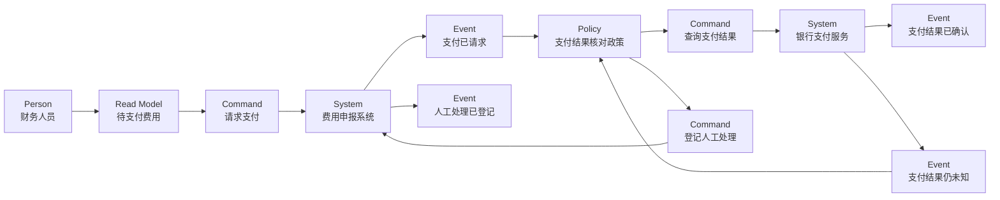

# G008 Batch 7 EventStorming Implementation Plan

> **For agentic workers:** REQUIRED SUB-SKILL: Use superpowers:subagent-driven-development (recommended) or superpowers:executing-plans to implement this plan task-by-task. Steps use checkbox (`- [ ]`) syntax for tracking.

**Goal:** Publish MOD-09 as an evidence-bounded EventStorming guide using a Big Picture, a narrow Process Model and a candidate-boundary ledger, then deploy and close only MOD-09.

**Architecture:** One original expense-claim workshop runs from a Big Picture timeline into a focused “approved to payment result” Process Model, then records boundary signals as hypotheses instead of architecture conclusions. The article uses one Mermaid and two Markdown tables, adds five governed sources and reciprocal links to MOD-05/MOD-08, while MOD-02 remains authoritative for the system boundary and the external name “银行支付服务”.

**Tech Stack:** Docusaurus MDX, Mermaid `flowchart`, Markdown tables, Node.js 26.5.0, `node:test`, generated JSON, governed source ledger and committed link-health cache, GitHub Pages.

## Global Constraints

- Work only in `/Users/seal/projects/tego-arch/.worktrees/g008-modeling-batch7` on `codex/g008-modeling-batch7`.
- Use `PATH=/Users/seal/.volta/tools/image/node/26.5.0/bin:$PATH` for every Node/npm command; do not use Node 20.
- Publish only MOD-09; MOD-10..13 remain pending and have no actionable article links.
- MOD-02 is authoritative for the expense-claim system boundary and the exact external name “银行支付服务”.
- Do not add dependencies, Draw.io, SVG, raster images, or `data/topic-relations.json` overrides.
- Use exactly one Mermaid Process Model and exactly two horizontally scrollable Markdown tables.
- Treat pivotal events, swimlanes, hotspots, Persons and workshop order as signals, not proofs of contexts, teams, services, owners or runtime order.
- Register exactly five new governed source identities; the Avanscoperta EventStorming overview is the only MOD-09 `manifest_primary: true` citation.
- Use `facts-summary` only; do not copy or adapt source prose, diagrams, templates, examples or sticky-note layouts.
- Stage A projection is `47 / 90 / 481`, with MOD-09 published/pending and next MOD-09.
- Stage B projection is `48 / 90 / 481`, durable stories `7 / 20`, current G008, next MOD-10.
- Preserve every G008 Batch 6 and older SHA, run, count, observation and historical paragraph byte-for-byte.

---

### Task 1: Build the MOD-09 article and mutation-sensitive workshop contract

**Files:**
- Create: `content/modeling/mod-09-eventstorming.mdx`
- Create: `tests/g008-batch7-content.test.mjs`

**Interfaces:**
- Consumes: MOD-02 system/name authority, MOD-05 expense-claim scenario, MOD-08 payment-result evidence boundary and `handleHorizontalArrowKey`.
- Produces: a published MOD-09 body whose metadata, headings, Big Picture rows, Process Model, candidate-boundary rows, wrappers and non-proof rules can be governed independently.

- [ ] **Step 1: Write the failing metadata and heading contract**

Create `tests/g008-batch7-content.test.mjs` using `readContentDocuments` from `../scripts/content-metadata.mjs` and select `modeling/mod-09-eventstorming.mdx`. Require this exact metadata and H2 sequence:

```js
assert.equal(document.metadata.topic_id, 'MOD-09');
assert.equal(document.metadata.slug, '/modeling/mod-09');
assert.equal(document.metadata.content_type, 'modeling');
assert.equal(document.metadata.status, 'reviewed');
assert.equal(document.metadata.priority, 'P1');
assert.deepEqual(document.metadata.depends_on, ['MOD-01', 'MOD-02']);
assert.deepEqual(document.metadata.adjacent_topics, ['MOD-05', 'MOD-08']);
assert.deepEqual(document.metadata.related_cases, [
  '/cases/temporal-saga-durable-execution',
]);
assert.deepEqual(document.metadata.related_questions, []);
assert.deepEqual(
  document.headings.filter(({level}) => level === 2).map(({text}) => text),
  [
    '学习问题',
    '建模目标与输入',
    '参与者与步骤',
    '模型产物',
    '完成判断',
    '常见失败',
    '与其他模型的衔接',
    '完整演练',
    '来源',
  ],
);
```

Expected: RED because MOD-09 does not exist.

- [ ] **Step 2: Add the failing Big Picture table contract**

Parse the first Markdown table into records with the exact keys `领域事件 / 事件来源或权威记录 / 关键转折候选 / 热点 / 未知项`. Require exactly these eight past-tense events in this order:

```js
const expectedBigPictureEvents = [
  '费用已提交',
  '费用已审批',
  '财务复核已完成',
  '支付已请求',
  '支付结果已确认',
  '支付结果仍未知',
  '支付对账已完成',
  '人工处理已登记',
];
```

Deep-compare these complete records:

```js
const expectedBigPictureRows = [
  {
    '领域事件': '费用已提交',
    '事件来源或权威记录': '费用申报记录',
    '关键转折候选': '否：仍处于申报准备阶段',
    '热点': '票据或政策信息可能不完整',
    '未知项': '由谁确认补件完成',
  },
  {
    '领域事件': '费用已审批',
    '事件来源或权威记录': '审批决定记录',
    '关键转折候选': '是：进入财务复核',
    '热点': '加签、越级与撤回规则存在分歧',
    '未知项': '审批撤回后哪些事实仍然有效',
  },
  {
    '领域事件': '财务复核已完成',
    '事件来源或权威记录': '财务复核记录',
    '关键转折候选': '是：费用具备支付条件',
    '热点': '财务政策与审批结论可能冲突',
    '未知项': '冲突时由哪条记录裁定',
  },
  {
    '领域事件': '支付已请求',
    '事件来源或权威记录': '费用申报系统的支付请求记录',
    '关键转折候选': '是：进入外部效果阶段',
    '热点': '重复请求、超时与幂等身份',
    '未知项': '银行支付服务是否已经接受请求',
  },
  {
    '领域事件': '支付结果已确认',
    '事件来源或权威记录': '银行支付服务回执与本地核对记录',
    '关键转折候选': '是：正常路径收束',
    '热点': '外部回执与费用申报的身份映射',
    '未知项': '该确认是否已经满足业务终态条件',
  },
  {
    '领域事件': '支付结果仍未知',
    '事件来源或权威记录': '超时记录与缺失回执证据',
    '关键转折候选': '是：进入异常恢复',
    '热点': '重试、取消与对账顺序',
    '未知项': '外部支付效果是否已经发生',
  },
  {
    '领域事件': '支付对账已完成',
    '事件来源或权威记录': '银行支付服务查询结果与对账记录',
    '关键转折候选': '是：重新获得权威结果',
    '热点': '回执、查询与本地记录可能冲突',
    '未知项': '冲突记录的更正由谁批准',
  },
  {
    '领域事件': '人工处理已登记',
    '事件来源或权威记录': '持久人工处理记录',
    '关键转折候选': '是：进入人工收敛路径',
    '热点': '处理 owner、证据和 disposition',
    '未知项': '谁有权限确认最终业务结论',
  },
];
```

These values keep submission/approval/finance records scoped to their own events, require the external “银行支付服务” receipt or query result for payment-result claims, retain unknown result as a hotspot rather than a failure, and prevent manual registration from proving payment outcome.

- [ ] **Step 3: Add the failing Process Model graph contract**

Extract one and only one `flowchart LR` Mermaid fence. Parse typed node declarations and directed edges into order-independent sorted sets. Require these exact nodes:

```js
const expectedProcessNodes = [
  {id: 'finance_person', type: 'Person', label: '财务人员'},
  {id: 'pending_read_model', type: 'Read Model', label: '待支付费用'},
  {id: 'request_payment', type: 'Command', label: '请求支付'},
  {id: 'expense_system', type: 'System', label: '费用申报系统'},
  {id: 'payment_requested', type: 'Event', label: '支付已请求'},
  {id: 'payment_result_policy', type: 'Policy', label: '支付结果核对政策'},
  {id: 'query_payment', type: 'Command', label: '查询支付结果'},
  {id: 'bank_payment_service', type: 'System', label: '银行支付服务'},
  {id: 'payment_confirmed', type: 'Event', label: '支付结果已确认'},
  {id: 'payment_unknown', type: 'Event', label: '支付结果仍未知'},
  {id: 'register_manual', type: 'Command', label: '登记人工处理'},
  {id: 'manual_registered', type: 'Event', label: '人工处理已登记'},
];
```

Require these exact directed edges and reject duplicate/undeclared endpoints:

```js
const expectedProcessEdges = [
  'finance_person->pending_read_model',
  'pending_read_model->request_payment',
  'request_payment->expense_system',
  'expense_system->payment_requested',
  'payment_requested->payment_result_policy',
  'payment_result_policy->query_payment',
  'query_payment->bank_payment_service',
  'bank_payment_service->payment_confirmed',
  'bank_payment_service->payment_unknown',
  'payment_unknown->payment_result_policy',
  'payment_result_policy->register_manual',
  'register_manual->expense_system',
  'expense_system->manual_registered',
];
```

The MDX Mermaid body must encode the type and label in every node so the parser can validate both dimensions:



- [ ] **Step 4: Add the failing candidate-boundary table contract**

Parse the second Markdown table with exact keys `观察到的信号 / 候选边界假设 / 替代解释 / 仍需的证据 / 当前处置`. Require exactly five signals:

```js
const expectedBoundarySignals = [
  '审批与支付使用不同结果语言',
  '银行支付服务具有独立契约与变更节奏',
  '费用申报记录与支付结果由不同权威记录裁定',
  '人工处理跨越财务判断与技术排障',
  '审批政策与支付核对政策的变化节奏不同',
];
```

Deep-compare these complete records:

```js
const expectedBoundaryRows = [
  {
    '观察到的信号': '审批与支付使用不同结果语言',
    '候选边界假设': '审批判断与支付执行可能属于不同业务边界',
    '替代解释': '它们也可能只是同一费用生命周期的不同阶段',
    '仍需的证据': '术语 owner、规则变更历史与跨阶段不变量',
    '当前处置': '交给 MOD-11',
  },
  {
    '观察到的信号': '银行支付服务具有独立契约与变更节奏',
    '候选边界假设': '外部支付集成需要明确的翻译与隔离边界',
    '替代解释': '它也可能只是技术适配器，而非新的业务边界',
    '仍需的证据': '契约所有权、版本策略、失败语义与变更记录',
    '当前处置': '下一轮验证',
  },
  {
    '观察到的信号': '费用申报记录与支付结果由不同权威记录裁定',
    '候选边界假设': '申报事实与支付结果可能需要分离的权威边界',
    '替代解释': '它们也可能是同一边界内的权威记录与投影视图',
    '仍需的证据': '数据 owner、更正规则、审计责任与一致性需求',
    '当前处置': '保留假设',
  },
  {
    '观察到的信号': '人工处理跨越财务判断与技术排障',
    '候选边界假设': '异常处理可能形成独立协作能力',
    '替代解释': '它也可能只是低频运营升级路径',
    '仍需的证据': '发生频率、稳定规则、持久 owner 与独立目标',
    '当前处置': '不作为边界证据',
  },
  {
    '观察到的信号': '审批政策与支付核对政策的变化节奏不同',
    '候选边界假设': '两类政策可能需要分别演进',
    '替代解释': '它们也可能由同一 owner 通过配置独立调整',
    '仍需的证据': '变更历史、发布耦合、规则 owner 与共同不变量',
    '当前处置': '下一轮验证',
  },
];
```

Require dispositions from the closed set `保留假设 / 下一轮验证 / 交给 MOD-11 / 不作为边界证据` and reject empty alternatives or evidence.

- [ ] **Step 5: Verify RED**

```bash
PATH=/Users/seal/.volta/tools/image/node/26.5.0/bin:$PATH \
  node --test tests/g008-batch7-content.test.mjs
```

Expected: FAIL because MOD-09 is absent.

- [ ] **Step 6: Write the minimal complete MOD-09 article**

Create exact front matter from Step 1 with `analyzed_at: 2026-08-03`, `source_cutoff: 2026-08-03`, `review_policy: quarterly-version-sensitive`, `confidence: high`, domains `software-architecture` and `domain-modeling`, and tags `EventStorming / Big Picture / Process Modelling / 边界假设`.

Import:

```mdx
import {handleHorizontalArrowKey} from '@site/src/components/KeyboardScrollableRegion/handleHorizontalArrowKey.mjs';
```

Wrap the Mermaid in `diagram-wrapper` and both tables in `table-wrapper table-wrapper--mapping`, each with `role="region"`, unique Chinese `aria-label`, `tabIndex={0}` and `onKeyDown={handleHorizontalArrowKey}`. State before/after the graph that it cannot prove runtime order, sync/async protocol, transaction boundary, service boundary or organizational owner.

State these exact non-proof sentences in `## 完成判断`:

```text
pivotal event 不等于 Bounded Context。
swimlane 不等于团队、系统或服务。
hotspot 不等于 backlog item、服务或已批准决策。
Person 不等于长期 owner。
工作坊排列顺序不等于运行时调用顺序。
一次 EventStorming 工作坊不能单独确认正式边界，候选关系仍须在 MOD-11 或等价架构活动中验证。
```

Use `Person`, not `Actor`, when describing the Brandolini Process Modelling grammar. Call Big Picture, Process Modelling and Software Design “工作坊格式”, never formal “层级”.

- [ ] **Step 7: Add accessibility and mutation tests**

Require exactly three wrappers, unique labels and the exact keyboard handler. Directly test `handleHorizontalArrowKey`: a focused overflowing region moves by 40 pixels; a non-overflowing region remains unchanged. Add controlled mutations that remove/reorder an H2, remove/duplicate a table, change one table header, change/remove one event row, change/remove one node type, reverse/remove one edge, remove a candidate alternative, use an invalid disposition, remove `tabIndex`, remove `onKeyDown`, replace `Person` with `Actor`, or weaken each non-proof sentence. Every mutation must throw.

- [ ] **Step 8: Run Task 1 verification and commit**

```bash
PATH=/Users/seal/.volta/tools/image/node/26.5.0/bin:$PATH \
  node --test tests/g008-batch7-content.test.mjs
PATH=/Users/seal/.volta/tools/image/node/26.5.0/bin:$PATH npm run typecheck
git diff --check
git add content/modeling/mod-09-eventstorming.mdx \
  tests/g008-batch7-content.test.mjs
git commit -m "docs: add mod09 eventstorming"
```

Expected: focused tests and typecheck pass; commit contains only the article and focused test.

---

### Task 2: Govern sources, reciprocal relations and the Stage A projection

**Files:**
- Modify: `tests/g008-batch7-content.test.mjs`
- Modify: `data/source-ledger.json`
- Modify: `data/source-link-health.json` only through the checker
- Modify: `content/modeling/mod-05-conceptual-logical-physical-data-model.mdx`
- Modify: `content/modeling/mod-08-state-machine-modeling.mdx`
- Modify: `scripts/content-schema.mjs`
- Modify: `tests/content-validation.test.mjs`
- Modify: `tests/g008-batch6-content.test.mjs`
- Modify: `tests/g008-batch2-deployment.test.mjs`
- Modify: `tests/g008-batch3-deployment.test.mjs`
- Modify: generated JSON under `src/generated/`

**Interfaces:**
- Consumes: Task 1 article and its structural contract.
- Produces: five governed living-page sources, reciprocal MOD-05/MOD-08 relations, a topic-specific nine-H2 schema and Stage A `47 / 90 / 481`.

- [ ] **Step 1: Add the failing exact source-review contract**

Require these deterministic URL-derived source identities:

```js
const expectedSources = new Map([
  ['src-docs-9a4e9ce7f01b', 'https://www.avanscoperta.it/en/eventstorming/'],
  ['src-docs-28997e2e106b', 'https://medium.com/@ziobrando/collaborative-process-modelling-with-eventstorming-17ed363650c0'],
  ['src-docs-5b4206bf06fe', 'https://www.avanscoperta.it/en/eventstorming/pivotal-events/'],
  ['src-docs-fc6e554f1153', 'https://www.avanscoperta.it/en/context-mapping/'],
  ['src-docs-ce27d09ce1e2', 'https://www.eventstorming.com/patterns/chaotic-exploration/'],
]);
```

Require a `documents["content/modeling/mod-09-eventstorming.mdx"]` review dated `2026-08-03`, the four standard copyright checks, exactly five citations, `facts-summary`, null modification/excerpt, `quotation_reviewed: false`, and only `src-docs-9a4e9ce7f01b` as `manifest_primary: true`.

- [ ] **Step 2: Add the five exact source records and citation review**

For each source set `canonical_locator`, `transport_locator` and `expected_final_transport_locator` to the exact URL in Step 1; use `query_insensitive: false`, empty aliases, null tombstone/published date, `registered_at` and `checked_at` `2026-08-03`, `version: "Living page retrieved 2026-08-03"`, `tier: "primary"`, `license: "LicenseRef-All-Rights-Reserved"`, `copyright_policy: "facts-and-short-quotation"`, `license_family_grouping: "identity"`, null family grouping evidence, `link_policy: "floating"`, approval date `2026-08-03` and note `Initial reviewed EventStorming teaching-source transport baseline`.

Use these exact per-source governance values:

```js
const sourceDefinitions = [
  {
    id: 'src-docs-9a4e9ce7f01b',
    title: 'EventStorming',
    author_or_org: 'Avanscoperta',
    source_kind: 'official-docs',
    roles: ['definition', 'method', 'learning'],
    boundary: 'Supports the three EventStorming workshop formats, collaborative purpose and reviewed artifact vocabulary; it does not prove local boundaries, teams, services or production behavior.',
  },
  {
    id: 'src-docs-28997e2e106b',
    title: 'Collaborative Process Modelling with EventStorming',
    author_or_org: 'Alberto Brandolini',
    source_kind: 'engineering-blog',
    roles: ['definition', 'method', 'learning'],
    boundary: 'Supports the reviewed Process Modelling grammar of Person, System, Command, Policy, Read Model and Event; it does not define this article’s expense-claim example or architecture.',
  },
  {
    id: 'src-docs-5b4206bf06fe',
    title: 'Pivotal Events',
    author_or_org: 'Avanscoperta',
    source_kind: 'official-docs',
    roles: ['definition', 'method'],
    boundary: 'Supports reviewed pivotal-event, timeline and swimlane discussion signals; it does not make a pivotal event or swimlane a context, team, system or service.',
  },
  {
    id: 'src-docs-fc6e554f1153',
    title: 'Context Mapping',
    author_or_org: 'Avanscoperta',
    source_kind: 'official-docs',
    roles: ['definition', 'method'],
    boundary: 'Supports the reviewed warning that boundary indicators are not bulletproof and require architecture judgment; it does not approve the article’s candidate boundaries.',
  },
  {
    id: 'src-docs-ce27d09ce1e2',
    title: 'Chaotic Exploration',
    author_or_org: 'EventStorming',
    source_kind: 'official-docs',
    roles: ['method', 'learning'],
    boundary: 'Supports independent event exploration followed by collaborative organization; it does not license copying its prose, examples, diagrams, templates or layouts.',
  },
];
```

For each record use the canonical URL as `license_evidence_url` and `license_family_id`. Set `license_scope` to `Facts summarized from the named page only; page text, diagrams, templates, examples, sticky-note layouts, trademarks, linked works and third-party assets are excluded.` Set `license_evidence_note` to identify the named page, checked URL and that no open content license was found on 2026-08-03. Use the same roles in the citation, with attribution notes `EventStorming, Avanscoperta`; `Collaborative Process Modelling with EventStorming, Alberto Brandolini`; `Pivotal Events, Avanscoperta`; `Context Mapping, Avanscoperta`; and `Chaotic Exploration, EventStorming`.

- [ ] **Step 3: Refresh and validate link health**

```bash
PATH=/Users/seal/.volta/tools/image/node/26.5.0/bin:$PATH npm run refresh:links
PATH=/Users/seal/.volta/tools/image/node/26.5.0/bin:$PATH npm run check:links
```

Preserve real attempt history. If an external origin fails under Node but succeeds through independently verified transport, use only `checkSourceLink`'s `fetchImpl` injection plus `mergeLinkHealthCaches`; never hand-write a successful attempt.

- [ ] **Step 4: Add reciprocal relationship tests and content**

Require MOD-09 visible links to `/modeling`, `/modeling/mod-01`, `/modeling/mod-02`, `/modeling/mod-05`, `/modeling/mod-08` and `/cases/temporal-saga-durable-execution`. Require zero `/modeling/mod-10` and `/modeling/mod-11` actionable links.

Add MOD-09 to MOD-05 and MOD-08 `adjacent_topics`; add one visible `/modeling/mod-09` link to each. In MOD-08 replace “MOD-09 尚未发布，本页不建立链接” with the reciprocal handoff. Update `tests/g008-batch6-content.test.mjs` so its historical MOD-08 semantics remain locked while its current reciprocal relation expects published MOD-09. Do not change other paragraphs or add relation overrides.

- [ ] **Step 5: Register and test the exact MOD-09 heading schema**

Add:

```js
export const mod09ModelingHeadings = [
  '## 学习问题',
  '## 建模目标与输入',
  '## 参与者与步骤',
  '## 模型产物',
  '## 完成判断',
  '## 常见失败',
  '## 与其他模型的衔接',
  '## 完整演练',
  '## 来源',
];
```

Extend `knowledgeHeadingContract` with `type === 'modeling' && topicId === 'MOD-09'`. In `tests/content-validation.test.mjs`, add one fixture that accepts this exact order and controlled fixtures that reject one missing heading and one swapped heading. Leave MOD-08 and the default modeling contract unchanged.

- [ ] **Step 6: Generate and lock Stage A**

```bash
PATH=/Users/seal/.volta/tools/image/node/26.5.0/bin:$PATH npm run generate:content
```

Require:

```js
assert.deepEqual(projectStatus, {
  schema_version: 1,
  durable_stories: {completed: 7, total: 20, current: 'G008'},
  completed_topics: 47,
  content_documents: 90,
  governed_sources: 481,
  sources: {
    durable_stories: 'docs/content-backlog.md',
    completed_topics: 'docs/content-backlog.md',
    content_documents: 'content/**/*.{md,mdx}',
    governed_sources: 'data/source-ledger.json',
  },
});
assert.equal(topicsById.get('MOD-09').published, true);
assert.equal(topicsById.get('MOD-09').status.value, 'pending');
assert.equal(topicsById.get('MOD-10').published, false);
assert.equal(topicsById.get('MOD-10').status.value, 'pending');
```

Update `tests/g008-batch2-deployment.test.mjs` and `tests/g008-batch3-deployment.test.mjs` only where their current-baseline prefix/next-topic assertions became stale. Never change Batch 6 or older historical SHA/run/count literals.

- [ ] **Step 7: Verify, review and commit Task 2**

```bash
PATH=/Users/seal/.volta/tools/image/node/26.5.0/bin:$PATH \
  node --test tests/g008-batch7-content.test.mjs \
  tests/g008-batch6-content.test.mjs tests/content-validation.test.mjs \
  tests/project-status.test.mjs
PATH=/Users/seal/.volta/tools/image/node/26.5.0/bin:$PATH npm run validate:content
PATH=/Users/seal/.volta/tools/image/node/26.5.0/bin:$PATH npm run check:content
PATH=/Users/seal/.volta/tools/image/node/26.5.0/bin:$PATH npm run check:links
git diff --check
```

Inspect `git diff --name-only`, stage only Task 2 files, then commit:

```bash
git add content/modeling/mod-05-conceptual-logical-physical-data-model.mdx \
  content/modeling/mod-08-state-machine-modeling.mdx \
  content/modeling/mod-09-eventstorming.mdx data/source-ledger.json \
  data/source-link-health.json scripts/content-schema.mjs src/generated \
  tests/content-validation.test.mjs tests/g008-batch2-deployment.test.mjs \
  tests/g008-batch3-deployment.test.mjs tests/g008-batch6-content.test.mjs \
  tests/g008-batch7-content.test.mjs
git commit -m "docs: govern mod09 sources and relations"
```

Expected: targeted validation passes and a fresh review approves source/copyright boundaries, reciprocal relations, live-vs-historical assertions and mutation strength.

---

### Task 3: Verify, independently review and publish Stage A

**Files:**
- Modify only for review findings: Task 1–2 files
- Create ignored: `.superpowers/sdd/task-3-stagea-report.md`

**Interfaces:**
- Consumes: committed Stage A `47 / 90 / 481`.
- Produces: one exact Stage A SHA on feature, local main, origin feature and origin/main, plus a successful exact-head Pages run.

- [ ] **Step 1: Run targeted and full verification**

```bash
PATH=/Users/seal/.volta/tools/image/node/26.5.0/bin:$PATH \
  node --test tests/g008-batch7-content.test.mjs \
  tests/content-validation.test.mjs tests/project-status.test.mjs
PATH=/Users/seal/.volta/tools/image/node/26.5.0/bin:$PATH npm run verify
git diff --check
git status --short
```

Record exact test pass/total, 90 content documents, 481 governed sources and all warnings.

- [ ] **Step 2: Run independent cumulative review**

Review design commit `b05627e` through current HEAD with separate judgments for workshop semantics, MOD-02 authority, visual/accessibility contracts, source/copyright governance, test/mutation quality, historical evidence safety and architecture. Fix every Important or Critical finding, rerun full verify and commit each narrow repair.

- [ ] **Step 3: Publish exact Stage A**

```bash
git push origin codex/g008-modeling-batch7
```

In `/Users/seal/projects/tego-arch`, confirm the only status entry is preserved `?? .codex/config.toml`, then:

```bash
git merge --ff-only codex/g008-modeling-batch7
git push origin main
```

Require feature HEAD, origin feature, local main and origin/main to equal the same 40-character SHA.

- [ ] **Step 4: Wait for the exact Pages run**

Find the `Verify and deploy Docusaurus to GitHub Pages` run whose `headSha` equals Stage A HEAD. Store its numeric ID in `G008_B7_STAGE_A_RUN_ID`, watch with `gh run watch "$G008_B7_STAGE_A_RUN_ID" --exit-status`, then require `status=completed`, `conclusion=success`, exact workflow and exact head SHA. Record the run URL.

---

### Task 4: Execute exact production browser QA

**Files:**
- Create ignored: `.superpowers/sdd/task-4-final-browser-qa.json`
- Create ignored: `.superpowers/sdd/task-4-report.md`

**Interfaces:**
- Consumes: exact Stage A SHA/run and deployed MOD-09.
- Produces: immutable measured browser evidence and its SHA-256 for Stage B.

- [ ] **Step 1: Verify the exact nine canonical routes**

Require HTTP 200 for:

```text
/
/modeling
/modeling/mod-01
/modeling/mod-02
/modeling/mod-05
/modeling/mod-08
/modeling/mod-09
/cases/temporal-saga-durable-execution
/references
```

- [ ] **Step 2: Verify desktop `1440x1000` and mobile `390x844`**

Use fresh browser tabs per viewport. At each exact viewport store title/H1, nine H2 strings, one Mermaid region/SVG, two Markdown tables, eight Big Picture rows, five boundary rows, zero document overflow, wrapper client/scroll widths, role, aria label and tab index. Press ArrowLeft/ArrowRight only after verifying a unique focused wrapper; require a 40-pixel movement where overflow exists and no movement when already at a boundary or no overflow exists.

- [ ] **Step 3: Activate every source and relationship**

At each viewport click all five MOD-09 source links and all six MOD-09 outbound relations. On MOD-05 and MOD-08 activate the reciprocal MOD-09 backlink at each viewport. Expected totals: 10 source activations and 16 relation activations. Record before URL, clicked href/name, interaction method and landed URL for every activation.

- [ ] **Step 4: Record forbidden publication and diagnostics**

Require zero MOD-10 article links and zero MOD-11 actionable article links. Store a closed-world operator target ledger proving no action targeted `/modeling/mod-10`. Collect fresh diagnostics from each viewport tab and require console warnings/errors/page errors `0/0/0`.

- [ ] **Step 5: Freeze and independently review evidence**

Write all measured values to `.superpowers/sdd/task-4-final-browser-qa.json`, compute its SHA-256 with `shasum -a 256`, copy equal counts to `.superpowers/sdd/task-4-report.md`, and have a fresh verifier compare every artifact key against this plan. Task 4 passes only with exact line `Task 4 production QA — PASS` and zero Important/Critical findings.

---

### Task 5: Record Stage B closure and deploy the final state

**Files:**
- Create: `docs/reviews/g008-batch7.md`
- Create: `tests/g008-batch7-deployment.test.mjs`
- Modify: `docs/content-backlog.md`
- Modify: `tests/g008-batch2-deployment.test.mjs`
- Modify: `tests/g008-batch3-deployment.test.mjs`
- Modify: generated JSON under `src/generated/`

**Interfaces:**
- Consumes: exact Stage A SHA, exact numeric Pages run, exact Stage A verify count, Task 4 artifact hash and measured QA counts.
- Produces: immutable Batch 7 evidence and Stage B `48 / 90 / 481`, current G008, next MOD-10.

- [ ] **Step 1: Write and prove the failing deployment contract**

Copy structural I/O and history helpers from `tests/g008-batch6-deployment.test.mjs`. Before the first run, paste the measured 40-character Stage A SHA, numeric Pages run, repository test count and 64-character QA artifact SHA as literals. Reject symbolic tokens with:

```js
assert.doesNotMatch(
  review,
  /ACTUAL_|STAGE_A_SHA|RUN_ID|TEST_COUNT|ARTIFACT_SHA|<[^>]+>/u,
);
```

Require exact review sections `Stage A identity / Verification / Independent review / Production smoke / Stage B projection / Final PASS`, exact measured Task 4 counts, and a SHA-256 guard over the complete Batch 6-and-older baseline suffix.

```bash
PATH=/Users/seal/.volta/tools/image/node/26.5.0/bin:$PATH \
  node --test tests/g008-batch7-deployment.test.mjs
```

Expected: RED because the Batch 7 review/backlog closure is absent and MOD-09 is pending.

- [ ] **Step 2: Create the exact release review and backlog segment**

Create `docs/reviews/g008-batch7.md` from measured values only. Prepend one `2026-08-03 G008 Batch 7 已完成 MOD-09` segment to the current baseline, preserve the entire Batch 6-and-older suffix byte-for-byte, and change only MOD-09 from `[ ]` to `[x]`.

The new segment and review must say Stage A `47 / 90 / 481`, Stage B `48 / 90 / 481`, durable `7 / 20`, G008 current, MOD-10 next, nine routes, the two exact viewports, one Mermaid, two tables, eight Big Picture rows, five boundary rows, `10/10` source activations, `16/16` relation activations, MOD-10 target `0`, diagnostics `0/0/0`, the exact artifact hash and `Stage B closure — PASS`.

- [ ] **Step 3: Generate Stage B and update only live assertions**

```bash
PATH=/Users/seal/.volta/tools/image/node/26.5.0/bin:$PATH npm run generate:content
```

Require exact project status:

```js
{
  schema_version: 1,
  durable_stories: {completed: 7, total: 20, current: 'G008'},
  completed_topics: 48,
  content_documents: 90,
  governed_sources: 481,
  sources: {
    durable_stories: 'docs/content-backlog.md',
    completed_topics: 'docs/content-backlog.md',
    content_documents: 'content/**/*.{md,mdx}',
    governed_sources: 'data/source-ledger.json',
  },
}
```

Require MOD-09 complete, MOD-10..13 pending, current G008 and next MOD-10. Add controlled mutations for every review/backlog literal, duplicate/missing evidence, MOD-09-only closure and each status/count. Update older tests only where current baseline/next-topic assertions are proven stale; never rewrite historical literals.

- [ ] **Step 4: Verify, independently review and commit Stage B**

```bash
PATH=/Users/seal/.volta/tools/image/node/26.5.0/bin:$PATH \
  node --test tests/g008-batch7-content.test.mjs \
  tests/g008-batch7-deployment.test.mjs tests/project-status.test.mjs \
  tests/g008-batch6-deployment.test.mjs
PATH=/Users/seal/.volta/tools/image/node/26.5.0/bin:$PATH npm run verify
git diff --check
```

Run a fresh cumulative review from `b05627e` through HEAD. Repair every Important/Critical finding, rerun full verify, inspect staged paths, then:

```bash
git add docs/content-backlog.md docs/reviews/g008-batch7.md \
  src/generated tests/g008-batch2-deployment.test.mjs \
  tests/g008-batch3-deployment.test.mjs \
  tests/g008-batch7-deployment.test.mjs
git commit -m "docs: close g008 batch7 eventstorming"
git push origin codex/g008-modeling-batch7
```

- [ ] **Step 5: Fast-forward main and verify final deployment**

Fast-forward local main, push origin/main, wait for the exact final Pages run and require completed/success at final HEAD. Recheck the nine routes and `/modeling`: MOD-09 must be linked/complete; MOD-10 must remain unlinked/planned.

---

### Task 6: Run final consistency audit and deliver

**Files:**
- No intended tracked changes

**Interfaces:**
- Consumes: verified final Stage B SHA/run.
- Produces: synchronized refs, clean feature worktree, preserved user files and concise delivery evidence.

- [ ] **Step 1: Run fresh committed-HEAD verification**

```bash
PATH=/Users/seal/.volta/tools/image/node/26.5.0/bin:$PATH npm run verify
git diff --check b05627e..HEAD
```

Record exact tests, 90 content documents, 481 governed sources and warnings.

- [ ] **Step 2: Verify refs, deployment and status**

Require feature HEAD, origin feature, local main and freshly fetched origin/main to equal the final SHA. Require the feature worktree clean and the main checkout to contain only preserved `?? .codex/config.toml`. Verify the final Pages exact workflow/head/status, nine HTTP routes, linked complete MOD-09 and unlinked planned MOD-10.

- [ ] **Step 3: Deliver exact evidence**

Report final SHA/run, full verify count, `48 / 90 / 481`, durable `7 / 20`, current G008, next MOD-10, exact viewport/source/relation/diagnostic totals, Task 4 artifact hash, independent review result and any warning gap. Preserve the feature worktree and branch.
