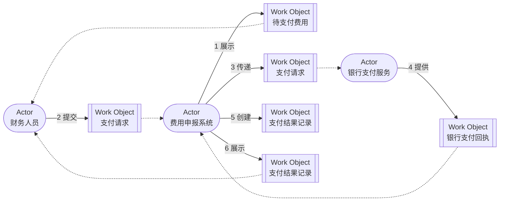

# G008 Batch 8 Domain Storytelling Implementation Plan

> **For agentic workers:** REQUIRED SUB-SKILL: Use superpowers:subagent-driven-development (recommended) or superpowers:executing-plans to implement this plan task-by-task. Steps use checkbox (`- [ ]`) syntax for tracking.

**Goal:** Publish MOD-10 as an evidence-bounded Domain Storytelling guide built around one digitalized as-is expense-payment story, compare it precisely with process diagrams, use cases and EventStorming, then deploy and close only MOD-10.

**Architecture:** One original six-sentence Domain Story reuses three actors across six activity-specific work-object instances, while a sentence table is the accessible semantic equivalent and a four-row comparison table prevents false model equivalence. The article adds four governed CC BY 4.0 Domain Storytelling sources, reciprocal MOD-08/MOD-09 links, the existing Temporal Saga case as its bounded terminal relation, and a dedicated nine-heading schema; MOD-02 remains authoritative for the system boundary and “银行支付服务”, and MOD-11 stays unpublished and unlinked. MOD-09 is included in MOD-10 `adjacent_topics` to satisfy the existing reciprocal manifest contract; the terminal case satisfies the existing related-case-or-question OR gate without adding execution semantics to the Domain Story.

**Tech Stack:** Docusaurus MDX, Mermaid `flowchart`, Markdown tables, Node.js 26.5.0, `node:test`, generated JSON, governed source ledger and committed link-health cache, GitHub Pages.

## Global Constraints

- Work only in `/Users/seal/projects/tego-arch/.worktrees/g008-modeling-batch8` on `codex/g008-modeling-batch8`.
- Use `PATH=/Users/seal/.volta/tools/image/node/26.5.0/bin:$PATH` for every Node/npm command; do not use Node 20.
- Publish only MOD-10; MOD-11..13 remain pending and have no actionable article links.
- MOD-02 is authoritative for the expense-claim system boundary and the exact external name “银行支付服务”.
- MOD-08 is authoritative for the payment-result evidence boundary: local request, timeout or manual records do not replace a bank receipt or query result.
- Do not add dependencies, Draw.io, SVG, raster images, third-party icons or `data/topic-relations.json` overrides.
- Use exactly one original Mermaid Domain Story and exactly two horizontally scrollable Markdown tables.
- The Mermaid contains exactly three actor declarations, six activity-specific work-object instances covering four work-object categories, six numbered activity edges and five collaborator edges.
- Treat actors, work objects, activity arrows, sequence numbers and annotations as story evidence, not proofs of teams, owners, APIs, storage, runtime calls, transactions, formal branches or contexts.
- Register exactly four new Domain Storytelling source identities; the Quick-Start Guide is the only MOD-10 `manifest_primary: true` citation.
- Govern the four pages as `CC-BY-4.0` / `adapt-with-attribution`, but use `facts-summary` only; do not copy or adapt source prose, diagrams, templates, icons, cases or layouts.
- Stage A projection is `48 / 91 / 485`, with MOD-10 published/pending and next MOD-10.
- Stage B projection is `49 / 91 / 485`, durable stories `7 / 20`, current G008, next MOD-11.
- Preserve every G008 Batch 7 and older SHA, run, count, observation and historical paragraph byte-for-byte.
- Preserve the root checkout’s existing untracked `.codex/config.toml` without modifying, staging or committing it.

---

### Task 1: Build the MOD-10 article and mutation-sensitive Domain Story contract

**Files:**
- Create: `content/modeling/mod-10-domain-storytelling.mdx`
- Create: `tests/g008-batch8-content.test.mjs`

**Interfaces:**
- Consumes: MOD-02 system/name authority, MOD-08 payment-result evidence boundary, MOD-09 comparison boundary and `handleHorizontalArrowKey`.
- Produces: a published MOD-10 body whose metadata, headings, story graph, sentence rows, comparison rows, wrappers, workshop flow and non-proof rules can be governed independently.

- [ ] **Step 1: Write the failing metadata and heading contract**

Create `tests/g008-batch8-content.test.mjs` using `readContentDocuments` from `../scripts/content-metadata.mjs`, then select `modeling/mod-10-domain-storytelling.mdx`. Require this exact metadata and H2 sequence:

```js
assert.equal(document.metadata.topic_id, 'MOD-10');
assert.equal(document.metadata.slug, '/modeling/mod-10');
assert.equal(document.metadata.content_type, 'modeling');
assert.equal(document.metadata.status, 'reviewed');
assert.equal(document.metadata.priority, 'P1');
assert.equal(document.metadata.analyzed_at, '2026-08-04');
assert.equal(document.metadata.source_cutoff, '2026-08-04');
assert.equal(document.metadata.review_policy, 'quarterly-version-sensitive');
assert.equal(document.metadata.confidence, 'high');
assert.deepEqual(document.metadata.domains, ['software-architecture', 'domain-modeling']);
assert.deepEqual(document.metadata.tags, [
  'Domain Storytelling',
  '领域协作',
  '业务流程',
  '模型比较',
]);
assert.deepEqual(document.metadata.depends_on, ['MOD-01', 'MOD-02', 'MOD-09']);
assert.deepEqual(document.metadata.adjacent_topics, ['MOD-08', 'MOD-09']);
assert.deepEqual(document.metadata.related_cases, ['/cases/temporal-saga-durable-execution']);
assert.deepEqual(document.metadata.related_questions, []);
assert.deepEqual(
  document.headings.filter(({level}) => level === 2).map(({text}) => text),
  [
    '学习问题',
    '建模目标与输入',
    '元素选择与证据边界',
    '核心产物',
    '完成判断',
    '常见失败',
    '与其他模型的衔接',
    '完整演练',
    '来源',
  ],
);
```

Run:

```bash
PATH=/Users/seal/.volta/tools/image/node/26.5.0/bin:$PATH \
  node --test tests/g008-batch8-content.test.mjs
```

Expected: FAIL because MOD-10 does not exist.

- [ ] **Step 2: Add the failing story-sentence table contract**

Parse the first Markdown table into records with exact keys `序号 / 主体 actor / activity / work object / 协作 actor / 证据说明`. Deep-compare these six complete records:

```js
const expectedStoryRows = [
  {
    '序号': '1',
    '主体 actor': '费用申报系统',
    'activity': '展示',
    'work object': '待支付费用',
    '协作 actor': '财务人员',
    '证据说明': '费用申报系统中的待支付费用视图；不证明银行已经接受请求',
  },
  {
    '序号': '2',
    '主体 actor': '财务人员',
    'activity': '提交',
    'work object': '支付请求',
    '协作 actor': '费用申报系统',
    '证据说明': '本地支付请求记录；只证明财务人员表达了支付意图',
  },
  {
    '序号': '3',
    '主体 actor': '费用申报系统',
    'activity': '传递',
    'work object': '支付请求',
    '协作 actor': '银行支付服务',
    '证据说明': '请求传递记录；不证明支付已经发生或成功',
  },
  {
    '序号': '4',
    '主体 actor': '银行支付服务',
    'activity': '提供',
    'work object': '银行支付回执',
    '协作 actor': '费用申报系统',
    '证据说明': '银行支付服务回执；是本故事支付结果的外部权威证据',
  },
  {
    '序号': '5',
    '主体 actor': '费用申报系统',
    'activity': '创建',
    'work object': '支付结果记录',
    '协作 actor': '—',
    '证据说明': '依据银行支付回执创建的本地记录；不能反向替代银行回执',
  },
  {
    '序号': '6',
    '主体 actor': '费用申报系统',
    'activity': '展示',
    'work object': '支付结果记录',
    '协作 actor': '财务人员',
    '证据说明': '向财务人员展示的本地结果；结论仍由银行回执支撑',
  },
];
```

Require exact sequence `1..6`, exactly three unique actor names excluding `—`, and exactly four unique work-object categories.

- [ ] **Step 3: Add the failing Mermaid graph contract**

Extract one and only one `flowchart LR` Mermaid fence. Parse actor declarations, work-object declarations, solid numbered activity edges and dotted collaborator edges into order-independent sets. Require these exact actor declarations:

```js
const expectedActors = [
  {id: 'bank_actor', type: 'Actor', label: '银行支付服务'},
  {id: 'expense_actor', type: 'Actor', label: '费用申报系统'},
  {id: 'finance_actor', type: 'Actor', label: '财务人员'},
];
```

Require these six activity-specific work-object instances; repeated business categories remain separate instances so each activity can retain its own object state and collaborator:

```js
const expectedWorkObjects = [
  {id: 'pending_object', type: 'Work Object', label: '待支付费用'},
  {id: 'receipt_object', type: 'Work Object', label: '银行支付回执'},
  {id: 'request_submit_object', type: 'Work Object', label: '支付请求'},
  {id: 'request_transfer_object', type: 'Work Object', label: '支付请求'},
  {id: 'result_create_object', type: 'Work Object', label: '支付结果记录'},
  {id: 'result_view_object', type: 'Work Object', label: '支付结果记录'},
];
```

Require these exact numbered activity edges:

```js
const expectedActivityEdges = [
  'expense_actor--1 展示->pending_object',
  'finance_actor--2 提交->request_submit_object',
  'expense_actor--3 传递->request_transfer_object',
  'bank_actor--4 提供->receipt_object',
  'expense_actor--5 创建->result_create_object',
  'expense_actor--6 展示->result_view_object',
].toSorted();
```

Require these exact dotted collaborator edges and no collaborator edge for the single-actor fifth sentence:

```js
const expectedCollaboratorEdges = [
  'pending_object-.->finance_actor',
  'request_submit_object-.->expense_actor',
  'request_transfer_object-.->bank_actor',
  'receipt_object-.->expense_actor',
  'result_view_object-.->finance_actor',
].toSorted();
```

The article’s Mermaid body must use this semantic shape:



Reject duplicate actor declarations, undeclared endpoints, duplicate activity numbers, activity labels without verbs, a fifth collaborator edge accidentally attached to `result_create_object`, and any graph edge that is not in the approved sets.

- [ ] **Step 4: Add the failing four-model comparison contract**

Parse the second Markdown table with exact keys `模型 / 主要问题 / 典型输入 / 核心产物 / 适合发现什么 / 明确不证明什么`. Deep-compare these complete records:

```js
const expectedComparisonRows = [
  {
    '模型': 'Domain Storytelling',
    '主要问题': '一个具体业务场景中，谁对什么做了什么并与谁协作',
    '典型输入': '领域专家讲述、业务语言、具体实例与 scope 决定',
    '核心产物': '带 actor、work object、activity、序号与 annotation 的 Domain Story',
    '适合发现什么': '共同语言、参与者协作、工作对象、遗漏、分歧与重要变体',
    '明确不证明什么': '完整分支、正式需求、API、事务、服务边界或组织设计',
  },
  {
    '模型': '流程图',
    '主要问题': '活动、判断、分支与路径如何连接',
    '典型输入': '已识别的活动、条件、入口、出口与规则',
    '核心产物': '活动节点、判断与有向路径',
    '适合发现什么': '路径遗漏、分支、循环、顺序与规则缺口',
    '明确不证明什么': '参与者已经共享领域语言或系统实现满足流程',
  },
  {
    '模型': '用例',
    '主要问题': 'actor 为实现目标如何与系统交互',
    '典型输入': 'actor 目标、系统范围、前后条件及主与替代流程',
    '核心产物': '用例、参与者、前后条件与场景描述',
    '适合发现什么': '系统责任、目标、交互边界与需求场景',
    '明确不证明什么': 'actor、work object、activity 与用例元素存在一一映射',
  },
  {
    '模型': 'EventStorming',
    '主要问题': '领域中发生了什么，哪里存在热点、未知项和边界线索',
    '典型输入': '领域事件、参与者叙述、政策、系统、事故与术语证据',
    '核心产物': '过去时事件时间线、Process Model、热点与候选假设',
    '适合发现什么': '事件语言、业务转折、政策、未知项和候选边界信号',
    '明确不证明什么': '与 Domain Storytelling 等价或可按元素严格互换',
  },
];
```

- [ ] **Step 5: Add the failing workshop and non-proof contracts**

Require these exact seven workshop steps in `## 完整演练`:

```js
const expectedWorkshopSteps = [
  '主持人说明场景、粒度、as-is、digitalized、权威名称和非目标。',
  '领域专家从一个具体费用支付实例开始，用自己的领域语言回答“接下来发生什么”。',
  '主持人逐句画出 actor、work object、activity 和 sequence number，并当场朗读。',
  '参与者即时纠正术语、遗漏、顺序和工作对象，不用抽象词掩盖真实分歧。',
  '团队先完成典型路径；小差异写入 annotation，重要替代情形另建 Domain Story。',
  '全体从第一句开始复述，检查明显错误、遗漏和领域专家是否认可。',
  '团队复查 annotations，为每个分歧或变体确定澄清方式、后续故事或其他模型。',
];
```

Require this exact annotation rule:

```text
如果费用申报系统未取得可核验的银行回执，则停止典型故事，将“支付结果仍未知”保留为 annotation，并依据 MOD-08 另建异常故事。
```

Require these exact non-proof sentences in `## 完成判断`:

```js
const nonProofSentences = [
  'actor 不等于团队、长期 owner、服务或部署单元。',
  'software actor 不证明真实 API、契约、协议、SLA 或安全责任。',
  'work object 不等于数据库表、聚合、数据 owner 或权威存储。',
  'activity arrow 不等于同步调用、消息、事务或网络连接。',
  'sequence number 不等于完整时序、并发语义或性能保证。',
  'annotation 不等于已经实现的分支、错误处理或正式需求。',
  '一张典型 Domain Story 不证明全部异常、循环、合规路径或流程完备性。',
  '一次 workshop 不单独确认正式系统边界、Bounded Context 或组织结构。',
];
```

- [ ] **Step 6: Verify the complete RED contract**

```bash
PATH=/Users/seal/.volta/tools/image/node/26.5.0/bin:$PATH \
  node --test tests/g008-batch8-content.test.mjs
```

Expected: FAIL because the MOD-10 article is absent; no assertion may pass by falling back to another modeling document.

- [ ] **Step 7: Write the minimal complete MOD-10 article**

Create this exact front matter and import:

```mdx
---
title: Domain Storytelling 协作建模
slug: /modeling/mod-10
content_type: modeling
status: reviewed
difficulty: intermediate
analyzed_at: 2026-08-04
source_cutoff: 2026-08-04
review_policy: quarterly-version-sensitive
confidence: high
domains:
  - software-architecture
  - domain-modeling
agent_patterns: []
protocols: []
quality_attributes:
  - maintainability
tags:
  - Domain Storytelling
  - 领域协作
  - 业务流程
  - 模型比较
summary: 用费用支付典型场景演练 Domain Storytelling，并明确它与流程图、用例和 EventStorming 的证据边界。
topic_id: MOD-10
priority: P1
depends_on:
  - MOD-01
  - MOD-02
  - MOD-09
adjacent_topics:
  - MOD-08
  - MOD-09
related_cases:
  - /cases/temporal-saga-durable-execution
related_questions: []
---

import {handleHorizontalArrowKey} from '@site/src/components/KeyboardScrollableRegion/handleHorizontalArrowKey.mjs';
```

Use exactly the nine H2s from Step 1. Put the Mermaid from Step 3 in one `diagram-wrapper diagram-wrapper--scroll-owner` with `role="region"`, `aria-label="费用支付 Domain Story，可横向滚动"`, `tabIndex={0}` and `onKeyDown={handleHorizontalArrowKey}`. Add targeted CSS so this focused outer wrapper owns `overflow-x: auto`, while its direct Mermaid containers use `width: max-content`, `max-width: none` and `overflow-x: visible`; the handler and scroll owner must be the same element. Put each exact table from Steps 2 and 4 in its own `table-wrapper table-wrapper--mapping` using the same role/tab/handler and unique labels `费用支付故事句子表，可横向滚动` and `Domain Storytelling 四模型比较表，可横向滚动`.

The prose must state the scope as one narrow, digitalized, as-is, typical/80% payment story; preserve MOD-02 and MOD-08 authority; explain actor/work object/activity/sequence number/annotation; include the seven steps, annotation rule and eight non-proof sentences verbatim; and visibly link `/modeling`, `/modeling/mod-01`, `/modeling/mod-02`, `/modeling/mod-08`, `/modeling/mod-09` and `/cases/temporal-saga-durable-execution`. The existing Temporal Saga case is only the terminal relation required by the repository's related-case-or-question OR gate and does not add formal execution semantics to the story. Mention MOD-11 only as plain text.

- [ ] **Step 8: Add accessibility and mutation tests**

Require exactly three wrappers with unique labels and the keyboard handler. Statically lock the main diagram's focused `diagram-wrapper--scroll-owner` and the targeted CSS contract that gives the outer wrapper horizontal overflow while preventing direct nested Mermaid containers from retaining it. Directly test `handleHorizontalArrowKey`: a focused overflowing region moves by 40 pixels; a non-overflowing region remains unchanged. Add controlled mutations that remove/reorder an H2, remove/duplicate a table, change a table header, delete or swap one story row, duplicate an actor declaration, merge two work-object instances, change one object label, remove/reverse one activity edge, duplicate an activity number, remove a collaborator edge, attach a collaborator to activity 5, change a comparison row, remove the annotation rule, remove `tabIndex`, remove `onKeyDown`, or weaken each non-proof sentence. Every mutation must throw. Task 4 must confirm the real rendered outer wrapper moves by exactly 40 pixels.

- [ ] **Step 9: Run Task 1 verification and commit**

```bash
PATH=/Users/seal/.volta/tools/image/node/26.5.0/bin:$PATH \
  node --test tests/g008-batch8-content.test.mjs
PATH=/Users/seal/.volta/tools/image/node/26.5.0/bin:$PATH npm run typecheck
git diff --check
git add content/modeling/mod-10-domain-storytelling.mdx \
  tests/g008-batch8-content.test.mjs
git commit -m "docs: add mod10 domain storytelling"
```

Expected: focused tests and typecheck pass; the commit contains only the article and focused contract.

---

### Task 2: Govern sources, reciprocal relations, heading schema and Stage A projection

**Files:**
- Modify: `tests/g008-batch8-content.test.mjs`
- Modify: `data/source-ledger.json`
- Modify: `data/source-link-health.json` only through the checker
- Modify: `content/modeling/mod-08-state-machine-modeling.mdx`
- Modify: `content/modeling/mod-09-eventstorming.mdx`
- Modify: `scripts/content-schema.mjs`
- Modify: `tests/content-validation.test.mjs`
- Modify: `tests/g008-batch6-content.test.mjs`
- Modify: `tests/g008-batch7-content.test.mjs`
- Modify current-projection assertions only in:
  - `tests/g007-batch5-deployment.test.mjs`
  - `tests/g008-batch1-content.test.mjs`
  - `tests/g008-batch1-deployment.test.mjs`
  - `tests/g008-batch2-content.test.mjs`
  - `tests/g008-batch2-deployment.test.mjs`
  - `tests/g008-batch3-content.test.mjs`
  - `tests/g008-batch3-deployment.test.mjs`
  - `tests/g008-batch4-deployment.test.mjs`
  - `tests/g008-batch5-content.test.mjs`
  - `tests/g008-batch5-deployment.test.mjs`
  - `tests/g008-batch6-deployment.test.mjs`
  - `tests/g008-batch7-deployment.test.mjs`
  - `tests/project-status.test.mjs`
- Modify generated JSON under `src/generated/`

**Interfaces:**
- Consumes: Task 1 article and its structural contract.
- Produces: four governed Domain Storytelling sources, reciprocal MOD-08/MOD-09 relations, a topic-specific nine-H2 schema and Stage A `48 / 91 / 485`.

- [ ] **Step 1: Add the failing exact source-governance contract**

Require these deterministic SHA-256 URL-derived identities:

```js
const expectedSources = new Map([
  ['src-docs-be2e1512961a', 'https://domainstorytelling.org/quick-start-guide'],
  ['src-docs-9e1e53a50c3b', 'https://domainstorytelling.org/'],
  ['src-docs-a2dceda76218', 'https://domainstorytelling.org/requirements'],
  ['src-docs-0d3f7c6c1483', 'https://domainstorytelling.org/articles/how-to-model-loops/'],
]);
```

Require `documents["content/modeling/mod-10-domain-storytelling.mdx"]` with review date `2026-08-04`, all four standard copyright checks, exactly four citations, `facts-summary`, null modification/excerpt, `quotation_reviewed: false`, and only `src-docs-be2e1512961a` as `manifest_primary: true`.

- [ ] **Step 2: Add the four exact source records and citation review**

Use these exact definitions:

```js
const sourceDefinitions = [
  {
    id: 'src-docs-be2e1512961a',
    url: 'https://domainstorytelling.org/quick-start-guide',
    title: 'Domain Storytelling Quick-Start Guide',
    author: 'Domain Storytelling',
    roles: ['definition', 'method', 'learning'],
    boundary: 'Supports actors, work objects, activities, sequence numbers, annotations, scope choices, typical-case modeling, workshop participation and replay checks; it does not make a Domain Story a complete requirement, executable process or architecture proof.',
  },
  {
    id: 'src-docs-9e1e53a50c3b',
    url: 'https://domainstorytelling.org/',
    title: 'Domain Storytelling',
    author: 'Domain Storytelling',
    roles: ['definition', 'learning'],
    boundary: 'Supports the method purpose of shared understanding, domain language, activities and work objects; it does not prove this article’s system boundary or production behavior.',
  },
  {
    id: 'src-docs-a2dceda76218',
    url: 'https://domainstorytelling.org/requirements',
    title: 'Requirements',
    author: 'Domain Storytelling',
    roles: ['method', 'comparison', 'learning'],
    boundary: 'Supports bridging a Domain Story into requirements and user stories while retaining scenario context; it does not make Domain Storytelling and use cases or user stories equivalent.',
  },
  {
    id: 'src-docs-0d3f7c6c1483',
    url: 'https://domainstorytelling.org/articles/how-to-model-loops/',
    title: 'How to Model Repeating Activities',
    author: 'Stefan Hofer',
    roles: ['method', 'comparison'],
    boundary: 'Supports concrete-instance, annotation and group choices for repeating activities; it does not give a Domain Story formal loop, branch or execution semantics.',
  },
];
```

For every record use:

```js
{
  query_insensitive: false,
  locator_aliases: [],
  tombstone: null,
  registered_at: '2026-08-04',
  checked_at: '2026-08-04',
  source_kind: 'official-docs',
  tier: 'primary',
  license_family_grouping: 'identity',
  family_grouping_evidence_url: null,
  link_policy: 'floating',
  expected_final_approved_at: '2026-08-04',
  author_or_org: definition.author,
  published_at: null,
  version: 'Living page retrieved 2026-08-04',
  license: 'CC-BY-4.0',
  license_scope: 'The named Domain Storytelling page within its visible CC BY 4.0 scope; trademarks, third-party icons, books, linked works, tool code and separately licensed media are excluded.',
  license_evidence_note: 'The named page displayed the Domain Storytelling CC BY 4.0 footer when checked on 2026-08-04; separately licensed and third-party material remains excluded.',
  copyright_policy: 'adapt-with-attribution',
  expected_final_approval_note: 'Reviewed the direct Domain Storytelling HTTPS transport and visible CC BY 4.0 footer on 2026-08-04.',
}
```

Set `canonical_locator`, `transport_locator`, `expected_final_transport_locator`, `license_evidence_url` and `license_family_id` to each definition’s exact URL; set `allowed_evidence_roles` and `usage_boundary` from its definition. Citation attribution is `${title}, ${author}`; the loops article and its visible source list entry must credit Stefan Hofer, while the other three retain Domain Storytelling. Only Quick-Start has `manifest_primary: true`.

Replace the provisional `## 来源` body with exactly four visible Markdown links, in the same order as `sourceDefinitions`, using labels `Domain Storytelling Quick-Start Guide`, `Domain Storytelling`, `Requirements` and `How to Model Repeating Activities`. The loops item must visibly name Stefan Hofer. Each list item must state the supported method fact and a local non-proof or reuse boundary; no fifth external link, official icon, book/PDF asset or Egon artifact may appear.

- [ ] **Step 3: Refresh and validate link health**

```bash
PATH=/Users/seal/.volta/tools/image/node/26.5.0/bin:$PATH npm run refresh:links
PATH=/Users/seal/.volta/tools/image/node/26.5.0/bin:$PATH npm run check:links
```

Expected: one healthy result per exact transport URL, a 2xx `last_attempt`, no login wall and an exact approved final locator. Preserve real attempt history. If an origin fails, retain the failure and use only the checker’s public injection/merge path for independently verified recovery; never hand-write a healthy attempt.

- [ ] **Step 4: Add reciprocal relationship tests and content**

Require MOD-10 visible links to `/modeling`, `/modeling/mod-01`, `/modeling/mod-02`, `/modeling/mod-08` and `/modeling/mod-09`. Require zero `/modeling/mod-11`, `/modeling/mod-12` and `/modeling/mod-13` actionable links.

Add MOD-10 to MOD-08 and MOD-09 `adjacent_topics`; add exactly one visible `/modeling/mod-10` link to each. MOD-08 must say an important Domain Story variant can be refined with state/terminal/recovery semantics. MOD-09 must say the two collaborative methods can be combined but are not substitutes and have no strict element mapping. Update Batch 6/7 content tests only for these current reciprocal relations; retain all original MOD-08/MOD-09 semantic assertions and history.

- [ ] **Step 5: Register and test the exact MOD-10 heading schema**

Add to `scripts/content-schema.mjs`:

```js
export const mod10ModelingHeadings = [
  '## 学习问题',
  '## 建模目标与输入',
  '## 元素选择与证据边界',
  '## 核心产物',
  '## 完成判断',
  '## 常见失败',
  '## 与其他模型的衔接',
  '## 完整演练',
  '## 来源',
];
```

Extend `knowledgeHeadingContract` with `type === 'modeling' && topicId === 'MOD-10'`. In `tests/content-validation.test.mjs`, add one fixture that accepts this exact order and controlled fixtures that reject one missing heading and one swapped heading. Leave MOD-08, MOD-09 and the default modeling contract unchanged.

- [ ] **Step 6: Generate and lock Stage A**

```bash
PATH=/Users/seal/.volta/tools/image/node/26.5.0/bin:$PATH npm run generate:content
```

Require:

```js
assert.deepEqual(projectStatus, {
  schema_version: 1,
  durable_stories: {completed: 7, total: 20, current: 'G008'},
  completed_topics: 48,
  content_documents: 91,
  governed_sources: 485,
  sources: {
    durable_stories: 'docs/content-backlog.md',
    completed_topics: 'docs/content-backlog.md',
    content_documents: 'content/**/*.{md,mdx}',
    governed_sources: 'data/source-ledger.json',
  },
});
assert.equal(topicsById.get('MOD-10').published, true);
assert.equal(topicsById.get('MOD-10').status.value, 'pending');
for (const id of ['MOD-11', 'MOD-12', 'MOD-13']) {
  assert.equal(topicsById.get(id).published, false, id);
  assert.equal(topicsById.get(id).status.value, 'pending', id);
}
```

Run the test suite once, use its exact failures to locate current-projection consumers, and update only their live counts, published set and next-topic assertions to `48 / 91 / 485`, MOD-10 published/pending and next MOD-10. Never rewrite Batch 7 or older SHA, run, test count, artifact hash, historical projection or browser evidence. Add mutation cases proving each of MOD-11..13 stays unpublished, pending and unlinked.

- [ ] **Step 7: Verify, independently review and commit Task 2**

```bash
PATH=/Users/seal/.volta/tools/image/node/26.5.0/bin:$PATH \
  node --test tests/g008-batch8-content.test.mjs \
  tests/g008-batch7-content.test.mjs tests/g008-batch6-content.test.mjs \
  tests/content-validation.test.mjs tests/project-status.test.mjs
PATH=/Users/seal/.volta/tools/image/node/26.5.0/bin:$PATH npm run validate:content
PATH=/Users/seal/.volta/tools/image/node/26.5.0/bin:$PATH npm run check:content
PATH=/Users/seal/.volta/tools/image/node/26.5.0/bin:$PATH npm run check:links
git diff --check
```

Inspect `git diff --name-only`, stage only the Task 2 paths, then commit:

```bash
git add content/modeling/mod-08-state-machine-modeling.mdx \
  content/modeling/mod-09-eventstorming.mdx \
  content/modeling/mod-10-domain-storytelling.mdx \
  data/source-ledger.json data/source-link-health.json \
  scripts/content-schema.mjs src/generated \
  tests/content-validation.test.mjs \
  tests/g007-batch5-deployment.test.mjs \
  tests/g008-batch1-content.test.mjs \
  tests/g008-batch1-deployment.test.mjs \
  tests/g008-batch2-content.test.mjs \
  tests/g008-batch2-deployment.test.mjs \
  tests/g008-batch3-content.test.mjs \
  tests/g008-batch3-deployment.test.mjs \
  tests/g008-batch4-deployment.test.mjs \
  tests/g008-batch5-content.test.mjs \
  tests/g008-batch5-deployment.test.mjs \
  tests/g008-batch6-content.test.mjs \
  tests/g008-batch6-deployment.test.mjs \
  tests/g008-batch7-content.test.mjs \
  tests/g008-batch7-deployment.test.mjs \
  tests/g008-batch8-content.test.mjs \
  tests/project-status.test.mjs
git commit -m "docs: govern mod10 sources and relations"
```

Expected: targeted validation passes and a fresh review approves Domain Story semantics, MOD-02/MOD-08 authority, source/license boundaries, reciprocal links, living-page health and mutation strength. After staging, `git diff --cached --name-only` must contain only the explicit Task 2 files above and generated JSON.

---

### Task 3: Verify, independently review and publish Stage A

**Files:**
- Modify only for review findings: Task 1–2 files
- Create ignored: `.superpowers/sdd/task-3-stagea-report.md`

**Interfaces:**
- Consumes: committed Stage A `48 / 91 / 485`.
- Produces: one exact Stage A SHA on feature, local main, origin feature and origin/main, plus a successful exact-head Pages run.

- [ ] **Step 1: Run targeted and full verification**

```bash
PATH=/Users/seal/.volta/tools/image/node/26.5.0/bin:$PATH \
  node --test tests/g008-batch8-content.test.mjs \
  tests/content-validation.test.mjs tests/project-status.test.mjs
PATH=/Users/seal/.volta/tools/image/node/26.5.0/bin:$PATH npm run verify
git diff --check
git status --short
```

Record the exact test pass/total, 91 content documents, 485 governed sources and all local warnings in `.superpowers/sdd/task-3-stagea-report.md`.

- [ ] **Step 2: Run independent cumulative review**

Review `fca35e43813c3eca4db3e9fdc803c1cb0b154bba..HEAD` with separate judgments for Domain Story semantics, MOD-02/MOD-08 authority, visual/accessibility contracts, source/copyright governance, test/mutation quality, historical evidence safety and architecture. Fix every Important or Critical finding, rerun full verify and commit each narrow repair.

- [ ] **Step 3: Publish exact Stage A**

```bash
git push origin codex/g008-modeling-batch8
```

In `/Users/seal/projects/tego-arch`, verify `git status --short` contains only the preserved `?? .codex/config.toml`, then:

```bash
git merge --ff-only codex/g008-modeling-batch8
git push origin main
```

Require feature HEAD, origin feature, local main and origin/main to equal the same 40-character SHA.

- [ ] **Step 4: Wait for the exact Pages run**

Resolve and watch the exact `Verify and deploy Docusaurus to GitHub Pages` run whose `headSha` equals Stage A HEAD:

```bash
G008_B8_STAGE_A_SHA=$(git rev-parse HEAD)
G008_B8_STAGE_A_RUN_ID=$(gh run list \
  --workflow "Verify and deploy Docusaurus to GitHub Pages" \
  --limit 30 --json databaseId,headSha \
  | jq -r --arg sha "$G008_B8_STAGE_A_SHA" \
    '[.[] | select(.headSha == $sha)][0].databaseId // empty')
test -n "$G008_B8_STAGE_A_RUN_ID"
gh run watch "$G008_B8_STAGE_A_RUN_ID" --exit-status
gh run view "$G008_B8_STAGE_A_RUN_ID" \
  --json databaseId,headSha,status,conclusion,url,workflowName
```

Require a numeric run ID, `status=completed`, `conclusion=success`, the exact workflow name and exact Stage A SHA. Record the returned URL.

---

### Task 4: Execute exact production browser QA

**Files:**
- Create ignored: `.superpowers/sdd/task-4-final-browser-qa.json`
- Create ignored: `.superpowers/sdd/task-4-report.md`

**Interfaces:**
- Consumes: exact Stage A SHA/run and deployed MOD-10.
- Produces: immutable measured browser evidence and its SHA-256 for Stage B.

- [ ] **Step 1: Verify the exact eight canonical routes**

Require HTTP 200 for:

```text
/
/modeling
/modeling/mod-01
/modeling/mod-02
/modeling/mod-08
/modeling/mod-09
/modeling/mod-10
/references
```

Record requested URL, final URL, status and timestamp for every route.

- [ ] **Step 2: Verify desktop `1440x1000` and mobile `390x844`**

Use fresh browser tabs per viewport. At each exact viewport store title/H1, the nine H2 strings, one Mermaid region/SVG, three actor labels, six activity labels, four unique work-object labels, two Markdown tables, six story rows, four comparison rows, zero document overflow, wrapper client/scroll widths, role, aria label and tab index. Press ArrowLeft/ArrowRight only after verifying a unique focused wrapper; require a 40-pixel movement where overflow exists and no movement when already at a boundary or no overflow exists.

- [ ] **Step 3: Activate every source and relationship**

At each viewport click all four MOD-10 source links and all five MOD-10 outbound links: `/modeling`, MOD-01, MOD-02, MOD-08 and MOD-09. On MOD-08 and MOD-09 activate the reciprocal MOD-10 backlink at each viewport. Expected totals: `8` source activations and `14` relation activations. Record before URL, clicked href/name, interaction method and landed URL for every activation.

- [ ] **Step 4: Record forbidden publication and diagnostics**

Require zero MOD-11 article links and zero actions targeting `/modeling/mod-11`. Also require MOD-11’s `/modeling` card to remain unlinked/planned. Store a closed-world operator target ledger and collect fresh diagnostics from each viewport tab; console warnings/errors/page errors must be `0/0/0`.

- [ ] **Step 5: Freeze and independently review evidence**

Write every measured value to `.superpowers/sdd/task-4-final-browser-qa.json`, compute its SHA-256 with `shasum -a 256`, copy equal counts to `.superpowers/sdd/task-4-report.md`, and have a fresh verifier compare every artifact key against this plan. Task 4 passes only with exact line `Task 4 production QA — PASS` and zero Important/Critical findings.

---

### Task 5: Record Stage B closure and deploy the final state

**Files:**
- Create: `docs/reviews/g008-batch8.md`
- Create: `tests/g008-batch8-deployment.test.mjs`
- Modify: `docs/content-backlog.md`
- Modify current-projection assertions in the test files listed in Task 2
- Modify generated JSON under `src/generated/`

**Interfaces:**
- Consumes: exact Stage A SHA, exact numeric Pages run, exact Stage A verify count, Task 4 artifact hash and measured QA counts.
- Produces: immutable Batch 8 evidence and Stage B `49 / 91 / 485`, current G008, next MOD-11.

- [ ] **Step 1: Write and prove the failing deployment contract**

Copy structural I/O, exact-section and history-hash helpers from `tests/g008-batch7-deployment.test.mjs`. Before the first run, paste the measured 40-character Stage A SHA, numeric Pages run, repository test count and 64-character QA artifact SHA as literals. The test must reject symbolic evidence with:

```js
assert.doesNotMatch(
  review,
  /ACTUAL_|STAGE_A_SHA|RUN_ID|TEST_COUNT|ARTIFACT_SHA|<[^>]+>/u,
);
```

Require exact review sections `Stage A identity / Verification / Independent review / Production smoke / Stage B projection / Final PASS`, exact measured Task 4 counts, and a SHA-256 guard over the complete Batch 7-and-older baseline suffix.

```bash
PATH=/Users/seal/.volta/tools/image/node/26.5.0/bin:$PATH \
  node --test tests/g008-batch8-deployment.test.mjs
```

Expected: FAIL because the Batch 8 review/backlog closure is absent and MOD-10 is pending.

- [ ] **Step 2: Create the exact release review and backlog segment**

Create `docs/reviews/g008-batch8.md` from measured values only. Prepend one `2026-08-04 G008 Batch 8 已完成 MOD-10` segment to the current baseline, preserve the entire Batch 7-and-older suffix byte-for-byte, and change only MOD-10 from `[ ]` to `[x]`.

The new segment and review must contain: Stage A `48 / 91 / 485`; Stage B `49 / 91 / 485`; durable `7 / 20`; G008 current; MOD-11 next; eight routes; exact desktop/mobile viewports; one Mermaid; two tables with `6 + 4` rows; `8/8` source activations; `14/14` relation activations; MOD-11 target `0`; diagnostics `0/0/0`; exact artifact hash; exact repository test count; and `Stage B closure — PASS`.

- [ ] **Step 3: Generate Stage B and update only live assertions**

```bash
PATH=/Users/seal/.volta/tools/image/node/26.5.0/bin:$PATH npm run generate:content
```

Require exact project status:

```js
{
  schema_version: 1,
  durable_stories: {completed: 7, total: 20, current: 'G008'},
  completed_topics: 49,
  content_documents: 91,
  governed_sources: 485,
  sources: {
    durable_stories: 'docs/content-backlog.md',
    completed_topics: 'docs/content-backlog.md',
    content_documents: 'content/**/*.{md,mdx}',
    governed_sources: 'data/source-ledger.json',
  },
}
```

Require MOD-10 complete, MOD-11..13 pending, current G008 and next MOD-11. Add controlled mutations for every review/backlog literal, duplicate/missing evidence, MOD-10-only closure and each status/count. Update current consumers only where Stage B makes their Stage A live assertion stale; never rewrite Batch 7 or older historical literals.

- [ ] **Step 4: Verify, independently review and commit Stage B**

```bash
PATH=/Users/seal/.volta/tools/image/node/26.5.0/bin:$PATH \
  node --test tests/g008-batch8-content.test.mjs \
  tests/g008-batch8-deployment.test.mjs tests/project-status.test.mjs \
  tests/g008-batch7-deployment.test.mjs
PATH=/Users/seal/.volta/tools/image/node/26.5.0/bin:$PATH npm run verify
git diff --check
```

Run a fresh cumulative review of `fca35e43813c3eca4db3e9fdc803c1cb0b154bba..HEAD`. Repair every Important/Critical finding, rerun full verify, inspect staged paths, then:

```bash
git add docs/content-backlog.md docs/reviews/g008-batch8.md \
  src/generated \
  tests/g007-batch5-deployment.test.mjs \
  tests/g008-batch1-content.test.mjs \
  tests/g008-batch1-deployment.test.mjs \
  tests/g008-batch2-content.test.mjs \
  tests/g008-batch2-deployment.test.mjs \
  tests/g008-batch3-content.test.mjs \
  tests/g008-batch3-deployment.test.mjs \
  tests/g008-batch4-deployment.test.mjs \
  tests/g008-batch5-content.test.mjs \
  tests/g008-batch5-deployment.test.mjs \
  tests/g008-batch6-deployment.test.mjs \
  tests/g008-batch7-content.test.mjs \
  tests/g008-batch7-deployment.test.mjs \
  tests/g008-batch8-content.test.mjs \
  tests/g008-batch8-deployment.test.mjs \
  tests/project-status.test.mjs
git commit -m "docs: close g008 batch8 domain storytelling"
git push origin codex/g008-modeling-batch8
```

After staging, `git diff --cached --name-only` must contain only the release review, backlog, generated JSON and explicit closure tests above. Do not use `git add tests` in this closure task.

- [ ] **Step 5: Fast-forward main and verify final deployment**

In the root checkout require only `?? .codex/config.toml`, then fast-forward local main, push origin/main, wait for the exact final Pages run and require completed/success at final HEAD. Recheck the eight routes and `/modeling`: MOD-10 must be linked/complete; MOD-11 must remain unlinked/planned.

---

### Task 6: Run final consistency audit and deliver

**Files:**
- No intended tracked changes
- Create ignored: `.superpowers/sdd/task-6-report.md`

**Interfaces:**
- Consumes: verified final Stage B SHA/run.
- Produces: synchronized refs, clean feature worktree, preserved user files and concise delivery evidence.

- [ ] **Step 1: Run fresh committed-HEAD verification**

```bash
PATH=/Users/seal/.volta/tools/image/node/26.5.0/bin:$PATH npm run verify
git diff --check fca35e43813c3eca4db3e9fdc803c1cb0b154bba..HEAD
```

Record exact tests, 91 content documents, 485 governed sources and every warning in `.superpowers/sdd/task-6-report.md`.

- [ ] **Step 2: Verify refs, deployment and status**

Require feature HEAD, origin feature, local main and freshly fetched origin/main to equal the final SHA. Require the feature worktree clean and the main checkout to contain only preserved `?? .codex/config.toml`. Verify the final Pages exact workflow/head/status, eight HTTP routes, linked complete MOD-10 and unlinked planned MOD-11.

- [ ] **Step 3: Deliver exact evidence**

Report final SHA/run, full verify count, `49 / 91 / 485`, durable `7 / 20`, current G008, next MOD-11, exact viewport/source/relation/diagnostic totals, Task 4 artifact hash, independent review result and any warning gap. Preserve the feature worktree and branch.
