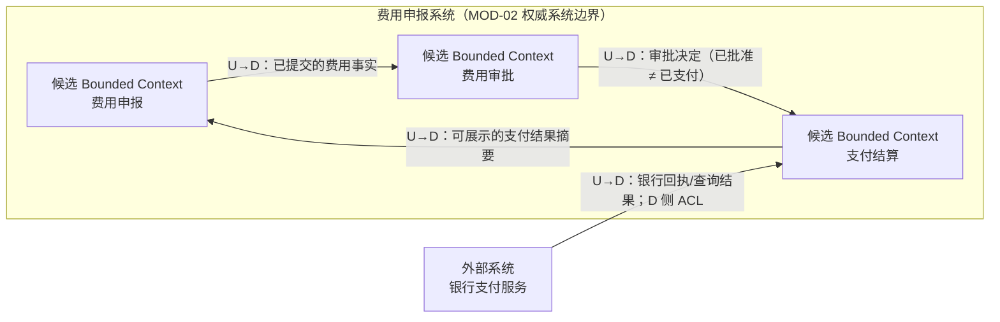

# G008 Batch 9 DDD Context Map Implementation Plan

> **For agentic workers:** REQUIRED SUB-SKILL: Use superpowers:subagent-driven-development (recommended) or superpowers:executing-plans to implement this plan task-by-task. Steps use checkbox (`- [ ]`) syntax for tracking.

**Goal:** Publish MOD-11 as an evidence-bounded DDD Context Map guide with three candidate Bounded Contexts, one external bank system, four explicit U/D relationships and one downstream ACL, then deploy and close only MOD-11.

**Architecture:** One original Mermaid map keeps the three candidate Contexts inside the MOD-02 authoritative system boundary and the bank outside it; a three-row evidence table prevents candidate boundaries from becoming architecture facts, while a four-row responsibility table makes U/D, exchanged facts, translation and ownership explicit. Three new governed sources plus the reused Avanscoperta source support the method without copied diagrams or prose; reciprocal MOD-05/MOD-08 links, actionable MOD-09/MOD-10 handoffs, a dedicated nine-heading schema and two-stage release evidence lock the published result.

**Tech Stack:** Docusaurus MDX, Mermaid `flowchart`, Markdown tables, Node.js 26.5.0, `node:test`, generated JSON, governed source ledger and committed link-health cache, GitHub Pages.

## Global Constraints

- Work only in `/Users/seal/projects/tego-arch/.worktrees/g008-modeling-batch9` on `codex/g008-modeling-batch9`.
- Use `PATH=/Users/seal/.volta/tools/image/node/26.5.0/bin:$PATH` for every Node/npm command; do not use Node 20.
- Publish only MOD-11; MOD-12..13 remain pending and MOD-12 has no actionable article link.
- MOD-02 is authoritative for the exact system boundary “费用申报系统” and external name “银行支付服务”.
- The three internal units are candidate Bounded Contexts, not approved systems, services, modules, databases, repositories, deployments or teams.
- Use exactly one original Mermaid Context Map and exactly two horizontally scrollable Markdown tables.
- The Mermaid contains one authoritative system subgraph, three candidate Context nodes, one external bank node and exactly four U→D edges.
- The bank-to-payment edge is the only explicit ACL; do not infer OHS, PL or any other Context Mapping pattern.
- Treat U/D and arrows as model-influence and integration-responsibility evidence, not organization power, packet direction, APIs, calls, messages, events, transactions, protocols or runtime order.
- Register exactly three new source identities and reuse `src-docs-fc6e554f1153`; Fowler is the only MOD-11 `manifest_primary: true` citation.
- Register Fowler as `independent-blog / primary`; primary means the article is MOD-11's main definitional evidence and does not make it an official DDD specification.
- Pin DDD Crew to commit `970c1ff3a61f7aa8b61b789b697c05bc585f614d` and govern its repository license as `CC-BY-SA-4.0` / `adapt-sharealike-review` while using `facts-summary` only.
- Use `facts-summary` for every citation; do not copy or adapt source prose, diagrams, cheat sheets, Miro boards, templates, examples, icons or layouts.
- Stage A projection is `49 / 92 / 488`, with MOD-11 published/pending and next MOD-11.
- Stage B projection is `50 / 92 / 488`, durable stories `7 / 20`, current G008, next MOD-12.
- Preserve every G008 Batch 8 and older SHA, run, count, observation, review and historical backlog paragraph byte-for-byte.
- Preserve the root checkout’s existing untracked `.codex/config.toml` without modifying, staging or committing it.

---

### Task 1: Build the MOD-11 article and mutation-sensitive Context Map contract

**Files:**
- Create: `content/modeling/mod-11-ddd-context-map.mdx`
- Create: `tests/g008-batch9-content.test.mjs`

**Interfaces:**
- Consumes: MOD-02 system/name authority, MOD-08 payment-result evidence boundary, MOD-09 boundary signals, MOD-10 language/collaboration signals and `handleHorizontalArrowKey`.
- Produces: a published MOD-11 body whose metadata, headings, Context graph, evidence rows, relationship rows, wrappers, exercise and non-proof rules can be validated independently.

- [ ] **Step 1: Write the failing metadata and heading contract**

Create `tests/g008-batch9-content.test.mjs`. Use `readContentDocuments` from `../scripts/content-metadata.mjs`, select `modeling/mod-11-ddd-context-map.mdx`, and require this exact metadata:

```js
assert.equal(document.metadata.title, 'DDD Context Map 建模');
assert.equal(document.metadata.slug, '/modeling/mod-11');
assert.equal(document.metadata.content_type, 'modeling');
assert.equal(document.metadata.status, 'reviewed');
assert.equal(document.metadata.difficulty, 'advanced');
assert.equal(document.metadata.topic_id, 'MOD-11');
assert.equal(document.metadata.priority, 'P1');
assert.equal(document.metadata.analyzed_at, '2026-08-05');
assert.equal(document.metadata.source_cutoff, '2026-08-05');
assert.equal(document.metadata.review_policy, 'quarterly-version-sensitive');
assert.equal(document.metadata.confidence, 'high');
assert.deepEqual(document.metadata.domains, ['software-architecture', 'domain-modeling']);
assert.deepEqual(document.metadata.agent_patterns, []);
assert.deepEqual(document.metadata.protocols, []);
assert.deepEqual(document.metadata.quality_attributes, ['maintainability']);
assert.deepEqual(document.metadata.tags, [
  'DDD',
  'Bounded Context',
  'Context Map',
  'Anti-Corruption Layer',
]);
assert.deepEqual(document.metadata.depends_on, ['MOD-01', 'MOD-02', 'MOD-09', 'MOD-10']);
assert.deepEqual(document.metadata.adjacent_topics, ['MOD-05', 'MOD-08']);
assert.deepEqual(document.metadata.related_cases, ['/cases/temporal-saga-durable-execution']);
assert.deepEqual(document.metadata.related_questions, []);
assert.deepEqual(
  document.headings.filter(({level}) => level === 2).map(({text}) => text),
  [
    '学习问题',
    '建模目标与输入',
    '边界候选与证据规则',
    '核心产物',
    '完成判断',
    '常见失败',
    '与其他模型的衔接',
    '完整演练',
    '来源',
  ],
);
```

Run:

```bash
PATH=/Users/seal/.volta/tools/image/node/26.5.0/bin:$PATH \
  node --test tests/g008-batch9-content.test.mjs
```

Expected: FAIL because MOD-11 does not exist.

- [ ] **Step 2: Add the failing candidate-boundary table contract**

Parse the first Markdown table into records with exact keys `候选 Context / 本地语言 / 独立规则 / 业务权威 / 支持证据 / 反证或备选 / 下一项验证与责任类型`. Deep-compare these three complete records:

```js
const expectedBoundaryRows = [
  {
    '候选 Context': '费用申报',
    '本地语言': '费用、凭证、提交、补正、申请人',
    '独立规则': '费用完整性、凭证要求、提交与补正条件',
    '业务权威': '已提交且可供后续判断的费用事实；不含审批决定与支付结果',
    '支持证据': 'MOD-09 的费用提交事件与术语热点；MOD-10 的待支付费用与支付请求协作',
    '反证或备选': '若提交与审批规则长期共同变化，可与费用审批合并',
    '下一项验证与责任类型': '核对规则变更历史与术语冲突；费用业务领域专家',
  },
  {
    '候选 Context': '费用审批',
    '本地语言': '审批决定、审批理由、权限、政策适用',
    '独立规则': '审批层级、额度、拒绝与重新审批',
    '业务权威': '审批决定及其依据；已批准 ≠ 已支付',
    '支持证据': 'MOD-09 发现审批与支付使用不同结果语言',
    '反证或备选': '若决定与支付只是同一规则生命周期，可与支付结算合并',
    '下一项验证与责任类型': '核对政策变更与跨阶段不变量；审批政策责任人',
  },
  {
    '候选 Context': '支付结算',
    '本地语言': '支付请求、银行回执、结果未知、查询、对账',
    '独立规则': '结果确认、未知保持、重查与对账收敛',
    '业务权威': '本地支付执行语义与可展示摘要；银行结果仍以外部回执或查询为证',
    '支持证据': 'MOD-08 的结果未知边界；MOD-10 的银行回执权威与本地展示协作',
    '反证或备选': '对账若有独立语言与变化节奏可继续拆分，否则保留本候选',
    '下一项验证与责任类型': '核对回执、查询、对账案例与契约；支付或对账责任人、外部集成契约责任人',
  },
];
```

Require exact row order, exactly three unique Context names, one real merge/split/reject alternative per row, and no team/service/database/repository/deployment owner claims.

- [ ] **Step 3: Add the failing relationship-responsibility table contract**

Parse the second Markdown table with exact keys `上游 U / 下游 D / 交换事实 / 翻译或适配责任 / 契约责任类型 / 当前不证明什么 / 下一项验证与责任类型`. Deep-compare these four records:

```js
const expectedRelationshipRows = [
  {
    '上游 U': '费用申报',
    '下游 D': '费用审批',
    '交换事实': '已提交的费用事实',
    '翻译或适配责任': '费用审批按审批语言解释输入，不反向改写申报事实',
    '契约责任类型': '审批政策责任人',
    '当前不证明什么': '不证明 API、事件、事务或服务调用',
    '下一项验证与责任类型': '核对字段含义与拒绝、补正规则；费用领域专家、审批政策责任人',
  },
  {
    '上游 U': '费用审批',
    '下游 D': '支付结算',
    '交换事实': '审批决定',
    '翻译或适配责任': '支付结算把已批准解释为可进入支付判断，不解释为已支付',
    '契约责任类型': '审批政策责任人、支付或对账责任人',
    '当前不证明什么': '不证明同步调用、消息格式或执行顺序',
    '下一项验证与责任类型': '核对撤回、过期与重复决定；审批政策责任人',
  },
  {
    '上游 U': '银行支付服务',
    '下游 D': '支付结算',
    '交换事实': '银行回执或查询结果',
    '翻译或适配责任': '支付结算以 D 侧 ACL 转换外部语义并保留可核验原始证据',
    '契约责任类型': '外部集成契约责任人',
    '当前不证明什么': '不证明 ACL 实现、银行 OHS、PL、协议或 SLA 已存在',
    '下一项验证与责任类型': '核对回执状态、未知值与查询语义；外部集成契约责任人',
  },
  {
    '上游 U': '支付结算',
    '下游 D': '费用申报',
    '交换事实': '可展示的支付结果摘要',
    '翻译或适配责任': '费用申报只转换展示语言，不成为银行结果或支付执行状态权威',
    '契约责任类型': '费用业务领域专家、支付或对账责任人',
    '当前不证明什么': '不证明共享数据库、反向写入或数据所有权',
    '下一项验证与责任类型': '核对展示词汇与证据追溯；费用业务领域专家',
  },
];
```

Require exactly one row containing `ACL`, and require the other three rows to contain none of `Partnership / Shared Kernel / Customer-Supplier / Conformist / OHS / PL`.

- [ ] **Step 4: Add the failing Mermaid graph contract**

Extract one and only one `flowchart LR` Mermaid fence. Parse subgraph membership, node declarations and directed labeled edges into normalized sets. Require this exact semantic graph:



Reject a bank node inside the subgraph, any candidate outside it, duplicate/unknown nodes, reversed endpoints, missing U→D labels, more or fewer than four edges, an ACL on a non-bank edge, or runtime terms such as `API`, `HTTP`, `event`, `topic`, `transaction` in graph labels.

- [ ] **Step 5: Write the minimum article shell and verify the test advances**

Create `content/modeling/mod-11-ddd-context-map.mdx` with this exact front matter and import:

```mdx
---
title: DDD Context Map 建模
slug: /modeling/mod-11
content_type: modeling
status: reviewed
difficulty: advanced
analyzed_at: 2026-08-05
source_cutoff: 2026-08-05
review_policy: quarterly-version-sensitive
confidence: high
domains:
  - software-architecture
  - domain-modeling
agent_patterns: []
protocols: []
quality_attributes:
  - maintainability
tags:
  - DDD
  - Bounded Context
  - Context Map
  - Anti-Corruption Layer
summary: 用费用申报系统的语言、规则与权威证据提出三个候选 Bounded Context，并明确四条上下游关系和翻译责任。
topic_id: MOD-11
priority: P1
depends_on:
  - MOD-01
  - MOD-02
  - MOD-09
  - MOD-10
adjacent_topics:
  - MOD-05
  - MOD-08
related_cases:
  - /cases/temporal-saga-durable-execution
related_questions: []
---

import {handleHorizontalArrowKey} from '@site/src/components/KeyboardScrollableRegion/handleHorizontalArrowKey.mjs';
```

Add the nine exact H2s from Step 1. Under `## 核心产物`, put the Step 4 Mermaid in one `diagram-wrapper diagram-wrapper--scroll-owner` with `role="region"`, `aria-label="费用申报系统 Context Map，可横向滚动"`, `tabIndex={0}` and `onKeyDown={handleHorizontalArrowKey}`. Put the Step 2 and Step 3 tables in `table-wrapper table-wrapper--mapping` regions labeled `候选 Bounded Context 证据表，可横向滚动` and `Context Map 关系责任表，可横向滚动`.

Run the focused test. Expected: metadata, headings, graph and tables pass; remaining prose/relationship/source assertions still fail.

- [ ] **Step 6: Add the complete method, exercise and non-proof prose**

The article must state these exact method contracts as standalone sentences so mutations are unambiguous:

```text
Bounded Context 不等于子域、系统、服务、模块、数据库、仓库、部署单元或团队。
Context 与团队不存在自动的一对一关系。
图中的箭头不等于 API、调用、事件、事务、协议、网络方向或执行顺序。
U/D 不等于组织权力、价值高低或数据包方向。
ACL 标签不证明实现已经存在。
业务权威不等于数据库、存储位置或组织所有权。
银行支付服务是外部系统，不是本地 Bounded Context。
三个候选都可能在后续证据下合并、拆分或被否决。
```

Define U/D as per-relationship roles, state that the arrow points from U to D only for model influence/integration responsibility, and state `已批准 ≠ 已支付`. Explain that payment settlement translates bank evidence but does not become the external payment-result authority. Include the exact seven-step exercise from the design spec and the completion checklist requiring evidence, alternatives, owner types, next evidence and replay without runtime interpretation.

Visibly link `/modeling`, `/modeling/mod-01`, `/modeling/mod-02`, `/modeling/mod-05`, `/modeling/mod-08`, `/modeling/mod-09`, `/modeling/mod-10` and `/cases/temporal-saga-durable-execution`. Mention MOD-12 only as plain text. State that the Temporal Saga case can test timeout/retry/compensation/manual convergence but cannot determine candidate Contexts.

- [ ] **Step 7: Add accessibility and mutation tests**

Require exactly three wrappers, unique aria labels, `tabIndex={0}` and the shared keyboard handler. Statically lock that `src/css/custom.css` gives `.diagram-wrapper--scroll-owner` `overflow-x: auto` and its direct Mermaid containers `width: max-content`, `max-width: none`, `overflow-x: visible`; the handler and scroll owner must be the same element. Directly test `handleHorizontalArrowKey`: a focused overflowing region moves by 40 pixels and a non-overflowing region remains unchanged.

Add controlled mutations that remove/reorder an H2, move the bank into the subgraph, move a candidate out, remove/reverse an edge, change U/D, add a second ACL, delete/duplicate a table, change a header, swap a table row, remove an alternative, replace an owner type with a fictional team, remove `tabIndex`, remove `onKeyDown`, weaken each non-proof sentence, or add an actionable MOD-12 link. Every mutation must throw.

- [ ] **Step 8: Run Task 1 verification and commit**

```bash
PATH=/Users/seal/.volta/tools/image/node/26.5.0/bin:$PATH \
  node --test tests/g008-batch9-content.test.mjs
PATH=/Users/seal/.volta/tools/image/node/26.5.0/bin:$PATH npm run typecheck
git diff --check
git add content/modeling/mod-11-ddd-context-map.mdx \
  tests/g008-batch9-content.test.mjs
git commit -m "docs: add mod11 context map"
```

Expected: focused tests and typecheck pass; the commit contains only the article and focused contract.

---

### Task 2: Govern sources, relations, heading schema and Stage A projection

**Files:**
- Modify: `tests/g008-batch9-content.test.mjs`
- Modify: `data/source-ledger.json`
- Modify: `data/source-link-health.json` only through the checker
- Modify: `content/modeling/mod-05-conceptual-logical-physical-data-model.mdx`
- Modify: `content/modeling/mod-08-state-machine-modeling.mdx`
- Modify: `content/modeling/mod-09-eventstorming.mdx`
- Modify: `content/modeling/mod-10-domain-storytelling.mdx`
- Modify: `content/modeling/mod-11-ddd-context-map.mdx`
- Modify: `scripts/content-schema.mjs`
- Modify: `tests/content-validation.test.mjs`
- Modify relation/current-projection assertions only in:
  - `tests/g007-batch5-deployment.test.mjs`
  - `tests/g008-batch1-content.test.mjs`
  - `tests/g008-batch1-deployment.test.mjs`
  - `tests/g008-batch2-content.test.mjs`
  - `tests/g008-batch2-deployment.test.mjs`
  - `tests/g008-batch3-content.test.mjs`
  - `tests/g008-batch3-deployment.test.mjs`
  - `tests/g008-batch4-deployment.test.mjs`
  - `tests/g008-batch5-content.test.mjs`
  - `tests/g008-batch5-deployment.test.mjs`
  - `tests/g008-batch6-content.test.mjs`
  - `tests/g008-batch6-deployment.test.mjs`
  - `tests/g008-batch7-content.test.mjs`
  - `tests/g008-batch7-deployment.test.mjs`
  - `tests/g008-batch8-content.test.mjs`
  - `tests/g008-batch8-deployment.test.mjs`
  - `tests/project-status.test.mjs`
- Modify generated JSON under `src/generated/`

**Interfaces:**
- Consumes: Task 1 article and structural contract.
- Produces: three new governed sources, one reused citation, reciprocal MOD-05/MOD-08 relations, actionable MOD-09/MOD-10 handoffs, a topic-specific schema and Stage A `49 / 92 / 488`.

- [ ] **Step 1: Add the failing exact source-governance contract**

Require these three deterministic SHA-256 URL-derived identities plus the reused source:

```js
const expectedSources = new Map([
  ['src-docs-8fb33e125d2a', 'https://martinfowler.com/bliki/BoundedContext.html'],
  ['src-docs-1ad75d39a251', 'https://github.com/ddd-crew/context-mapping/tree/970c1ff3a61f7aa8b61b789b697c05bc585f614d'],
  ['src-docs-ac85a74ed0b2', 'https://contextmapper.org/docs/anticorruption-layer/'],
  ['src-docs-fc6e554f1153', 'https://www.avanscoperta.it/en/context-mapping/'],
]);
```

Require `documents["content/modeling/mod-11-ddd-context-map.mdx"]` with review date `2026-08-05`, all four standard copyright checks, exactly four citations, `facts-summary`, null modification/excerpt, `quotation_reviewed: false`, and only `src-docs-8fb33e125d2a` as `manifest_primary: true`.

- [ ] **Step 2: Add the three exact source records**

Add records with the complete shared fields `query_insensitive: false`, `locator_aliases: []`, `tombstone: null`, `published_at: null`, `registered_at: '2026-08-05'`, `checked_at: '2026-08-05'`, `license_family_grouping: 'identity'`, `family_grouping_evidence_url: null`, `expected_final_approved_at: '2026-08-05'`.

Use these source-specific definitions:

```js
const sourceDefinitions = [
  {
    id: 'src-docs-8fb33e125d2a',
    url: 'https://martinfowler.com/bliki/BoundedContext.html',
    title: 'Bounded Context',
    author: 'Martin Fowler',
    version: 'Living page retrieved 2026-08-05',
    sourceKind: 'independent-blog',
    tier: 'primary',
    roles: ['definition', 'method', 'learning'],
    license: 'LicenseRef-All-Rights-Reserved',
    licenseEvidenceUrl: 'https://martinfowler.com/bliki/BoundedContext.html',
    licenseFamilyId: 'https://martinfowler.com/bliki/BoundedContext.html',
    copyrightPolicy: 'facts-and-short-quotation',
    boundary: 'Supports the language/model boundary and explicit Context Map relationship summary; it does not approve this article’s candidate boundaries, services, teams or runtime design.',
  },
  {
    id: 'src-docs-1ad75d39a251',
    url: 'https://github.com/ddd-crew/context-mapping/tree/970c1ff3a61f7aa8b61b789b697c05bc585f614d',
    title: 'Context Mapping',
    author: 'DDD Crew',
    version: 'ddd-crew/context-mapping@970c1ff3a61f7aa8b61b789b697c05bc585f614d',
    sourceKind: 'official-repository',
    tier: 'secondary',
    roles: ['definition', 'method', 'comparison'],
    license: 'CC-BY-SA-4.0',
    licenseEvidenceUrl: 'https://github.com/ddd-crew/context-mapping/blob/970c1ff3a61f7aa8b61b789b697c05bc585f614d/LICENSE',
    licenseFamilyId: 'github:ddd-crew/context-mapping',
    copyrightPolicy: 'adapt-sharealike-review',
    boundary: 'Supports small question-specific Context Maps, U/D roles and the existence of relationship patterns; it does not license copying the cheat sheet or Miro board and does not select patterns for this article.',
  },
  {
    id: 'src-docs-ac85a74ed0b2',
    url: 'https://contextmapper.org/docs/anticorruption-layer/',
    title: 'Anti-Corruption Layer',
    author: 'Context Mapper',
    version: 'Living page retrieved 2026-08-05',
    sourceKind: 'official-docs',
    tier: 'primary',
    roles: ['definition', 'method'],
    license: 'LicenseRef-All-Rights-Reserved',
    licenseEvidenceUrl: 'https://contextmapper.org/docs/anticorruption-layer/',
    licenseFamilyId: 'https://contextmapper.org/docs/anticorruption-layer/',
    copyrightPolicy: 'facts-and-short-quotation',
    boundary: 'Supports ACL as a downstream translation and isolation role; it does not prove a production ACL implementation, bank OHS/PL, protocol or deployment boundary.',
  },
];
```

For ARR records use license scope `Facts summarized from the named page only; page prose, diagrams, examples, templates, trademarks, linked works and third-party assets are excluded.` and note that no open content license was found on 2026-08-05. For DDD Crew use scope `The pinned ddd-crew/context-mapping repository content covered by its CC BY-SA 4.0 LICENSE; trademarks, linked works, Miro-hosted assets and separately licensed third-party material are excluded.` and state that the pinned LICENSE, not abbreviated README wording, governs. Set each transport and expected-final locator to its exact `url`, `link_policy` to `floating` for living pages and `stable` for the pinned repository, and write a concrete reviewed transport note.

- [ ] **Step 3: Add the document citation review and visible source list**

Add this exact citation set in the same order:

```js
[
  {
    source_id: 'src-docs-8fb33e125d2a',
    citation_url: 'https://martinfowler.com/bliki/BoundedContext.html',
    roles: ['definition', 'method', 'learning'],
    manifest_primary: true,
    usage_mode: 'facts-summary',
    attribution_note: 'Bounded Context, Martin Fowler',
    modification_note: null,
    excerpt: null,
    quotation_reviewed: false,
  },
  {
    source_id: 'src-docs-1ad75d39a251',
    citation_url: 'https://github.com/ddd-crew/context-mapping/tree/970c1ff3a61f7aa8b61b789b697c05bc585f614d',
    roles: ['definition', 'method', 'comparison'],
    manifest_primary: false,
    usage_mode: 'facts-summary',
    attribution_note: 'Context Mapping, DDD Crew',
    modification_note: null,
    excerpt: null,
    quotation_reviewed: false,
  },
  {
    source_id: 'src-docs-ac85a74ed0b2',
    citation_url: 'https://contextmapper.org/docs/anticorruption-layer/',
    roles: ['definition', 'method'],
    manifest_primary: false,
    usage_mode: 'facts-summary',
    attribution_note: 'Anti-Corruption Layer, Context Mapper',
    modification_note: null,
    excerpt: null,
    quotation_reviewed: false,
  },
  {
    source_id: 'src-docs-fc6e554f1153',
    citation_url: 'https://www.avanscoperta.it/en/context-mapping/',
    roles: ['definition', 'method'],
    manifest_primary: false,
    usage_mode: 'facts-summary',
    attribution_note: 'Context Mapping, Avanscoperta',
    modification_note: null,
    excerpt: null,
    quotation_reviewed: false,
  },
]
```

Replace the provisional source section with exactly four visible links using labels `Bounded Context`、`DDD Crew Context Mapping`、`Anti-Corruption Layer`、`Avanscoperta Context Mapping`. Each list item states the supported fact and local non-proof/reuse boundary. Add no fifth source link and no copied source asset.

- [ ] **Step 4: Refresh and validate link health**

```bash
PATH=/Users/seal/.volta/tools/image/node/26.5.0/bin:$PATH npm run refresh:links
PATH=/Users/seal/.volta/tools/image/node/26.5.0/bin:$PATH npm run check:links
```

Expected: one policy-accepted result per new exact transport URL, with real attempt history and expected final locator. If an origin fails, preserve the failure and use only the checker’s public injection/merge path after an independent successful recheck; never hand-write a healthy result.

- [ ] **Step 5: Add exact reciprocal and forward relationship contracts**

Require MOD-11’s eight visible site links from Task 1 and zero `/modeling/mod-12` or `/modeling/mod-13` links. Add `MOD-11` to both MOD-05 and MOD-08 `adjacent_topics` and add exactly one visible backlink in each:

```text
MOD-05：实体、关系与权威记录可以为 Context 边界提供证据，但数据模型不能单独决定 Bounded Context。
MOD-08：状态、不变量和恢复规则的独立变化可以验证候选边界，但状态机不等于 Context Map。
```

Convert the existing plain MOD-11 handoff text in MOD-09 and MOD-10 into actionable `/modeling/mod-11` links without adding MOD-11 to their adjacency metadata. Preserve the statements that EventStorming lanes/signals and Domain Story actors/objects cannot directly generate Contexts. Update Batch 3/6/7/8 content tests only for these current relations; preserve every prior semantic assertion.

- [ ] **Step 6: Register and test the exact MOD-11 heading schema**

Add to `scripts/content-schema.mjs`:

```js
export const mod11ModelingHeadings = [
  '## 学习问题',
  '## 建模目标与输入',
  '## 边界候选与证据规则',
  '## 核心产物',
  '## 完成判断',
  '## 常见失败',
  '## 与其他模型的衔接',
  '## 完整演练',
  '## 来源',
];
```

Return it from `knowledgeHeadingContract` when `type === 'modeling' && topicId === 'MOD-11'`. In `tests/content-validation.test.mjs`, import the constant; add one fixture accepting the exact order and controlled fixtures rejecting one missing heading and one swap between `边界候选与证据规则` and `核心产物`. Leave every earlier topic-specific/default contract unchanged.

- [ ] **Step 7: Generate and lock Stage A**

```bash
PATH=/Users/seal/.volta/tools/image/node/26.5.0/bin:$PATH npm run generate:content
```

Require:

```js
assert.deepEqual(projectStatus, {
  schema_version: 1,
  durable_stories: {completed: 7, total: 20, current: 'G008'},
  completed_topics: 49,
  content_documents: 92,
  governed_sources: 488,
  sources: {
    durable_stories: 'docs/content-backlog.md',
    completed_topics: 'docs/content-backlog.md',
    content_documents: 'content/**/*.{md,mdx}',
    governed_sources: 'data/source-ledger.json',
  },
});
assert.equal(topicsById.get('MOD-11').published, true);
assert.equal(topicsById.get('MOD-11').status.value, 'pending');
for (const id of ['MOD-12', 'MOD-13']) {
  assert.equal(topicsById.get(id).published, false, id);
  assert.equal(topicsById.get(id).status.value, 'pending', id);
}
```

Run the complete test suite once and update only live current-projection consumers to `49 / 92 / 488`, MOD-11 published/pending and next MOD-11. Keep every literal inside prior release reviews and immutable historical backlog segments unchanged. Add controlled mutations proving MOD-12..13 remain unpublished, pending and unlinked.

- [ ] **Step 8: Verify and commit Task 2**

```bash
PATH=/Users/seal/.volta/tools/image/node/26.5.0/bin:$PATH \
  node --test tests/g008-batch9-content.test.mjs \
  tests/g008-batch8-content.test.mjs tests/g008-batch7-content.test.mjs \
  tests/g008-batch6-content.test.mjs tests/g008-batch3-content.test.mjs \
  tests/content-validation.test.mjs tests/project-status.test.mjs
PATH=/Users/seal/.volta/tools/image/node/26.5.0/bin:$PATH npm run validate:content
PATH=/Users/seal/.volta/tools/image/node/26.5.0/bin:$PATH npm run check:content
PATH=/Users/seal/.volta/tools/image/node/26.5.0/bin:$PATH npm run check:links
git diff --check
```

Inspect `git diff --name-only`, stage only Task 2 paths and generated JSON, inspect `git diff --cached --name-only`, then commit:

```bash
git add content/modeling/mod-05-conceptual-logical-physical-data-model.mdx \
  content/modeling/mod-08-state-machine-modeling.mdx \
  content/modeling/mod-09-eventstorming.mdx \
  content/modeling/mod-10-domain-storytelling.mdx \
  content/modeling/mod-11-ddd-context-map.mdx \
  data/source-ledger.json data/source-link-health.json \
  scripts/content-schema.mjs src/generated \
  tests/content-validation.test.mjs \
  tests/g007-batch5-deployment.test.mjs \
  tests/g008-batch1-content.test.mjs \
  tests/g008-batch1-deployment.test.mjs \
  tests/g008-batch2-content.test.mjs \
  tests/g008-batch2-deployment.test.mjs \
  tests/g008-batch3-content.test.mjs \
  tests/g008-batch3-deployment.test.mjs \
  tests/g008-batch4-deployment.test.mjs \
  tests/g008-batch5-content.test.mjs \
  tests/g008-batch5-deployment.test.mjs \
  tests/g008-batch6-content.test.mjs \
  tests/g008-batch6-deployment.test.mjs \
  tests/g008-batch7-content.test.mjs \
  tests/g008-batch7-deployment.test.mjs \
  tests/g008-batch8-content.test.mjs \
  tests/g008-batch8-deployment.test.mjs \
  tests/g008-batch9-content.test.mjs \
  tests/project-status.test.mjs
git commit -m "docs: govern mod11 sources and relations"
```

Expected: targeted validation passes; a fresh content/fact/copyright/accessibility/test review has no Important or Critical findings; no prior release review or historical backlog evidence changes.

---

### Task 3: Verify, independently review and publish Stage A

**Files:**
- Modify only for review findings: Task 1–2 files
- Create ignored: `.superpowers/sdd/task-3-stagea-report.md`

**Interfaces:**
- Consumes: committed Stage A `49 / 92 / 488`.
- Produces: one exact Stage A SHA on feature, local main, origin feature and origin/main, plus a successful exact-head Pages run.

- [ ] **Step 1: Run targeted and full verification**

```bash
PATH=/Users/seal/.volta/tools/image/node/26.5.0/bin:$PATH \
  node --test tests/g008-batch9-content.test.mjs \
  tests/content-validation.test.mjs tests/project-status.test.mjs
PATH=/Users/seal/.volta/tools/image/node/26.5.0/bin:$PATH npm run verify
git diff --check
git status --short
```

Record the exact repository test pass/total, 92 content documents, 488 governed sources and all local warnings in `.superpowers/sdd/task-3-stagea-report.md`.

- [ ] **Step 2: Run independent cumulative review**

Review `d785def4c2136fcd310c63a86341c67869b26b1c..HEAD` with separate judgments for Context Mapping semantics, MOD-02/MOD-08 authority, candidate/non-proof boundaries, diagram/table/accessibility contracts, source/copyright governance, mutation strength, prior-history safety and architecture. Fix every Important or Critical finding, rerun full verify and commit each narrow repair.

- [ ] **Step 3: Publish exact Stage A**

```bash
git push origin codex/g008-modeling-batch9
```

In `/Users/seal/projects/tego-arch`, require `git status --short` to contain only `?? .codex/config.toml`, then:

```bash
git merge --ff-only codex/g008-modeling-batch9
git push origin main
```

Require feature HEAD, origin feature, local main and origin/main to equal the same 40-character SHA.

- [ ] **Step 4: Wait for the exact Pages run**

Resolve and watch the exact `Verify and deploy Docusaurus to GitHub Pages` run whose `headSha` equals Stage A HEAD:

```bash
G008_B9_STAGE_A_SHA=$(git rev-parse HEAD)
G008_B9_STAGE_A_RUN_ID=$(gh run list \
  --workflow "Verify and deploy Docusaurus to GitHub Pages" \
  --limit 30 --json databaseId,headSha \
  | jq -r --arg sha "$G008_B9_STAGE_A_SHA" \
    '[.[] | select(.headSha == $sha)][0].databaseId // empty')
test -n "$G008_B9_STAGE_A_RUN_ID"
gh run watch "$G008_B9_STAGE_A_RUN_ID" --exit-status
gh run view "$G008_B9_STAGE_A_RUN_ID" \
  --json databaseId,headSha,status,conclusion,url,workflowName
```

Require a numeric run ID, `status=completed`, `conclusion=success`, the exact workflow name and exact Stage A SHA. Record the returned URL.

---

### Task 4: Execute exact production browser QA

**Files:**
- Create ignored: `.superpowers/sdd/task-4-final-browser-qa.json`
- Create ignored: `.superpowers/sdd/task-4-report.md`

**Interfaces:**
- Consumes: exact Stage A SHA/run and deployed MOD-11.
- Produces: immutable measured browser evidence and its SHA-256 for Stage B.

- [ ] **Step 1: Verify the exact ten canonical routes**

Require HTTP 200 for:

```text
/
/modeling
/modeling/mod-01
/modeling/mod-02
/modeling/mod-05
/modeling/mod-08
/modeling/mod-09
/modeling/mod-10
/modeling/mod-11
/references
```

Record requested URL, final URL, status and timestamp for every route.

- [ ] **Step 2: Verify desktop `1440x1000` and mobile `390x844`**

Use fresh browser tabs per viewport. At each viewport store title/H1, the nine H2 strings, one Mermaid region/SVG, the authoritative system label, three candidate labels, external bank label, four edge labels, two Markdown tables, three boundary rows, four relationship rows, zero document overflow, wrapper client/scroll widths, role, aria label and tab index. Press ArrowLeft/ArrowRight only after verifying a unique focused wrapper; require a 40-pixel movement where overflow exists and no movement at a boundary or when no overflow exists.

- [ ] **Step 3: Activate every source and relationship**

At each viewport click all four MOD-11 source links and all eight MOD-11 site links: `/modeling`, MOD-01, MOD-02, MOD-05, MOD-08, MOD-09, MOD-10 and the Temporal Saga case. On MOD-05 and MOD-08 activate the reciprocal MOD-11 backlink; on MOD-09 and MOD-10 activate the forward MOD-11 handoff, at both viewports. Expected totals: `8` source activations and `24` relation activations. Record before URL, clicked href/name, interaction method and landed URL for every activation.

- [ ] **Step 4: Record forbidden publication and diagnostics**

Require zero MOD-12 article links and zero actions targeting `/modeling/mod-12`; require MOD-12’s `/modeling` card to remain unlinked/planned. Store a closed-world operator target ledger and collect fresh diagnostics from each viewport tab; console warnings/errors/page errors must be `0/0/0`.

- [ ] **Step 5: Freeze and independently review evidence**

Write every measured value to `.superpowers/sdd/task-4-final-browser-qa.json`, compute its SHA-256 with `shasum -a 256`, copy equal counts to `.superpowers/sdd/task-4-report.md`, and have a fresh verifier compare every artifact key against this plan. Task 4 passes only with exact line `Task 4 production QA — PASS` and zero Important/Critical findings.

---

### Task 5: Record Stage B closure and deploy the final state

**Files:**
- Create: `docs/reviews/g008-batch9.md`
- Create: `tests/g008-batch9-deployment.test.mjs`
- Modify: `docs/content-backlog.md`
- Modify live current-projection assertions in the test files listed in Task 2
- Modify generated JSON under `src/generated/`

**Interfaces:**
- Consumes: exact Stage A SHA, exact numeric Pages run, exact Stage A verify count, Task 4 artifact hash and measured QA counts.
- Produces: immutable Batch 9 evidence and Stage B `50 / 92 / 488`, current G008, next MOD-12.

- [ ] **Step 1: Write and prove the failing deployment contract**

Use the structural I/O, exact-section and history-hash approach from `tests/g008-batch8-deployment.test.mjs`, but name all Batch 9 constants and helpers independently. Paste the measured 40-character Stage A SHA, numeric Pages run, exact repository test count and 64-character QA artifact SHA as literals before the first run. Reject symbolic evidence:

```js
assert.doesNotMatch(
  review,
  /ACTUAL_|STAGE_A_SHA|RUN_ID|TEST_COUNT|ARTIFACT_SHA|<[^>]+>/u,
);
```

Require exact review sections `Stage A identity / Verification / Independent review / Production smoke / Stage B projection / Final PASS`, exact Task 4 counts and a SHA-256 guard over the complete Batch 8-and-older backlog suffix.

```bash
PATH=/Users/seal/.volta/tools/image/node/26.5.0/bin:$PATH \
  node --test tests/g008-batch9-deployment.test.mjs
```

Expected: FAIL because the Batch 9 review/backlog closure is absent and MOD-11 is pending.

- [ ] **Step 2: Create the exact release review and backlog segment**

Create `docs/reviews/g008-batch9.md` from measured values only. Prepend one `2026-08-05 G008 Batch 9 已完成 MOD-11` segment to the current backlog baseline, preserve the entire Batch 8-and-older suffix byte-for-byte, and change only MOD-11 from `[ ]` to `[x]`.

The new segment and review must contain: Stage A `49 / 92 / 488`; Stage B `50 / 92 / 488`; durable `7 / 20`; G008 current; MOD-12 next; ten routes; exact desktop/mobile viewports; one Mermaid; two tables with `3 + 4` rows; `8/8` source activations; `24/24` relation activations; MOD-12 target `0`; diagnostics `0/0/0`; exact artifact hash; exact repository test count; and `Stage B closure — PASS`.

- [ ] **Step 3: Generate Stage B and update only live assertions**

```bash
PATH=/Users/seal/.volta/tools/image/node/26.5.0/bin:$PATH npm run generate:content
```

Require exact project status:

```js
{
  schema_version: 1,
  durable_stories: {completed: 7, total: 20, current: 'G008'},
  completed_topics: 50,
  content_documents: 92,
  governed_sources: 488,
  sources: {
    durable_stories: 'docs/content-backlog.md',
    completed_topics: 'docs/content-backlog.md',
    content_documents: 'content/**/*.{md,mdx}',
    governed_sources: 'data/source-ledger.json',
  },
}
```

Require MOD-11 complete, MOD-12..13 pending, current G008 and next MOD-12. Add controlled mutations for every review/backlog literal, duplicate/missing evidence, MOD-11-only closure and each status/count. Update only live current-state consumers; never rewrite any Batch 8 or older historical literal.

- [ ] **Step 4: Verify, independently review and commit Stage B**

```bash
PATH=/Users/seal/.volta/tools/image/node/26.5.0/bin:$PATH \
  node --test tests/g008-batch9-content.test.mjs \
  tests/g008-batch9-deployment.test.mjs tests/project-status.test.mjs \
  tests/g008-batch8-deployment.test.mjs
PATH=/Users/seal/.volta/tools/image/node/26.5.0/bin:$PATH npm run verify
git diff --check
```

Run a fresh cumulative review of `d785def4c2136fcd310c63a86341c67869b26b1c..HEAD`. Repair every Important/Critical finding, rerun full verify, inspect staged paths, then:

```bash
git add docs/content-backlog.md docs/reviews/g008-batch9.md \
  src/generated \
  tests/g007-batch5-deployment.test.mjs \
  tests/g008-batch1-content.test.mjs \
  tests/g008-batch1-deployment.test.mjs \
  tests/g008-batch2-content.test.mjs \
  tests/g008-batch2-deployment.test.mjs \
  tests/g008-batch3-content.test.mjs \
  tests/g008-batch3-deployment.test.mjs \
  tests/g008-batch4-deployment.test.mjs \
  tests/g008-batch5-content.test.mjs \
  tests/g008-batch5-deployment.test.mjs \
  tests/g008-batch6-deployment.test.mjs \
  tests/g008-batch7-content.test.mjs \
  tests/g008-batch7-deployment.test.mjs \
  tests/g008-batch8-content.test.mjs \
  tests/g008-batch8-deployment.test.mjs \
  tests/g008-batch9-content.test.mjs \
  tests/g008-batch9-deployment.test.mjs \
  tests/project-status.test.mjs
git commit -m "docs: close g008 batch9 context map"
git push origin codex/g008-modeling-batch9
```

After staging, `git diff --cached --name-only` must contain only the Batch 9 review, backlog, generated JSON and explicit live closure tests. Do not use `git add tests`.

- [ ] **Step 5: Fast-forward main and verify final deployment**

In the root checkout require only `?? .codex/config.toml`, then fast-forward local main, push origin/main, wait for the exact final Pages run and require `completed/success` at final HEAD. Recheck all ten routes and `/modeling`: MOD-11 must be linked/complete; MOD-12 must remain unlinked/planned.

---

### Task 6: Run final consistency audit and deliver

**Files:**
- No intended tracked changes
- Create ignored: `.superpowers/sdd/task-6-report.md`

**Interfaces:**
- Consumes: verified final Stage B SHA/run.
- Produces: synchronized refs, clean feature worktree, preserved user files and concise delivery evidence.

- [ ] **Step 1: Run fresh committed-HEAD verification**

```bash
PATH=/Users/seal/.volta/tools/image/node/26.5.0/bin:$PATH npm run verify
git diff --check d785def4c2136fcd310c63a86341c67869b26b1c..HEAD
```

Record exact tests, 92 content documents, 488 governed sources and every warning in `.superpowers/sdd/task-6-report.md`.

- [ ] **Step 2: Verify refs, deployment and status**

Require feature HEAD, origin feature, local main and freshly fetched origin/main to equal the final SHA. Require the feature worktree clean and the main checkout to contain only preserved `?? .codex/config.toml`. Verify the final Pages exact workflow/head/status, ten HTTP routes, linked complete MOD-11 and unlinked planned MOD-12.

- [ ] **Step 3: Deliver exact evidence**

Report final SHA/run, full verify count, `50 / 92 / 488`, durable `7 / 20`, current G008, next MOD-12, exact viewport/source/relation/diagnostic totals, Task 4 artifact hash, independent review result and any warning gap. Preserve the feature worktree and branch.
