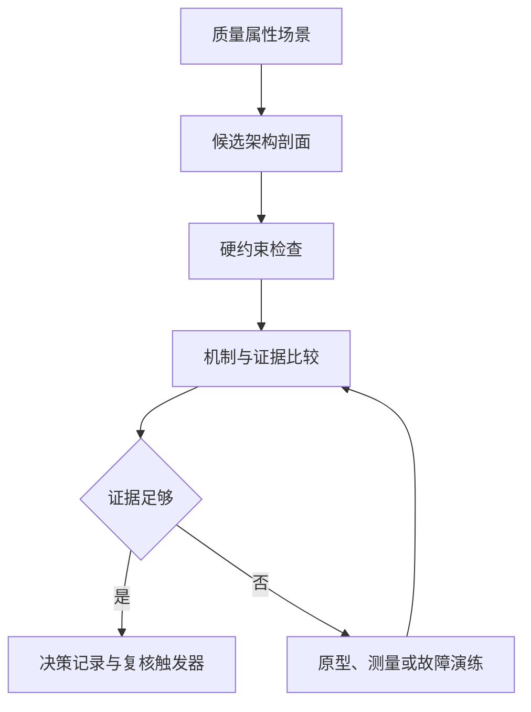

# G009 Batch 1 Style Comparison Framework Implementation Plan

> **For agentic workers:** REQUIRED SUB-SKILL: Use superpowers:subagent-driven-development (recommended) or superpowers:executing-plans to implement this plan task-by-task. Steps use checkbox (`- [ ]`) syntax for tracking.

**Goal:** Upgrade the published STY-00 fixture into a scenario-driven, evidence-governed architecture-style comparison method and close only STY-00 after exact-head production verification.

**Architecture:** Keep the existing style content schema and route. Add four version-recorded sources, replace STY-00's generic citations with five specific governed works, rewrite the article around one eight-dimension profile contract and a six-action Mermaid decision loop, then use two-stage publication so backlog completion is derived only after Stage A deployment evidence exists.

**Tech Stack:** Docusaurus 3, MDX, Mermaid, Node.js 26.5.0, `node:test`, deterministic JSON generation, GitHub Actions/Pages, repository source-ledger tooling.

## Global Constraints

- Work only in `/Users/seal/projects/tego-arch/.worktrees/g009-styles-batch1` on `codex/g009-styles-batch1`.
- Preserve `/Users/seal/projects/tego-arch`, all G008 worktrees, and the root untracked `.codex/config.toml` unchanged.
- Use Node.js `v26.5.0`; `package.json` requires `>=24.0`.
- Do not add dependencies or modify the global eleven-heading `style` schema.
- Close only `STY-00`; keep G009 current and do not create STY-01..06 content.
- Keep `PR-01` and `MOD-02` reciprocal adjacency plus `/cases/micro-frontends-single-spa`.
- Use the comparison dimensions in this exact order: boundary, control flow, data ownership, consistency, deployment unit, failure domain, team topology, quality attributes.
- Use `直接支持`, `需要补充机制`, `与约束冲突`, and `未知`; a `0/1/2` sum must not select the winner.
- Record missing evidence as `未知`; never infer a PASS or a score.
- Use Mermaid, not Draw.io or a raster asset, for the decision flow.
- Stage A projects `52 / 94 / 498` with STY-00 published/pending.
- Stage B projects `53 / 94 / 498` with STY-00 published/complete, G009 current, and STY-01 next.
- Never hand-edit `src/generated/`; update canonical inputs and run `npm run generate:content`.
- Do not write symbolic deployment tokens into tracked files. Stage A SHA, run IDs, job IDs, test totals, artifact hashes, and observations must be literal outputs captured after they exist.
- Every task ends with targeted tests and an independently reviewable commit or an explicit release gate.

---

## File Map

- Modify `content/styles/sty-00-comparison-framework.mdx`: canonical article metadata, method, Mermaid, two tables, decision record, exercise, visible sources and relationships.
- Modify `data/source-ledger.json`: four new source records and the five-citation STY-00 document review.
- Modify `data/source-link-health.json`: checker-produced transport observations for the four new records.
- Create `tests/g009-batch1-content.test.mjs`: Stage A content, method, visual, source, relationship and pending-projection contract.
- Create `tests/g009-batch1-deployment.test.mjs`: Stage B immutable deployment, review, backlog, generated-state and historical-suffix contract.
- Modify `src/generated/topic-manifest.json`: generated STY-00 source/status projection.
- Modify `src/generated/topic-indexes.json`: generated style index and source projection.
- Modify `src/generated/source-ledger.json`: generated public source projection.
- Modify `src/generated/project-status.json`: generated Stage B completion projection only.
- Modify `docs/content-backlog.md`: Stage B checkbox and current release baseline only after Stage A succeeds.
- Create `docs/reviews/g009-batch1.md`: exact release review written only after Stage A identifiers and browser evidence exist.
- Create `.superpowers/sdd/task-4-browser-qa.json`: untracked but durable production interaction evidence used to calculate the tracked artifact hash.
- Create `.superpowers/sdd/progress.md` and task reports: untracked task-by-task execution and review evidence.

## Task 1: Govern the Five STY-00 Sources

**Files:**
- Create: `tests/g009-batch1-content.test.mjs`
- Modify: `data/source-ledger.json`
- Modify: `data/source-link-health.json`
- Modify: `content/styles/sty-00-comparison-framework.mdx`

**Interfaces:**
- Consumes: `readContentDocuments(contentRoot)`, source-ledger schema, link-health cache schema.
- Produces: source IDs `src-sei-qaw-collection`, `src-sei-atam-collection`, `src-microsoft-architecture-styles`, `src-arc42-architecture-decisions`; STY-00 citations to those four plus `src-arc42-quality-requirements-v9`.

- [ ] **Step 1: Write the failing source-governance test**

Create `tests/g009-batch1-content.test.mjs` with the repository loaders and exact identity checks:

```js
import assert from 'node:assert/strict';
import {readFile} from 'node:fs/promises';
import test from 'node:test';
import {fileURLToPath} from 'node:url';

import {readContentDocuments} from '../scripts/content-metadata.mjs';

const contentRoot = fileURLToPath(new URL('../content/', import.meta.url));
const documents = await readContentDocuments(contentRoot);
const document = documents.find(({file}) => file === 'styles/sty-00-comparison-framework.mdx');
const [ledger, linkHealth] = await Promise.all([
  readFile(new URL('../data/source-ledger.json', import.meta.url), 'utf8').then(JSON.parse),
  readFile(new URL('../data/source-link-health.json', import.meta.url), 'utf8').then(JSON.parse),
]);

const expectedSources = new Map([
  ['src-sei-qaw-collection', 'https://www.sei.cmu.edu/library/quality-attribute-workshop-collection/'],
  ['src-sei-atam-collection', 'https://www.sei.cmu.edu/library/architecture-tradeoff-analysis-method-collection/'],
  ['src-microsoft-architecture-styles', 'https://learn.microsoft.com/en-us/azure/architecture/guide/architecture-styles/'],
  ['src-arc42-architecture-decisions', 'https://docs.arc42.org/section-9/'],
  ['src-arc42-quality-requirements-v9', 'https://docs.arc42.org/section-10/'],
]);

const expectedCitations = [
  ['src-sei-qaw-collection', false],
  ['src-sei-atam-collection', true],
  ['src-microsoft-architecture-styles', false],
  ['src-arc42-architecture-decisions', false],
  ['src-arc42-quality-requirements-v9', false],
];

test('governs five specific visible STY-00 sources', () => {
  assert.ok(document, 'STY-00 must remain published');
  const records = new Map(ledger.sources.map((source) => [source.id, source]));
  for (const [id, locator] of expectedSources) {
    assert.equal(records.get(id)?.canonical_locator, locator, id);
    assert.ok(document.source.includes(`](${locator})`), `${id} visible citation`);
  }
  const review = ledger.documents['content/styles/sty-00-comparison-framework.mdx'];
  assert.equal(review.reviewed_at, '2026-08-06');
  assert.deepEqual(
    review.citations.map(({source_id, manifest_primary}) => [source_id, manifest_primary]),
    expectedCitations,
  );
  assert.deepEqual(
    review.citations.filter(({manifest_primary}) => manifest_primary).map(({source_id}) => source_id),
    ['src-sei-atam-collection'],
  );
});

test('keeps every new remote source in the reviewed health cache', () => {
  const results = new Map(
    linkHealth.results.flatMap((result) =>
      result.source_ids.map((sourceId) => [sourceId, result]),
    ),
  );
  for (const id of [...expectedSources.keys()].slice(0, 4)) {
    const result = results.get(id);
    assert.ok(result, `${id} health result`);
    assert.equal(result.last_attempt.outcome, 'healthy', `${id} current transport`);
    assert.equal(result.review_status, 'healthy', `${id} review status`);
  }
});
```

- [ ] **Step 2: Run the source test and verify the intended failure**

Run:

```bash
node --test tests/g009-batch1-content.test.mjs
```

Expected: FAIL at `src-sei-qaw-collection` because the new records and citations do not exist.

- [ ] **Step 3: Add the four exact source records**

Insert four records into the sorted `sources` array in `data/source-ledger.json`. Use these immutable identities and transports:

```json
[
  {
    "id": "src-sei-qaw-collection",
    "canonical_locator": "https://www.sei.cmu.edu/library/quality-attribute-workshop-collection/",
    "transport_locator": "https://www.sei.cmu.edu/library/quality-attribute-workshop-collection/",
    "query_insensitive": false,
    "locator_aliases": [],
    "tombstone": null,
    "title": "Quality Attribute Workshop Collection",
    "author_or_org": "Carnegie Mellon Software Engineering Institute",
    "published_at": "2016-09-01",
    "registered_at": "2026-08-06",
    "checked_at": "2026-08-06",
    "version": "Collection published 2016-09-01; page checked on 2026-08-06",
    "source_kind": "official-docs",
    "tier": "primary",
    "allowed_evidence_roles": ["definition", "learning", "method"],
    "license": "LicenseRef-All-Rights-Reserved",
    "license_scope": "The named checked collection page only; linked reports, marks, and third-party works excluded unless separately governed",
    "license_evidence_url": "https://www.sei.cmu.edu/library/quality-attribute-workshop-collection/",
    "license_evidence_note": "The checked SEI collection page exposes no reusable documentation license; Tego Arch retains only the link and original factual summaries.",
    "license_family_id": "https://www.sei.cmu.edu/library/quality-attribute-workshop-collection/",
    "license_family_grouping": "identity",
    "family_grouping_evidence_url": null,
    "copyright_policy": "facts-and-short-quotation",
    "usage_boundary": "Supports stakeholder-derived, prioritized and refined quality-attribute scenarios before architecture comparison; it does not supply project-specific priorities, measurements, or a style choice.",
    "link_policy": "stable",
    "expected_final_transport_locator": "https://www.sei.cmu.edu/library/quality-attribute-workshop-collection/",
    "expected_final_approved_at": "2026-08-06",
    "expected_final_approval_note": "Reviewed canonical SEI collection transport and publication identity on 2026-08-06."
  },
  {
    "id": "src-sei-atam-collection",
    "canonical_locator": "https://www.sei.cmu.edu/library/architecture-tradeoff-analysis-method-collection/",
    "transport_locator": "https://www.sei.cmu.edu/library/architecture-tradeoff-analysis-method-collection/",
    "query_insensitive": false,
    "locator_aliases": [],
    "tombstone": null,
    "title": "Architecture Tradeoff Analysis Method Collection",
    "author_or_org": "Carnegie Mellon Software Engineering Institute",
    "published_at": "2018-02-14",
    "registered_at": "2026-08-06",
    "checked_at": "2026-08-06",
    "version": "Collection published 2018-02-14; page checked on 2026-08-06",
    "source_kind": "official-docs",
    "tier": "primary",
    "allowed_evidence_roles": ["definition", "learning", "method"],
    "license": "LicenseRef-All-Rights-Reserved",
    "license_scope": "The named checked collection page only; linked reports, marks, and third-party works excluded unless separately governed",
    "license_evidence_url": "https://www.sei.cmu.edu/library/architecture-tradeoff-analysis-method-collection/",
    "license_evidence_note": "The checked SEI collection page exposes no reusable documentation license; Tego Arch retains only the link and original factual summaries.",
    "license_family_id": "https://www.sei.cmu.edu/library/architecture-tradeoff-analysis-method-collection/",
    "license_family_grouping": "identity",
    "family_grouping_evidence_url": null,
    "copyright_policy": "facts-and-short-quotation",
    "usage_boundary": "Supports scenario-based analysis of architectural approaches and identification of risks, sensitivity points and tradeoff points; it does not certify an architecture or define numeric style scores.",
    "link_policy": "stable",
    "expected_final_transport_locator": "https://www.sei.cmu.edu/library/architecture-tradeoff-analysis-method-collection/",
    "expected_final_approved_at": "2026-08-06",
    "expected_final_approval_note": "Reviewed canonical SEI collection transport and publication identity on 2026-08-06."
  },
  {
    "id": "src-microsoft-architecture-styles",
    "canonical_locator": "https://learn.microsoft.com/en-us/azure/architecture/guide/architecture-styles/",
    "transport_locator": "https://raw.githubusercontent.com/microsoftdocs/architecture-center/4fb4d75aa5ed8423caa0d6c35d40b32bbc3cc819/docs/guide/architecture-styles/index.md",
    "query_insensitive": false,
    "locator_aliases": [],
    "tombstone": null,
    "title": "Architecture Styles — Azure Architecture Center",
    "author_or_org": "Microsoft",
    "published_at": "2025-09-25",
    "registered_at": "2026-08-06",
    "checked_at": "2026-08-06",
    "version": "MicrosoftDocs architecture-center commit 4fb4d75aa5ed8423caa0d6c35d40b32bbc3cc819; source ms.date 2025-09-25",
    "source_kind": "vendor-reference-architecture",
    "tier": "first-party",
    "allowed_evidence_roles": ["comparison", "definition", "learning", "method"],
    "license": "CC-BY-4.0",
    "license_scope": "The named Microsoft Learn page at the pinned official documentation commit; code, trademarks, linked works, and third-party assets excluded",
    "license_evidence_url": "https://github.com/microsoftdocs/architecture-center/blob/4fb4d75aa5ed8423caa0d6c35d40b32bbc3cc819/LICENSE",
    "license_evidence_note": "The pinned official Architecture Center repository LICENSE applies CC BY 4.0 to the documentation repository.",
    "license_family_id": "https://learn.microsoft.com/en-us/azure/architecture/guide/architecture-styles/",
    "license_family_grouping": "identity",
    "family_grouping_evidence_url": null,
    "copyright_policy": "vendor-claims-separated",
    "usage_boundary": "Supports Microsoft's description of styles as characteristic constraints with benefits and challenges; it does not independently validate suitability, cost, reliability, or performance for a concrete system.",
    "link_policy": "stable",
    "expected_final_transport_locator": "https://raw.githubusercontent.com/microsoftdocs/architecture-center/4fb4d75aa5ed8423caa0d6c35d40b32bbc3cc819/docs/guide/architecture-styles/index.md",
    "expected_final_approved_at": "2026-08-06",
    "expected_final_approval_note": "Pinned official source file returned HTTP 200 on 2026-08-06."
  },
  {
    "id": "src-arc42-architecture-decisions",
    "canonical_locator": "https://docs.arc42.org/section-9/",
    "transport_locator": "https://raw.githubusercontent.com/arc42/docs.arc42.org-site/bcbc20283a2a486305ce72e400e731a3ee30f7f4/_pages/section-9.md",
    "query_insensitive": false,
    "locator_aliases": [],
    "tombstone": null,
    "title": "arc42 — Architecture Decisions",
    "author_or_org": "arc42 contributors",
    "published_at": null,
    "registered_at": "2026-08-06",
    "checked_at": "2026-08-06",
    "version": "docs.arc42.org-site commit bcbc20283a2a486305ce72e400e731a3ee30f7f4",
    "source_kind": "official-docs",
    "tier": "primary",
    "allowed_evidence_roles": ["definition", "learning", "method"],
    "license": "CC-BY-SA-4.0",
    "license_scope": "The named arc42 documentation page at the pinned official source commit; linked works, trademarks, code, and separately licensed media excluded",
    "license_evidence_url": "https://arc42.org/license",
    "license_evidence_note": "The official arc42 license page identifies arc42 documentation as CC BY-SA 4.0.",
    "license_family_id": "https://docs.arc42.org/section-9/",
    "license_family_grouping": "identity",
    "family_grouping_evidence_url": null,
    "copyright_policy": "adapt-sharealike-review",
    "usage_boundary": "Supports recording important architecture decisions, alternatives, reasons and consequences; it does not prescribe this article's local card vocabulary or prove implementation compliance.",
    "link_policy": "stable",
    "expected_final_transport_locator": "https://raw.githubusercontent.com/arc42/docs.arc42.org-site/bcbc20283a2a486305ce72e400e731a3ee30f7f4/_pages/section-9.md",
    "expected_final_approved_at": "2026-08-06",
    "expected_final_approval_note": "Pinned official arc42 source file returned HTTP 200 on 2026-08-06."
  }
]
```

- [ ] **Step 4: Replace the STY-00 document citations and visible source list**

Replace the STY-00 document review with five citations in this order:

```json
{
  "reviewed_at": "2026-08-06",
  "copyright_checks": [
    "original-structure",
    "quotation-boundary",
    "attribution-complete",
    "illustration-rights"
  ],
  "citations": [
    {
      "source_id": "src-sei-qaw-collection",
      "citation_url": "https://www.sei.cmu.edu/library/quality-attribute-workshop-collection/",
      "roles": ["method", "learning"],
      "manifest_primary": false,
      "usage_mode": "facts-summary",
      "attribution_note": "Quality Attribute Workshop Collection, Carnegie Mellon Software Engineering Institute",
      "modification_note": null,
      "excerpt": null,
      "quotation_reviewed": false
    },
    {
      "source_id": "src-sei-atam-collection",
      "citation_url": "https://www.sei.cmu.edu/library/architecture-tradeoff-analysis-method-collection/",
      "roles": ["definition", "method", "learning"],
      "manifest_primary": true,
      "usage_mode": "facts-summary",
      "attribution_note": "Architecture Tradeoff Analysis Method Collection, Carnegie Mellon Software Engineering Institute",
      "modification_note": null,
      "excerpt": null,
      "quotation_reviewed": false
    },
    {
      "source_id": "src-microsoft-architecture-styles",
      "citation_url": "https://learn.microsoft.com/en-us/azure/architecture/guide/architecture-styles/",
      "roles": ["comparison", "definition", "learning"],
      "manifest_primary": false,
      "usage_mode": "facts-summary",
      "attribution_note": "Architecture Styles, Microsoft Azure Architecture Center",
      "modification_note": null,
      "excerpt": null,
      "quotation_reviewed": false
    },
    {
      "source_id": "src-arc42-architecture-decisions",
      "citation_url": "https://docs.arc42.org/section-9/",
      "roles": ["method", "learning"],
      "manifest_primary": false,
      "usage_mode": "facts-summary",
      "attribution_note": "Architecture Decisions, arc42 contributors",
      "modification_note": null,
      "excerpt": null,
      "quotation_reviewed": false
    },
    {
      "source_id": "src-arc42-quality-requirements-v9",
      "citation_url": "https://docs.arc42.org/section-10/",
      "roles": ["definition", "method", "learning"],
      "manifest_primary": false,
      "usage_mode": "facts-summary",
      "attribution_note": "Quality Requirements, arc42 contributors",
      "modification_note": null,
      "excerpt": null,
      "quotation_reviewed": false
    }
  ]
}
```

Replace the current `## 来源` paragraph in the MDX with visible links to those five canonical locators. State that the comparison tables, judgment vocabulary, Mermaid and exercise are original Tego Arch synthesis and do not reproduce source diagrams or numeric scores.

- [ ] **Step 5: Refresh the checker-managed health cache**

Run:

```bash
npm run refresh:links
npm run check:links
```

Expected: the four new transports have accepted healthy observations; the complete cache passes. If a live SEI collection temporarily fails, run `npm run check:links:live -- --output .superpowers/sdd/task-1-live-links.json`, retain the failure evidence, retry only within the checker policy, and do not fabricate a healthy cache row.

- [ ] **Step 6: Run targeted validation**

Run:

```bash
node --test tests/g009-batch1-content.test.mjs
npm run validate:content
npm run check:links
git diff --check
```

Expected: PASS. Content validation remains at 94 documents and moves to 498 governed sources.

- [ ] **Step 7: Commit source governance**

```bash
git add tests/g009-batch1-content.test.mjs data/source-ledger.json data/source-link-health.json content/styles/sty-00-comparison-framework.mdx
git commit -m "content(styles): govern STY-00 decision sources"
```

## Task 2: Rewrite STY-00 as an Executable Comparison Method

**Files:**
- Modify: `tests/g009-batch1-content.test.mjs`
- Modify: `content/styles/sty-00-comparison-framework.mdx`

**Interfaces:**
- Consumes: the five governed citations from Task 1; existing style schema; `handleHorizontalArrowKey` from `src/components/KeyboardScrollableRegion/handleHorizontalArrowKey.mjs`.
- Produces: exact metadata, eight-dimension profile, four judgments, seven-shape Mermaid flow, scenario-response matrix, decision record and order-system exercise.

- [ ] **Step 1: Extend the test with the method contract**

Add exact constants and assertions:

```js
import {findMarkdownHeadings, parseFrontMatter} from '../scripts/content-metadata.mjs';
import {extractInternalLinks} from '../scripts/content-relations.mjs';
import {handleHorizontalArrowKey} from '../src/components/KeyboardScrollableRegion/handleHorizontalArrowKey.mjs';

const expectedHeadings = [
  '学习问题',
  '组件、连接器与约束',
  '边界与控制流',
  '数据所有权与一致性',
  '部署单元与故障域',
  '团队拓扑',
  '质量属性收益与成本',
  '迁移路径',
  '禁用条件',
  '对比案例',
  '来源',
];
const dimensions = [
  '边界', '控制流', '数据所有权', '一致性',
  '部署单元', '故障域', '团队拓扑', '质量属性',
];
const judgments = ['直接支持', '需要补充机制', '与约束冲突', '未知'];
const flowLabels = [
  '质量属性场景', '候选架构剖面', '硬约束检查', '机制与证据比较',
  '证据足够', '原型、测量或故障演练', '决策记录与复核触发器',
];

test('publishes the approved STY-00 metadata and style headings', () => {
  const metadata = parseFrontMatter(document.source);
  assert.equal(metadata.title, '架构风格比较框架');
  assert.equal(metadata.slug, '/styles/sty-00');
  assert.equal(metadata.content_type, 'style');
  assert.equal(metadata.topic_id, 'STY-00');
  assert.equal(metadata.analyzed_at, '2026-08-06');
  assert.equal(metadata.source_cutoff, '2026-08-06');
  assert.deepEqual(metadata.adjacent_topics, ['PR-01', 'MOD-02']);
  assert.deepEqual(metadata.related_cases, ['/cases/micro-frontends-single-spa']);
  assert.deepEqual(
    findMarkdownHeadings(document.body).filter(({level}) => level === 2).map(({text}) => text),
    expectedHeadings,
  );
});

test('locks the eight-dimension profile and non-numeric judgments', () => {
  for (const value of dimensions) assert.match(document.source, new RegExp(`\\| ${value} \\|`, 'u'));
  for (const value of judgments) assert.match(document.source, new RegExp(value, 'u'));
  assert.match(document.source, /维度 \| 候选约束 \| 实现机制 \| 当前证据 \| 未知项/u);
  assert.match(document.source, /场景与响应度量 \| 候选响应 \| 判断 \| 所需机制 \| 风险或代价 \| 证据 \| 置信度/u);
  assert.doesNotMatch(document.source, /`?[012]`?\s*表示/u);
  assert.doesNotMatch(document.source, /总分[^。\n]*(选择|胜出|最高)/u);
});

test('locks the Mermaid recovery loop and accessible local overflow owners', () => {
  assert.equal((document.source.match(/```mermaid/gmu) ?? []).length, 1);
  for (const label of flowLabels) assert.match(document.source, new RegExp(label, 'u'));
  assert.match(document.source, /证据足够.*--\|否\|.*原型、测量或故障演练/su);
  assert.match(document.source, /原型、测量或故障演练.*机制与证据比较/su);
  assert.equal((document.source.match(/role="region"/gmu) ?? []).length, 3);
  assert.equal((document.source.match(/tabIndex=\{0\}/gmu) ?? []).length, 3);
  assert.equal((document.source.match(/onKeyDown=\{handleHorizontalArrowKey\}/gmu) ?? []).length, 3);
  const region = {scrollWidth: 900, clientWidth: 360, scrollLeft: 0};
  let prevented = false;
  handleHorizontalArrowKey({key:'ArrowRight', currentTarget:region, target:region, preventDefault(){prevented=true;}});
  assert.equal(region.scrollLeft, 40);
  assert.equal(prevented, true);
});

test('keeps the approved visible relations and exercise decision', () => {
  const links = new Set(extractInternalLinks(document.source));
  for (const href of ['/styles', '/principles/pr-01', '/modeling/mod-02', '/cases/micro-frontends-single-spa']) {
    assert.ok(links.has(href), href);
  }
  assert.match(document.source, /模块化单体 \+ 事务性 Outbox \+ 独立报表消费者/u);
  assert.match(document.source, /订单、库存、报表独立部署/u);
  assert.match(document.source, /选择候选 A/u);
  assert.match(document.source, /团队所有权拆分/u);
  assert.match(document.source, /容量或故障隔离目标变化/u);
  assert.match(document.source, /独立发布需求持续出现/u);
});
```

- [ ] **Step 2: Run the extended test and verify it fails**

```bash
node --test tests/g009-batch1-content.test.mjs
```

Expected: source tests pass; metadata date, profile table, Mermaid and exercise tests fail against the old fixture body.

- [ ] **Step 3: Replace the front matter and opening**

Use this exact metadata contract:

```yaml
---
title: 架构风格比较框架
slug: /styles/sty-00
content_type: style
status: reviewed
difficulty: intermediate
analyzed_at: 2026-08-06
source_cutoff: 2026-08-06
confidence: high
domains:
  - software-architecture
agent_patterns: []
protocols: []
quality_attributes:
  - maintainability
  - reliability
  - deployability
tags:
  - 架构风格
  - 比较框架
summary: 用质量属性场景、八维架构剖面、硬约束与可复核证据比较候选风格，记录风险、权衡和重新评估触发器。
topic_id: STY-00
priority: P0
depends_on: []
adjacent_topics:
  - PR-01
  - MOD-02
related_cases:
  - /cases/micro-frontends-single-spa
related_questions: []
---
```

The opening must state that an architecture style is a family of constraints rather than a technology list, that candidates may combine styles, and that the method compares architecture profiles rather than labels.

Immediately after the front matter, import the established keyboard handler:

```mdx
import {handleHorizontalArrowKey} from '@site/src/components/KeyboardScrollableRegion/handleHorizontalArrowKey.mjs';
```

- [ ] **Step 4: Implement the profile and decision tables**

In `## 组件、连接器与约束`, add the five-column table with exactly these rows:

```mdx
<div className="table-wrapper table-wrapper--mapping" role="region" aria-label="候选架构剖面八维表，可横向滚动" tabIndex={0} onKeyDown={handleHorizontalArrowKey}>

| 维度 | 候选约束 | 实现机制 | 当前证据 | 未知项 |
| --- | --- | --- | --- | --- |
| 边界 | 写明组件划分与禁止依赖 | 模块、服务、端口或事件契约 | 代码、模型与变更记录 | 未验证的绕行依赖 |
| 控制流 | 写明流程的启动、推进和终止者 | 同步编排、异步协作或本地调用 | 时序、追踪与失败演练 | 超时后的控制权 |
| 数据所有权 | 写明唯一写者与读取方式 | 私有存储、共享事务或复制 | schema、权限与写入路径 | 非正式共享写入 |
| 一致性 | 写明原子边界与陈旧窗口 | 本地事务、消息、补偿或冲突解决 | 事务测试与恢复记录 | 未演练的部分失败 |
| 部署单元 | 写明构建、发布、回滚和扩缩边界 | 单制品或独立制品流水线 | 部署记录与版本身份 | 兼容窗口成本 |
| 故障域 | 写明传播、隔离、降级和恢复边界 | 进程隔离、队列、超时或熔断 | 故障注入与恢复观测 | 级联故障路径 |
| 团队拓扑 | 写明变更、值班和审批所有权 | 单团队模块或跨团队服务契约 | 提交、值班与审批事实 | 名义所有权偏差 |
| 质量属性 | 写明支持场景的机制与代价 | 与场景一一对应的架构措施 | 可测响应与风险记录 | 无度量的收益声明 |

</div>
```

In `## 质量属性收益与成本`, add the four-judgment table and this scenario-response header:

```mdx
<div className="table-wrapper table-wrapper--mapping" role="region" aria-label="场景响应比较矩阵，可横向滚动" tabIndex={0} onKeyDown={handleHorizontalArrowKey}>

| 场景与响应度量 | 候选响应 | 判断 | 所需机制 | 风险或代价 | 证据 | 置信度 |
| --- | --- | --- | --- | --- | --- | --- |

</div>
```

Fill the matrix with both candidates for the same three scenarios: consistent order confirmation, reporting-consumer isolation and recovery, and rollback without accepted-order loss. Use `未知` for any unmeasured recovery duration; do not invent throughput, latency or incident numbers.

- [ ] **Step 5: Implement the Mermaid and decision record**

Use this exact semantic graph inside a separately focusable Mermaid region:

````mdx
<div className="diagram-wrapper diagram-wrapper--scroll-owner" role="region" aria-label="架构风格比较决策流程，可横向滚动" tabIndex={0} onKeyDown={handleHorizontalArrowKey}>



</div>
````

Immediately after the graph, include a decision record card with all nine fields from the design: scope/date, role types, selected candidate, rejected candidates, sensitivity points, tradeoff points, open risks, validation actions and review triggers.

- [ ] **Step 6: Implement the bounded order-system exercise**

The exercise must preserve these facts and conclusion:

```md
- 下单与库存预留在订单确认前需要一致结果。
- 报表消费者不可用不能阻断订单写入；报表允许有界延迟并需要恢复行为。
- 当前由一个共同值班团队维护，尚无独立服务平台能力。
- 发布失败必须可回滚，已接受订单不能丢失。

候选 A：模块化单体 + 事务性 Outbox + 独立报表消费者。
候选 B：订单、库存、报表独立部署；订单与库存同步确认，报表异步更新。

当前选择候选 A。这个结论只适用于上述约束与证据；团队所有权拆分、容量或故障隔离目标变化、独立发布需求持续出现时必须重新比较。
```

Explain where candidate B is `需要补充机制` or `未知`; do not label it universally wrong. Link C4 boundary work through `/modeling/mod-02`, information hiding through `/principles/pr-01`, and the production example through `/cases/micro-frontends-single-spa`.

- [ ] **Step 7: Run targeted content and accessibility tests**

```bash
node --test tests/g009-batch1-content.test.mjs
npm run validate:content
git diff --check
```

Expected: PASS. Exactly one Mermaid exists, three focusable regions use the established ArrowRight handler, all visible relations resolve, and the source contract remains green.

- [ ] **Step 8: Commit the method rewrite**

```bash
git add content/styles/sty-00-comparison-framework.mdx tests/g009-batch1-content.test.mjs
git commit -m "content(styles): make STY-00 comparison executable"
```

## Task 3: Generate and Lock the Stage A Projection

**Files:**
- Modify: `tests/g009-batch1-content.test.mjs`
- Modify: `src/generated/topic-manifest.json`
- Modify: `src/generated/topic-indexes.json`
- Modify: `src/generated/source-ledger.json`
- Modify: `src/generated/project-status.json` only if deterministic generation changes bytes; Stage A status values remain 52/94/498 and STY-00 pending.

**Interfaces:**
- Consumes: canonical backlog, MDX metadata and source ledger.
- Produces: deterministic Stage A public projections with four additional governed sources and no topic completion change.

- [ ] **Step 1: Add the failing Stage A projection test**

Append:

```js
const [manifest, projectStatus, indexes, publicLedger] = await Promise.all([
  readFile(new URL('../src/generated/topic-manifest.json', import.meta.url), 'utf8').then(JSON.parse),
  readFile(new URL('../src/generated/project-status.json', import.meta.url), 'utf8').then(JSON.parse),
  readFile(new URL('../src/generated/topic-indexes.json', import.meta.url), 'utf8').then(JSON.parse),
  readFile(new URL('../src/generated/source-ledger.json', import.meta.url), 'utf8').then(JSON.parse),
]);

test('projects the Stage A G009 state without closing STY-00', () => {
  const topic = manifest.topics.find(({id}) => id === 'STY-00');
  assert.equal(topic.published, true);
  assert.equal(topic.status.value, 'pending');
  assert.deepEqual(topic.primary_sources, [
    'https://www.sei.cmu.edu/library/architecture-tradeoff-analysis-method-collection/',
  ]);
  assert.deepEqual(projectStatus, {
    schema_version: 1,
    durable_stories: {completed:8, total:20, current:'G009'},
    completed_topics: 52,
    content_documents: 94,
    governed_sources: 498,
    sources: {
      durable_stories:'docs/content-backlog.md',
      completed_topics:'docs/content-backlog.md',
      content_documents:'content/**/*.{md,mdx}',
      governed_sources:'data/source-ledger.json',
    },
  });
  assert.ok(indexes.style.some(({id, status}) => id === 'STY-00' && status.value === 'pending'));
  assert.equal(publicLedger.sources.length, 498);
});
```

- [ ] **Step 2: Verify generated drift fails before regeneration**

```bash
node --test tests/g009-batch1-content.test.mjs
npm run check:content
```

Expected: FAIL because generated artifacts still contain 494 sources and the old STY-00 citation projection.

- [ ] **Step 3: Regenerate from canonical inputs**

```bash
npm run generate:content
git status --short
```

Expected changed generated files: topic manifest, topic indexes and public source ledger; project status changes only in governed source count. No content document is added.

- [ ] **Step 4: Run the complete Stage A validation suite**

```bash
node --test tests/g009-batch1-content.test.mjs
npm run validate:content
npm run check:content
npm run check:links
npm run check:reviews
npm run typecheck
npm run build
npm run verify
git diff --check
```

Expected: all commands pass. Record the fresh repository test total from `npm run verify`; do not reuse 768 if the new test file increases it.

- [ ] **Step 5: Commit deterministic Stage A projections**

```bash
git add tests/g009-batch1-content.test.mjs src/generated/topic-manifest.json src/generated/topic-indexes.json src/generated/source-ledger.json src/generated/project-status.json
git commit -m "test(styles): lock STY-00 Stage A projection"
```

## Task 4: Review, Remediate, Publish, and Browser-QA Stage A

**Files:**
- Modify only files required by confirmed findings.
- Create untracked: `.superpowers/sdd/task-4-browser-qa.json`
- Create untracked: `.superpowers/sdd/task-4-report.md`

**Interfaces:**
- Consumes: clean Stage A candidate and production Pages workflow.
- Produces: exact Stage A SHA, run ID, build/deploy job IDs, browser observations, screenshots, artifact SHA-256 and zero unresolved Critical/Important findings.

- [ ] **Step 1: Run independent content, code, and architecture reviews**

Review against the design and this plan. Require these literal gates in `.superpowers/sdd/task-4-report.md`:

```md
Critical findings: 0
Important findings: 0
Architecture judgment: CLEAR
Production readiness: READY
```

If a finding is valid, add a mutation-sensitive regression first, make the smallest fix, rerun targeted tests and request a fresh review. Do not accept a review that treats unknown evidence as PASS or compares style names without profiles.

- [ ] **Step 2: Run local responsive QA**

Start the production build server:

```bash
npm run build
npm run serve -- --host 127.0.0.1 --port 64214
```

At `1440x1000` and `390x844`, inspect `/styles/sty-00`, `/styles`, `/principles/pr-01`, `/modeling/mod-02`, `/cases/micro-frontends-single-spa`, and `/references`. Require:

- all six routes render and retain the expected H1;
- document `scrollWidth === clientWidth`;
- one Mermaid and two tables render;
- all three wrappers are focusable;
- both table wrappers move `scrollLeft` from `0` to `40` on ArrowRight;
- five source links and four required internal relations activate successfully;
- console warnings, console errors, page errors and failed requests are zero.

Record every attempt and final observation in `.superpowers/sdd/task-4-browser-qa.json`; save desktop/mobile article and diagram/table screenshots.

- [ ] **Step 3: Reverify after remediation**

```bash
node --test tests/g009-batch1-content.test.mjs
npm run verify
git diff --check
git status --short
```

Expected: all pass and tracked worktree is clean. Commit only confirmed fixes with a focused message before publication.

- [ ] **Step 4: Push the feature and fast-forward production from the exact feature ref**

```bash
git fetch origin
git merge-base --is-ancestor origin/main HEAD
git push -u origin codex/g009-styles-batch1
git push origin codex/g009-styles-batch1:main
```

Expected: ancestry check succeeds; both remote refs resolve to the same Stage A SHA. Do not merge or reset the protected root checkout.

- [ ] **Step 5: Wait for the exact Stage A Pages run**

Capture the literal SHA first:

```bash
git rev-parse HEAD
gh run list --workflow "Verify and deploy Docusaurus to GitHub Pages" --branch main --limit 20 --json databaseId,headSha,status,conclusion,url
```

Select the unique run whose `headSha` equals the captured SHA; wait with `gh run watch` and query jobs with `gh run view --json jobs`. Require workflow `completed/success` and both build and deploy jobs `completed/success`. Preserve the literal numeric IDs.

- [ ] **Step 6: Run production browser QA and hash the artifact**

Repeat Step 2 against `https://sealday.github.io/tego-arch`. Add exact response status, viewport, source activations, relation activations, wrapper geometry, console diagnostics, screenshots and attempt disposition to `.superpowers/sdd/task-4-browser-qa.json`.

```bash
shasum -a 256 .superpowers/sdd/task-4-browser-qa.json
```

Expected: a literal 64-character SHA-256 and all accepted observations PASS. The source activations are `5 × 2 viewports = 10`; the four required relations are `/styles`, `/principles/pr-01`, `/modeling/mod-02`, and the case, for `4 × 2 = 8` relation activations.

## Task 5: Close STY-00 from Immutable Stage A Evidence

**Files:**
- Create: `tests/g009-batch1-deployment.test.mjs`
- Create: `docs/reviews/g009-batch1.md`
- Modify: `docs/content-backlog.md`
- Modify: `src/generated/topic-manifest.json`
- Modify: `src/generated/topic-indexes.json`
- Modify: `src/generated/project-status.json`

**Interfaces:**
- Consumes: Task 4 literal Stage A SHA/run/jobs/test total/browser artifact hash and observations.
- Produces: STY-00 complete, exact Stage B review, `53 / 94 / 498`, G009 current, STY-01 next, immutable G008-and-older historical suffix.

- [ ] **Step 1: Write the failing deployment and closure test**

Create `tests/g009-batch1-deployment.test.mjs` with these imports:

```js
import assert from 'node:assert/strict';
import {createHash} from 'node:crypto';
import {readFile} from 'node:fs/promises';
import test from 'node:test';
```

After Task 4 completes, use `apply_patch` to assign its actual outputs directly to six constants: `expectedStageASha`, `expectedPagesRunId`, `expectedBuildJobId`, `expectedDeployJobId`, `expectedRepositoryTestTotal`, and `expectedArtifactSha256`. The first five string/integer values come from the exact-head workflow and fresh `npm run verify`; the last string comes from `shasum -a 256 .superpowers/sdd/task-4-browser-qa.json`. Do not temporarily place instructional text or environment-variable names in the tracked test. Add these assertions immediately after the literal constants:

```js
assert.match(expectedStageASha, /^[0-9a-f]{40}$/u);
for (const value of [expectedPagesRunId, expectedBuildJobId, expectedDeployJobId]) {
  assert.match(value, /^[0-9]+$/u);
}
assert.equal(Number.isInteger(expectedRepositoryTestTotal), true);
assert.match(expectedArtifactSha256, /^[0-9a-f]{64}$/u);

test('records an exact non-symbolic G009 Batch 1 review', async () => {
  const review = await readFile(new URL('../docs/reviews/g009-batch1.md', import.meta.url), 'utf8');
  assert.ok(review.includes(`Exact Stage A SHA: \`${expectedStageASha}\``));
  assert.match(review, new RegExp(`/actions/runs/${expectedPagesRunId}`, 'u'));
  assert.ok(review.includes(`build \`${expectedBuildJobId}\`; deploy \`${expectedDeployJobId}\``));
  assert.match(review, new RegExp(`Repository tests: ${expectedRepositoryTestTotal} / ${expectedRepositoryTestTotal}`, 'u'));
  assert.ok(review.includes(`artifact SHA-256: \`${expectedArtifactSha256}\``));
  assert.doesNotMatch(review, /ACTUAL_|STAGE_A_SHA|RUN_ID|JOB_ID|TEST_COUNT|ARTIFACT_SHA|<[^>]+>/u);
  for (const heading of ['Stage A identity','Verification','Independent review','Production smoke','Stage B projection','Final PASS']) {
    assert.equal((review.match(new RegExp(`^## ${heading}$`, 'gmu')) ?? []).length, 1);
  }
});

test('closes only STY-00 and projects G009 to STY-01', async () => {
  const [backlog, manifest, status] = await Promise.all([
    readFile(new URL('../docs/content-backlog.md', import.meta.url), 'utf8'),
    readFile(new URL('../src/generated/topic-manifest.json', import.meta.url), 'utf8').then(JSON.parse),
    readFile(new URL('../src/generated/project-status.json', import.meta.url), 'utf8').then(JSON.parse),
  ]);
  assert.match(backlog, /^- \[x\] \*\*STY-00 /mu);
  assert.match(backlog, /^- \[ \] \*\*STY-01 /mu);
  assert.match(backlog, /^- \*\*当前持久故事：\*\* `G009`。$/mu);
  const topic = manifest.topics.find(({id}) => id === 'STY-00');
  assert.equal(topic.published, true);
  assert.equal(topic.status.value, 'complete');
  assert.deepEqual(status, {
    schema_version:1,
    durable_stories:{completed:8,total:20,current:'G009'},
    completed_topics:53,
    content_documents:94,
    governed_sources:498,
    sources:{
      durable_stories:'docs/content-backlog.md',
      completed_topics:'docs/content-backlog.md',
      content_documents:'content/**/*.{md,mdx}',
      governed_sources:'data/source-ledger.json',
    },
  });
});
```

Add the exact current-history hash and extraction contract:

```js
const expectedG008AndOlderSha256 =
  'e422815754478aa6514653f75e2b63ca9325e5078c1339d7b85eb5862572f80e';

function currentReleaseBaseline(source) {
  const lines = source.split(/\r?\n/u).filter((line) =>
    line.startsWith('- **当前发布基线：**'),
  );
  assert.equal(lines.length, 1, 'one current release baseline');
  return lines[0];
}

function g008AndOlderHistory(source) {
  const marker = '此前 G008 Batch 11 历史完成基线为：';
  const baseline = currentReleaseBaseline(source);
  const start = baseline.indexOf(marker);
  assert.notEqual(start, -1, 'G008 Batch 11 history boundary');
  return baseline.slice(start + marker.length);
}

test('preserves the complete G008 and older release history', async () => {
  const backlog = await readFile(new URL('../docs/content-backlog.md', import.meta.url), 'utf8');
  assert.equal(
    createHash('sha256').update(g008AndOlderHistory(backlog)).digest('hex'),
    expectedG008AndOlderSha256,
  );
});
```

- [ ] **Step 2: Run the deployment test and verify it fails**

```bash
node --test tests/g009-batch1-deployment.test.mjs
```

Expected: FAIL because the review file does not exist and STY-00 is still pending.

- [ ] **Step 3: Write the exact review record**

Create `docs/reviews/g009-batch1.md` with these sections and only literal Task 4 evidence:

```md
# G009 Batch 1 Release Review

## Stage A identity

## Verification

## Independent review

## Production smoke

## Stage B projection

- 53 completed topics
- 94 content documents
- 498 governed sources
- durable stories 8 / 20
- recently completed G008
- current G009
- next STY-01
- STY-00 published / complete
- STY-01 planned / pending

## Final PASS

Stage B closure — PASS
```

Populate the first four sections with exact SHA/run/jobs, fresh test total, six routes, 12 page/viewport observations, 1 Mermaid, 2 tables, 10 source activations, 8 relation activations, wrapper/ArrowRight geometry, diagnostics `0 / 0 / 0`, screenshot counts, attempt dispositions and artifact SHA-256. Do not write a line until its value exists in the Task 4 artifact or command output.

- [ ] **Step 4: Close the backlog and preserve history byte-for-byte**

Change only the STY-00 checkbox from `[ ]` to `[x]`. Replace the single current release baseline prefix with a new G009 Batch 1 segment containing the exact review literals, then append the entire previous G008 Batch 11 and older segment unchanged. Keep:

```md
- **当前持久故事：** `G009`。
- **持久故事进度：** 已完成 `8 / 20`；最近完成 `G008`。
```

The new segment must say `下一项为 STY-01`; it must not claim G009 complete.

- [ ] **Step 5: Regenerate Stage B and prove closure**

```bash
npm run generate:content
node --test tests/g009-batch1-content.test.mjs tests/g009-batch1-deployment.test.mjs
npm run check:content
npm run verify
git diff --check
```

Expected: all pass; exact projection is `53 / 94 / 498`; STY-00 is published/complete; G009 remains current; STY-01 is next.

- [ ] **Step 6: Commit Stage B closure**

```bash
git add tests/g009-batch1-deployment.test.mjs docs/reviews/g009-batch1.md docs/content-backlog.md src/generated/topic-manifest.json src/generated/topic-indexes.json src/generated/project-status.json
git commit -m "docs: close G009 style comparison framework"
```

## Task 6: Final Review, Deploy, and Audit

**Files:**
- Modify only files required by confirmed final findings.
- Create untracked: `.superpowers/sdd/final-audit-report.md`

**Interfaces:**
- Consumes: clean Stage B candidate and exact Stage A evidence.
- Produces: zero unresolved Critical/Important findings, origin feature/main equality, successful exact-final-head Pages run, production smoke, clean preserved worktree.

- [ ] **Step 1: Run final independent review**

Require fresh code-reviewer and architecture judgments over the full Stage A + Stage B diff. Verify source rights, article method, generated counts, review literals, historical-suffix hash, and non-closure of G009. Fix only confirmed findings with regression tests first.

- [ ] **Step 2: Run the final repository proof**

```bash
node --test tests/g009-batch1-content.test.mjs tests/g009-batch1-deployment.test.mjs
npm run verify
git diff --check
git status --short --branch
```

Expected: all tests pass; no tracked or untracked repository changes except ignored `.superpowers/sdd` audit artifacts.

- [ ] **Step 3: Push feature and main from the exact Stage B ref**

```bash
git fetch origin
git merge-base --is-ancestor origin/main HEAD
git push origin codex/g009-styles-batch1
git push origin codex/g009-styles-batch1:main
git fetch origin
git rev-parse HEAD
git rev-parse origin/codex/g009-styles-batch1
git rev-parse origin/main
```

Expected: all three final SHAs are identical. Do not mutate the root checkout.

- [ ] **Step 4: Wait for final exact-head Pages success**

Use `gh run list`, select the unique workflow run whose `headSha` equals final HEAD, wait for completion, and require successful build/deploy jobs. Do not confuse the Stage A run recorded in the closure with the later Stage B deployment.

- [ ] **Step 5: Run final production smoke**

Check the same six routes at both viewports. Require STY-00 to render the final method and `/styles` to label it complete while STY-01 remains planned/non-actionable. Require source/relation clicks, Mermaid/table focus behavior, contained overflow and zero diagnostics.

- [ ] **Step 6: Write the final audit report and preserve the worktree**

Record final SHA equality, final workflow/run/jobs, full test total, `53 / 94 / 498`, durable `8 / 20`, current G009, next STY-01, STY-00 complete, STY-01 pending, production smoke, independent findings, root checkout observation and worktree cleanliness in `.superpowers/sdd/final-audit-report.md`.

Do not delete `/Users/seal/projects/tego-arch/.worktrees/g009-styles-batch1`; retain it for audit unless the user later requests cleanup.
