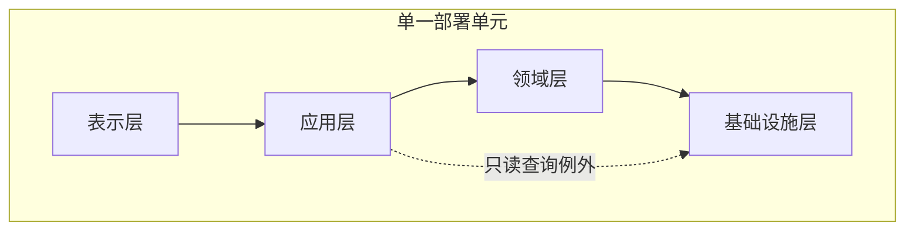

# G009 Batch 2 Layered Architecture Implementation Plan

> **For agentic workers:** REQUIRED SUB-SKILL: Use superpowers:subagent-driven-development (recommended) or superpowers:executing-plans to implement this plan task-by-task. Steps use checkbox (`- [ ]`) syntax for tracking.

**Goal:** Publish and close STY-01 as a contract-first Layered Architecture article with version-governed evidence, a single-deployment order-system exercise, mutation-sensitive dependency rules, and exact-head production proof.

**Architecture:** Preserve the repository's eleven-heading `style` contract. Add four governed sources, publish a four-layer classic top-down dependency model with closed layers by default and one controlled read-query exception, make STY-00 ↔ STY-01 reciprocal, then use Stage A deployment evidence before deriving Stage B completion.

**Tech Stack:** Docusaurus 3, MDX, Mermaid, Node.js 26.5.0, `node:test`, deterministic JSON generation, GitHub Actions/Pages, repository source-ledger and link-health tooling, in-app Browser QA.

## Global Constraints

- Work only in `/Users/seal/projects/tego-arch/.worktrees/g009-styles-batch2` on `codex/g009-styles-batch2`.
- Preserve `/Users/seal/projects/tego-arch`, Batch 1, all G008 worktrees, and root untracked `.codex/config.toml` unchanged.
- Use Node.js `v26.5.0`; `package.json` requires `>=24.0`.
- Do not add dependencies or change the global eleven-heading `style` schema.
- Close only `STY-01`; keep G009 current and do not create STY-02..06 content.
- Use layers in this exact order: 表示层、应用层、领域层、基础设施层.
- Use classic top-down dependencies: 表示层 → 应用层 → 领域层 → 基础设施层.
- Closed layers are the default. The only open-layer exception is 应用层 → 基础设施层 for a read-only report query.
- Do not present dependency inversion, ports, or adapters as classic layered defaults; leave those mechanisms to STY-02.
- Keep all four logical layers inside one deployment unit; do not draw services or network boundaries.
- Use Mermaid, not Draw.io or a raster asset.
- Stage A projects `53 / 95 / 502` with STY-01 published/pending and next STY-01.
- Stage B projects `54 / 95 / 502` with STY-01 published/complete, G009 current, and next STY-02.
- Never hand-edit `src/generated/`; update canonical inputs and run `npm run generate:content`.
- Never fabricate link-health success, review verdicts, deployment IDs, browser observations, hashes, or test totals.
- Tracked release evidence must contain literal values captured after they exist, never symbolic tokens.
- Preserve the complete G009 Batch 1 and older release-history suffix byte-for-byte.
- Every implementation task ends with targeted tests and an independently reviewable commit or an explicit release gate.

---

## File Map

- Create `content/styles/sty-01-layered-architecture.mdx`: canonical STY-01 article, Mermaid, two tables, order-system exercise, visible sources and relationships.
- Modify `content/styles/sty-00-comparison-framework.mdx`: add only reciprocal STY-01 metadata and visible link.
- Modify `data/source-ledger.json`: four new source records and STY-01 citation review.
- Modify `data/source-link-health.json`: checker-produced accepted observations for the four new transports.
- Create `tests/g009-batch2-content.test.mjs`: Stage A source, metadata, dependency, visual, exercise, relation and pending-projection contract.
- Create `tests/g009-batch2-deployment.test.mjs`: Stage B exact review, deployment, backlog, generated-state and historical-suffix contract.
- Modify `src/generated/topic-manifest.json`, `src/generated/topic-indexes.json`, `src/generated/source-ledger.json`, and `src/generated/project-status.json`: generator-owned projections only.
- Modify historical `tests/g007-*`, `tests/g008-*`, `tests/g009-batch1-*`, `tests/knowledge-fixtures.test.mjs`, and `tests/project-status.test.mjs` only where they assert the live projection; historical review text, SHAs, hashes, old counts, and old next-topic literals remain immutable.
- Modify `docs/content-backlog.md` only in Stage B: STY-01 checkbox and current release baseline prefix.
- Create `docs/reviews/g009-batch2.md` after Stage A evidence exists.
- Create `.superpowers/sdd/g009-batch2-browser-qa.json`, screenshots, task reports, and final audit as ignored evidence artifacts.

## Task 1: Govern the Four STY-01 Sources

**Files:**
- Create: `tests/g009-batch2-content.test.mjs`
- Modify: `data/source-ledger.json`
- Modify: `data/source-link-health.json`

**Interfaces:**
- Consumes: source-ledger schema, link-health cache schema, `readFile`.
- Produces: `src-microsoft-n-tier-architecture`, `src-fowler-presentation-domain-data-layering`, `src-aws-hexagonal-layered-overview`, and `src-archunit-user-guide`.

- [ ] **Step 1: Write the failing source-governance tests**

Create `tests/g009-batch2-content.test.mjs`:

```js
import assert from 'node:assert/strict';
import {readFile} from 'node:fs/promises';
import test from 'node:test';

const [ledger, linkHealth] = await Promise.all([
  readFile(new URL('../data/source-ledger.json', import.meta.url), 'utf8').then(JSON.parse),
  readFile(new URL('../data/source-link-health.json', import.meta.url), 'utf8').then(JSON.parse),
]);

const expectedSources = new Map([
  ['src-microsoft-n-tier-architecture', 'https://learn.microsoft.com/en-us/azure/architecture/guide/architecture-styles/n-tier'],
  ['src-fowler-presentation-domain-data-layering', 'https://martinfowler.com/bliki/PresentationDomainDataLayering.html'],
  ['src-aws-hexagonal-layered-overview', 'https://docs.aws.amazon.com/prescriptive-guidance/latest/hexagonal-architectures/overview.html'],
  ['src-archunit-user-guide', 'https://www.archunit.org/userguide/html/000_Index.html'],
]);

test('governs the four approved STY-01 sources', () => {
  const records = new Map(ledger.sources.map((source) => [source.id, source]));
  for (const [id, locator] of expectedSources) {
    const record = records.get(id);
    assert.equal(record?.canonical_locator, locator, id);
    assert.ok(record.version, `${id} version`);
    assert.ok(record.license_evidence_url, `${id} license evidence`);
    assert.ok(record.usage_boundary, `${id} usage boundary`);
  }
  assert.equal(records.get('src-microsoft-n-tier-architecture').version.includes('ef79621488119c618cd3ebeb8f81443f023cc452'), true);
  assert.equal(records.get('src-archunit-user-guide').version.includes('v1.5.0'), true);
});

test('keeps every STY-01 transport in the reviewed health cache', () => {
  const results = new Map(linkHealth.results.flatMap((result) =>
    result.source_ids.map((sourceId) => [sourceId, result])));
  for (const id of expectedSources.keys()) {
    const result = results.get(id);
    assert.ok(result, `${id} health result`);
    assert.equal(result.last_attempt.outcome, 'healthy', `${id} current transport`);
    assert.equal(result.review_status, 'healthy', `${id} review status`);
  }
});
```

- [ ] **Step 2: Run the source test and verify RED**

Run:

```bash
node --test tests/g009-batch2-content.test.mjs
```

Expected: FAIL because all four source records and cache observations are absent.

- [ ] **Step 3: Add four exact source records**

Insert records into the sorted `sources` array in `data/source-ledger.json` with these fixed identities:

```js
const sourceContracts = [
  {
    id: 'src-microsoft-n-tier-architecture',
    canonical_locator: 'https://learn.microsoft.com/en-us/azure/architecture/guide/architecture-styles/n-tier',
    transport_locator: 'https://raw.githubusercontent.com/MicrosoftDocs/architecture-center/ef79621488119c618cd3ebeb8f81443f023cc452/docs/guide/architecture-styles/n-tier.md',
    title: 'N-tier architecture style',
    author_or_org: 'Microsoft',
    published_at: '2025-08-15',
    version: 'MicrosoftDocs architecture-center commit ef79621488119c618cd3ebeb8f81443f023cc452; source ms.date 2025-08-15',
    source_kind: 'vendor-reference-architecture',
    tier: 'primary',
    allowed_evidence_roles: ['comparison', 'definition', 'implementation', 'learning'],
    license: 'CC-BY-4.0',
    copyright_policy: 'vendor-claims-separated',
    usage_boundary: 'Defines logical layers, physical tiers, downward dependencies, and open versus closed layers; Azure VM topology and product recommendations are not requirements for STY-01.',
    link_policy: 'stable',
  },
  {
    id: 'src-fowler-presentation-domain-data-layering',
    canonical_locator: 'https://martinfowler.com/bliki/PresentationDomainDataLayering.html',
    transport_locator: 'https://martinfowler.com/bliki/PresentationDomainDataLayering.html',
    title: 'Presentation Domain Data Layering',
    author_or_org: 'Martin Fowler',
    published_at: '2015-08-26',
    version: 'Article published 2015-08-26; page checked 2026-08-07',
    source_kind: 'engineering-blog',
    tier: 'primary',
    allowed_evidence_roles: ['comparison', 'definition', 'learning'],
    license: 'LicenseRef-All-Rights-Reserved',
    copyright_policy: 'facts-and-short-quotation',
    usage_boundary: 'Supports presentation-domain-data separation, logical-not-physical layering, and domain-oriented modules that are internally layered; author experience is not a universal production guarantee.',
    link_policy: 'stable',
  },
  {
    id: 'src-aws-hexagonal-layered-overview',
    canonical_locator: 'https://docs.aws.amazon.com/prescriptive-guidance/latest/hexagonal-architectures/overview.html',
    transport_locator: 'https://docs.aws.amazon.com/prescriptive-guidance/latest/hexagonal-architectures/overview.html',
    title: 'Hexagonal architecture overview',
    author_or_org: 'Amazon Web Services',
    published_at: null,
    version: 'Current AWS Prescriptive Guidance page checked 2026-08-07',
    source_kind: 'vendor-reference-architecture',
    tier: 'first-party',
    allowed_evidence_roles: ['comparison', 'definition', 'learning'],
    license: 'LicenseRef-All-Rights-Reserved',
    copyright_policy: 'vendor-claims-separated',
    usage_boundary: 'Supports only the contrast between classic top-down layered dependencies and dependency inversion; it does not make AWS implementation choices or Hexagonal mechanisms part of STY-01.',
    link_policy: 'stable',
  },
  {
    id: 'src-archunit-user-guide',
    canonical_locator: 'https://www.archunit.org/userguide/html/000_Index.html',
    transport_locator: 'https://raw.githubusercontent.com/TNG/ArchUnit/v1.5.0/docs/userguide/004_What_to_Check.adoc',
    title: 'ArchUnit User Guide — Layer Checks',
    author_or_org: 'TNG Technology Consulting',
    published_at: null,
    version: 'ArchUnit v1.5.0 tag at commit 502d782bfbf2632a2c9f943a502ddd8cc3e3c46d',
    source_kind: 'official-docs',
    tier: 'primary',
    allowed_evidence_roles: ['implementation', 'learning'],
    license: 'Apache-2.0',
    copyright_policy: 'adapt-with-attribution',
    usage_boundary: 'Demonstrates that package, layer, and cycle constraints can be executable tests; Java and ArchUnit are examples, not required STY-01 implementation technologies.',
    link_policy: 'stable',
  },
];
```

For every record, also set the schema-required common fields exactly:

```json
{
  "query_insensitive": false,
  "locator_aliases": [],
  "tombstone": null,
  "registered_at": "2026-08-07",
  "checked_at": "2026-08-07",
  "license_family_grouping": "identity",
  "family_grouping_evidence_url": null,
  "expected_final_approved_at": "2026-08-07",
  "expected_final_approval_note": "Reviewed canonical identity and version-pinned transport on 2026-08-07."
}
```

Use the Microsoft pinned repository `LICENSE` as Microsoft license evidence; use the checked Fowler page and its copyright footer for Fowler; use the checked AWS page/site terms evidence conservatively; use `https://raw.githubusercontent.com/TNG/ArchUnit/v1.5.0/LICENSE` for ArchUnit. Set each `license_scope`, `license_evidence_url`, `license_evidence_note`, `license_family_id`, and `expected_final_transport_locator` to the exact work and transport described above. Do not group unrelated works into one license family.

- [ ] **Step 4: Refresh checker-managed health evidence**

Run:

```bash
npm run refresh:links
npm run check:links
```

Expected: accepted current observations exist for all four source IDs and the complete cache passes. If a transport fails, retain the checker output under `.superpowers/sdd/`, retry only within checker policy, and keep Task 1 RED until an accepted observation exists.

- [ ] **Step 5: Run focused validation and commit**

Run:

```bash
node --test tests/g009-batch2-content.test.mjs
npm run validate:content
npm run check:links
git diff --check
```

Expected: 2/2 G009 Batch 2 tests pass; repository content remains 94 documents and moves to 502 sources until the article is added.

Commit:

```bash
git add tests/g009-batch2-content.test.mjs data/source-ledger.json data/source-link-health.json
git commit -m "content(styles): govern STY-01 sources"
```

## Task 2: Publish the Layer Contract, Visual, Exercise, and Reciprocal Relation

**Files:**
- Modify: `tests/g009-batch2-content.test.mjs`
- Create: `content/styles/sty-01-layered-architecture.mdx`
- Modify: `content/styles/sty-00-comparison-framework.mdx`
- Modify: `data/source-ledger.json`

**Interfaces:**
- Consumes: four source IDs from Task 1; `readContentDocuments`, `findMarkdownHeadings`, `parseFrontMatter`, `extractInternalLinks`, and `handleHorizontalArrowKey`.
- Produces: `/styles/sty-01`, exact four-layer contract, one Mermaid, two tables, one open-layer exception, order exercise, STY-00 ↔ STY-01 visible relation, and STY-01 document citation review.

- [ ] **Step 1: Extend the test with exact content contracts**

Add imports and constants:

```js
import {fileURLToPath} from 'node:url';
import {findMarkdownHeadings, parseFrontMatter, readContentDocuments} from '../scripts/content-metadata.mjs';
import {extractInternalLinks} from '../scripts/content-relations.mjs';

const contentRoot = fileURLToPath(new URL('../content/', import.meta.url));
const documents = await readContentDocuments(contentRoot);
const sty01 = documents.find(({file}) => file === 'styles/sty-01-layered-architecture.mdx');
const sty00 = documents.find(({file}) => file === 'styles/sty-00-comparison-framework.mdx');
const expectedHeadings = [
  '学习问题', '组件、连接器与约束', '边界与控制流', '数据所有权与一致性',
  '部署单元与故障域', '团队拓扑', '质量属性收益与成本', '迁移路径',
  '禁用条件', '对比案例', '来源',
];
const layers = ['表示层', '应用层', '领域层', '基础设施层'];
const dimensions = ['边界', '控制流', '数据所有权', '一致性', '部署单元', '故障域', '团队拓扑', '质量属性'];
const exceptionFields = ['调用方', '被调用层', '被跳过层', '理由', '不变量', '风险', '自动化验证', '责任角色类型', '复核触发器', '撤销条件'];
const responsibilityRows = [
  ['表示层', '协议解析、输入格式、响应呈现', '稳定的输入映射和结果呈现', '业务规则、事务决策、数据库访问'],
  ['应用层', '用例编排、权限入口、事务意图、超时预算和流程结果', '面向调用方的用例', '核心业务判断、ORM 与厂商驱动'],
  ['领域层', '订单与库存不变量、状态转换和业务拒绝', '领域行为与稳定的数据访问能力合同', 'HTTP、UI、数据库 schema、ORM 类型和运行配置'],
  ['基础设施层', '持久化、消息、时钟和外部系统实现', '满足上层所需的数据与外部能力', '决定业务规则或向上层泄漏厂商类型'],
];
const canonicalSources = [...expectedSources.values()];
```

Add tests that assert:

```js
test('publishes the approved STY-01 metadata and style headings', () => {
  assert.ok(sty01);
  const metadata = parseFrontMatter(sty01.source);
  assert.equal(metadata.title, 'Layered Architecture：用依赖方向约束职责分层');
  assert.equal(metadata.slug, '/styles/sty-01');
  assert.equal(metadata.topic_id, 'STY-01');
  assert.deepEqual(metadata.depends_on, ['STY-00']);
  assert.deepEqual(metadata.adjacent_topics, ['STY-00']);
  assert.deepEqual(metadata.related_cases, ['/cases/micro-frontends-single-spa']);
  assert.deepEqual(findMarkdownHeadings(sty01.body).map(({text}) => text), expectedHeadings);
});

test('locks four closed layers and one controlled read-query exception', () => {
  let cursor = -1;
  for (const layer of layers) {
    const next = sty01.body.indexOf(`| ${layer} |`);
    assert.ok(next > cursor, `${layer} order`);
    cursor = next;
  }
  assert.match(sty01.body, /表示层\s*-->\s*应用层/u);
  assert.match(sty01.body, /应用层\s*-->\s*领域层/u);
  assert.match(sty01.body, /领域层\s*-->\s*基础设施层/u);
  assert.match(sty01.body, /应用层\s*-\.->\|只读查询例外\|\s*基础设施层/u);
  for (const field of exceptionFields) assert.ok(sty01.body.includes(field), field);
  assert.match(sty01.body, /单一部署单元/u);
  assert.doesNotMatch(sty01.body, /表示层独立部署|应用层独立部署|领域层独立部署|基础设施层独立部署/u);
});

test('locks responsibilities, logical-versus-physical boundaries, visual wrappers, profile, and evidence', () => {
  for (const row of responsibilityRows) {
    assert.ok(sty01.body.includes(`| ${row.join(' | ')} |`), row[0]);
  }
  for (const dimension of dimensions) assert.ok(sty01.body.includes(`| ${dimension} |`), dimension);
  assert.match(sty01.body, /逻辑层/u);
  assert.match(sty01.body, /module|package/u);
  assert.match(sty01.body, /tier|部署单元/u);
  assert.equal((sty01.body.match(/diagram-wrapper--scroll-owner/g) ?? []).length, 3);
  assert.equal((sty01.body.match(/tabIndex=\{0\}/g) ?? []).length, 3);
  assert.equal((sty01.body.match(/onKeyDown=\{handleHorizontalArrowKey\}/g) ?? []).length, 3);
  for (const locator of canonicalSources) assert.ok(sty01.body.includes(locator), locator);
  assert.match(sty01.body, /同一本地事务/u);
  assert.match(sty01.body, /格式错误[\s\S]*流程失败[\s\S]*业务拒绝[\s\S]*稳定错误类别/u);
  assert.doesNotMatch(sty01.body, /吞吐提升|延迟降低|恢复时间缩短|生产事故减少/u);
});

test('keeps the STY-00 relation reciprocal and STY-02 non-actionable', () => {
  const sty01Links = extractInternalLinks(sty01.body);
  const sty00Links = extractInternalLinks(sty00.body);
  assert.ok(sty01Links.includes('/styles/sty-00'));
  assert.ok(sty00Links.includes('/styles/sty-01'));
  assert.ok(sty01Links.includes('/cases/micro-frontends-single-spa'));
  assert.ok(!sty01Links.includes('/styles/sty-02'));
  assert.ok(parseFrontMatter(sty00.source).adjacent_topics.includes('STY-01'));
});
```

- [ ] **Step 2: Run the content tests and verify RED**

Run:

```bash
node --test tests/g009-batch2-content.test.mjs
```

Expected: FAIL because STY-01 does not exist and STY-00 lacks reciprocal adjacency.

- [ ] **Step 3: Create the exact STY-01 metadata and eleven sections**

Create `content/styles/sty-01-layered-architecture.mdx` with the metadata from the approved design and import:

```mdx
import {handleHorizontalArrowKey} from '@site/src/components/KeyboardScrollableRegion/handleHorizontalArrowKey.mjs';

# Layered Architecture：用依赖方向约束职责分层
```

Use the exact H2 order in `expectedHeadings`. The opening must state that layers are responsibility and dependency boundaries, not directories, processes, services, tiers, or teams.

- [ ] **Step 4: Add the exact layer table and Mermaid**

Use a focusable table wrapper and the four responsibility rows from the design. Add:

````mdx
<div className="diagram-wrapper diagram-wrapper--scroll-owner" role="region" aria-label="单一部署单元内的封闭层与只读查询例外，可横向滚动" tabIndex={0} onKeyDown={handleHorizontalArrowKey}>



</div>
````

The prose immediately after the diagram must state that reverse and cyclic dependencies are forbidden and that the dashed edge is not a service or network hop.

- [ ] **Step 5: Add the exception table, eight-dimension profile, and order exercise**

The second focusable table must contain one row with these exact values:

```md
| 应用层 | 基础设施层 | 领域层 | 报表只读查询避免无业务价值的转发 | 不改变订单、库存或权限不变量 | 查询模型耦合与旁路扩散 | 架构依赖测试、查询契约测试、结果映射测试 | 架构责任人、订单能力负责人 | 查询参与业务决策或返回模型变化 | 恢复逐层调用或重新设计边界 |
```

Use the design's eight dimensions in exact order. The order exercise must keep order confirmation and inventory reservation in one local transaction, classify errors by layer, state that all layers ship in one artifact, and forbid invented production metrics.

- [ ] **Step 6: Add sources and document citation review**

Add visible links to the four canonical locators. Add `data/source-ledger.json` document review for `content/styles/sty-01-layered-architecture.mdx` with citations in this order:

```js
const expectedCitations = [
  ['src-microsoft-n-tier-architecture', true],
  ['src-fowler-presentation-domain-data-layering', false],
  ['src-aws-hexagonal-layered-overview', false],
  ['src-archunit-user-guide', false],
];
```

Set `reviewed_at` to `2026-08-07`, use `facts-summary` for every citation, keep excerpts null, and record `original-structure`, `quotation-boundary`, `attribution-complete`, and `illustration-rights` checks.

- [ ] **Step 7: Add reciprocal STY-00 relation only**

Append `STY-01` to STY-00 `adjacent_topics` and add one visible `/styles/sty-01` link in `迁移路径` or the opening paragraph. Do not alter STY-00's sources, method, Mermaid, tables, exercise conclusion, or case relation.

- [ ] **Step 8: Add mutation-sensitive tests**

Implement `assertLayerContract(source)` once, call it from the positive contract test and mutation loop, and make it enforce the four responsibility rows, three adjacent downward edges, zero reverse/cyclic edges, the sole read-only exception and all ten exception fields, logical-versus-physical distinction, one deployment unit, three focusable overflow owners, eight dimensions in order, local transaction, stable error categories, four visible source links, and no actionable STY-02 link.

For every mutation, assert the input changed and the contract rejects it:

```js
for (const [label, mutated] of [
  ['write-path bypass', sty01.source.replace('应用层 --> 领域层', '应用层 --> 基础设施层')],
  ['reverse dependency', sty01.source.replace('领域层 --> 基础设施层', '基础设施层 --> 领域层')],
  ['domain receives HTTP type', sty01.source.replace('HTTP、UI、数据库 schema、ORM 类型和运行配置', '允许 HTTP 请求类型')],
  ['domain receives ORM type', sty01.source.replace('HTTP、UI、数据库 schema、ORM 类型和运行配置', '允许 ORM 实体类型')],
  ['missing exception validation', sty01.source.replace('架构依赖测试、查询契约测试、结果映射测试', '')],
  ['missing exception rollback', sty01.source.replace('恢复逐层调用或重新设计边界', '')],
  ['four deployments', sty01.source.replace('subgraph 单一部署单元', 'subgraph 四个独立部署单元')],
  ['hexagonal inversion as default', sty01.source.replace('表示层 --> 应用层', '基础设施层 --> 领域层')],
]) {
  assert.notEqual(mutated, sty01.source, `${label} mutation must change source`);
  assert.throws(() => assertLayerContract(mutated), {name: 'AssertionError'});
}
```

Add separate reciprocal-link mutations that remove `/styles/sty-01` from STY-00 and inject `/styles/sty-02` into STY-01; guard both with `assert.notEqual` and require the relation contract to reject them. Also assert the document citation review lists the four source IDs in the approved order, marks only Microsoft as `primary: true`, uses `facts-summary`, contains no excerpts, and records all four rights checks.

- [ ] **Step 9: Run focused validation and commit**

Run:

```bash
node --test tests/g009-batch2-content.test.mjs
npm run validate:content
git diff --check
```

Expected: focused tests pass; content validation reports 95 documents and 502 sources.

Commit:

```bash
git add content/styles/sty-01-layered-architecture.mdx content/styles/sty-00-comparison-framework.mdx data/source-ledger.json tests/g009-batch2-content.test.mjs
git commit -m "content(styles): publish Layered Architecture"
```

## Task 3: Generate and Lock the Stage A Live Projection

**Files:**
- Modify: `tests/g009-batch2-content.test.mjs`
- Modify: generator-owned `src/generated/*.json`
- Modify: historical test files that assert only the live projection.

**Interfaces:**
- Consumes: canonical content, backlog, source ledger, content generator.
- Produces: Stage A `53 / 95 / 502`, STY-01 published/pending, next STY-01, and historical tests that separate live projection from immutable historical evidence.

- [ ] **Step 1: Add the Stage A projection test before generation**

```js
const [manifest, projectStatus, indexes, publicLedger] = await Promise.all([
  readFile(new URL('../src/generated/topic-manifest.json', import.meta.url), 'utf8').then(JSON.parse),
  readFile(new URL('../src/generated/project-status.json', import.meta.url), 'utf8').then(JSON.parse),
  readFile(new URL('../src/generated/topic-indexes.json', import.meta.url), 'utf8').then(JSON.parse),
  readFile(new URL('../src/generated/source-ledger.json', import.meta.url), 'utf8').then(JSON.parse),
]);

test('projects the Stage A G009 Batch 2 state without closing STY-01', () => {
  const topic = manifest.topics.find(({id}) => id === 'STY-01');
  assert.equal(topic.published, true);
  assert.equal(topic.status.value, 'pending');
  assert.deepEqual(topic.primary_sources, [
    'https://learn.microsoft.com/en-us/azure/architecture/guide/architecture-styles/n-tier',
  ]);
  assert.equal(projectStatus.completed_topics, 53);
  assert.equal(projectStatus.content_documents, 95);
  assert.equal(projectStatus.governed_sources, 502);
  assert.equal(publicLedger.sources.length, 502);
  assert.ok(indexes.style.some(({id, status}) => id === 'STY-01' && status.value === 'pending'));
});
```

- [ ] **Step 2: Verify stale generated files fail**

Run:

```bash
node --test tests/g009-batch2-content.test.mjs
npm run check:content
```

Expected: FAIL because generated artifacts do not yet include STY-01 or the four sources.

- [ ] **Step 3: Generate canonical projections**

Run:

```bash
npm run generate:content
```

Expected generated changes: topic manifest, topic indexes, public source ledger, project status, and any deterministic content index generated by the repository. No canonical input is rewritten.

- [ ] **Step 4: Run the full test suite and classify historical failures**

Run:

```bash
npm test
```

For every failure in G007/G008/G009 Batch 1 tests, classify the assertion as either immutable historical evidence or live projection. Never change exact historical review/baseline literals, historical SHAs, job IDs, artifact hashes, old counts, or old next-topic text. Update only live assertions from 94/498 to 95/502 and add STY-01 published/pending where the current manifest is asserted.

At minimum audit the files returned by:

```bash
rg -l "content_documents: 94|governed_sources: 498|STY-01.*pending" tests | sort
```

Mutation tests must reverse the new live value to the old invalid value; no `.replace()` may be a no-op.

- [ ] **Step 5: Run Stage A verification and commit**

Run:

```bash
node --test tests/g009-batch2-content.test.mjs
npm run validate:content
npm run check:content
npm run check:links
npm run check:reviews
npm run verify
git diff --check
```

Expected: all tests pass; 95 documents, 502 sources; production build succeeds.

Commit all generated files and live-projection test compatibility changes:

```bash
git add src/generated tests
git commit -m "test(styles): lock STY-01 Stage A projection"
```

## Task 4: Review, Deploy, and Browser-QA Stage A

**Files:**
- Create ignored: `.superpowers/sdd/g009-batch2-browser-qa.json`
- Create ignored: `.superpowers/sdd/screenshots/g009-batch2-*`
- Modify tracked files only for reviewer-approved remediation, with separate commits.

**Interfaces:**
- Consumes: clean Stage A exact HEAD and complete verification.
- Produces: exact Stage A SHA, successful Pages run/build/deploy jobs, independent review verdicts, and accepted local/production browser observations.

- [ ] **Step 1: Run independent content, code, and architecture reviews**

Bind all reviews to `git rev-parse HEAD`. Require Critical 0, Important 0, content READY, code READY, architecture CLEAR and READY. Apply fixes in narrow commits and rerun the affected review on the new exact HEAD.

- [ ] **Step 2: Run fresh pre-push proof**

```bash
npm run verify
git diff --check
git status --short --branch
git rev-parse HEAD
```

Expected: all checks pass and the worktree is clean.

- [ ] **Step 3: Push feature and exact main**

```bash
git push -u origin codex/g009-styles-batch2
git push origin HEAD:main
```

Verify `origin/codex/g009-styles-batch2`, `origin/main`, and local HEAD are identical.

- [ ] **Step 4: Resolve the exact Pages run**

Query:

```bash
gh run list --workflow deploy.yml --branch main --limit 10 --json databaseId,headSha,status,conclusion,event,url
```

Use the push-triggered run only if `headSha` equals the exact Stage A SHA. If no run appears during the bounded wait, dispatch `gh workflow run deploy.yml --ref main`, record event `workflow_dispatch`, and verify exact `headSha`. Wait with `gh run watch` and capture build/deploy job IDs from `gh run view`.

- [ ] **Step 5: Run local and production Browser QA**

Use the in-app Browser skill and persistent Node REPL. At desktop `1440x1000` and mobile `390x844`, inspect:

- `/styles/sty-01`
- `/styles/sty-00`
- `/styles`
- `/cases/micro-frontends-single-spa`
- `/references`

Require exact H1, HTTP 200, no document overflow, 1 Mermaid, 2 tables, 3 focusable wrappers, ArrowRight movement on both tables, all four source activations, all reciprocal/case relations, and zero warnings/errors/page errors. Capture screenshots and a JSON artifact with attempt dispositions; superseded attempts remain traceable.

- [ ] **Step 6: Record the Stage A gate**

Do not edit backlog yet. Record exact SHA, run, jobs, test total, review verdicts, route/viewport totals, interaction totals, wrapper geometry, diagnostics, screenshots, and artifact SHA-256 in ignored task evidence. This task ends only when Stage A production evidence is complete.

## Task 5: Close STY-01 with Exact Stage B Evidence

**Files:**
- Create: `docs/reviews/g009-batch2.md`
- Create: `tests/g009-batch2-deployment.test.mjs`
- Modify: `docs/content-backlog.md`
- Modify: generator-owned `src/generated/*.json`
- Modify: historical tests only for the new live projection.

**Interfaces:**
- Consumes: Task 4 literal Stage A identity and browser evidence.
- Produces: mutation-sensitive release review/current baseline, `54 / 95 / 502`, STY-01 complete, G009 current, next STY-02, and immutable Batch 1-and-older suffix.

- [ ] **Step 1: Write the deployment test before closure**

Create a test that reads review, backlog, manifest, project status, and source ledger. Insert the literal Stage A SHA, run ID, build/deploy job IDs, repository test total, and browser artifact SHA-256 printed by Task 4. The test must reject symbolic tokens and require these headings exactly once and in this order:

```js
const expectedReviewSections = [
  'Stage A identity',
  'Verification',
  'Independent review',
  'Production smoke',
  'Stage B projection',
  'Final PASS',
];
```

The first RED run must fail because the review does not exist, STY-01 remains unchecked, and generated status remains pending.

- [ ] **Step 2: Write exact review and current baseline**

Create `docs/reviews/g009-batch2.md` from actual Task 4 evidence. Build `expectedReviewText` in the deployment test and require exact equality after CRLF normalization. Add at least these contradiction mutations, each guarded by `assert.notEqual` before `assert.throws`:

- run conclusion success → failure;
- Critical 0 → 1;
- Important 0 → 1;
- CLEAR → BLOCK;
- READY → NOT READY;
- production smoke PASS → FAIL;
- Stage B closure PASS → FAIL.

Replace only the current baseline prefix in `docs/content-backlog.md`, preserving the marker `此前 G009 Batch 1 历史完成基线为：` and every byte after it. The new prefix must contain all exact deployment and QA evidence and end with `STY-01 为 published/complete，STY-02 为 planned/pending，Stage B closure — PASS。`

- [ ] **Step 3: Close only STY-01 and regenerate**

Change:

```md
- [ ] **STY-01 P0｜Layered Architecture**。
```

to:

```md
- [x] **STY-01 P0｜Layered Architecture**。
```

Run:

```bash
npm run generate:content
```

Expected: completed topics 54; content documents 95; governed sources 502; current G009; STY-01 complete; STY-02 pending.

- [ ] **Step 4: Protect the historical suffix and current prefix**

Compute the SHA-256 of the text after the Batch 1 marker in the pre-closure and post-closure backlog and require equality. Store the literal hash in the deployment test. Separately reconstruct the complete G009 Batch 2 current prefix and require exact equality plus one occurrence of every evidence literal.

Add baseline contradiction mutations for conclusion, route count, interaction count, test total, Stage B counts, next STY-02, and final PASS.

- [ ] **Step 5: Update only Stage B live projections in historical tests**

Run `npm test`, then update current live assertions:

- completed topics 53 → 54;
- STY-01 pending → complete;
- STY-01 `[ ]` → `[x]`;
- next STY-01 → STY-02;
- current baseline root → G009 Batch 2;
- documents and sources remain 95/502.

Do not rewrite any historical G007/G008/G009 Batch 1 review or baseline literal. Mutation tests must reverse new live values to old values and assert the mutation changed the source.

- [ ] **Step 6: Run closure verification and commit**

Run:

```bash
node --test tests/g009-batch2-content.test.mjs tests/g009-batch2-deployment.test.mjs
npm run verify
git diff --check
```

Expected: all tests pass; 95 documents, 502 sources; typecheck and build pass.

Commit:

```bash
git add docs/content-backlog.md docs/reviews/g009-batch2.md src/generated tests
git commit -m "docs: close G009 layered architecture"
```

## Task 6: Final Review, Deploy, Production Audit, and Handoff

**Files:**
- Create ignored: `.superpowers/sdd/final-audit-report.md`
- Modify tracked files only for verified review remediation, each in a separate commit.

**Interfaces:**
- Consumes: clean exact Stage B HEAD.
- Produces: final READY/CLEAR verdict, exact final Pages deployment, production status proof, clean synchronized refs, and next target STY-02.

- [ ] **Step 1: Run final exact-HEAD reviews**

Run independent code, content/evidence, and architecture reviews against the exact Stage B SHA. Require Critical 0, Important 0, code READY, content READY, architecture CLEAR and READY. Any Important blocks release and requires a new commit plus exact-HEAD re-review.

- [ ] **Step 2: Run fresh full proof**

```bash
npm run verify
git diff --check
git show --check HEAD
git status --short --branch
```

Expected: all checks pass and the worktree is clean.

- [ ] **Step 3: Push feature and main to one exact SHA**

```bash
git push origin HEAD:codex/g009-styles-batch2 HEAD:main
```

Verify local HEAD, `origin/codex/g009-styles-batch2`, and `origin/main` are identical.

- [ ] **Step 4: Verify final Pages identity and success**

Resolve the exact final run as in Task 4, using workflow dispatch only if the push trigger does not produce a bounded exact-head run. Capture final run/build/deploy IDs and require completed/success for the exact final SHA.

- [ ] **Step 5: Run final production QA**

Repeat both viewports and all five routes. Require `/styles` to show STY-01 as `任务已完成` with an article link and STY-02 as `计划主题` without an article link. Re-run all source/relation activations, wrapper focus/scroll, H1, overflow, HTTP and diagnostics checks.

- [ ] **Step 6: Write the ignored final audit and close Browser state**

Write exact final SHA/ref equality, final run/jobs, test total, 54/95/502, 8/20, current G009, next STY-02, review verdicts, production QA, historical suffix hash, root-checkout observation, and clean worktree status to `.superpowers/sdd/final-audit-report.md`. Reset viewport and finalize Browser tabs only after all QA is complete.

- [ ] **Step 7: Handoff**

Keep the worktree for audit. Report final SHA, Pages URL, verification totals, review verdicts, production observations, and next target STY-02. Do not checkpoint G009.
